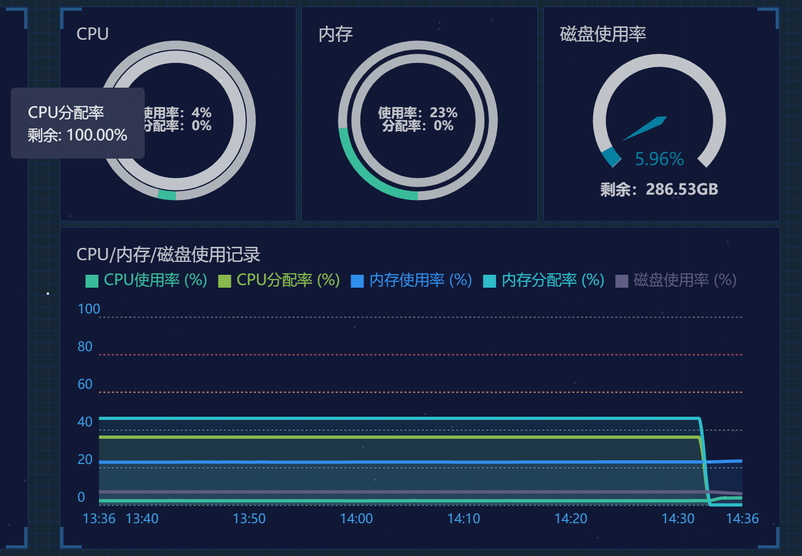
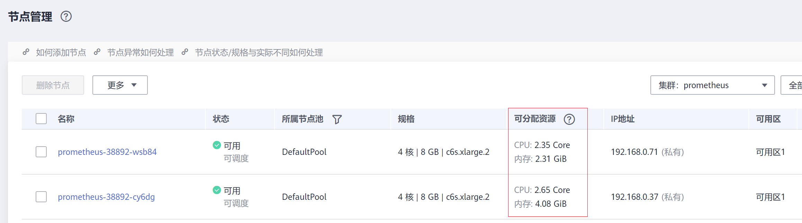
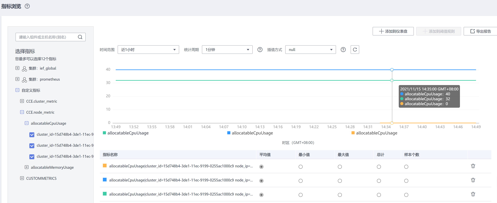

# virtual-kubelet

Virtual Kubelet是基于社区Virtual Kubelet开源项目开发的插件，作为一种虚拟的kubelet用来连接Kubernetes集群和其他平台的API。Virtual Kubelet的主要场景是将Kubernetes API扩展到无服务器的容器平台（如CCI）。

基于该插件，支持华为云用户在短时高负载场景下，将部署在云容器引擎CCE上的无状态负载（Deployment）、有状态负载（StatefulSet）、普通任务（Job）三种资源类型的容器实例（Pod），弹性创建到[云容器实例CCI](https://support.huaweicloud.com/cci/index.html)服务上，以减少集群扩容带来的消耗。详情请参见[华为云CCE弹性到CCI](https://support.huaweicloud.com/bestpractice-cce/cce_bestpractice_0133.html)。

开源社区地址：[https://github.com/virtual-kubelet/virtual-kubelet](https://github.com/virtual-kubelet/virtual-kubelet)

Virtual Kubelet插件具体如下功能：

-   **支持容器实例实现秒级弹性伸缩：**virtual kubelet插件将自动为您在[云容器实例CCI](https://support.huaweicloud.com/cci/index.html)侧创建容器实例，减少运维成本。
-   无缝对接华为云[容器镜像服务SWR](https://support.huaweicloud.com/swr/index.html)，支持使用公用镜像和私有镜像。
-   支持CCI容器实例的事件同步、监控、日志、exec、查看状态等操作。
-   支持查看虚拟弹性节点的节点容量信息。
-   支持CCE和CCI两侧实例的service网络互通。

## 约束及限制

-   仅支持VPC网络模式的CCE集群和CCE Turbo集群（virtual-kubelet 1.2.5版本及以上支持），且仅支持1.21及以下集群。

-   调度到CCI的实例的存储类型只支持ConfigMap、Secret、emptyDir、SFS、SFS Turbo几种Volume类型，其中emptyDir不支持子路径，且SFS、SFS Turbo类型存储对应的PVC只支持使用CSI类型的StorageClass。
-   暂不支持守护进程集（DaemonSet）以及HostNetwork网络模式的容器实例（Pod）弹性到CCI。
-   跨CCE和CCI实例Service网络互通只支持集群内访问（ClusterIP）类型。
-   跨CCE和CCI实例，在对接LoadBalancer或Ingress时，禁止指定健康检查端口：

    1. 在CCE集群下，由于CCI的容器与CCE的容器在ELB注册的后端使用端口不一致，指定健康检查端口会导致部分后端健康检查异常。

    2. 跨集群使用Service对接同一个ELB的监听器时，需确认健康检查方式，避免服务访问异常。

-   集群所在子网不能与10.247.0.0/16重叠，否则会与CCI命名空间下的Service网段冲突，导致无法使用。
-   使用插件前需要用户在[CCI界面](https://console.huaweicloud.com/cci/?locale=zh-cn#/dashboard)对CCI服务进行授信。
-   安装virtual-kubelet插件后会在CCI服务新建一个名为"cce-burst-"+集群ID的命名空间，该命名空间完全由virtual-kubelet管理，不建议直接在CCI服务使用该命名空间，如需使用CCI服务，请另外新建命名空间。
-   实例的规格必须满足云容器实例CCI的容器规范。
    1.  使用1.2.5以下版本插件时，各容器的Requests须等于Limits（1.2.5及以上版本插件两者可不相等，弹性到CCI时自动将两者设置为一样，若配置了Limits，则以Limits为准，没有配Limits，则以Requests为准）。
    2.  Pod中至少有1个容器配置CPU大于0。
    3.  经过资源自动规整后，Pod总CPU不得超过32核，内存不得超过256Gi。

## 资源自动规整

对弹性到CCI的Pod，若其配置的资源规格不满足CCI容器规范，virtual-kubelet会自动尝试将Pod资源向上规整到满足CCI容器规范的范围，以规整后的资源规格创建Pod到CCI。

自动规整规则如下：

1.  将Pod中除了BestEffort类型容器外的每个容器CPU向上调整至0.25核的整数倍， Memory向上调整至大于等于0.2Gi。
2.  将整个Pod的Memory向上调整至1Gi的整数倍。
3.  若Pod Memory/CPU的比值小于2，则将Pod Memory向上调整至大于等于CPU的2倍，且满足是1Gi的整数倍；若Pod Memory/CPU的比值大于8，则将Pod CPU向上调整至大于等于Memory的1/8，且满足是0.25核的整数倍。
4.  若向上调整之后，CPU超过32核或Memory超过256Gi，则矫正失败，拒绝创建请求。
5.  以上对Pod级别资源向上调整造成的增量CPU和Memory，全部添加到Pod中第一个不为BestEffort的容器上。

## 安装插件

1.  在CCE控制台，单击左侧导航栏的“插件管理“，在“插件市场“页签下，单击virtual-kubelet插件下的“安装插件“。
2.  在“基本信息“步骤中，选择安装的集群和插件版本，单击“下一步：规格配置“。
3.  在“规格配置“步骤中，勾选“跨服务互通“后的选择框，可实现CCE集群中的Pod与CCI集群中的Pod通过Kubernetes Service互通。

    **图 1**  勾选“跨服务互通“  
    

4.  单击“安装“。

    待插件安装完成后，单击“返回“，在“插件实例“页签下，选择对应的集群，可查看到运行中的实例，这表明该插件已在当前集群的各节点中安装。

## 使用插件

您成功安装virtual-kubelet插件后，按如下步骤创建可弹性到CCI的负载：

1.  在CCE控制台，单击左侧导航栏的“工作负载“。
2.  在创建无状态工作负载或Job时，在“工作负载基本信息“步骤中，勾选“CCI弹性承载“。

    **图 2**  勾选“CCI弹性承载“  
    

3.  单击“下一步“继续创建相关资源。

## Virtual Kubelet可分配资源监控影响说明

安装Virtual Kubelet插件后，从监控的角度，相当于引入一个超大节点，此时在CCE集群监控界面上可分配资源使用率会把CCI的资源放在一起计算。如下所示，刚安装Virtual Kubelet插件后，CPU/内存的可分配率剧烈下降。

**图 3**  集群监控  

您可以在节点管理界面或AOM中查看具体节点的分配率。

**图 4**  查看节点可分配资源  

**图 5**  在AOM中查看节点资源可分配率  

## 升级插件

1.  登录CCE控制台，在左侧导航栏中选择“插件管理“，在“插件实例“页签下，选择对应的集群，单击“virtual-kubelet“下的“升级“。

    > **说明：** 
    >-   如果升级按钮处于冻结状态，则说明当前插件版本是最新的版本，不需要进行升级操作。
    >-   升级“virtual-kubelet“插件时，会替换原先节点上的旧版本的“virtual-kubelet“插件，安装最新版本的“virtual-kubelet“插件以实现功能的快速升级。

2.  在基本信息页面选择插件版本，单击“下一步“。
3.  参考[安装插件](#section2237175619515)中参数说明配置参数后，单击“升级“即可升级“virtual-kubelet“插件。

## 卸载插件

1.  在CCE控制台，单击左侧导航栏的“插件管理”，在“插件实例”页签下，选择对应的集群，单击virtual kubelet下的“卸载”。
2.  在弹出的窗口中，单击“确认”，可卸载该插件。（卸载插件会自动删除CCI侧的所有资源，以确保不会有资源残留造成额外计费）

> **注意：** 
>如果在未卸载virtual-kubelet插件的情况下直接删除集群，CCI侧的资源不会被自动清理，会导致CCI侧资源残留，可能会造成额外计费。因此请确保完成以下任意一操作。
>-   在删除集群前先卸载virtual-kubelet插件。
>-   在直接删除集群后登录CCI控制台删除名为**cce-burst-$\{CLUSTER\_ID\}**的命名空间。
>-   集群休眠时CCI侧正在运行的实例不会自动停止，会持续运行并计费。因此如不需要实例继续运行，请确保在集群休眠前将弹性到CCI的负载实例数缩至0。

