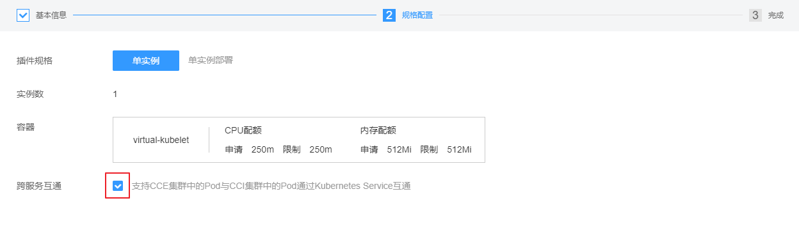
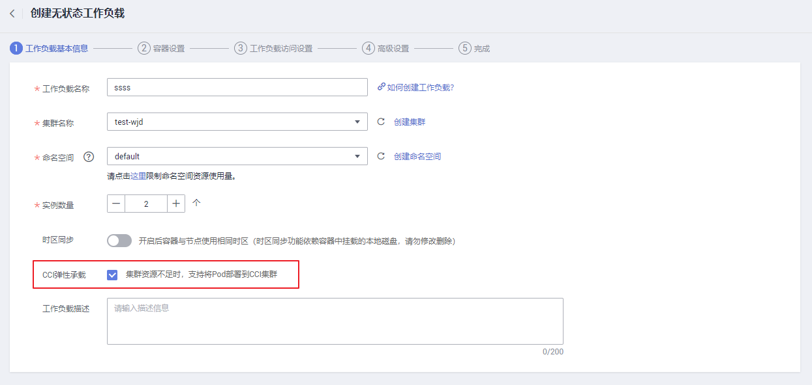

# virtual kubelet

Virtual Kubelet是基于社区Virtual Kubelet开源项目开发的插件，该插件支持用户在短时高负载场景下，将部署在CCE上的无状态负载（Deployment）、守护进程集（DaemonSet）、普通任务（Job）三种资源类型的容器实例（Pod），弹性创建到华为云[云容器实例CCI](https://support.huaweicloud.com/cci/index.html)服务上，以减少集群扩容带来的消耗。

Virtual Kubelet插件具体如下功能：

-   **支持容器实例实现秒级弹性伸缩：**在集群资源不足时，无需新增节点，virtual kubelet插件将自动为您在[云容器实例CCI](https://support.huaweicloud.com/cci/index.html)侧创建容器实例，减少运维成本。
-   无缝对接华为云[容器镜像服务SWR](https://support.huaweicloud.com/swr/index.html)，支持使用公用镜像和私有镜像。
-   支持CCI容器实例的事件同步、监控、日志、exec、查看状态等操作。
-   支持查看虚拟弹性节点的节点容量信息。
-   支持CCE和CCI两侧实例的service网络互通。

## 使用约束

-   仅支持VPC网络模式的虚拟机集群，仅限于v1.11版本。
-   调度到CCI的实例的存储类型只支持SFS、ConfigMap、Secret三种Volume类型。
-   暂不支持HostNetwork网络模式的容器实例（Pod）弹性到CCI。
-   实例的规格必须满足云容器实例CCI的[容器规范](https://support.huaweicloud.com/productdesc-cci/cci_03_0007.html)。
-   使用插件前需要用户在[CCI界面](https://console.huaweicloud.com/cci)对CCI服务进行授信。

## 安装插件

1.  在[CCE控制台](https://console.huaweicloud.com/cce2.0/?utm_source=helpcenter)中，单击左侧导航栏的“插件管理“，在“插件市场“中，单击virtual kubelet插件下的“安装插件“。
2.  在“基本信息“步骤中，选择安装的集群和插件版本，单击“下一步：规格配置“。
3.  在“规格配置“步骤中，勾选“跨服务互通“后的选择框，可实现CCE集群中的Pod与CCI集群中的Pod通过Kubernetes Service互通。

    **图 1**  勾选“跨服务互通“  
    

4.  单击“安装“。

    待插件安装完成后，单击“返回插件管理“，在“插件实例“页签中，选择对应的集群，可查看到运行中的实例，这表明该插件已在当前集群的各节点中安装。

## 配置插件

您成功安装virtual kubelet插件后，仍需完成如下步骤才能使用。

1.  在[CCE控制台](https://console.huaweicloud.com/cce2.0/?utm_source=helpcenter)中，单击左侧导航栏的“工作负载“。
2.  在创建无状态工作负载或Job时，在“工作负载基本信息“步骤中，勾选“CCI弹性承载“。

    **图 2**  勾选“CCI弹性承载“  
    

3.  单击“下一步“继续创建相关资源。

## 卸载插件

1.  在[CCE控制台](https://console.huaweicloud.com/cce2.0/?utm_source=helpcenter)中，单击左侧导航栏的“插件管理“，在“插件实例“页签中，选择对应的集群，单击virtual kubelet下的“卸载“。
2.  在弹出的窗口中，单击“确认“，可卸载该插件。

