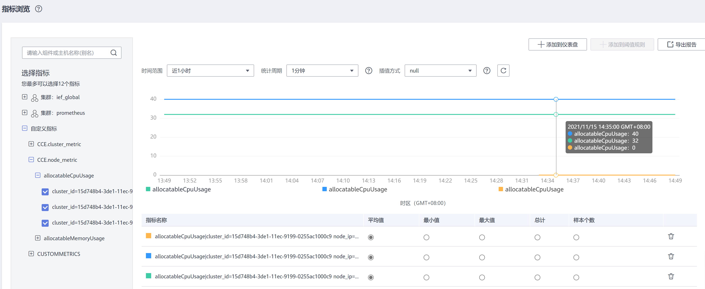

# virtual-kubelet<a name="cce_10_0135"></a>

Virtual Kubelet是基于社区Virtual Kubelet开源项目开发的插件，作为一种虚拟的kubelet用来连接Kubernetes集群和其他平台的API。Virtual Kubelet的主要场景是将Kubernetes API扩展到无服务器的容器平台（如CCI）。

基于该插件，支持用户在短时高负载场景下，将部署在云容器引擎CCE上的无状态负载（Deployment）、有状态负载（StatefulSet）、普通任务（Job）三种资源类型的容器实例（Pod），弹性创建到[云容器实例CCI](https://support.huaweicloud.com/cci/index.html)服务上，以减少集群扩容带来的消耗。详情请参见[CCE容器实例弹性伸缩到CCI服务](CCE容器实例弹性伸缩到CCI服务.md)。

开源社区地址：[https://github.com/virtual-kubelet/virtual-kubelet](https://github.com/virtual-kubelet/virtual-kubelet)

Virtual Kubelet插件具体如下功能：

-   **支持容器实例实现秒级弹性伸缩：**virtual kubelet插件将自动为您在[云容器实例CCI](https://support.huaweicloud.com/cci/index.html)侧创建容器实例，减少运维成本。
-   无缝对接[容器镜像服务SWR](https://support.huaweicloud.com/swr/index.html)，支持使用公用镜像和私有镜像。
-   支持CCI容器实例的事件同步、监控、日志、exec、查看状态等操作。
-   支持查看虚拟弹性节点的节点容量信息。
-   支持CCE和CCI两侧实例的service网络互通。

## 约束及限制<a name="section628693291119"></a>

-   仅支持VPC网络模式的CCE集群和CCE Turbo集群（virtual-kubelet 1.2.5版本及以上支持），且仅支持1.21及以下版本集群，暂不支持ARM集群。如果集群中包含ARM节点，插件实例将不会部署至ARM节点。

-   调度到CCI的实例的存储类型只支持ConfigMap、Secret、emptyDir、SFS、SFS Turbo几种Volume类型，其中emptyDir不支持子路径，且SFS、SFS Turbo类型存储对应的PVC只支持使用CSI类型的StorageClass。
-   暂不支持守护进程集（DaemonSet）以及HostNetwork网络模式的容器实例（Pod）弹性到CCI。
-   跨CCE和CCI实例Service网络互通只支持集群内访问（ClusterIP）类型。
-   跨CCE和CCI实例，在对接LoadBalancer或Ingress时，禁止指定健康检查端口：

    1. 在CCE集群下，由于CCI的容器与CCE的容器在ELB注册的后端使用端口不一致，指定健康检查端口会导致部分后端健康检查异常。

    2. 跨集群使用Service对接同一个ELB的监听器时，需确认健康检查方式，避免服务访问异常。

-   集群所在子网不能与10.247.0.0/16重叠，否则会与CCI命名空间下的Service网段冲突，导致无法使用。
-   使用插件前需要用户在[CCI界面](https://console.huaweicloud.com/cci/?locale=zh-cn#/dashboard)对CCI服务进行授信。
-   安装virtual-kubelet插件后会在CCI服务新建一个名为"cce-burst-"+集群ID的命名空间，该命名空间完全由virtual-kubelet管理，不建议直接在CCI服务使用该命名空间，如需使用CCI服务，请另外新建命名空间。
-   实例的规格必须满足云容器实例CCI的容器规范。
    1.  使用1.2.5以下版本插件时，各容器的Requests须等于Limits（1.2.5及以上版本插件两者可不相等，弹性到CCI时自动将两者设置为一样，若配置了Limits，则以Limits为准，没有配Limits，则以Requests为准）。
    2.  Pod中至少有1个容器配置CPU大于0。
    3.  经过资源自动规整后，Pod总CPU不得超过32核，内存不得超过256Gi。


## 资源自动规整<a name="section133381239113915"></a>

对弹性到CCI的Pod，若其配置的资源规格不满足CCI容器规范，virtual-kubelet会自动尝试将Pod资源向上规整到满足CCI容器规范的范围，以规整后的资源规格创建Pod到CCI。

自动规整规则如下：

1.  将Pod中除了BestEffort类型容器外的每个容器CPU向上调整至0.25核的整数倍， Memory向上调整至大于等于0.2Gi。
2.  将整个Pod的Memory向上调整至1Gi的整数倍。
3.  若Pod Memory/CPU的比值小于2，则将Pod Memory向上调整至大于等于CPU的2倍，且满足是1Gi的整数倍；若Pod Memory/CPU的比值大于8，则将Pod CPU向上调整至大于等于Memory的1/8，且满足是0.25核的整数倍。
4.  若向上调整之后，CPU超过32核或Memory超过256Gi，则矫正失败，拒绝创建请求。
5.  以上对Pod级别资源向上调整造成的增量CPU和Memory，全部添加到Pod中第一个不为BestEffort的容器上。

## 安装插件<a name="section2237175619515"></a>

1.  在CCE控制台，进入集群，单击左侧导航栏的“插件管理“，在右侧找到**virtual-kubelet**，单击“安装“。
2.  选择插件规格，勾选“支持CCE集群中的Pod与CCI集群中的Pod通过Kubernetes Service互通“。
3.  单击“安装“。

## 使用插件<a name="section162391856185111"></a>

您成功安装virtual-kubelet插件后，在工作负载中添加virtual-kubelet.io/burst-to-cci这个标签即可设置弹性到CCI。

```
apiVersion: apps/v1
kind: Deployment
metadata:
  name: test
  namespace: default
  labels:
    virtual-kubelet.io/burst-to-cci: 'auto'    # 弹性到CCI
spec:
  replicas: 2
  selector:
    matchLabels:
      app: test
  template:
    metadata:
      labels:
        app: test
    spec:
      containers:
        - image: 'nginx:perl'
          name: container-0
          resources:
            requests:
              cpu: 250m
              memory: 512Mi
            limits:
              cpu: 250m
              memory: 512Mi
          volumeMounts: []
      imagePullSecrets:
        - name: default-secret
```

> **说明：** 
>标红部分为添加labels。
>创建弹性至CCI的负载时需要在负载的labels中添加如下字段：
>```
>virtual-kubelet.io/burst-to-cci: "auto"
>```
>其中，value值支持以下选项：
>-   auto：CCE节点资源使用率较高时自动弹性至CCI。
>-   enforce：强制调度至CCI。
>-   off：不调度至CCI。

## Virtual Kubelet可分配资源监控影响说明<a name="section76394615111"></a>

安装Virtual Kubelet插件后，从监控的角度，相当于引入一个超大节点，此时在CCE集群监控界面上可分配资源使用率会把CCI的资源放在一起计算。如下所示，刚安装Virtual Kubelet插件后，CPU/内存的可分配率剧烈下降。

**图 1**  集群监控<a name="fig17527445313"></a>  


您可以在节点管理界面或AOM中查看具体节点的分配率。

**图 2**  在AOM中查看节点资源可分配率<a name="fig171801375410"></a>  


## 卸载插件<a name="section18671115841510"></a>

1.  登录CCE控制台，进入集群，在左侧导航栏选择“插件管理”，在右侧“已安装插件”页签下，单击virtual kubelet下的“卸载”。
2.  在弹出的窗口中，单击“是”，可卸载该插件。（卸载插件会自动删除CCI侧的所有资源，以确保不会有资源残留造成额外计费）

> **注意：** 
>-   由于virtual-kubelet插件卸载时会在集群中启动Job用于清理资源，卸载插件时请保证集群中至少有一个可以调度的节点，否则卸载插件会失败。若已经因无可调度节点造成插件卸载失败，需要在有可调度节点后重新点击插件卸载。
>-   如果在未卸载virtual-kubelet插件的情况下直接删除集群，CCI侧的资源不会被自动清理，会导致CCI侧资源残留，可能会造成额外计费。因此请确保完成以下任意一操作。
>    -   在删除集群前先卸载virtual-kubelet插件。
>    -   在直接删除集群后登录CCI控制台删除名为**cce-burst-$\{CLUSTER\_ID\}**的命名空间。
>    -   集群休眠时CCI侧正在运行的实例不会自动停止，会持续运行并计费。因此如不需要实例继续运行，请确保在集群休眠前将弹性到CCI的负载实例数缩至0。

