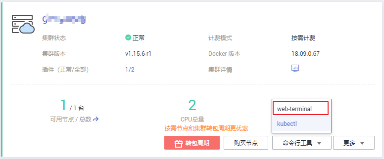
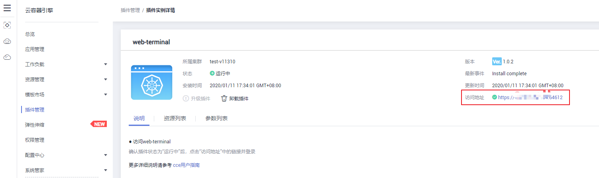
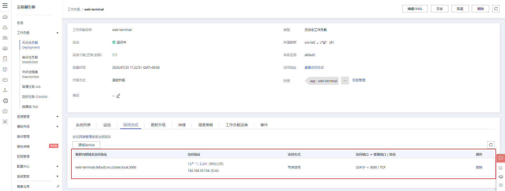

# web-terminal

-   [约束与限制](#section628693291119)
-   [安装插件](#section41861311141210)
-   [使用web-terminal插件连接集群](#section115151890220)
-   [配置插件](#section18673939131214)
-   [升级插件](#section23441939916)
-   [卸载插件](#section65651488131)
-   [版本记录](#section144262219109)

web-terminal是一款非常轻巧的终端服务器，支持在Web界面上使用Kubectl的插件。它支持通过标准的Web浏览器和HTTP协议提供远程CLI，提供灵活的接口便于集成到独立系统中，可直接作为一个服务连接，通过cmdb获取信息并登录服务器。

web-terminal可以在Node.js支持的所有操作系统上运行，而不依赖于本机模块，快速且易于安装，支持多会话。

开源社区地址：[https://github.com/rabchev/web-terminal](https://github.com/rabchev/web-terminal)

## 约束与限制

集群为1.9及以上版本时，才支持此功能。

## 安装插件

1.  在[CCE控制台](https://console.huaweicloud.com/cce2.0/?utm_source=helpcenter)中，单击左侧导航栏的“ 插件管理“，在“插件市场“页签下，单击**web-terminal**插件下的“安装插件“。
2.  在安装插件页面，选择安装的集群和插件版本，单击“下一步：规格配置“。
3.  在规格配置页面，配置以下参数。
    -   用户名：默认为root，不可修改。
    -   密码：登录web-terminal的密码，请务必记住该密码。
    -   确认密码：重新准确输入该密码。
    -   访问类型：
        -   节点访问：该插件默认以NodePort形式提供访问，需为集群任意一个节点绑定弹性IP才能使用。若集群没有绑定弹性IP，需绑定弹性IP。
        -   负载均衡：选择弹性负载均衡实例。若无弹性负载均衡实例，需新建[共享型弹性负载均衡](https://console.huaweicloud.com/vpc/#/ulb/createUlb)，完成后单击刷新按钮。负载均衡实例需与当前集群处于相同VPC且为公网类型。

    -   端口配置：访问类型为负载均衡时，需端口配置。
        -   协议：请根据业务的协议类型选择。
        -   容器端口：容器镜像中工作负载实际监听端口，为默认值，无法更改。
        -   访问端口：容器端口最终映射到负载均衡服务地址的端口，用负载均衡服务地址访问工作负载时使用，端口范围为1-65535，可任意指定。

4.  单击“安装“。

    待插件安装完成后，单击“返回“，在“插件实例“页签下，选择对应的集群，可查看到运行中的实例，这表明该插件已在当前集群的各节点中安装。

## 使用web-terminal插件连接集群

**方式一：**

1.  在[CCE控制台](https://console.huaweicloud.com/cce2.0/?utm_source=helpcenter)中，单击左侧导航栏的“资源管理 \> 集群管理“。
2.  单击集群下方的“命令行工具 \> web-terminal“进入插件实例详情页。

    **图 1**  使用web-terminal连接集群  
    

3.  单击插件详情页中访问地址后的链接即可登录。

    **图 2**  web-terminal插件访问地址  
    

**方式二：**

1.  在[CCE控制台](https://console.huaweicloud.com/cce2.0/?utm_source=helpcenter)中，单击左侧导航栏的“插件管理“。
2.  在“插件实例”中，正确选择插件所在的集群，单击“web-terminal”进入详情页。
3.  单击插件详情页中访问地址后的链接即可登录。

## 配置插件

该插件基于社区原生能力构建，请根据实际场景选择体验。

成功安装web-tertimal后，需要完成如下步骤才能使用：

**插件版本为1.0.1以及之后时：**

-   在CCE控制台中，单击左侧栏目树的“工作负载 \> 无状态负载 Deployment“，在工作负载列表页面单击web-terminal名称进入web-terminal实例详情界面。
-   单击下方的“访问方式“页签，查看其访问方式是否为“节点访问”，并确认是否已为集群任意节点绑定弹性公网IP。若未绑定需根据界面引导进行绑定，已绑定则可跳过此步。

    **图 3**  查看访问方式  
    

-   单击“访问地址”中的链接进入终端并登录，默认帐号为“root”，密码与安装插件时设置的值一致。

至此您已可以在web-terminal提供的界面上使用kubectl。

**插件版本为1.0.0版本时：**

1.  为web-terminal添加service

    -   在CCE控制台中，单击左侧栏目树的“工作负载 \> 无状态负载 Deployment“，在工作负载列表页面单击web-terminal名称进入web-terminal实例详情界面。
    -   单击下方的“访问方式“页签，单击“添加Service“按钮进入service添加界面。
    -   访问类型选择“负载均衡 \( LoadBalancer \)“或“节点访问 \( NodePort \)“，Service名称设置为：web-terminal-service（可任取）。
    -   端口配置中将容器端口设置为：3000，其余根据情况自行设定，确认设置后单击“创建“完成该步骤。

    现在您已可以通过service提供的访问地址和访问端口在浏览器上访问终端，对应地址为“https://访问地址:访问端口”。

2.  为容器配置kubeconfig
    -   在CCE控制台中，单击左侧栏目树的“资源管理 \> 集群管理“，在集群管理页面选择想要操作的集群，单击“命令行工具 \> kubectl“，在弹出页面中下载kubectl配置文件并打开，复制所有内容。
    -   根据[1](#li78781347105012)中的地址访问web-terminal并登录，默认帐号为“hwcloud\_cce”，密码与安装插件时设置的值一致，在初始目录"/home/hwcloud\_cce"使用vi指令创建文件config，将kubeconfig的所有内容通过ctrl+v粘贴到该文件，最后保存。

至此您已可以在web-terminal提供的界面上使用kubectl。

## 升级插件

1.  登录[CCE控制台](https://console.huaweicloud.com/cce2.0/?utm_source=helpcenter)，在左侧导航栏中选择“插件管理“，在“插件实例“页签下，选择对应的集群，单击“web-terminal“下的“ 升级“。

    > **说明：** 
    >-   如果升级按钮处于冻结状态，则说明当前插件版本是最新的版本，不需要进行升级操作。
    >-   升级“web-terminal“插件时，会替换原先节点上的旧版本的“web-terminal“插件，安装最新版本的“web-terminal“插件以实现功能的快速升级。

2.  在基本信息页面选择插件版本，单击“下一步“。
3.  参考[安装插件](#li153748218613)中参数说明配置参数后，单击“升级“即可升级“web-terminal“插件。

## 卸载插件

1.  在[CCE控制台](https://console.huaweicloud.com/cce2.0/?utm_source=helpcenter)中，单击左侧导航栏的“插件管理“，在“插件实例“页签下，选择对应的集群，单击web-terminal下的“卸载“。
2.  在弹出的窗口中，单击“是“，可卸载该插件。

## 版本记录

**表 1**  web-terminal版本记录

<table><thead align="left"><tr id="row278175916234"><th class="cellrowborder" valign="top" width="16%" id="mcps1.2.5.1.1">
插件版本

</th>
<th class="cellrowborder" valign="top" width="24%" id="mcps1.2.5.1.2">
支持的集群类型

</th>
<th class="cellrowborder" valign="top" width="19.900000000000002%" id="mcps1.2.5.1.3">
更新时间

</th>
<th class="cellrowborder" valign="top" width="40.1%" id="mcps1.2.5.1.4">
更新特性

</th>
</tr>
</thead>
<tbody><tr id="row152684214528"><td class="cellrowborder" valign="top" width="16%" headers="mcps1.2.5.1.1 ">
1.0.5

</td>
<td class="cellrowborder" valign="top" width="24%" headers="mcps1.2.5.1.2 ">
混合集群 v1.(9|11|13|15|17).*

</td>
<td class="cellrowborder" valign="top" width="19.900000000000002%" headers="mcps1.2.5.1.3 ">
2020/08/19

</td>
<td class="cellrowborder" valign="top" width="40.1%" headers="mcps1.2.5.1.4 ">
支持1.17版本集群

</td>
</tr>
<tr id="row7335155311559"><td class="cellrowborder" valign="top" width="16%" headers="mcps1.2.5.1.1 ">
1.0.4

</td>
<td class="cellrowborder" valign="top" width="24%" headers="mcps1.2.5.1.2 ">
混合集群 v1.(9|11|13|15).*

</td>
<td class="cellrowborder" valign="top" width="19.900000000000002%" headers="mcps1.2.5.1.3 ">
2020/06/23

</td>
<td class="cellrowborder" valign="top" width="40.1%" headers="mcps1.2.5.1.4 "><ul id="ul76091051111116"><li>集群管理界面添加新入口</li><li>支持1.13,1.15版本集群</li></ul>
</td>
</tr>
</tbody>
</table>

