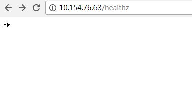

# 七层负载均衡（Ingress）<a name="cce_01_0094"></a>

七层负载均衡是采用了增强型弹性负载均衡，在四层负载均衡访问方式的基础上支持了URI配置，通过对应的URI将访问流量分发到对应的服务。同时，服务根据不同URI实现不同的功能。

七层负载均衡访问方式由弹性负载均衡ELB服务地址、设置的访问端口、定义的URI组成，例如：10.117.117.117:80/helloworld。

通过配置公网类型和私网类型的负载均衡实例可以实现公网的七层路由转发和内网（同一VPC内）的七层路由转发。

## 前提条件<a name="section2042610683912"></a>

已在华为云控制台中创建“统一负载均衡“实例。

1.  登录华为云控制台首页，在服务列表中选择“网络  \>  弹性负载均衡“。
2.  单击右上角的“创建增强型负载均衡”，详细操作步骤请参见[创建增强型负载均衡器](https://support.huaweicloud.com/qs-elb/zh-cn_topic_0052569751.html)。

## 添加方式<a name="section10392205822818"></a>

您可以在创建工作负载时设置访问方式，也可以工作负载创建完成后添加访问方式。

-   方式一：创建工作负载时配置，请参见[通过界面创建](#section744117150366)和[kubectl命令行创建](#section1944313158364)。
-   方式二：工作负载创建完成后配置，此配置对工作负载状态无影响，且实时生效。

## 通过界面创建<a name="section744117150366"></a>

本节以ingress-test工作负载为例进行说明。

1.  创建工作负载，详细步骤请参见[创建无状态工作负载](创建无状态工作负载.md)或[创建有状态工作负载](创建有状态工作负载.md)。

    在创建工作负载时，需要配置工作负载访问方式，且设置为“VPC内网访问”。若未设置访问方式，请跳转到[3](#li45981923161059)添加Service类型。

2.  （可选）若创建工作负载时，未配置“VPC内网访问”，请执行如下操作。
    1.  单击CCE左侧导航栏的“资源管理 \> 网络管理”。
    2.  在Service页签下，单击“添加Service”。选择类型为“VPC内网访问”。
        -   服务名称：自定义服务名称，可与工作负载名称保持一致。
        -   集群名称：选择需要添加Service的集群。
        -   命名空间：选择需要添加Service的命名空间。
        -   关联工作负载：单击“选择工作负载”，选择需要配置VPC内网访问的工作负载名称，单击“确定”。
        -   访问类型：选择节点IP。
        -   端口配置：
            -   协议：请根据业务的协议类型选择。
            -   容器端口：容器镜像中工作负载实际监听的端口，需用户确定。nginx程序实际监听的端口为80。
            -   访问端口：容器端口映射到节点私有IP上的端口，用私有IP访问工作负载时使用，端口范围为30000-32767，建议选择“自动生成”。
                -   自动生成：系统会自动分配端口号。
                -   指定端口：指定固定的节点端口，默认取值范围为30000-32767。若指定端口时，请确保同个集群内的端口唯一性。


    3.  单击“创建”，VPC内网访问方式设置成功。

3.  <a name="li45981923161059"></a>添加Ingress类型的Service。
    1.  单击CCE左侧导航栏的“资源管理 \>  网络管理”。
    2.  在Ingress页签下，单击“添加Ingress”。
        -   Ingress名称：自定义Ingress名称，例如ingress-demo。
        -   集群名称：选择需要添加Ingress的集群。
        -   命名空间：选择需要添加Ingress的命名空间。
        -   增强型负载均衡实例：支持使用已有负载均衡实例和自动创建两种方式。
            -   选择已有的负载均衡实例时，请确保此负载均衡实例和所选集群处于相同的VPC和子网。
            -   选择自动创建时，若待创建负载均衡实例类型为“公网”，可单击“更改负载均衡规格”来修改待负载均衡实例的规格、计费模式和带宽。

        -   对外端口：开放在负载均衡服务地址的端口，可任意指定。
        -   对外协议：支持HTTP和HTTPS。若选择HTTPS，请选择密钥证书。密钥证书需提前创建，密钥类型为IngressTLS。创建密钥的方法请参见[创建密钥](创建密钥.md)。
        -   域名：实际访问的域名地址，对应负载均衡服务域名地址，需用户购买备案自己的域名，可选填。一旦配置了域名规则，则必须使用域名访问。否则，可以使用负载均衡实例的IP地址访问。
        -   路由配置：
            -   路由匹配规则：前缀匹配、精确匹配、正则匹配。
                -   前缀匹配：例如映射URL为/healthz，只要符合此前缀的URL均可访问。例如/healthz/v1，/healthz/v2。
                -   精确匹配：表示精准匹配，只有完全匹配上才能生效。例如映射URL为/healthz，则必须为此URL才能访问。
                -   正则匹配：可设定映射URL规范，例如规范为**/\[A-Za-z0-9\_.-\]+/test**。只要符合此规则的URL均可访问，例如/abcA9/test，/v1-Ab/test。正则匹配规则支持POSIX与Perl两种标准。

            -   映射URL：需要注册的访问路径，例如：/healthz。
            -   服务名称：选择需要添加Ingress的服务，该服务访问类型为VPC内网服务。
            -   容器端口：容器镜像中容器实际监听端口，需用户确定。例如：defaultbackend程序实际监听的端口为8080。


4.  单击“创建“。

    创建完成后，在Ingress列表可查看到已创建成功的Ingress。

5.  访问工作负载（例如名称为defaultbackend）的“/healthz”接口。
    1.  获取defaultbackend“/healthz”接口的访问地址，访问地址有负载均衡实例、对外端口、映射URL组成，例如：10.154.76.63:80/healthz。

        **图 1**  获取访问地址<a name="fig729725915615"></a>  
        

    2.  在浏览器中输入“/healthz”接口的访问地址，即可成功访问工作负载，如[图2](#fig744914718206)。

        **图 2**  访问defaultbackend“/healthz”接口<a name="fig744914718206"></a>  
        


## kubectl命令行创建<a name="section1944313158364"></a>

本节以nginx为例，说明kubectl命令实现ingress访问的方法。

**前提条件**

请参见[通过Kubectl连接集群](通过Kubectl连接集群.md)配置kubectl命令，使弹性云服务器连接集群。

1.  登录已配置好kubectl命令的弹性云服务器。登录方法请参见[登录Linux弹性云服务器](https://support.huaweicloud.com/usermanual-ecs/zh-cn_topic_0013771089.html)。
2.  创建ingress-test-deployment.yaml、ingress-test-svc.yaml、ingress-test-ingress.yaml以及ingress-test-secret.yaml文件。

    ingress-test-deployment.yaml、ingress-test-svc.yaml、ingress-test-ingress.yaml、ingress-test-secret.yaml为自定义名称，您可以随意命名。

    > **说明：**   
    >选择HTTPS协议时，才需要创建密钥证书ingress-test-secret.yaml。  

    **vi ingress-test-deployment.yaml**

    ```
    apiVersion: extensions/v1beta1
    kind: Deployment
    metadata:
      name: ingress-test
    spec:
      replicas: 1
      selector:
        matchLabels:
          app: ingress-test
      strategy:
        type: RollingUpdate
      template:
        metadata:
          labels:
            app: ingress-test
        spec:
          containers:
            #第三方公开镜像，可以参见描述获取地址，也可以使用自己的镜像
          - image: nginx  
            imagePullPolicy: Always
            name: nginx
    ```

    **vi ingress-test-svc.yaml**

    ```
    apiVersion: v1 
    kind: Service 
    metadata: 
      labels: 
        app: ingress-test 
      name: ingress-test 
    spec: 
      ports: 
      - name: service0 
        port: 8080             #集群虚拟IP的访问端口 
        protocol: TCP 
        targetPort: 8080       #对应界面上的容器端口，应用程序实际监听的端口 
      #若需要设置多个端口，可依次填写，如下展示
      - name: service1 
        port: 8081 
        protocol: TCP 
        targetPort: 8081
      selector: 
        app: ingress-test 
      type:  NodePort         #采用Nodeport的访问类型连接负载均衡
    ```

    **vi ingress-test-ingress.yaml**

    ```
    apiVersion: extensions/v1beta1 
    kind: Ingress 
    metadata: 
      annotations: 
        kubernetes.io/elb.ip: 192.168.0.39        #必填，为负载均衡增强型实例的服务地址，公网ELB配置为公网IP，私网ELB配置为私网IP
        kubernetes.io/elb.port: "80"              #必填，界面上的对外端口，为注册到负载均衡服务地址上的端口
      name: ingress-test 
    spec:
      tls:                             #可选，HTTPS协议时，需添加此参数
      - secretName: test-secret        #可选，HTTPS协议时添加，配置为创建的密钥证书名称
      rules: 
      - http: 
          paths: 
          - backend: 
              serviceName: ingress-test   #为ingress-test-svc.yaml的服务名称
              servicePort: 8080           #为ingress-test-svc.yaml的targetPort，即容器端口
            property:
              ingress.beta.kubernetes.io/url-match-mode: EQUAL_TO    #路由匹配策略，可选值为EQUAL_TO（精确匹配）、STARTS_WITH(前缀匹配)、REGEX（正则匹配）
            path: "/healthz"              #为路由，用户自定义设置
    ```

    **vi ingress-test-secret.yaml**

    ```
    apiVersion: v1
    data:
      tls.crt: LS0tLS1CRUdJTiBDRVJUSUZJQ0FURS0tLS0tCk1JSUd4RENDQkt5Z0F3SUJBZ0lJVFdXQ0lRZjgvVkl3RFFZSktvWklodmNOQVFFTEJRQXdnWkl4Q3pBSkJnTlYKQkFZVEFrTk9NUkl3RUFZRFZRUUlEQWxIZFdGdVowUnZibWN4RVRBUEJnTlZCQWNNQ0ZOb1pXNWFhR1Z1TVNVdwpJd1lEVlFRS0RCeElkV0YzWldrZ1ZHVmphRzV2Ykc5bmFXVnpJRU52TGl3Z1RIUmtNU0V3SHdZRFZRUUxEQmhQClUxTWdKaUJUWlhKMmFXTmxJRlJ2YjJ4eklFUmxjSFF4RWpBUUJnTlZCQU1NQ1U5VFV6TXVNQ0JEUVRBZUZ3MHgKT0RBeU1qTXhOVFE1TXpsYUZ3MHlNREF5TWpNeE5UUTVNemxhTUlIcU1Rc3dDUVlEVlFRR0V3SkRUakVTTUJBRwpBMVVFQ0JNSlIzVmhibWRFYjI1bk1SRXdEd1lEVlFRSEV3aFRhR1Z1V21obGJqRWxNQ01HQTFVRUNoTWNTSFZoCmQyVnBJRlJsWTJodWIyeHZaMmxsY3lCRGJ5NHNJRXgwWkRFaE1COEdBMVVFQ3d3WVQxTlRJQ1lnVTJWeWRtbGoKWlNCVWIyOXNjeUJFWlhCME1SSXdFQVlEVlFRREV3bFBVMU16TGpBZ1EwRXhFREFPQmdNcEFRRVRCMlJsWm1GMQpiSFF4S2pBb0JnTXBBUUlNSVdSbFptRjFiSFE2WkdWbVlYVnNkRHB2Y0Y5alptVmZZMjl1ZEhKdmJHeGxjakVZCk1CWUdBeWtCQXhNUFpHVm1ZWFZzZERwa1pXWmhkV3gwTUlJQ0lqQU5CZ2txaGtpRzl3MEJBUUVGQUFPQ0FnOEEKTUlJQ0NnS0NBZ0VBNmV1R2tRR1p2UHlQcitVZThwdk9rMG5lMEhDRkZyajhJNU9aNEh2NlZVanI5Q2JYenVySApQNmdhb3pqRHdxc3BnT2oyemdtTlpsS1RZdWZUckYxUGZzNUJEZUZoeXpMcWlvclowTnZUSDQ2ZWxhbllBYm4zCm1GV1hyNW51L2NoWHl2UU5XZ3RIdFh3WXZtNjRMUk1McFFBVGZHTnpSYTN6eFRVcnJ3aVgvQnJvMVpneHhpREgKZ1RlUndrT0kzZUZ4SWhDTXBaRk0wdDJjNjJGanF0SmhrQS9PZGxESVFaSnRTSUgxSGZMSG92YzNpK3pnYzJmZAozU2FXeit4dWJiYWx1a3BEaXEzYUg1UXAyWlRkU1V3WGNaS2VvQjZGZFc4eElJUWpVbTZQY3Jyd3dkMTdwK1RPCkxZaXBpSDVHTjZlbG5tdnZTdHZWWEpleVRuUE1pZlNSNXZxZTZDMUxMc1haSUtlLzZNUnhzSGNVMkc1N0g5TTkKbWE1WUoxOHJFZjBKc3Q1dHhWL1RZVnJyMzFWdTVUWjZaUisva3BRWjdyZTZLTjZMT1k5VVRPZTVqeFE3L2puSgoxQ3N5eERtU3Zxb3Q3REFlRnNRTUwrck12VjBDVktKMTQwOGpSTzNEaElYRm9vOXMxOThWKzZHK0hnZzhTaEp6ClNveFJDWnNYdHBXT1hLS09Nek1DTkY3ZEVwK1FpQjdGSjZrV1QxZUxUZTgrWTR3TEs5ejRtRUhJRkpKSEhxVUsKTDFrVEU2a1Q0ZTlobkhCeHd0WXVnWHhBYWxXMkNzM1IyQklEemhtT3dHRmF3OVArRDlTOGowa0FmQlJLZ2gvTAp5SUlKaUpTck40M2tHYXBpMDRwNjhhNzV6b1hKcGZCTlphUXZVR09TaG0vZlVQbHBtUVZJdWZFQ0F3RUFBYU9CCnd6Q0J3REFPQmdOVkhROEJBZjhFQkFNQ0FxUXdIUVlEVlIwbEJCWXdGQVlJS3dZQkJRVUhBd0lHQ0NzR0FRVUYKQndNQk1Bd0dBMVVkRXdFQi93UUNNQUF3SHdZRFZSMGpCQmd3Rm9BVUo5RGcvRWp1NTRVOVNNQWpkdWhNSDRlcwo1Z1V3WUFZRFZSMFJCRmt3VjRJYktpNWtaV1poZFd4MExuTjJZeTVqYkhWemRHVnlMbXh2WTJGc2dpQXFMbVYwClkyUXVaR1ZtWVhWc2RDNXpkbU11WTJ4MWMzUmxjaTVzYjJOaGJJY0Vmd0FBQVljRWZ3QUFBWWNFQ3ZjQUFZY0UKQ3ZjQUFqQU5CZ2txaGtpRzl3MEJBUXNGQUFPQ0FnRUF5bGhEMmExeWNZSVd1L0l1dzBMc2JGY1YzSnVUTG9OOQpXNEJVblgxSVV1dUtBYnd0NkNKeHI4VGtlNFlJRU1YQTFxRGo0N0R5R3dXYkF5S1N2ekU1WWYrRkF5Z0tUVDAzCjZhelNFMWoyczR6VFMrc1hXc1QzMWtxTVBVZHl5ZVRTQnJYV1B5S1RaaGpxRzJZZU9KM1RURGJKaG9QM0FPS0MKTkZ2eXVHUmNGZGo5VmtsWWhsazJ2ejBsRGMyWkR6MmkyUk9rOCtjcUJOdC91YnJXYmQzTTBxTmVmWDJuODNmZQpnQ2NXWjB5ZTdQdkdlWkNLNWRhWFNKZFVtWWNLaUpDR1pVSGtYV1VTL3krdm1Ra0xyYmF1T0tWMTBYbjN0TU1vCjdydVNMUFVIQWNMWVpkUG1LMkw1Z3owWXpNVG9uUFo2c2EvaXpBTzRxTmdHUlFoSW9RNno0RjNrSTRhd0tmRSsKajg1VVlWWCtJWTM0a3hOcnBXU3lmZTJLdnFlcFVaYk5wZXQ3Qk9neEpOcUJkUW5peG9oVEhhOU9nTmhTN0JZKwp1R1JDekFGOHd0OStzUEE0MTRlaW4xQ0dQY3FCNE5jZWVnZHBuVm96K2dzSzlOb0t6Y3lMZzI1a1lycm42dFM4CjM3TC9FLzJabFhSNGdKdDJIVlFoYjR0SThlaGgrVklJNzg3R3VRUTB0RmpETmw0MER4MCtzVDJsUGwrSWdyQ2oKRjhDTllOT1NsS2x0Y1VicTdIbjhzanlJalJTLzYxWHM2NGxsSkcvdElVZEkvaTJrL1A2bVl0c1d4T1hQNlRzNQpISktBWXNFTC8wdGtHZ2NCMUNENGpUaFVwOERLUVZZK1ZySEJUTmZBK3ArK2VQRS9SdXB5WGF1NWhYZEs4dldNCnE0RmFSWUdsbXc4PQotLS0tLUVORCBDRVJUSUZJQ0FURS0tLS0tCg==
      tls.key: LS0tLS1CRUdJTiBSU0EgUFJJVkFURSBLRVktLS0tLQpNSUlKS1FJQkFBS0NBZ0VBNmV1R2tRR1p2UHlQcitVZThwdk9rMG5lMEhDRkZyajhJNU9aNEh2NlZVanI5Q2JYCnp1ckhQNmdhb3pqRHdxc3BnT2oyemdtTlpsS1RZdWZUckYxUGZzNUJEZUZoeXpMcWlvclowTnZUSDQ2ZWxhblkKQWJuM21GV1hyNW51L2NoWHl2UU5XZ3RIdFh3WXZtNjRMUk1McFFBVGZHTnpSYTN6eFRVcnJ3aVgvQnJvMVpneAp4aURIZ1RlUndrT0kzZUZ4SWhDTXBaRk0wdDJjNjJGanF0SmhrQS9PZGxESVFaSnRTSUgxSGZMSG92YzNpK3pnCmMyZmQzU2FXeit4dWJiYWx1a3BEaXEzYUg1UXAyWlRkU1V3WGNaS2VvQjZGZFc4eElJUWpVbTZQY3Jyd3dkMTcKcCtUT0xZaXBpSDVHTjZlbG5tdnZTdHZWWEpleVRuUE1pZlNSNXZxZTZDMUxMc1haSUtlLzZNUnhzSGNVMkc1NwpIOU05bWE1WUoxOHJFZjBKc3Q1dHhWL1RZVnJyMzFWdTVUWjZaUisva3BRWjdyZTZLTjZMT1k5VVRPZTVqeFE3Ci9qbkoxQ3N5eERtU3Zxb3Q3REFlRnNRTUwrck12VjBDVktKMTQwOGpSTzNEaElYRm9vOXMxOThWKzZHK0hnZzgKU2hKelNveFJDWnNYdHBXT1hLS09Nek1DTkY3ZEVwK1FpQjdGSjZrV1QxZUxUZTgrWTR3TEs5ejRtRUhJRkpKSApIcVVLTDFrVEU2a1Q0ZTlobkhCeHd0WXVnWHhBYWxXMkNzM1IyQklEemhtT3dHRmF3OVArRDlTOGowa0FmQlJLCmdoL0x5SUlKaUpTck40M2tHYXBpMDRwNjhhNzV6b1hKcGZCTlphUXZVR09TaG0vZlVQbHBtUVZJdWZFQ0F3RUEKQVFLQ0FnQUpyRG1XU1hDb0JmR1RIbkJYSytZdzVQOFhzMjl0Ynh6T0E4NTdIK1ZNSFlYVVJMN3J5WDJQdmszTApyZzg2UDRXcDFQaFBzTWx1RDhBVWVPMmgxUUh5aG1qZVFCR2hLMnZUYXNaekFvUUtiQVZXdnYwMXBSRDk5WndlCklNbG5LUitvUHN0R2kremRMbEovbldoMFJMTllrVlk4OElmVnU4bTJ2K29jaE1oMEhsQytkRnFxakxSelBXOEQKajNOYmFYVWFLWUVIWDZqRGwzSmpzVlZEdlF0WHY2K1Q2T2MrL3VVUitIM0FUVWZBRDJUMm5rYnh2cnZINTA2WgpMbmVxaGNENG9SV0Y2SVo2Zzgvdk5WNnBKMEpZNmUweFJkSFM5MVFhdWh3VHpvcVQvZkx5c1V2cHQyWm5MNTJECkRXV3Q2M3JId0VMVzM1eEZCZWpUb2FvMWtpMXVRWEtlQ0ZhNzk1RjhrV3BJZEQ0USt0OHhxUlU0Z1dNcm1YZUkKYk02b1VnbnZoZFJHWDdQMU9OVDcveEs2RkMyUkw0MnRlbFhzODdCWjdBMmFOT0JHN01xSEM4SkZrWGZlNFBMZApDaHRIa1NteVNQLzVOMTJ4QXNkdVBUb1BnTzJNL3RUTGVqeCtBb2V6RzYzc1h5WEJFSGErN0VqTzJEejcrczVTCnNzZXVSaXVIOWJwSFJTbmd6Z1ZMSXJ2L1V2UVlYVEE2NGZmVVcyOHhhcTc4OE9lbE9HV21maUZrRERXWktNbnMKQ3NPRjQxYy9MZEV0c290d1ptNmJGM09paWZ6TU80NkNvdmx1dk9zeUt2RFBhK1pPVU50bkNjeXM5bmVPMTJUawpBQldMaGp1YXNzSVZIc0I2Z09GcjJhRUNuNUpwWU8ycnNtaThUeC9WNjNuRWdtaklvUUtDQVFFQS9YTWRFMVozCklUcEVtSEI2QlpmbEx5eWR1Q0VkL1haZDg5L3hENGFHNGU5M2ZabGRVUHZkSFVFbU1nYzN6VW9VYlJxcG42RUQKUXBaK1hBYnNkeUVSSUZCN3V3RHZkdWQzNXVKbyt6VFR0cHBPQUNvQ0NDTUxFZWtZRXV2SkYzU3JFV1JXZERwNwo5L1VpQUpzVkpwbm1tVGw2OGRkUmFRZ3hKaEdrZlRoZmYyNDRRVnZXdFM2bHRNUEdBUlZ0MDlGbkpkSkJtOElEClBqei83Z0Z2ZVAybHlOaW9JZDgyM2xEcThSaHdxY3libTdIclhRa0lLRmd6ZVp2eXova2EzejBHL0ZySzlIYjcKaG1CcTVOMWxuV3RSZmZaZ29SUml4d2dNeHFOcUszRG13TzNSTVUzQU8vcG5SeThaaU9jME9ycGUrMFROWkJ6bAp0d1BDUFdvS2pXNk5wUUtDQVFFQTdFWWFqUEVaU28xM0ZnZ0hpa2R5WlN6Q3R6YUcrU09HM0w5eTdPdEpHb0x3CnhlMGpHY1M1b2loNDVZNTg5WmphZ3NOclVMbjZtNzh4TGJ0eHM2VE1sbGNrZzUyTnZ5aWNERG5mK0Q1bHRzK1AKa3UyakQ0VmFkWGh0SFhqb2w1QS9NZzFPNjZiY2I4MVRGWjR0amNaUHhSYU1nZXZDdDhzT0ZWdG5SNWNSdzJTRgp2Nk9mL2dCV0x4aWZqb0QwT21HVnNYOWU5R1hpU0dGNVd4NWRYbkltYkpLVE1MOWM4MWczaGJwU2NzRnpaa2g4CnBFallqbDRPV21aYW5GZExPSVA3THJlN0JibFV5V25tL3hnZy9HV2dIYURpRnpyR0VGcnhURlZjZWhYam5zR3MKTVpmVGp2Y1I3Y0FPMGJvdG83ZVdyODZ1RVAwMkxjcWs1M3RPbDlraFhRS0NBUUVBKzNnNDFCUUpkV1Y3NUFoTgplYmxCUTNJd054NWN4RHlxY2F1ellhVW50WXJFODFDMDN3SlhYSXhrbW1UQkFDWk5hQWQ1WDVJQlN4Tkk0b1JZCklNY2xWL3VqR0dPUU5WanFoYUlGYWFIN29nVXQrVW0wNUYvb3Z1ZVk1RVVnSys2dFFUOWQ3RXFPNy9JL3Yzd2cKRzBHK0pDOTlCZkdPcS9qZDB4alVMUTQrNm8vd3J5Q3hRdW02cmtWRTg1UlFlVWNlNGM3aEcrci9Ec1MxWm0vMApLNGIzOC9UTHRYZmsxK1pQaGRHckR6NmM4bmt3dndtVUYzdVQ3MGhGUGdhNm05N1FUSmpGSUpQaGNtMitBY0NOCjd3Z3BQaUt6czM4bmxyVXMvL1hxQkpvcnlpYnNWZEFBT1VKMU1KTFI4aHo4bkh5SWV5VEQ2VjRtcWxUSForb0wKK0ZKRnBRS0NBUUVBcHhKelY5SnN0ZUVPb2srUE5XS01LNnJaRFVETGRJU0FxcnZlQWxYbDNZOVZ2aitQSUh1UgpZRzhKL2hraGwzRThvbGFaSGY1RWpibEdoellTa3BzbjUrODY3SzZPT3V2MlhGYllYdXVRZFJLVVRhc29NS04xCmNiZDBRUERzVjdBeVg2dzFjRUVQZ3lkSFp2UHc5bDJTcnFUaE9rV0I3UUR5dG50cHJwL09lY0l0S1hRRWdGR3cKbjZEandwckJHRDlFNEx4V1lxOWdzUm5yL0ZpZVlWaUtmeCt1WVR3UCtDc2JKNzYyNmxxTXhYamdXak1BbnJzMwpud2pkYmN2MGJzUTA2N1lUMDFwWDhBeW93UjFJeGZEK3BiVEw2dTB1ZlFZeHRtNXQ5QTVpWkRKREZ0WnJUSjY4CjJNZUVNeDFaaEhrZlhyWGhORFk1QjJ4UjZ6V3dQNFBVS1FLQ0FRQVlNNTNPYWE3UEJpV1JlNTJkQ0IxTkJMdzIKNmpYR2VkWjlZZ29MbE4xZW9PYTRrSkZTMEZhQkVkWm1sRzZ3bHVCZVZHZ0tHK2hpVG5oVjdrVHBQWVp5M291YgpRNFRCRzRhb2FuakJySDFUbW1kZ21ITFYwbE05UnhLSVBMV3hjcytEaDBPbmVCMGZINUVGcUVzUDZwYlkybGptCnhSc1VaZDFLYmpnNE50MytWOGszekJ3SVFQV3VYWnFjeU5DZlUvaDZMYVBRTmNHdlVma2d2SUh1ak1GVk1MTGcKeWRkV0F5VXlXTm9Db0JwbUdzdVFGdW9reHlFazFsdkNyelRISzBBZ21ndGxNQ1ZKQWFBRHhTYnFtdlQ2eFY0RQpHQ2JmZi9EN1U2MVYvaFMzeFgwUjFWWFhDc0xiUkNBMlE2ZXRjbDBjQzlGWWQ1OXhuZmxTc1Fya3hWOEwKLS0tLS1FTkQgUlNBIFBSSVZBVEUgS0VZLS0tLS0K
    kind: Secret
    metadata:
      annotations:
        description: test for ingressTLS secrets
      name: test-secret
      namespace: default
    type: IngressTLS
    ```

3.  创建工作负载。

    **kubectl create -f  ingress-test-deployment.yaml**

    回显如下，表明工作负载已创建。

    ```
    deployment "nginx" created
    ```

    **kubectl get po**

    回显如下，表明工作负载创建成功。

    ```
    NAME                            READY     STATUS             RESTARTS   AGE
    ingress-test-1627801589-r64pk   1/1       Running            0          6s
    ```

4.  创建密钥。

    **kubectl create -f  **ingress-test-secret.yaml****

    回显如下，表明密钥已创建。

    ```
    secret "ingress-test-secret" created
    ```

    **kubectl get secrets**

    回显如下，表明密钥创建成功。

    ```
    NAME                         TYPE                                  DATA      AGE
    dash-dashboard               Opaque                                0         7d
    dash-dashboard-token-f2nbk   kubernetes.io/service-account-token   3         7d
    default-secret               kubernetes.io/dockerconfigjson        1         8d
    default-token-wfn4l          kubernetes.io/service-account-token   3         8d
    paas.elb                     cfe/secure-opaque                     2         8d
    ingress-test-secret          IngressTLS                            2         13s
    ```

5.  创建服务。

    **kubectl create -f ingress-test-svc.yaml**

    回显如下，表示服务已创建。

    ```
    service "ingress-test" created
    ```

    **kubectl get svc**

    回显如下，表示服务创建成功。

    ```
    NAME            TYPE          CLUSTER-IP        EXTERNAL-IP   PORT(S)          AGE
    ingress-test    NodePort      10.247.189.207    <none>       8080:30532/TCP   5s
    kubernetes      ClusterIP     10.247.0.1        <none>        443/TCP          3d
    ```

    **kubectl create -f ingress-test-ingress.yaml**

    回显如下，表示ingress服务已创建。

    ```
    ingress "ingress-test" created
    ```

    **kubectl get ingress**

    回显如下，表示ingress服务创建成功，工作负载可访问。

    ```
    NAME             HOSTS     ADDRESS          PORTS   AGE
    ingress-test     *         10.154.76.63     80      10s
    ```

6.  在浏览器中输入访问地址http://10.154.76.63/healthz。

    其中10.154.76.63为统一负载均衡实例的IP地址。

    **图 3**  访问healthz<a name="fig1526153112115"></a>  
    


