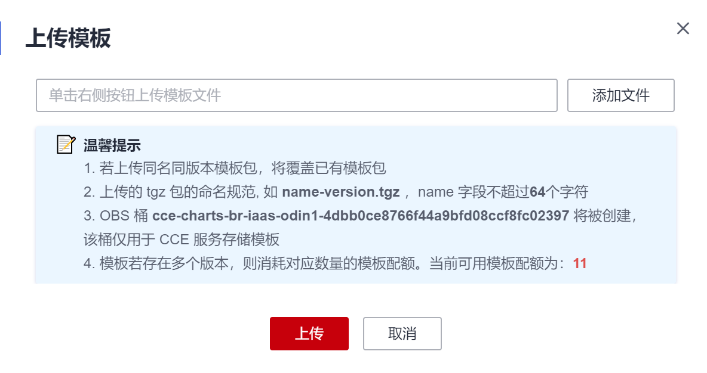

# 上传模板包

上传模板到“模板市场  \> 我的模板”中，为后期创建工作负载准备。

## 操作步骤

1.  登录[CCE控制台](https://console.huaweicloud.com/cce2.0/?utm_source=helpcenter)，在左侧导航栏中选择“模板市场 \> 我的模板“，单击“上传模板“。
2.  在“模板包”后的选择框中单击，选中待上传的工作负载包后，单击“上传”。

    **图 1**  上传模板包  
    

    > **说明：** 
    >由于上传模板时创建OBS桶的命名规则由cce-charts-\{region\}-**\{domain\_name\}**变为cce-charts-\{region\}-**\{domain\_id\}**，其中旧命名规则中的domain\_name系统会做base64转化并取前63位，如果您在现有命名规则的OBS桶中找不到模板，请在旧命名规则的桶中进行查找。

## 后续处理

模板创建完成后，在“我的模板”页面您还可以执行[表1](#t84ae87674877489b975382f30a71dfab)中的操作。

**表 1**  其他操作

<table><thead align="left"><tr id="re7230b135a27440f92e734bbebfc070e"><th class="cellrowborder" valign="top" width="20%" id="mcps1.2.3.1.1">
操作

</th>
<th class="cellrowborder" valign="top" width="80%" id="mcps1.2.3.1.2">
说明

</th>
</tr>
</thead>
<tbody><tr id="rb2b3046a94794a319604f737388bf9eb"><td class="cellrowborder" valign="top" width="20%" headers="mcps1.2.3.1.1 ">
安装模板

</td>
<td class="cellrowborder" valign="top" width="80%" headers="mcps1.2.3.1.2 ">
单击“安装”，安装该模板用于创建工作负载，具体请参见<a href="通过模板创建工作负载.md">通过模板创建工作负载</a>。

</td>
</tr>
<tr id="reda028ddd5b54babbbbc3902f75a740c"><td class="cellrowborder" valign="top" width="20%" headers="mcps1.2.3.1.1 ">
更新模板

</td>
<td class="cellrowborder" valign="top" width="80%" headers="mcps1.2.3.1.2 ">
更新模板是针对同名同版本的模板，即只更新内容不更新版本，操作同“上传模板”。

</td>
</tr>
<tr id="r5d095daf352f47d0ac61babe6f4ea614"><td class="cellrowborder" valign="top" width="20%" headers="mcps1.2.3.1.1 ">
下载模板

</td>
<td class="cellrowborder" valign="top" width="80%" headers="mcps1.2.3.1.2 ">
单击“更多 &gt; 下载”，将模板下载到本地。

</td>
</tr>
<tr id="r1d5ed8dcc6384b248fe80b74c38b7b7c"><td class="cellrowborder" valign="top" width="20%" headers="mcps1.2.3.1.1 ">
删除模板

</td>
<td class="cellrowborder" valign="top" width="80%" headers="mcps1.2.3.1.2 ">
单击“更多 &gt; 删除”，删除已创建的模板。

模板删除后不能恢复，请谨慎操作。

</td>
</tr>
</tbody>
</table>

