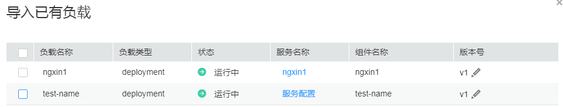

# 为应用导入已有负载

当部署新的组件到已有应用上时，可以导入cce已有无状态工作负载为组件。

## 前提条件

导入负载前，请确保系统中有可用应用，若没有请参照[创建应用](创建应用.md)创建，同时集群上有可用的无状态工作负载，若没有请参照[创建无状态工作负载](https://support.huaweicloud.com/usermanual-cce/cce_01_0047.html)创建。

> **说明：**   
>-   配置多个服务的工作负载无法导入。  
>-   配置的服务类型是nodePort且没有ingress的负载无法导入。  

## 为应用导入负载

1.  在CCE左侧导航栏中选择“应用治理“，打开[应用服务网格控制台](https://console.huaweicloud.com/istio/)，单击左侧导航栏中的“应用部署“，在待添加组件的应用后，单击“导入已有负载“。
2.  进入"导入已有负载"页签，进行以下配置。

    **图 1**  导入已有负载  
    

    -   工作负载已配置服务

        “服务名称”列显示工作负载的服务名称，无需配置。

    -   工作负载未配置服务

        单击“服务配置”，配置以下参数，单击“保存”。

        -   端口协议：选择请求协议，目前支持http和tcp协议。
        -   端口名称：默认自动填入端口名称，也支持自定义端口名称，例如http-a0009。
        -   访问端口：为外界访问该组件（即对应的负载）提供一个端口号。端口范围为1-65535，可任意指定。
        -   容器端口：为组件的访问端口号配置一个映射端口号来指向容器，需用户确定。例如nginx程序实际监听端口为80。

            > **说明：**   
            >未配置服务的工作负载需要先配置服务才可导入。  

3.  单击“版本号”下“”可以修改版本号，默认是v1。
4.  选择想要导入的工作负载，单击“确定”，返回“添加组件”页签，单击右下角“添加”。

