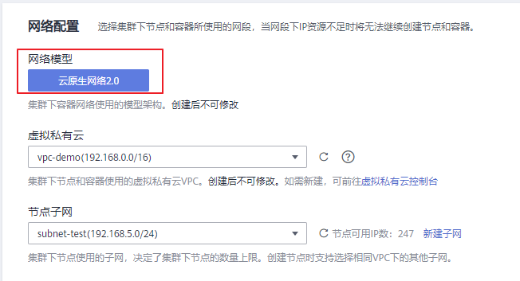
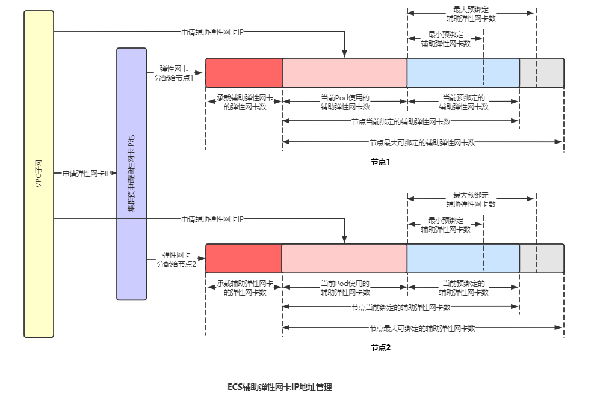
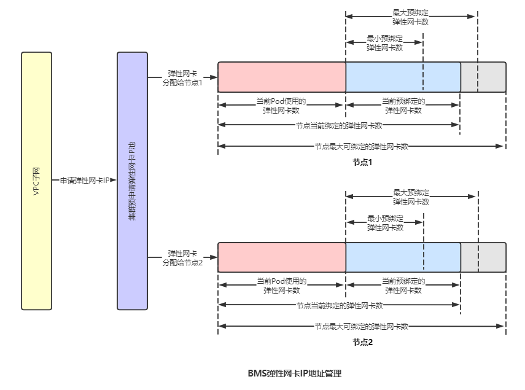

# 云原生网络2.0

云原生网络2.0是华为云自研的新一代容器网络模型，深度整合了华为云[虚拟私有云VPC](https://support.huaweicloud.com/vpc/index.html)的原生弹性网卡（Elastic Network Interface，简称ENI）能力，采用VPC网段分配容器地址，支持ELB直通容器，享有高性能。

**图 1**  云原生网络2.0  

## 约束与限制

-   CCE Turbo集群使用云原生网络2.0。
-   CCE Turbo集群支持添加共池裸金属节点和ECS节点（目前仅支持C6ne机型），共池裸金属节点使用了弹性网卡ENI的能力，ECS节点使用了辅助弹性网卡的能力，目前C6ne机型仅在“华南-广州“和“华北-北京四“Region申请公测后使用。
-   CCE Turbo集群支持加速容器，系统会默认为ENI网卡保留20个IP以实现预热，这些IP不能再分配给Trunkport网卡使用，因此创建出的容器个数和子网IP个数会不一致（例如：子网下有256个IP，实际能使用的IP只有236个）。
-   Trunkport模式下，每个节点默认占用1\~4个ENI网卡用于添加Trunkport，ENI网卡默认占用的数量=节点Trunkport容量/64（向上取整），这些ENI网卡不能分配给Pod使用。
-   CCE Turbo集群中节点上的弹性网卡ENI会被网络管理组件接管，若用户有使用弹性网卡ENI的诉求，需要[提交工单](https://console.huaweicloud.com/ticket/#/ticketindex/createIndex)开放。

## 适用场景

-   适用于对网络时延、带宽要求高的高性能场景。
-   容器与虚机IP互通，使用了微服务注册框架的，如Dubbo、Spring Cloud等。

## 云原生网络2.0容器网段规划

云原生网络2.0采用与集群相同VPC下的不同子网作为容器网段。

规划容器网段的可分配IP数应至少大于集群下各个节点的负载实例上限之和。

1.  节点负载实例数大于容器网段IP数，造成节点资源浪费。
2.  预热ENI网卡占用容器网段IP。

## IP地址管理

**云原生网络2.0，ECS节点上绑定的弹性网卡/辅助弹性网卡数：**Pod正在使用的辅助弹性网卡数 + 用于承载辅助弹性网卡的弹性网卡数 + 最小预绑定辅助弹性网卡数 < ECS节点上绑定的弹性网卡/辅助弹性网卡数 < Pod正在使用的辅助弹性网卡数 + 用于承载辅助弹性网卡的弹性网卡数 + 最大预绑定辅助弹性网卡数

-   当预绑定辅助弹性网卡数 < 最小预绑定辅助弹性网卡数时，会绑定辅助弹性网卡使得预绑定辅助弹性网卡数 = 最小预绑定辅助弹性网卡数。
-   当预绑定辅助弹性网卡数 \> 最大预绑定辅助弹性网卡数，会定时释放弹性辅助网卡（约2分钟一次），直到预绑定辅助弹性网卡数 = 最大预绑定辅助弹性网卡数。

**图 2**  ECS辅助弹性网卡IP地址管理  

**云原生网络2.0，BMS节点上绑定的弹性网卡数：**Pod正在使用的弹性网卡数 + 最小预绑定弹性网卡数 < BMS节点上绑定的弹性网卡数 < Pod正在使用的弹性网卡数 + 最大预绑定弹性网卡数

-   当预绑定弹性网卡数 < 最小预绑定弹性网卡数时，会绑定弹性网卡使得预绑定弹性网卡数 = 最小预绑定弹性网卡数。
-   当预绑定弹性网卡数 \> 最大预绑定弹性网卡数，会定时释放弹性网卡（约2分钟一次），直到预绑定弹性网卡数 = 最大预绑定弹性网卡数。
-   当预绑定辅助弹性网卡数量 < Pod数量 + 最小预绑定数量时，会绑定网卡使得已绑定数量 = Pod数量 + 最小预绑定数量。
-   当已绑定数量 \> Pod数量 + 最大预绑定数量时，会定时释放1个网卡（约2分钟一次），直到已绑定数量 = Pod数量 + 最大预绑定数量。
-   当最大可绑定网卡数量 < 当前已绑定数量时，会直接释放多余的空闲网卡，使得已绑定数量 = 最大可绑定数量。
-   独占网卡的Pod创建时，从节点可用网卡池中随机分配一个可用网卡。
-   独占网卡的Pod销毁时，网卡释放回节点的网卡池，留给下一个Pod使用，不会在VPC侧释放（删除）。
-   节点删除时，将释放（删除）所有已绑定的网卡。

**图 3**  BMS弹性网卡IP地址管理  

