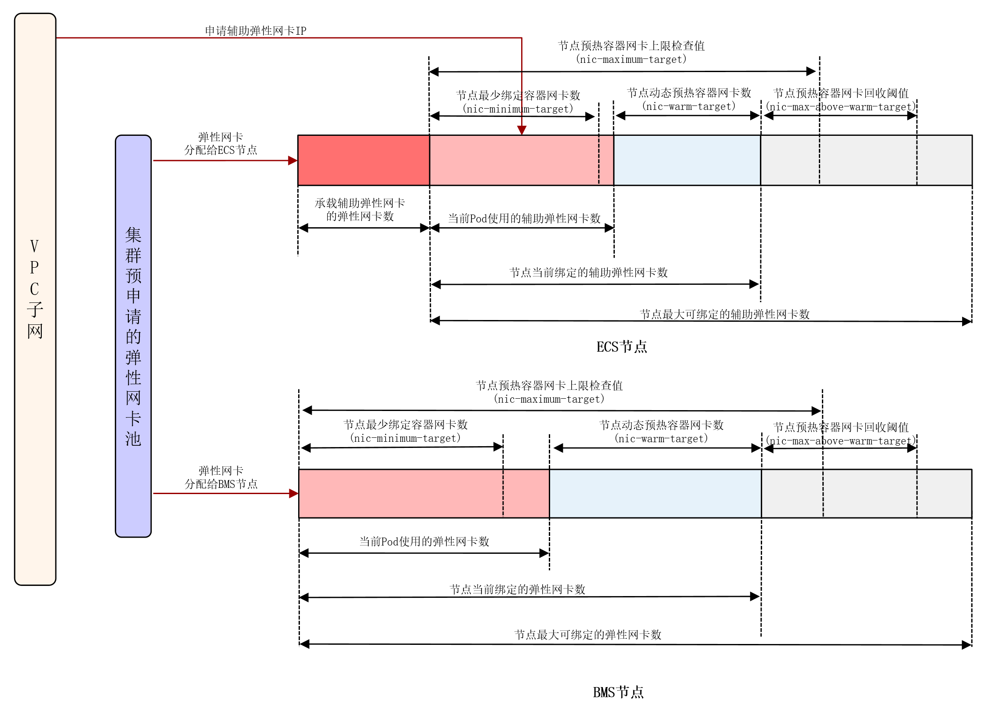
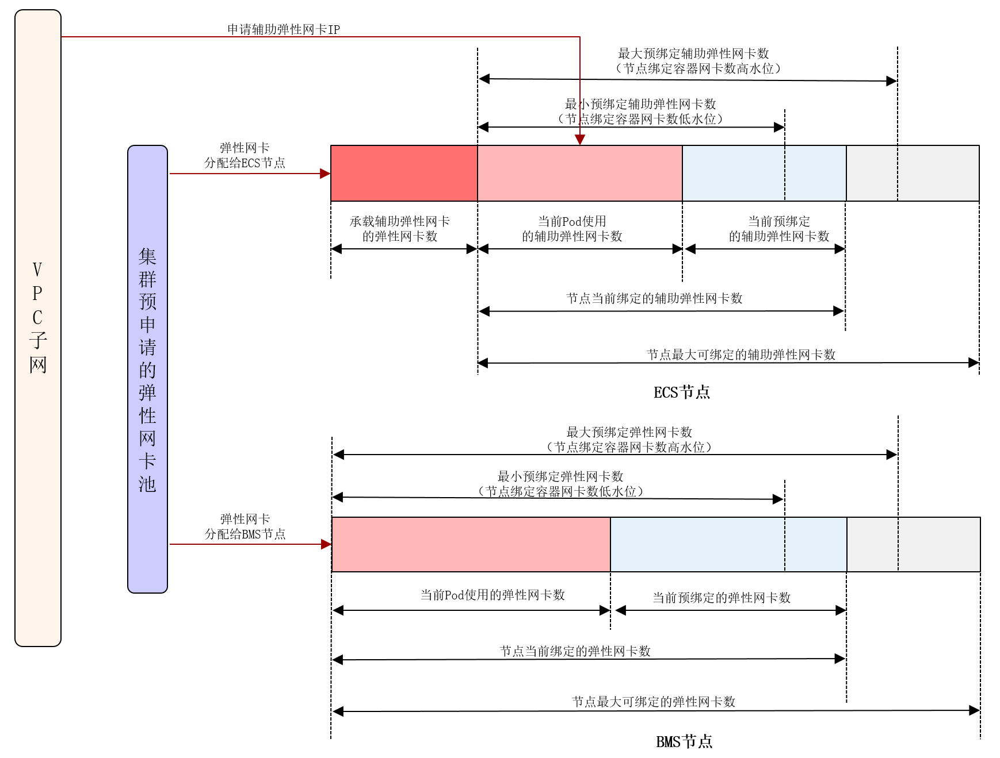
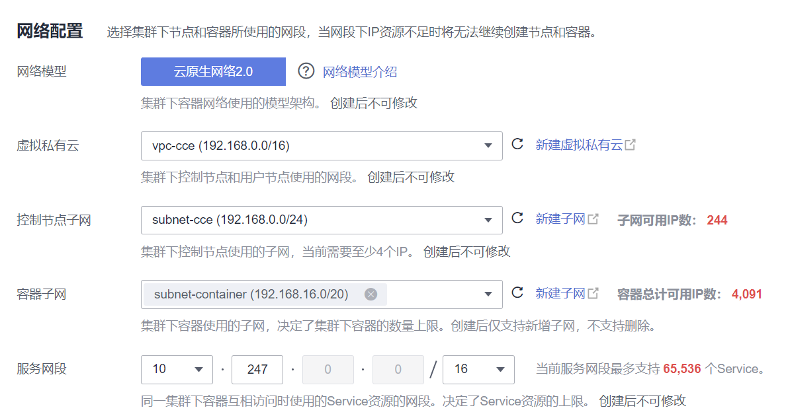

# 云原生网络2.0<a name="cce_10_0284"></a>

## 云原生网络2.0网络模型<a name="section18112145311217"></a>

云原生网络2.0是自研的新一代容器网络模型，深度整合了虚拟私有云VPC的弹性网卡（Elastic Network Interface，简称ENI）和辅助弹性网卡（Sub Network Interface，简称Sub-ENI）的能力，直接从VPC网段内分配容器IP地址，支持ELB直通容器，绑定安全组，绑定弹性公网IP，享有高性能。

**图 1**  云原生网络2.0<a name="zh-cn_topic_0146398798_fig117435555917"></a>  


**说明如下：**

-   裸金属节点上Pod使用ENI网卡；ECS节点上Pod使用Sub-ENI网卡，Sub-ENI网卡通过VLAN子接口挂载在ENI上。
-   节点内Pod间通信：直接通过VPC的弹性网卡/弹性辅助网卡进行流量转发。
-   跨节点Pod间通信：直接通过VPC的弹性网卡/弹性辅助网卡进行流量转发。

## 约束与限制<a name="section2548184716433"></a>

仅CCE Turbo集群支持使用云原生网络2.0。

## 优缺点<a name="section884011382223"></a>

**优点**

-   容器网络直接使用的VPC，网络问题易排查、性能最高。
-   支持VPC内的外部网络与容器IP直通。
-   可直接利用VPC提供的负载均衡、安全组、弹性公网IP等能力。

**缺点**

由于容器网络直接使用的VPC，消耗VPC的地址空间，创建集群前需要合理规划好容器网段。

## 适用场景<a name="section3723244144011"></a>

-   性能要求高，需要使用VPC其他网络能力的场景：由于云原生网络2.0直接使用的VPC网络，性能与VPC网络的性能几乎一致，所以适用于对带宽、时延要求极高的业务场景，比如：线上直播、电商秒杀等。
-   大规模组网：云原生网络2.0当前最大可支持2000个ECS节点，10万个容器。

## 容器IP地址管理<a name="section8646192033311"></a>

云原生网络2.0下的BMS节点和ECS节点分别使用的是弹性网卡和辅助弹性网卡：

-   Pod的IP地址从配置给容器网络的VPC子网上直接分配，无需为节点分配一个单独的小网段。
-   ECS节点添加到集群中，先绑定用于承载辅助弹性网卡的弹性网卡，待弹性网卡绑定完成后，即可绑定辅助弹性网卡。
-   ECS节点上绑定的弹性网卡数：**该节点最多可绑定的辅助弹性网卡数/64**，向上取整。
-   ECS节点上绑定的总网卡数：**用于承载辅助弹性网卡的弹性网卡数+当前Pod使用的辅助弹性网卡数+预热的辅助弹性网卡数**。
-   BMS节点上绑定的网卡数：**当前Pod使用的弹性网卡数+预热的弹性网卡数**。
-   Pod创建时，优先从节点的预热网卡池中随机分配一个可用的网卡。
-   Pod删除时，网卡释放回节点的预热网卡池。
-   节点删除时，将释放节点上所有已绑定的网卡（弹性网卡释放回集群预申请的网卡池，辅助弹性网卡直接删除）。

云原生2.0网络目前支持两种网卡预热策略：**节点容器网卡动态预热策略**和**节点绑定容器网卡数总量高低水位策略（废弃中）**。使用场景如下表所示：

**表 1**  容器网卡预热策略对比表

<a name="table89781532131220"></a>
<table><thead align="left"><tr id="row797816322124"><th class="cellrowborder" valign="top" width="10.291029102910292%" id="mcps1.2.4.1.1"><p id="p1997883217124"><a name="p1997883217124"></a><a name="p1997883217124"></a>容器网卡预热策略</p>
</th>
<th class="cellrowborder" valign="top" width="54.1954195419542%" id="mcps1.2.4.1.2"><p id="p119792032191214"><a name="p119792032191214"></a><a name="p119792032191214"></a>节点容器网卡动态预热策略（默认策略）</p>
</th>
<th class="cellrowborder" valign="top" width="35.51355135513551%" id="mcps1.2.4.1.3"><p id="p1197923219123"><a name="p1197923219123"></a><a name="p1197923219123"></a>节点绑定容器网卡数总量高低水位策略（废弃中）</p>
</th>
</tr>
</thead>
<tbody><tr id="row129791732151213"><td class="cellrowborder" valign="top" width="10.291029102910292%" headers="mcps1.2.4.1.1 "><p id="p14979143241217"><a name="p14979143241217"></a><a name="p14979143241217"></a>管理策略</p>
</td>
<td class="cellrowborder" valign="top" width="54.1954195419542%" headers="mcps1.2.4.1.2 "><p id="p09791232111219"><a name="p09791232111219"></a><a name="p09791232111219"></a>节点最少绑定容器网卡数（nic-minimum-target）：保障节点最少有多少张容器网卡绑定在节点上（未被Pod使用+已被Pod使用）</p>
<p id="p81198299345"><a name="p81198299345"></a><a name="p81198299345"></a>节点预热容器网卡上限检查值（nic-maximum-target）：当节点绑定的容器网卡数超过该值，不再主动预热容器网卡</p>
<p id="p18504342113511"><a name="p18504342113511"></a><a name="p18504342113511"></a>节点动态预热容器网卡数：当Pod使用完节点最少绑定容器网卡数（nic-minimum-target）后，会始终额外预热多少张容器网卡</p>
<p id="p11148114153614"><a name="p11148114153614"></a><a name="p11148114153614"></a>节点预热容器网卡回收阈值(nic-max-above-warm-target)：只有当 节点上空闲的容器网卡数 - 节点动态预热容器网卡数(nic-warm-target) 大于此阈值时，才会触发预热容器网卡的解绑回收</p>
</td>
<td class="cellrowborder" valign="top" width="35.51355135513551%" headers="mcps1.2.4.1.3 "><p id="p1597993211121"><a name="p1597993211121"></a><a name="p1597993211121"></a>节点绑定容器网卡数低水位：保障节点至少会绑定多少张网卡（未被Pod使用+已被Pod使用）</p>
<p id="p171991847113712"><a name="p171991847113712"></a><a name="p171991847113712"></a>节点绑定容器网卡数高水位：保障节点至多会绑定多少张网卡，超过该值会尝试解绑未被使用的空闲网卡</p>
</td>
</tr>
<tr id="row597910328124"><td class="cellrowborder" valign="top" width="10.291029102910292%" headers="mcps1.2.4.1.1 "><p id="p11979163281215"><a name="p11979163281215"></a><a name="p11979163281215"></a>适用场景</p>
</td>
<td class="cellrowborder" valign="top" width="54.1954195419542%" headers="mcps1.2.4.1.2 "><p id="p4979232111219"><a name="p4979232111219"></a><a name="p4979232111219"></a>在尽可能提高IP资源利用率的前提下，尽可能加快Pod的启动速度，适用于容器网段IP地址数紧张的场景</p>
<p id="p15494147393"><a name="p15494147393"></a><a name="p15494147393"></a>通过合理配置上述四个参数，可适用于各种业务场景，详情请参见<a href="https://support.huaweicloud.com/bestpractice-cce/cce_bestpractice_10010.html" target="_blank" rel="noopener noreferrer">CCE Turbo配置容器网卡动态预热</a>。</p>
</td>
<td class="cellrowborder" valign="top" width="35.51355135513551%" headers="mcps1.2.4.1.3 "><p id="p49791732171220"><a name="p49791732171220"></a><a name="p49791732171220"></a>适用于容器网段IP地址数充足，且节点上Pod数变化剧烈，但固定在某个范围的场景</p>
</td>
</tr>
</tbody>
</table>

> **说明：** 
>-   1.19.16-r2、1.21.5-r0、1.23.3-r0到1.19.16-r4、1.21.7-r0、1.23.5-r0之间的集群版本只支持nic-minimum-target和nic-warm-target两个容器网卡动态预热参数配置，绑定网卡数总量高低水位配置优先级高于容器网卡动态预热配置。
>-   1.19.16-r4、1.21.7-r0、1.23.5-r0、1.25.1-r0及以上集群版本支持全部四个容器网卡动态预热参数配置，容器网卡动态预热配置优先级高于绑定网卡数总量高低水位配置。

**图 2**  节点容器网卡动态预热策略<a name="fig8596185311515"></a>  


针对节点容器网卡动态预热策略，CCE提供了四个参数配置，您可以根据业务规划，集群规模以及节点上可绑定的网卡数，合理设置这四个参数。

**表 2**  容器网卡动态预热参数

<a name="table12837154511555"></a>
<table><thead align="left"><tr id="row68387451552"><th class="cellrowborder" valign="top" width="23.597640235976403%" id="mcps1.2.5.1.1"><p id="p15544654105610"><a name="p15544654105610"></a><a name="p15544654105610"></a>容器网卡动态预热参数</p>
</th>
<th class="cellrowborder" valign="top" width="8.739126087391263%" id="mcps1.2.5.1.2"><p id="p10544135465610"><a name="p10544135465610"></a><a name="p10544135465610"></a>默认值</p>
</th>
<th class="cellrowborder" valign="top" width="49.27507249275072%" id="mcps1.2.5.1.3"><p id="p185443543564"><a name="p185443543564"></a><a name="p185443543564"></a>参数说明</p>
</th>
<th class="cellrowborder" valign="top" width="18.388161183881614%" id="mcps1.2.5.1.4"><p id="p5533161014014"><a name="p5533161014014"></a><a name="p5533161014014"></a>配置建议</p>
</th>
</tr>
</thead>
<tbody><tr id="row1583874565519"><td class="cellrowborder" valign="top" width="23.597640235976403%" headers="mcps1.2.5.1.1 "><p id="p11544354145615"><a name="p11544354145615"></a><a name="p11544354145615"></a>节点最少绑定容器网卡数(nic-minimum-target)</p>
</td>
<td class="cellrowborder" valign="top" width="8.739126087391263%" headers="mcps1.2.5.1.2 "><p id="p2054425416564"><a name="p2054425416564"></a><a name="p2054425416564"></a>10</p>
</td>
<td class="cellrowborder" valign="top" width="49.27507249275072%" headers="mcps1.2.5.1.3 "><p id="p954465475620"><a name="p954465475620"></a><a name="p954465475620"></a>保障节点最少有多少张容器网卡绑定在节点上，支持数值跟百分比两种配置方式。</p>
<a name="ul1354212181438"></a><a name="ul1354212181438"></a><ul id="ul1354212181438"><li>数值配置：参数值需为正整数。例如10，表示节点最少有10张容器网卡绑定在节点上。当超过节点的容器网卡配额时，后台取值为节点的容器网卡配额。</li><li>百分比配置：参数值范围为1%-100%。例如10%，如果节点容器网卡配额128，表示节点最少有12张（向下取整）容器网卡绑定在节点上。</li></ul>
<p id="p125441354165613"><a name="p125441354165613"></a><a name="p125441354165613"></a>建议nic-minimum-target与nic-maximum-target为同类型的配置方式（同采用数值配置或同采用百分比配置）。</p>
</td>
<td class="cellrowborder" valign="top" width="18.388161183881614%" headers="mcps1.2.5.1.4 "><p id="p146974331425"><a name="p146974331425"></a><a name="p146974331425"></a>建议配置为大部分节点平时日常运行的Pod数。</p>
</td>
</tr>
<tr id="row1838134510559"><td class="cellrowborder" valign="top" width="23.597640235976403%" headers="mcps1.2.5.1.1 "><p id="p155441754115610"><a name="p155441754115610"></a><a name="p155441754115610"></a>节点预热容器网卡上限检查值(nic-maximum-target)</p>
</td>
<td class="cellrowborder" valign="top" width="8.739126087391263%" headers="mcps1.2.5.1.2 "><p id="p254495411569"><a name="p254495411569"></a><a name="p254495411569"></a>0</p>
</td>
<td class="cellrowborder" valign="top" width="49.27507249275072%" headers="mcps1.2.5.1.3 "><p id="p16544175455617"><a name="p16544175455617"></a><a name="p16544175455617"></a>当节点绑定的容器网卡数超过节点预热容器网卡上限检查值(nic-maximum-target)，不再主动预热容器网卡。</p>
<p id="p75441054135616"><a name="p75441054135616"></a><a name="p75441054135616"></a>当该参数大于等于节点最少绑定容器网卡数(nic-minimum-target)时，则开启预热容器网卡上限值检查；反之，则关闭预热容器网卡上限值检查。支持数值跟百分比两种配置方式。</p>
<a name="ul07411381247"></a><a name="ul07411381247"></a><ul id="ul07411381247"><li>数值配置：参数值需为正整数。例如0，表示关闭预热容器网卡上限值检查。当超过节点的容器网卡配额时，后台取值为节点的容器网卡配额。</li><li>百分比配置：参数值范围为1%-100%。例如50%，如果节点容器网卡配额128，表示节点预热容器网卡上限检查值64（向下取整）。</li></ul>
<p id="p65441554175620"><a name="p65441554175620"></a><a name="p65441554175620"></a>建议nic-minimum-target与nic-maximum-target为同类型的配置方式（同采用数值配置或同采用百分比配置）。</p>
</td>
<td class="cellrowborder" valign="top" width="18.388161183881614%" headers="mcps1.2.5.1.4 "><p id="p11600134516218"><a name="p11600134516218"></a><a name="p11600134516218"></a>建议配置为大部分节点平时最多运行的Pod数。</p>
</td>
</tr>
<tr id="row075618516568"><td class="cellrowborder" valign="top" width="23.597640235976403%" headers="mcps1.2.5.1.1 "><p id="p115445545562"><a name="p115445545562"></a><a name="p115445545562"></a>节点动态预热容器网卡数(nic-warm-target)</p>
</td>
<td class="cellrowborder" valign="top" width="8.739126087391263%" headers="mcps1.2.5.1.2 "><p id="p1754435418569"><a name="p1754435418569"></a><a name="p1754435418569"></a>2</p>
</td>
<td class="cellrowborder" valign="top" width="49.27507249275072%" headers="mcps1.2.5.1.3 "><p id="p145441454125616"><a name="p145441454125616"></a><a name="p145441454125616"></a>当Pod使用完节点最少绑定容器网卡数(nic-minimum-target)后，会始终额外预热多少张容器网卡，只支持数值配置。</p>
<p id="p18544354115619"><a name="p18544354115619"></a><a name="p18544354115619"></a>当 节点动态预热容器网卡数(nic-warm-target) + 节点当前绑定的容器网卡数 大于 节点预热容器网卡上限检查值(nic-maximum-target) 时，只会预热nic-maximum-target与节点当前绑定的容器网卡数的差值。</p>
</td>
<td class="cellrowborder" valign="top" width="18.388161183881614%" headers="mcps1.2.5.1.4 "><p id="p16533910603"><a name="p16533910603"></a><a name="p16533910603"></a>建议配置为大部分节点日常10s内会瞬时弹性扩容的Pod数。</p>
</td>
</tr>
<tr id="row14150115315561"><td class="cellrowborder" valign="top" width="23.597640235976403%" headers="mcps1.2.5.1.1 "><p id="p954435415565"><a name="p954435415565"></a><a name="p954435415565"></a>节点预热容器网卡回收阈值(nic-max-above-warm-target)</p>
</td>
<td class="cellrowborder" valign="top" width="8.739126087391263%" headers="mcps1.2.5.1.2 "><p id="p105451654145616"><a name="p105451654145616"></a><a name="p105451654145616"></a>2</p>
</td>
<td class="cellrowborder" valign="top" width="49.27507249275072%" headers="mcps1.2.5.1.3 "><p id="p15545354185619"><a name="p15545354185619"></a><a name="p15545354185619"></a>只有当 节点上空闲的容器网卡数 - 节点动态预热容器网卡数(nic-warm-target) 大于此阈值 时，才会触发预热容器网卡的解绑回收。只支持数值配置。</p>
<a name="ul1163419561149"></a><a name="ul1163419561149"></a><ul id="ul1163419561149"><li>调大此值会减慢空闲容器网卡的回收，加快Pod的启动速度，但会降低IP地址的利用率，特别是在IP地址紧张的场景，<strong id="b1255217163513"><a name="b1255217163513"></a><a name="b1255217163513"></a>请谨慎调大</strong>。</li><li>调小此值会加快空闲容器网卡的回收，提高IP地址的利用率，但在瞬时大量Pod激增的场景，部分Pod启动会稍微变慢。</li></ul>
</td>
<td class="cellrowborder" valign="top" width="18.388161183881614%" headers="mcps1.2.5.1.4 "><p id="p1963305914219"><a name="p1963305914219"></a><a name="p1963305914219"></a>建议配置为大部分节点日常在分钟级时间范围内会频繁弹性扩容缩容的Pod数 - 大部分节点日常10s内会瞬时弹性扩容的Pod数。</p>
</td>
</tr>
</tbody>
</table>

> **说明：** 
>上述容器网卡动态预热参数支持集群级别的全局配置和节点池级别的差异化配置，其中节点池级别的容器网卡动态预热配置优先级高于集群级别的容器网卡动态预热配置。

容器网络组件会为每个节点维护一个可弹性伸缩的预热容器网卡池 ，定时（约10s一次）检测并计算**需要绑定的预热容器网卡数**或**需要解绑的空闲容器网卡数**  :

-   **需要绑定的预热容器网卡数 = min\(nic-maximum-target - 当前绑定的容器网卡总数，max\(nic-minimum-target- 当前绑定的容器网卡总数，nic-warm-target - 当前空闲的容器网卡数\)\)**
-   **需要解绑的空闲容器网卡数 = min\(当前空闲的容器网卡数 - nic-warm-target- nic-max-above-warm-target，当前绑定的容器网卡总数 - nic-minimum-target\)**

节点上当前预热的容器网卡数稳态后会维持在以下区间内： 

-   **当前预热的容器网卡数区间最小值 = min\(max\(nic-minimum-target- 当前绑定的容器网卡总数，nic-warm-target\), nic-maximum-target - 当前绑定的容器网卡总数\)**
-   **当前预热的容器网卡数区间最大值 = max\(nic-warm-target+ nic-max-above-warm-target,  当前绑定的容器网卡总数 - nic-minimum-target\)**

Pod创建时，优先从节点的预热容器网卡池中顺序分配（最早未被使用的）一张空闲的容器网卡，如没有可用的空闲网卡，会新创建一张网卡（辅助弹性网卡）或 新绑定一张网卡（弹性网卡）以分配给该Pod。

Pod删除时，对应的容器网卡先释放回节点的预热容器网卡池，2分钟冷却时间内可供下一个Pod循环使用，超过2分钟冷却时间后且节点预热容器网卡池计算出需要释放该容器网卡，才会释放该容器网卡。

**图 3**  节点绑定容器网卡数总量高低水位策略<a name="fig1152604112509"></a>  


针对总量高低水位算法，CCE提供了一个配置参数，您可以根据业务规划，集群规模以及节点上可绑定的网卡数，合理设置这个参数：

-   节点绑定容器网卡数低水位：默认为0，保障节点至少会绑定多少张网卡（未被Pod使用+已被Pod使用）。ECS节点预绑定低水位网卡数=节点绑定网卡数低水位\*节点总辅助弹性网卡数；BMS节点预绑定低水位网卡数=节点绑定网卡数低水位\*节点总弹性网卡数。
-   节点绑定容器网卡数高水位：默认为0，保障节点至多会绑定多少张网卡，超过该值会尝试解绑未被使用的空闲网卡。ECS节点预绑定高水位网卡数=节点绑定网卡数高水位\*节点总辅助弹性网卡数；BMS节点预绑定高水位网卡数=节点绑定网卡数高水位\*节点总弹性网卡数。

容器网络组件会为每个节点维护一个可弹性伸缩的容器网卡池：

-   当**已绑定容器网卡数量（Pod使用的容器网卡数+预绑定的容器网卡数）< 预绑定低水位容器网卡数**时，会绑定网卡直到节点上**已绑定容器网卡数量（Pod使用的容器网卡数+预绑定的容器网卡数）=预绑定低水位容器网卡数**。
-   当**已绑定容器网卡数量（Pod使用的容器网卡数+预绑定的容器网卡数）\> 预绑定高水位容器网卡数**，且** 节点预绑定的容器网卡数\>0 **时，会定时释放预绑定的容器网卡（超过2分钟未被使用的空闲网卡），直到**Pod使用的容器网卡数+预绑定的容器网卡数=节点预绑定高水位容器网卡数 **或  **Pod使用的容器网卡数 \> 节点预绑定高水位容器网卡数**  且** 节点预绑定的容器网卡数=0。**

## 网段规划建议<a name="section08181419115517"></a>

在[集群网络构成](网络概述.md#section1131733719195)中介绍集群中网络地址可分为节点网络、容器网络、服务网络三块，在规划网络地址时需要从如下方面考虑：

-   **三个网段不能重叠**，否则会导致冲突。且集群所在VPC下所有子网（包括扩展网段子网）不能和容器网段、服务网段冲突。
-   保证**每个网段有足够的IP地址可用**。
    -   节点网段的IP地址要与集群规模相匹配，否则会因为IP地址不足导致无法创建节点。
    -   容器网段的IP地址要与业务规模相匹配，否则会因为IP地址不足导致无法创建Pod。


云原生网络2.0模型下，由于容器网段与节点网段共同使用VPC下的网络地址，建议容器子网与节点子网不要使用同一个子网，否则容易出现IP资源不足导致容器或节点创建失败的情况。

另外云原生网络2.0模型下容器网段支持在创建集群后增加子网，扩展可用IP数量，此时需要注意增加的子网不要与容器网段其他子网存在网络冲突。

**图 4**  网段配置（创建集群时配置）<a name="fig16639123813259"></a>  


## 云原生网络2.0访问示例<a name="section161713314914"></a>

创建一个CCE Turbo集群，集群包含3个ECS节点。

进入其中一个节点，可以看到节点有一个主网卡和扩展网卡，这两个网卡都是弹性网卡，其中扩展网卡是属于容器网络网段，用于给Pod挂载辅助弹性网卡Sub-ENI。

**图 5**  节点网卡<a name="fig9242131819209"></a>  


在集群中创建一个Deployment。

```
kind: Deployment
apiVersion: apps/v1
metadata:
  name: example
  namespace: default
spec:
  replicas: 6
  selector:
    matchLabels:
      app: example
  template:
    metadata:
      labels:
        app: example
    spec:
      containers:
        - name: container-0
          image: 'nginx:perl'
          resources:
            limits:
              cpu: 250m
              memory: 512Mi
            requests:
              cpu: 250m
              memory: 512Mi
      imagePullSecrets:
        - name: default-secret
```

创建后查询Pod。

```
$ kubectl get pod -owide
NAME                       READY   STATUS    RESTARTS   AGE   IP            NODE         NOMINATED NODE   READINESS GATES
example-5bdc5699b7-54v7g   1/1     Running   0          7s    10.1.18.2     10.1.0.167   <none>           <none>
example-5bdc5699b7-6dzx5   1/1     Running   0          7s    10.1.18.216   10.1.0.186   <none>           <none>
example-5bdc5699b7-gq7xs   1/1     Running   0          7s    10.1.16.63    10.1.0.144   <none>           <none>
example-5bdc5699b7-h9rvb   1/1     Running   0          7s    10.1.16.125   10.1.0.167   <none>           <none>
example-5bdc5699b7-s9fts   1/1     Running   0          7s    10.1.16.89    10.1.0.144   <none>           <none>
example-5bdc5699b7-swq6q   1/1     Running   0          7s    10.1.17.111   10.1.0.167   <none>           <none>
```

这里Pod的IP都是Sub-ENI，挂载在节点的ENI上（扩展网卡）。

例如10.1.0.167节点对应的扩展网卡是10.1.17.172。在弹性网卡控制台上可以看到10.1.17.172这块扩展网卡挂载3个Sub-ENI，正是Pod的IP。

**图 6**  Pod网卡<a name="fig03652819204"></a>  


在VPC中直接访问Pod的IP，能够正常访问。

