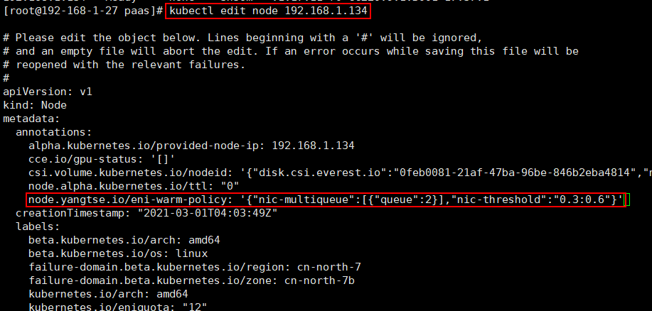

# 云原生网络2.0

-   [约束与限制](#section2548184716433)
-   [优势](#section97761310143015)
-   [适用场景](#section3723244144011)
-   [云原生网络2.0容器网段规划](#section08181419115517)
-   [通过Kubectl调整裸金属节点网卡预热状态](#section8392727628)

云原生网络2.0是华为云自研的新一代容器网络模型，深度整合了华为云[虚拟私有云VPC](https://support.huaweicloud.com/vpc/index.html)的原生弹性网卡（Elastic Network Interface，简称ENI）能力，采用VPC网段分配容器地址，支持ELB直通容器，享有高性能。

**图 1**  云原生网络2.0  

**云原生网络2.0包括4个组件：**

-   yangtse-apiserver

    提供云原生网络2.0内部资源对象（Node，DistNodeSubnet，NeutronPort，Network，Subnet）等资源的REST操作接口，供yangtse-controller，yangtse-agent进行调用。

-   yangtse-controller

    是云原生网络2.0的核心，它通过对yangtse-apiserver以及kube-apiserver特定资源进行list&watch，将当前的状态向期望的状态迁移并最终一致；目前包括NAD控制器、DistNodeSubnet控制器、ENI Pod控制器、Node控制器、NeutronPort控制器、Accelerator控制器、Recycler控制器、PodNetworkInterface控制器、NetworkPolicy控制器等控制器。

-   yangtse-cni

    实现了CNI标准规范的二进制插件，作为kubelet与yangtse-agent之间的调用代理。

-   yangtse-agent

    是运行在每个节点上的守护进程，yangtse-agent启动的时候，会向yangtse-apiserver注册该节点；yangtse-agent也需要对特定的资源进行list&watch进行控制调谐，包括Network控制器、NeutronPort控制器；同时作为server响应yangtse-cni的容器网络Add/Del请求。

## 约束与限制

-   仅CCE Turbo集群支持使用该功能。
-   CCE Turbo集群中使用了弹性网卡的能力，单节点部署的容器数量受限于ECS节点的网卡个数上限，详情请参见ECS的[规格清单](https://support.huaweicloud.com/productdesc-ecs/zh-cn_topic_0159822360.html)。
-   CCE Turbo集群默认不预留网卡，即CCE节点上的ENI网卡会被网络管理组件接管，若用户有使用ENI的诉求，需要[提交工单](https://console.huaweicloud.com/ticket/#/ticketindex/createIndex)开放。

## 优势

-   灵活迁移

    通过将弹性网卡从云服务器实例解绑后再绑定到另外一台服务器实例，保留已绑定私网IP、弹性公网IP和安全组策略，无需重新配置关联关系，将故障实例上的业务流量快速迁移到备用实例，实现服务快速恢复。

-   业务分离管理

    可以为服务器实例配置多个分属于同一VPC内不同子网的弹性网卡，特定网卡分别承载云服务器实例的内网、外网、管理网流量。针对子网可独立设置访问安全控制策略与路由策略，弹性网卡也可配置独立安全组策略，从而实现网络隔离与业务流量分离。

## 适用场景

-   适用于对网络时延、带宽要求高的高性能场景。
-   容器与虚机IP互通，使用了微服务注册框架的，如Dubbo、Spring Cloud等。

## 云原生网络2.0容器网段规划

-   云原生网络2.0采用与集群相同VPC下的不同子网作为容器网段。

    

-   规划容器网段的可分配IP数应至少大于集群下各个节点的负载实例上限之和。
    1.  节点负载实例数大于容器网段IP数，造成节点资源浪费。
    2.  预热ENI网卡占用容器网段IP。

## 通过Kubectl调整裸金属节点网卡预热状态

1.  登录已配置好kubectl命令的弹性云服务器。登录方法请参见[登录Linux弹性云服务器](https://support.huaweicloud.com/usermanual-ecs/zh-cn_topic_0013771089.html)。
2.  编辑对应节点的yaml。
3.  修改ENI网卡预热参数。

    

    **表 1**  关键参数说明

    
    <table><thead align="left"><tr id="row1157212271924"><th class="cellrowborder" valign="top" width="24.772477247724773%" id="mcps1.2.5.1.1">
参数

    </th>
    <th class="cellrowborder" valign="top" width="13.691369136913693%" id="mcps1.2.5.1.2">
是否必填

    </th>
    <th class="cellrowborder" valign="top" width="13.821382138213819%" id="mcps1.2.5.1.3">
参数类型

    </th>
    <th class="cellrowborder" valign="top" width="47.714771477147714%" id="mcps1.2.5.1.4">
描述

    </th>
    </tr>
    </thead>
    <tbody><tr id="row15572122712213"><td class="cellrowborder" valign="top" width="24.772477247724773%" headers="mcps1.2.5.1.1 ">
nic-multiqueue

    </td>
    <td class="cellrowborder" valign="top" width="13.691369136913693%" headers="mcps1.2.5.1.2 ">
是

    </td>
    <td class="cellrowborder" valign="top" width="13.821382138213819%" headers="mcps1.2.5.1.3 ">
<a href="#table16175413105111">表2 nic-multiqueue字段数据结构说明</a>

    
Object

    </td>
    <td class="cellrowborder" valign="top" width="47.714771477147714%" headers="mcps1.2.5.1.4 ">
预热网卡的队列数与比例。

    </td>
    </tr>
    <tr id="row10573192714211"><td class="cellrowborder" valign="top" width="24.772477247724773%" headers="mcps1.2.5.1.1 ">
nic-threshold

    </td>
    <td class="cellrowborder" valign="top" width="13.691369136913693%" headers="mcps1.2.5.1.2 ">
是

    </td>
    <td class="cellrowborder" valign="top" width="13.821382138213819%" headers="mcps1.2.5.1.3 ">
String

    </td>
    <td class="cellrowborder" valign="top" width="47.714771477147714%" headers="mcps1.2.5.1.4 ">
预热网卡的高低水位。

    
低水位：当预热网卡数小于（低水位*ENI网卡配额）时，节点会自动预热到（低水位*ENI网卡配额的网卡）数。

    
高水位：当节点预热网卡数大于（高水位*ENI网卡配额）时，节点会自动解绑一部分网卡，直至ENI网卡数小于等于（高水位*ENI网卡配额）。

    
取值范围：

    
1. 必须为一位小数

    
2. 0 &lt;= 低水位&lt;=高水位&lt;=1

    </td>
    </tr>
    </tbody>
    </table>

    **表 2**  nic-multiqueue字段数据结构说明

    
    <table><thead align="left"><tr id="row95731278218"><th class="cellrowborder" valign="top" width="24.612461246124614%" id="mcps1.2.5.1.1">
参数

    </th>
    <th class="cellrowborder" valign="top" width="14.481448144814483%" id="mcps1.2.5.1.2">
是否必填

    </th>
    <th class="cellrowborder" valign="top" width="15.771577157715772%" id="mcps1.2.5.1.3">
参数类型

    </th>
    <th class="cellrowborder" valign="top" width="45.13451345134513%" id="mcps1.2.5.1.4">
描述

    </th>
    </tr>
    </thead>
    <tbody><tr id="row11573122712214"><td class="cellrowborder" valign="top" width="24.612461246124614%" headers="mcps1.2.5.1.1 ">
queue

    </td>
    <td class="cellrowborder" valign="top" width="14.481448144814483%" headers="mcps1.2.5.1.2 ">
是

    </td>
    <td class="cellrowborder" valign="top" width="15.771577157715772%" headers="mcps1.2.5.1.3 ">
int

    </td>
    <td class="cellrowborder" valign="top" width="45.13451345134513%" headers="mcps1.2.5.1.4 ">
预热网卡的队列数，队列数越多性能越强，但能够创建的网卡总量越少

    
取值范围：1/2/4/8/16/28

    </td>
    </tr>
    <tr id="row25747271223"><td class="cellrowborder" valign="top" width="24.612461246124614%" headers="mcps1.2.5.1.1 ">
factor

    </td>
    <td class="cellrowborder" valign="top" width="14.481448144814483%" headers="mcps1.2.5.1.2 ">
是

    </td>
    <td class="cellrowborder" valign="top" width="15.771577157715772%" headers="mcps1.2.5.1.3 ">
float

    </td>
    <td class="cellrowborder" valign="top" width="45.13451345134513%" headers="mcps1.2.5.1.4 ">
总预热网卡数下各个队列网卡数所占比例。

    
例如：nic-multiqueue:[{"queue":1,"factor":0.6},{"queue":2,"factor":0.4}]，当节点有128张预热的ENI网卡，那么一队列网卡预热0.6*128=76张，而队列网卡预热51张。

    
取值范围：

    
1. factor必须为一位小数；

    
2. 所有factor之和必须为1；

    </td>
    </tr>
    </tbody>
    </table>

