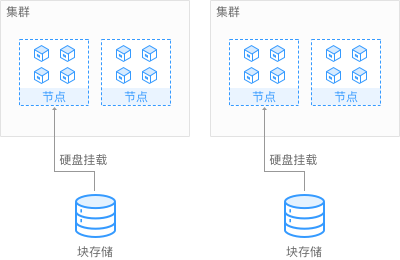

# 云硬盘存储卷概述

为满足数据持久化的需求，CCE支持将云硬盘（EVS）创建的存储卷挂载到容器的某一路径下，当容器迁移时，挂载的云硬盘将一同迁移。通过云硬盘，可以将存储系统的远端文件目录挂载到容器中，数据卷中的数据将被永久保存，即使删除了容器，数据卷中的数据依然保存在存储系统中。

**图 1**  CCE挂载云硬盘存储卷  

## 使用说明

-   **使用便捷：**您可以像使用传统服务器硬盘一样，对挂载到服务器上的块存储（硬盘）做格式化、创建文件系统等操作。
-   **数据不共享：**每台服务器使用独立的块存储（硬盘），多服务器之间数据隔离。
-   **私有网络：**数据访问必须在数据中心内部网络中。
-   **容量性能：**单卷容量有限（TB级），但性能极佳（IO读写时延ms级）。
-   **使用限制：**不支持导入分区过或者具有非ext4文件系统的云硬盘。
-   **应用场景：**主要面向HPC高性能计算、企业核心集群应用、企业应用系统和开发测试等。适用于供单实例部署的无状态负载（Deployment）和普通任务（Job），以及有状态工作负载（StatefulSet）的每个实例独占式使用。因为云硬盘属于非共享存储，不能同时被多个节点挂载，若两个Pod配置了使用同一个云硬盘，当这两个Pod被调度到不同的节点时，必然有一个Pod会因为无法挂载云硬盘导致无法成功启动。

