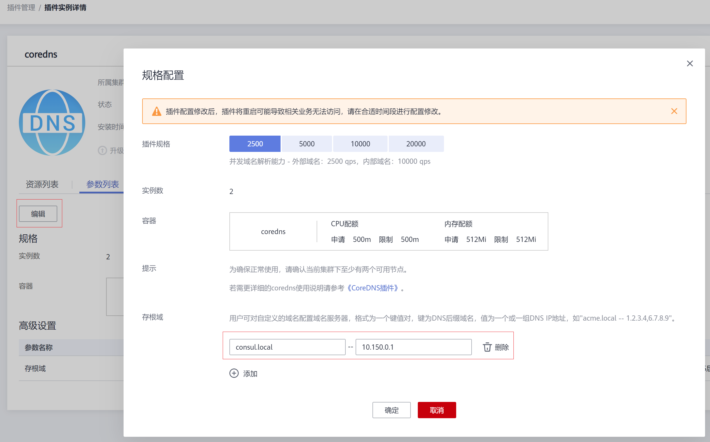

# 使用CoreDNS实现自定义域名解析<a name="cce_01_0361"></a>

## 应用现状<a name="section1374833194817"></a>

在使用CCE时，可能会有解析自定义内部域名的需求，例如：

-   存量代码配置了用固定域名调用内部其他服务，如果要切换到Kubernetes Service方式，修改配置工作量大。
-   在集群外自建了一个其他服务，需要将集群中的数据通过固定域名发送到这个服务。

## 解决方案<a name="section1911914574918"></a>

使用CoreDNS有以下几种自定义域名解析的方案。

-   [为CoreDNS配置存根域](#section5202157467)：可以直接在控制台添加，简单易操作。
-   [使用 CoreDNS Hosts 插件配置任意域名解析](#section106211954135311)：简单直观，可以添加任意解析记录，类似在本地/etc/hosts中添加解析记录。
-   [使用 CoreDNS Rewrite 插件指向域名到集群内服务](#section2213823544)：相当于给Kubernetes中的Service名称取了个别名，无需提前知道解析记录的IP地址。
-   [使用 CoreDNS Forward 插件将自建 DNS 设为上游 DNS](#section677819913541)：自建DNS中，可以管理大量的解析记录，解析记录专门管理，增删记录无需修改CoreDNS配置。

## 注意事项<a name="section1817217121625"></a>

CoreDNS修改配置需额外谨慎，因为CoreDNS负责集群的域名解析任务，修改不当可能会导致集群解析出现异常。请做好修改前后的测试验证。

## 为CoreDNS配置存根域<a name="section5202157467"></a>

集群管理员可以修改CoreDNS Corefile的ConfigMap以更改服务发现的工作方式。使用插件proxy可对CoreDNS的存根域进行配置。

若集群管理员有一个位于10.150.0.1的Consul域名解析服务器，并且所有Consul的域名都带有.consul.local的后缀。

1.  登录CCE控制台。
2.  在左侧导航栏中选择“插件管理“，在“插件实例“页签下，单击CoreDNS插件，进入插件详情页。
3.  单击参数列表下的“编辑“按钮，在弹出窗口中添加存根域。

    **图 1**  配置存根域<a name="fig118492813367"></a>  
    

4.  单击“确定“。

## 修改CoreDNS Hosts配置<a name="section106211954135311"></a>

1.  使用kubectl连接集群。
2.  修改CoreDNS配置文件，将自定义域名添加到hosts中。

    将www.example.com指向192.168.1.1，通过CoreDNS解析www.example.com时，会返回192.168.1.1。

    > **须知：** 
    >此处配置不能遗漏fallthrough字段，fallthrough表示当在hosts找不到要解析的域名时，会将解析任务传递给CoreDNS的下一个插件。如果不写fallthrough的话，任务就此结束，不会继续解析，会导致集群内部域名解析失败的情况。
    >hosts的详细配置请参见[https://coredns.io/plugins/hosts/](https://coredns.io/plugins/hosts/)。

    ```
    $ kubectl edit configmap coredns -n kube-system
    apiVersion: v1
    data:
      Corefile: |-
        .:5353 {
            bind {$POD_IP}
            cache 30
            errors
            health {$POD_IP}:8080
            kubernetes cluster.local in-addr.arpa ip6.arpa {
              pods insecure
              fallthrough in-addr.arpa ip6.arpa
            }
            hosts {
              192.168.1.1 www.example.com
              fallthrough
            }
            loadbalance round_robin
            prometheus {$POD_IP}:9153
            forward . /etc/resolv.conf
            reload
        }
    kind: ConfigMap
    metadata:
      creationTimestamp: "2021-08-23T13:27:28Z"
      labels:
        app: coredns
        k8s-app: coredns
        kubernetes.io/cluster-service: "true"
        kubernetes.io/name: CoreDNS
        release: cceaddon-coredns
      name: coredns
      namespace: kube-system
      resourceVersion: "460"
      selfLink: /api/v1/namespaces/kube-system/configmaps/coredns
      uid: be64aaad-1629-441f-8a40-a3efc0db9fa9
    ```

    在CoreDNS中修改hosts后，就不用单独在每个Pod中配置hosts了，带来了一定的方便性。


## 添加CoreDNS Rewrite配置指向域名到集群内服务<a name="section2213823544"></a>

使用 CoreDNS 的 Rewrite 插件，将指定域名解析到某个 Service 的域名，相当于给Service取了个别名。

1.  使用kubectl连接集群。
2.  修改CoreDNS配置文件，将example.com指向default命名空间下的example服务。

    ```
    $ kubectl edit configmap coredns -n kube-system
    apiVersion: v1
    data:
      Corefile: |-
        .:5353 {
            bind {$POD_IP}
            cache 30
            errors
            health {$POD_IP}:8080
            kubernetes cluster.local in-addr.arpa ip6.arpa {
              pods insecure
              fallthrough in-addr.arpa ip6.arpa
            }
            rewrite name example.com example.default.svc.cluster.local
            loadbalance round_robin
            prometheus {$POD_IP}:9153
            forward . /etc/resolv.conf
            reload
        }
    kind: ConfigMap
    metadata:
      creationTimestamp: "2021-08-23T13:27:28Z"
      labels:
        app: coredns
        k8s-app: coredns
        kubernetes.io/cluster-service: "true"
        kubernetes.io/name: CoreDNS
        release: cceaddon-coredns
      name: coredns
      namespace: kube-system
      resourceVersion: "460"
      selfLink: /api/v1/namespaces/kube-system/configmaps/coredns
      uid: be64aaad-1629-441f-8a40-a3efc0db9fa9
    ```


## 使用CoreDNS级联自建DNS<a name="section677819913541"></a>

1.  使用kubectl连接集群。
2.  修改CoreDNS配置文件，将forward后面的/etc/resolv.conf，改成外部DNS的地址，如下所示。

    ```
    $ kubectl edit configmap coredns -n kube-system
    apiVersion: v1
    data:
      Corefile: |-
        .:5353 {
            bind {$POD_IP}
            cache 30
            errors
            health {$POD_IP}:8080
            kubernetes cluster.local in-addr.arpa ip6.arpa {
              pods insecure
              fallthrough in-addr.arpa ip6.arpa
            }
            loadbalance round_robin
            prometheus {$POD_IP}:9153
            forward . 192.168.1.1
            reload
        }
    kind: ConfigMap
    metadata:
      creationTimestamp: "2021-08-23T13:27:28Z"
      labels:
        app: coredns
        k8s-app: coredns
        kubernetes.io/cluster-service: "true"
        kubernetes.io/name: CoreDNS
        release: cceaddon-coredns
      name: coredns
      namespace: kube-system
      resourceVersion: "460"
      selfLink: /api/v1/namespaces/kube-system/configmaps/coredns
      uid: be64aaad-1629-441f-8a40-a3efc0db9fa9
    ```


## 相关文档<a name="section1382343322314"></a>

[自建IDC与CCE集群共享域名解析](https://support.huaweicloud.com/bestpractice-cce/cce_bestpractice_00276.html)

