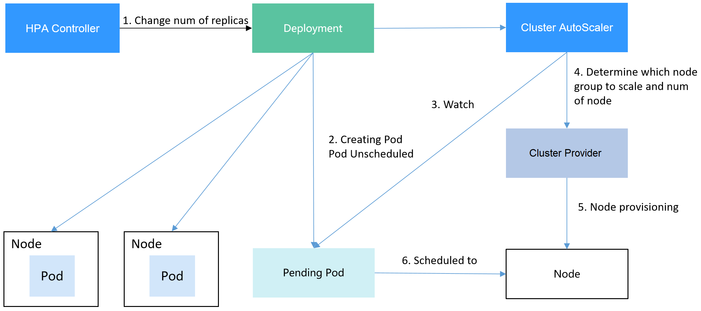
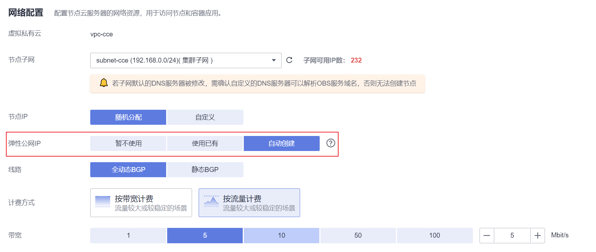
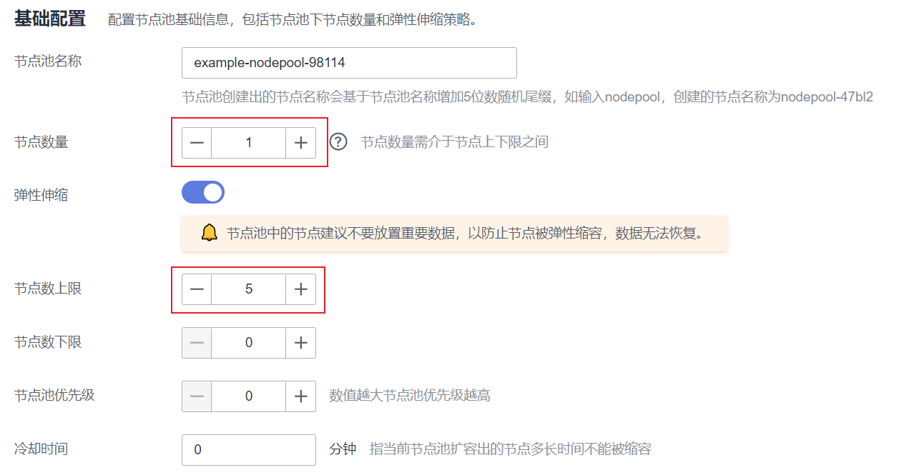
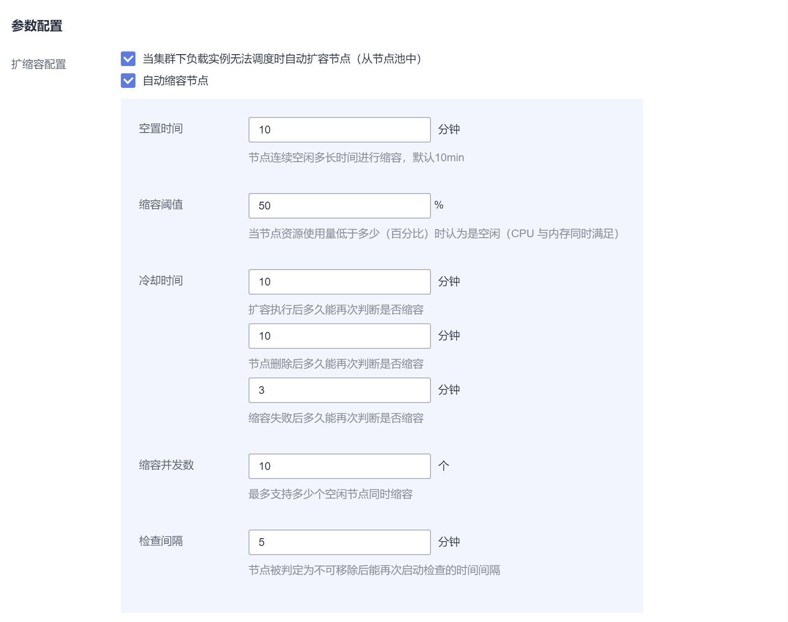
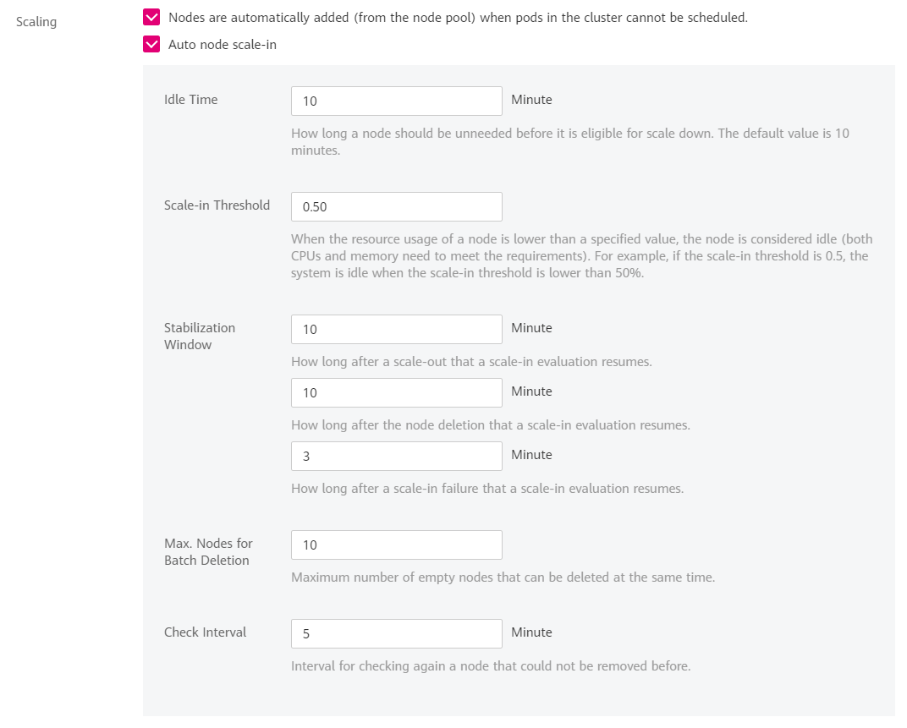
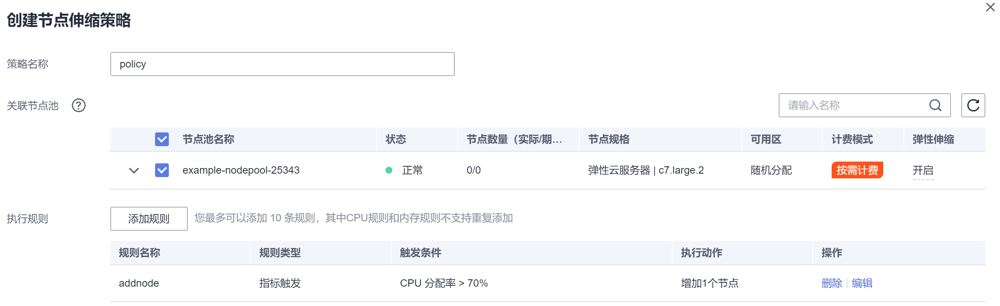

# 使用HPA+CA实现工作负载和节点联动弹性伸缩<a name="cce_01_0300"></a>

## 应用场景<a name="zh-cn_topic_0000001148755333_section124810133244"></a>

企业应用的流量大小不是每时每刻都一样，有高峰，有低谷，如果每时每刻都要保持能够扛住高峰流量的机器数目，那么成本会很高。通常解决这个问题的办法就是根据流量大小或资源占用率自动调节机器的数量，也就是弹性伸缩。

在CCE中，由于是使用Pod/容器部署应用，容器可使用的资源是在部署时就固定下了，不会无限制使用CCE节点中的资源，所以在CCE中弹性伸缩需要先对Pod数量进行伸缩，Pod数量增加后节点资源使用率才会增加，进而根据节点资源使用率去伸缩节点数量。

## 解决方案<a name="zh-cn_topic_0000001148755333_section751193618161"></a>

CCE中弹性伸缩最主要的就是使用HPA（Horizontal Pod Autoscaling）和CA（Cluster AutoScaling）两种弹性伸缩策略，HPA负责工作负载弹性伸缩，也就是应用层面的弹性伸缩，CA负责节点弹性伸缩，也就是资源层面的弹性伸缩。

通常情况下，两者需要配合使用，因为HPA需要集群有足够的资源才能扩容成功，当集群资源不够时需要CA扩容节点，使得集群有足够资源；而当HPA缩容后集群会有大量空余资源，这时需要CA缩容节点释放资源，才不至于造成浪费。

如[图1](#zh-cn_topic_0000001148755333_fig6540132372015)所示，HPA根据监控指标进行扩容，当集群资源不够时，新创建的Pod会处于Pending状态，CA会检查所有Pending状态的Pod，根据用户配置的扩缩容策略，选择出一个最合适的节点池，在这个节点池扩容。HPA和CA的工作原理详情请参见[工作负载伸缩原理](https://support.huaweicloud.com/usermanual-cce/cce_10_0290.html)和[节点伸缩原理](https://support.huaweicloud.com/usermanual-cce/cce_10_0296.html)。

**图 1**  HPA + CA工作流程<a name="zh-cn_topic_0000001148755333_fig6540132372015"></a>  


使用HPA+CA可以很容易做到弹性伸缩，且节点和Pod的伸缩过程可以非常方便的观察到，使用HPA+CA做弹性伸缩能够满足大部分业务场景需求。

本文将通过一个示例介绍HPA+CA两种策略配合使用下弹性伸缩的过程，从而帮助您更好的理解和使用弹性伸缩。

## 准备工作<a name="zh-cn_topic_0000001148755333_section11665144319113"></a>

1.  创建一个有1个节点的集群，节点规格为2U4G及以上，并在创建节点时为节点添加弹性公网IP，以便从外部访问。如创建节点时未绑定弹性公网IP，您也可以前往ECS控制台为该节点进行手动绑定。

    

2.  给集群安装插件。
    -   autoscaler：节点伸缩插件。
    -   metrics-server：是Kubernetes集群范围资源使用数据的聚合器，能够收集包括了Pod、Node、容器、Service等主要Kubernetes核心资源的度量数据。

3.  登录集群节点，准备一个算力密集型的应用。当用户请求时，需要先计算出结果后才返回给用户结果，如下所示。
    1.  创建一个名为index.php的PHP文件，文件内容是在用户请求时先循环开方1000000次，然后再返回“OK!”。

        ```
        vi index.php
        ```

        文件内容如下：

        ```
        <?php
          $x = 0.0001;
          for ($i = 0; $i <= 1000000; $i++) {
            $x += sqrt($x);
          }
          echo "OK!";
        ?>
        ```

    2.  编写Dockerfile制作镜像。

        ```
        vi Dockerfile
        ```

        Dockerfile内容如下：

        ```
        FROM php:5-apache
        COPY index.php /var/www/html/index.php
        RUN chmod a+rx index.php
        ```

    3.  执行如下命令构建镜像，镜像名称为hpa-example，版本为latest。

        ```
        docker build -t hpa-example:latest .
        ```

    4.  <a name="zh-cn_topic_0000001148755333_li108181514125"></a>（可选）登录SWR管理控制台，选择左侧导航栏的“组织管理”，单击页面右上角的“创建组织”，创建一个组织。

        如已有组织可跳过此步骤。

    5.  <a name="zh-cn_topic_0000001148755333_li187221141362"></a>在左侧导航栏选择“我的镜像“，单击右侧“客户端上传“，在弹出的页面中单击“生成临时登录指令“，单击复制登录指令。
    6.  在集群节点上执行上一步复制的登录指令，登录成功会显示“Login Succeeded”。
    7.  为hpa-example镜像打标签。

        **docker tag \[镜像名称1:版本名称1\] \[镜像仓库地址\]/\[组织名称\]/\[镜像名称2:版本名称2\]**

        -   **\[镜像名称1:版本名称1\]**：请替换为您本地所要上传的实际镜像的名称和版本名称。
        -   **\[镜像仓库地址\]**：可在SWR控制台上查询，[5](#zh-cn_topic_0000001148755333_li187221141362)中登录指令末尾的域名即为镜像仓库地址。
        -   **\[组织名称\]**：请替换为[4](#zh-cn_topic_0000001148755333_li108181514125)中创建的组织。
        -   **\[镜像名称2:版本名称2\]**：请替换为SWR镜像仓库中需要显示的镜像名称和镜像版本。

        示例：

        **docker tag hpa-example:latest swr.cn-east-3.myhuaweicloud.com/cloud-develop/hpa-example:latest**

    8.  上传镜像至镜像仓库。

        **docker push \[镜像仓库地址\]/\[组织名称\]/\[镜像名称2:版本名称2\]**

        示例：

        **docker push swr.cn-east-3.myhuaweicloud.com/cloud-develop/hpa-example:latest**

        终端显示如下信息，表明上传镜像成功。

        ```
        6d6b9812c8ae: Pushed 
        ... 
        fe4c16cbf7a4: Pushed 
        latest: digest: sha256:eb7e3bbd*** size: **
        ```

        返回容器镜像服务控制台，在“我的镜像“页面，执行刷新操作后可查看到对应的镜像信息。


## 创建节点池和节点伸缩策略<a name="zh-cn_topic_0000001148755333_section1155620269250"></a>

1.  登录CCE控制台，进入已创建的集群，在左侧单击“节点管理”，选择“节点池”页签并单击右上角“创建节点池”。
2.  填写节点池配置，添加2U4G的节点，并打开弹性扩缩容开关。

    -   节点数量：设置为1，表示创建节点池时默认创建的节点数为1。
    -   弹性伸缩：开启，表示节点池将根据集群负载情况自动创建或删除节点池内的节点。
    -   节点数上限：设置为5，表示节点池中节点数的最大值。
    -   节点规格：2核 | 4GiB

    其余参数设置可使用默认值，详情请参见[创建节点池](https://support.huaweicloud.com/usermanual-cce/cce_10_0012.html)。

    

3.  在集群控制台左侧单击“插件管理”，单击autoscaler插件下的“编辑“按钮，修改autoscaler插件配置，将自动缩容开关打开，并配置缩容相关参数。例如节点资源使用率小于50%时进行缩容扫描，启动缩容。

    

    

    上面配置的节点池弹性伸缩，会根据Pod的Pending状态进行扩容，根据节点的资源使用率进行缩容。

4.  在集群控制台左侧单击“节点伸缩”，单击页面右上角的“创建节点伸缩策略“。这里的节点伸缩策略可以根据CPU/内存分配率扩容、还可以按照时间定期扩容节点数量。

    节点伸缩示例如下，这里配置当集群CPU分配率大于70%时，增加一个节点。CA策略需要关联节点池，可以关联多个节点池，当需要对节点扩缩容时，在节点池中根据最小浪费规则挑选合适规格的节点扩缩容。关于节点伸缩策略设置的详细说明，请参见[创建节点伸缩策略](https://support.huaweicloud.com/usermanual-cce/cce_10_0209.html)。

    


## 创建工作负载<a name="zh-cn_topic_0000001148755333_section57571151111612"></a>

使用构建的hpa-example镜像创建无状态工作负载，副本数为1，镜像地址与上传到SWR仓库的组织有关，需要替换为实际取值。

```
kind: Deployment
apiVersion: apps/v1
metadata:
  name: hpa-example
spec:
  replicas: 1
  selector:
    matchLabels:
      app: hpa-example
  template:
    metadata:
      labels:
        app: hpa-example
    spec:
      containers:
      - name: container-1
        image: 'hpa-example:latest ' # 替换为您上传到SWR的镜像地址
        resources:
          limits:                  # limits与requests建议取值保持一致，避免扩缩容过程中出现震荡
            cpu: 500m
            memory: 200Mi
          requests:
            cpu: 500m
            memory: 200Mi
      imagePullSecrets:
      - name: default-secret
```

然后再为这个负载创建一个Nodeport类型的Service，以便能从外部访问。

> **说明：** 
>Nodeport类型的Service从外网访问需要为集群某个节点创建EIP，创建完后需要同步节点信息，具体请参见[同步节点信息](https://support.huaweicloud.com/usermanual-cce/cce_10_0184.html)。如果节点已有EIP则无需再次创建。
>或者您也可以创建带ELB的Service从外部访问，具体请参见[通过kubectl命令行创建-自动创建ELB](https://support.huaweicloud.com/usermanual-cce/cce_10_0014.html#section6)。

```
kind: Service
apiVersion: v1
metadata:
  name: hpa-example
spec:
  ports:
    - name: cce-service-0
      protocol: TCP
      port: 80
      targetPort: 80
      nodePort: 31144
  selector:
    app: hpa-example
  type: NodePort
```

## 创建HPA策略<a name="zh-cn_topic_0000001148755333_section1377561942518"></a>

创建HPA策略，如下所示，该策略关联了名为hpa-example的负载，期望CPU使用率为50%。

另外有两条注解annotations，一条是CPU的阈值范围，最低30，最高70，表示CPU使用率在30%到70%之间时，不会扩缩容，防止小幅度波动造成影响。另一条是扩缩容时间窗，表示策略成功触发后，在缩容/扩容冷却时间内，不会再次触发缩容/扩容，以防止短期波动造成影响。

```
apiVersion: autoscaling/v2
kind: HorizontalPodAutoscaler
metadata:
  name: hpa-policy
  annotations:
    extendedhpa.metrics: '[{"type":"Resource","name":"cpu","targetType":"Utilization","targetRange":{"low":"30","high":"70"}}]'
    extendedhpa.option: '{"downscaleWindow":"5m","upscaleWindow":"3m"}'
spec:
  scaleTargetRef:
    kind: Deployment
    name: hpa-example
    apiVersion: apps/v1
  minReplicas: 1
  maxReplicas: 100
  metrics:
    - type: Resource
      resource:
        name: cpu
        targetAverageUtilization: 50
```

在控制台创建则参数填写如下所示。


## 观察弹性伸缩过程<a name="zh-cn_topic_0000001148755333_section16503511256"></a>

1.  首先查看集群节点情况，如下所示，有两个节点。

    ```
    # kubectl get node
    NAME            STATUS   ROLES    AGE     VERSION
    192.168.0.183   Ready    <none>   2m20s   v1.17.9-r0-CCE21.1.1.3.B001-17.36.8
    192.168.0.26    Ready    <none>   55m     v1.17.9-r0-CCE21.1.1.3.B001-17.36.8
    ```

    查看HPA策略，可以看到目标负载的指标（CPU使用率）为0%

    ```
    # kubectl get hpa hpa-policy
    NAME         REFERENCE                TARGETS   MINPODS   MAXPODS   REPLICAS   AGE
    hpa-policy   Deployment/hpa-example   0%/50%    1         100       1          4m
    ```

2.  通过如下命令访问负载，如下所示，其中\{ip:port\}为负载的访问地址，可以在负载的详情页中查询。

    **while true;do wget -q -O- http://**_\{ip:port\}_**; done**

    > **说明：** 
    >如果此处不显示公网IP地址，则说明集群节点没有弹性公网IP，请创建弹性公网IP并绑定到节点，创建完后需要同步节点信息，具体请参见[同步节点信息](https://support.huaweicloud.com/usermanual-cce/cce_10_0184.html)。

    观察负载的伸缩过程。

    ```
    # kubectl get hpa hpa-policy --watch
    NAME         REFERENCE                TARGETS    MINPODS   MAXPODS   REPLICAS   AGE
    hpa-policy   Deployment/hpa-example   0%/50%     1         100       1          4m
    hpa-policy   Deployment/hpa-example   190%/50%   1         100       1          4m23s
    hpa-policy   Deployment/hpa-example   190%/50%   1         100       4          4m31s
    hpa-policy   Deployment/hpa-example   200%/50%   1         100       4          5m16s
    hpa-policy   Deployment/hpa-example   200%/50%   1         100       4          6m16s
    hpa-policy   Deployment/hpa-example   85%/50%    1         100       4          7m16s
    hpa-policy   Deployment/hpa-example   81%/50%    1         100       4          8m16s
    hpa-policy   Deployment/hpa-example   81%/50%    1         100       7          8m31s
    hpa-policy   Deployment/hpa-example   57%/50%    1         100       7          9m16s
    hpa-policy   Deployment/hpa-example   51%/50%    1         100       7          10m
    hpa-policy   Deployment/hpa-example   58%/50%    1         100       7          11m
    ```

    可以看到4m23s时负载的CPU使用率为190%，超过了目标值，此时触发了负载弹性伸缩，将负载扩容为4个副本/Pod，随后的几分钟内，CPU使用并未下降，直到到7m16s时CPU使用率才开始下降，这是因为新创建的Pod并不一定创建成功，可能是因为资源不足Pod处于Pending状态，这段时间内在扩容节点。

    到7m16s时CPU使用率开始下降，说明Pod创建成功，开始分担请求流量，到8分钟时下降到81%，还是高于目标值，且高于70%，说明还会再次扩容，到9m16s时再次扩容到7个Pod，这时CPU使用率降为51%，在30%-70%的范围内，不会再次伸缩，可以观察到此后Pod数量一直稳定在7个。

    观察负载和HPA策略的详情，从事件中可以看到负载的扩容的过程和策略生效的时间，如下所示。

    ```
    # kubectl describe deploy hpa-example
    ...
    Events:
      Type    Reason             Age    From                   Message
      ----    ------             ----   ----                   -------
      Normal  ScalingReplicaSet  25m    deployment-controller  Scaled up replica set hpa-example-79dd795485 to 1
      Normal  ScalingReplicaSet  20m    deployment-controller  Scaled up replica set hpa-example-79dd795485 to 4
      Normal  ScalingReplicaSet  16m    deployment-controller  Scaled up replica set hpa-example-79dd795485 to 7
    # kubectl describe hpa hpa-policy
    ...
    Events:
      Type    Reason             Age    From                       Message
      ----    ------             ----   ----                       -------
      Normal  SuccessfulRescale  20m    horizontal-pod-autoscaler  New size: 4; reason: cpu resource utilization (percentage of request) above target
      Normal  SuccessfulRescale  16m    horizontal-pod-autoscaler  New size: 7; reason: cpu resource utilization (percentage of request) above target
    ```

    此时查看节点数量，发现节点多了两个，也就是在刚才过程中节点扩容了两个。

    ```
    # kubectl get node
    NAME            STATUS   ROLES    AGE     VERSION
    192.168.0.120   Ready    <none>   3m5s    v1.17.9-r0-CCE21.1.1.3.B001-17.36.8
    192.168.0.136   Ready    <none>   6m58s   v1.17.9-r0-CCE21.1.1.3.B001-17.36.8
    192.168.0.183   Ready    <none>   18m     v1.17.9-r0-CCE21.1.1.3.B001-17.36.8
    192.168.0.26    Ready    <none>   71m     v1.17.9-r0-CCE21.1.1.3.B001-17.36.8
    ```

    在控制台也可以看到伸缩历史，这里可以看到CA策略执行了一次，当集群中CPU分配率大于70%，将节点池中节点数量从2扩容到3。另一个节点是autoscaler默认的根据Pod的Pending状态扩容而来，在HPA初期。

    这里节点扩容过程具体是这样：

    1.  Pod数量变为4后，由于没有资源，Pod处于Pending状态，触发了autoscaler默认的扩容策略，将节点数增加一个。
    2.  第二次节点扩容是因为集群中CPU分配率大于70%，触发了CA策略，从而将节点数增加一个，从控制台上伸缩历史可以看出来。根据分配率扩容，可以保证集群一直处于资源充足的状态。

3.  停止访问负载，观察负载Pod数量。

    ```
    # kubectl get hpa hpa-policy --watch
    NAME         REFERENCE                TARGETS    MINPODS   MAXPODS   REPLICAS   AGE
    hpa-policy   Deployment/hpa-example   50%/50%    1         100       7          12m
    hpa-policy   Deployment/hpa-example   21%/50%    1         100       7          13m
    hpa-policy   Deployment/hpa-example   0%/50%     1         100       7          14m
    hpa-policy   Deployment/hpa-example   0%/50%     1         100       7          18m
    hpa-policy   Deployment/hpa-example   0%/50%     1         100       3          18m
    hpa-policy   Deployment/hpa-example   0%/50%     1         100       3          19m
    hpa-policy   Deployment/hpa-example   0%/50%     1         100       3          19m
    hpa-policy   Deployment/hpa-example   0%/50%     1         100       3          19m
    hpa-policy   Deployment/hpa-example   0%/50%     1         100       3          19m
    hpa-policy   Deployment/hpa-example   0%/50%     1         100       3          23m
    hpa-policy   Deployment/hpa-example   0%/50%     1         100       3          23m
    hpa-policy   Deployment/hpa-example   0%/50%     1         100       1          23m
    ```

    可以看到从13m开始CPU使用率为21%，18m时Pod数量缩为3个，到23m时Pod数量缩为1个。

    观察负载和HPA策略的详情，从事件中可以看到负载的扩容的过程和策略生效的时间，如下所示。

    ```
    # kubectl describe deploy hpa-example
    ...
    Events:
      Type    Reason             Age    From                   Message
      ----    ------             ----   ----                   -------
      Normal  ScalingReplicaSet  25m    deployment-controller  Scaled up replica set hpa-example-79dd795485 to 1
      Normal  ScalingReplicaSet  20m    deployment-controller  Scaled up replica set hpa-example-79dd795485 to 4
      Normal  ScalingReplicaSet  16m    deployment-controller  Scaled up replica set hpa-example-79dd795485 to 7
      Normal  ScalingReplicaSet  6m28s  deployment-controller  Scaled down replica set hpa-example-79dd795485 to 3
      Normal  ScalingReplicaSet  72s    deployment-controller  Scaled down replica set hpa-example-79dd795485 to 1
    # kubectl describe hpa hpa-policy
    ...
    Events:
      Type    Reason             Age    From                       Message
      ----    ------             ----   ----                       -------
      Normal  SuccessfulRescale  20m    horizontal-pod-autoscaler  New size: 4; reason: cpu resource utilization (percentage of request) above target
      Normal  SuccessfulRescale  16m    horizontal-pod-autoscaler  New size: 7; reason: cpu resource utilization (percentage of request) above target
      Normal  SuccessfulRescale  6m45s  horizontal-pod-autoscaler  New size: 3; reason: All metrics below target
      Normal  SuccessfulRescale  90s    horizontal-pod-autoscaler  New size: 1; reason: All metrics below target
    ```

    在控制台同样可以看到HPA策略生效历史，再继续等待，会看到节点也会被缩容一个。

    这里为何没有被缩容掉两个节点，是因为节点池中这两个节点都存在kube-system namespace下的Pod（且不是DaemonSets创建的Pod），节点在什么情况下不会缩容请参见[Cluster Autoscaler工作原理](https://support.huaweicloud.com/usermanual-cce/cce_10_0296.html)。


## 总结<a name="zh-cn_topic_0000001148755333_section1989492202616"></a>

通过上述内容可以看到，使用HPA+CA可以很容易做到弹性伸缩，且节点和Pod的伸缩过程可以非常方便的观察到，使用HPA+CA做弹性伸缩能够满足大部分业务场景需求。

