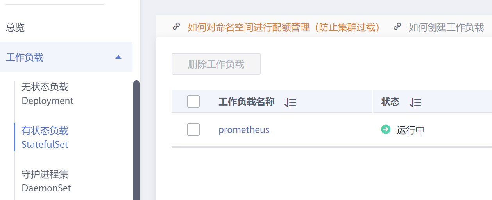
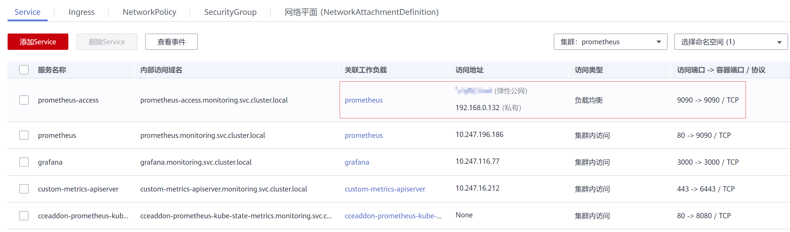
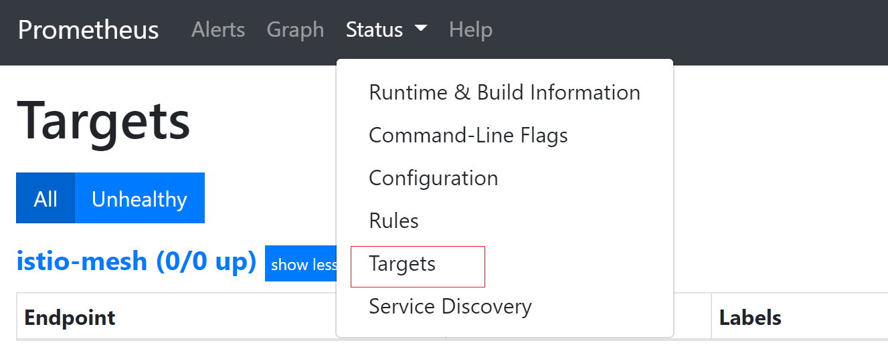
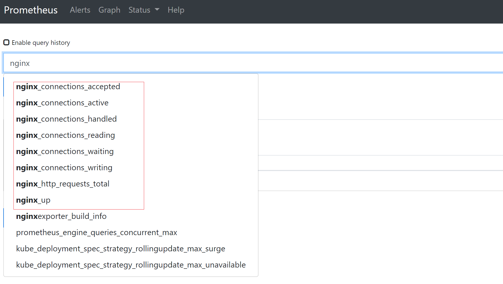
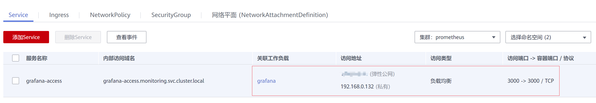
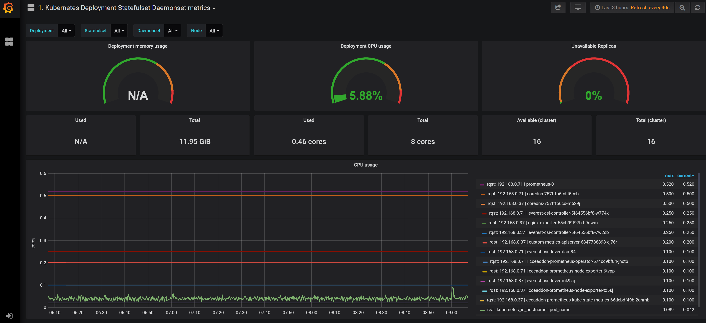

# 使用Prometheus插件监控<a name="cce_01_0373"></a>

在[自定义监控](自定义监控.md)中介绍了AOM ICAgent获取负载自定义指标监控数据的方法。您也可以直接在集群中安装Prometheus插件，直接使用Prometheus作为监控平台。

## 安装Prometheus插件<a name="section1135613420551"></a>

安装Prometheus插件请参见[prometheus](prometheus.md)。

## 访问Prometheus<a name="section4340162312020"></a>

Prometheus插件安装完成后会在集群中部署一系列工作负载和Service。其中有状态负载prometheus就是Prometheus Server。



您可以创建一个公网[LoadBalancer类型Service](负载均衡(LoadBalancer).md)，这样就可以从外部访问Prometheus。



创建完成后单击访问地址，访问Prometheus。


单击“Status \> Targets“，可以查看到Prometheus监控了哪些目标。



## 监控自定义指标<a name="section179021319175"></a>

自定义指标也可以在Prometheus中监控。配置方法非常简单，例如[自定义监控](自定义监控.md)中的nginx:exporter应用，只需要在部署时添加如下annotations就可以自动被Prometheus采集监控指标。

```
kind: Deployment
apiVersion: apps/v1
metadata:
  name: nginx-exporter
  namespace: default
spec:
  replicas: 1
  selector:
    matchLabels:
      app: nginx-exporter
  template:
    metadata:
      labels:
        app: nginx-exporter
      annotations:
        prometheus.io/scrape: "true"
        prometheus.io/port: "9113"
        prometheus.io/path: "/metrics"
        prometheus.io/scheme: "http"
    spec:
      containers:
        - name: container-0
          image: 'swr.cn-east-3.myhuaweicloud.com/dev-container/nginx:exporter'
          resources:
            limits:
              cpu: 250m
              memory: 512Mi
            requests:
              cpu: 250m
              memory: 512Mi
        - name: container-1
          image: 'nginx/nginx-prometheus-exporter:0.9.0'
          command:
            - nginx-prometheus-exporter
          args:
            - '-nginx.scrape-uri=http://127.0.0.1:8080/stub_status'
      imagePullSecrets:
        - name: default-secret
```

其中

-   prometheus.io/scrape：表示是否需要prometheus采集Pod的监控数据，取值为true。
-   prometheus.io/port：表示采集监控数据接口的端口。
-   prometheus.io/path：表示采集监控数据接口的URL，如不配置则默认为“/metrics“。
-   prometheus.io/scheme：表示采集的协议，值可以填写http或https。

部署应用后，在“Status \> Targets“能够发现多了一个9113端口的采集路径的Pod。


在Graph页签下输入nginx，可以看出nginx相关的指标已经在Prometheus中呈现。



## 访问Grafana<a name="section1112612916573"></a>

Prometheus插件同时安装了[Grafana](https://grafana.com/)（一款开源可视化工具），并且与Prometheus进行了对接。您可以创建一个公网[LoadBalancer类型Service](负载均衡(LoadBalancer).md)，这样就可以从公网访问Grafana，从Grafana中看到Prometheus的监控数据。



单击访问地址，访问Grafana，选择合适的DashBoard，即可以查到相应的聚合内容。



## Grafana数据持久化<a name="section676815415156"></a>

当前Prometheus插件中Grafana数据没做持久化，如果Grafana容器重启会导致数据丢失。您可以给Grafana容器挂载云存储，从而实现Grafana数据持久化。

1.  请参见[通过kubectl连接集群](通过kubectl连接集群.md)，使用kubectl连接Grafana所在集群。
2.  <a name="li19947131075915"></a>创建云硬盘存储PVC。

    ```
    apiVersion: v1
    kind: PersistentVolumeClaim
    metadata:
      name: grafana-pvc
      namespace: monitoring
      annotations:
        everest.io/disk-volume-type: SSD
      labels:
        failure-domain.beta.kubernetes.io/region: cn-north-4
        failure-domain.beta.kubernetes.io/zone: cn-north-4b
    spec:
      accessModes:
      - ReadWriteOnce
      resources:
        requests:
          storage: 10Gi
      storageClassName: csi-disk
    ```

    **云硬盘必须与Grafana所在节点在同一个可用区**，否则无法挂载。

    -   failure-domain.beta.kubernetes.io/region：云硬盘所在的区域。
    -   failure-domain.beta.kubernetes.io/zone：云硬盘所在的AZ。
    -   storage：云硬盘大小，请根据需要选择。

    您还可以在CCE控制台创建云硬盘存储，具体方法请参见[购买云硬盘存储卷](使用云硬盘存储卷.md#section1727261664619)。

3.  修改Grafana工作负载配置，挂载云硬盘。

    **kubectl edit deploy grafana -n monitoring**

    在YAML文件中给容器添加云硬盘挂载，如下所示。其中PVC名称必须与[2](#li19947131075915)中名称一致，挂载路径必须为“/var/lib/grafana“。

    另外必须修改grafana负载的升级策略，最大Pod数量为1。

    ```
    ...
      template:
        spec:
          volumes:
            - name: cce-pvc-grafana
              persistentVolumeClaim:
                claimName: grafana-pvc
    ...
          containers:
            - volumeMounts:
                - name: cce-pvc-grafana
                  mountPath: /var/lib/grafana
    ...
      strategy:
        type: RollingUpdate
        rollingUpdate:
          maxUnavailable: 1
          maxSurge: 1
    ```

    修改完成后保存配置，Grafana负载会升级并挂载云硬盘。


