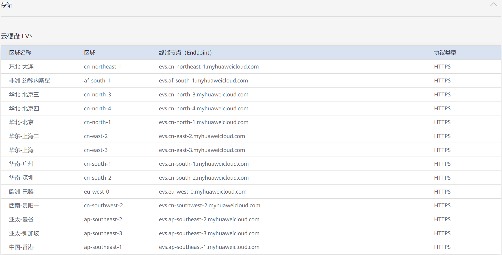

# 使用kubectl对接已有云硬盘<a name="cce_01_0313"></a>

## 操作场景<a name="section1934656185510"></a>

CCE支持使用已有的EVS云硬盘创建PersistentVolume。创建成功后，通过创建相应的PersistentVolumeClaim绑定当前PersistentVolume使用。

## 前提条件<a name="section1640173074515"></a>

您已经创建好一个CCE集群，并且在该集群中安装Flexvolume插件（[storage-driver](storage-driver（系统资源插件-必装）.md)）。

## 约束与限制<a name="section946015116135"></a>

如下配置示例适用于Kubernetes 1.13及以下版本的集群。

## 操作步骤<a name="section265070105619"></a>

1.  登录EVS控制台，创建一个EVS云硬盘，记录云硬盘的VolumeID、容量和磁盘类型。
2.  请参见[通过kubectl连接集群](通过kubectl连接集群.md)，使用kubectl连接集群。
3.  新建两个yaml文件，用于创建PersistentVolume（PV）、PersistentVolumeClaim（PVC），假设文件名分别为**pv-evs-example.yaml**、**pvc-evs-example.yaml**。

    **touch pv-evs-example.yaml** **pvc-evs-example.yaml**

    <a name="table184303411324"></a>
    <table><thead align="left"><tr id="row104311415322"><th class="cellrowborder" valign="top" width="33.2033203320332%" id="mcps1.1.4.1.1"><p id="p443118443220"><a name="p443118443220"></a><a name="p443118443220"></a>K8S集群版本（K8S version）</p>
    </th>
    <th class="cellrowborder" valign="top" width="35.34353435343534%" id="mcps1.1.4.1.2"><p id="p1431154113212"><a name="p1431154113212"></a><a name="p1431154113212"></a>说明</p>
    </th>
    <th class="cellrowborder" valign="top" width="31.453145314531454%" id="mcps1.1.4.1.3"><p id="p14311346322"><a name="p14311346322"></a><a name="p14311346322"></a>yaml示例</p>
    </th>
    </tr>
    </thead>
    <tbody><tr id="row543118415321"><td class="cellrowborder" valign="top" width="33.2033203320332%" headers="mcps1.1.4.1.1 "><p id="p1743111463216"><a name="p1743111463216"></a><a name="p1743111463216"></a>1.11.7 ≤ K8S version ≤ 1.13</p>
    </td>
    <td class="cellrowborder" valign="top" width="35.34353435343534%" headers="mcps1.1.4.1.2 "><p id="p743119413320"><a name="p743119413320"></a><a name="p743119413320"></a>1.11.7以上及1.13版本集群</p>
    </td>
    <td class="cellrowborder" valign="top" width="31.453145314531454%" headers="mcps1.1.4.1.3 "><p id="p13431246327"><a name="p13431246327"></a><a name="p13431246327"></a>请参见<a href="#li0648350102513">1.11.7~1.13 yaml文件配置示例</a></p>
    </td>
    </tr>
    <tr id="row132483424343"><td class="cellrowborder" valign="top" width="33.2033203320332%" headers="mcps1.1.4.1.1 "><p id="p102481242133410"><a name="p102481242133410"></a><a name="p102481242133410"></a>1.11 ≤ K8S version &lt; 1.11.7</p>
    </td>
    <td class="cellrowborder" valign="top" width="35.34353435343534%" headers="mcps1.1.4.1.2 "><p id="p1524819427346"><a name="p1524819427346"></a><a name="p1524819427346"></a>1.11.7之前的1.11版本集群</p>
    </td>
    <td class="cellrowborder" valign="top" width="31.453145314531454%" headers="mcps1.1.4.1.3 "><p id="p16248134217345"><a name="p16248134217345"></a><a name="p16248134217345"></a>请参见<a href="#li19211184720504">1.11~1.11.7 yaml文件配置示例</a></p>
    </td>
    </tr>
    <tr id="row72981940163417"><td class="cellrowborder" valign="top" width="33.2033203320332%" headers="mcps1.1.4.1.1 "><p id="p9298154043420"><a name="p9298154043420"></a><a name="p9298154043420"></a>K8S version = 1.9</p>
    </td>
    <td class="cellrowborder" valign="top" width="35.34353435343534%" headers="mcps1.1.4.1.2 "><p id="p1729814407349"><a name="p1729814407349"></a><a name="p1729814407349"></a>1.9版本集群</p>
    </td>
    <td class="cellrowborder" valign="top" width="31.453145314531454%" headers="mcps1.1.4.1.3 "><p id="p529834014349"><a name="p529834014349"></a><a name="p529834014349"></a>请参见<a href="#li813222310297">1.9 yaml文件配置示例</a></p>
    </td>
    </tr>
    </tbody>
    </table>

    **1.11.7 ≤ K8S version ≤ 1.13（1.11.7以上及1.13版本集群）**

    -   <a name="li0648350102513"></a>**PV yaml文件配置示例如下：**

        ```
        apiVersion: v1 
        kind: PersistentVolume 
        metadata: 
          labels: 
            failure-domain.beta.kubernetes.io/region: cn-north-4
            failure-domain.beta.kubernetes.io/zone:  cn-north-4b
          annotations:
            pv.kubernetes.io/provisioned-by: flexvolume-huawei.com/fuxivol
          name: pv-evs-example 
        spec: 
          accessModes: 
          - ReadWriteMany 
          capacity: 
            storage: 10Gi 
          claimRef:
            apiVersion: v1
            kind: PersistentVolumeClaim
            name: pvc-evs-example
            namespace: default
          flexVolume: 
            driver: huawei.com/fuxivol 
            fsType: ext4 
            options:
              disk-mode: SCSI
              fsType: ext4 
              volumeID: 0992dbda-6340-470e-a74e-4f0db288ed82 
          persistentVolumeReclaimPolicy: Delete 
          storageClassName: sas
        ```

        **表 1**  关键参数说明

        <a name="table17385444165213"></a>
        <table><thead align="left"><tr id="row173855445526"><th class="cellrowborder" valign="top" width="43.81%" id="mcps1.2.3.1.1"><p id="p8385144195210"><a name="p8385144195210"></a><a name="p8385144195210"></a>参数</p>
        </th>
        <th class="cellrowborder" valign="top" width="56.19%" id="mcps1.2.3.1.2"><p id="p8385114425213"><a name="p8385114425213"></a><a name="p8385114425213"></a>描述</p>
        </th>
        </tr>
        </thead>
        <tbody><tr id="row1385154425213"><td class="cellrowborder" valign="top" width="43.81%" headers="mcps1.2.3.1.1 "><p id="p15385544135217"><a name="p15385544135217"></a><a name="p15385544135217"></a>failure-domain.beta.kubernetes.io/region</p>
        </td>
        <td class="cellrowborder" valign="top" width="56.19%" headers="mcps1.2.3.1.2 "><p id="p173851644195213"><a name="p173851644195213"></a><a name="p173851644195213"></a>集群所在的region。</p>
        <p id="p9385544205217"><a name="p9385544205217"></a><a name="p9385544205217"></a>Region对应的值请参见<a href="https://developer.huaweicloud.com/endpoint" target="_blank" rel="noopener noreferrer">地区和终端节点</a>。</p>
        </td>
        </tr>
        <tr id="row143851443521"><td class="cellrowborder" valign="top" width="43.81%" headers="mcps1.2.3.1.1 "><p id="p238512444527"><a name="p238512444527"></a><a name="p238512444527"></a>failure-domain.beta.kubernetes.io/zone</p>
        </td>
        <td class="cellrowborder" valign="top" width="56.19%" headers="mcps1.2.3.1.2 "><p id="p1338544455214"><a name="p1338544455214"></a><a name="p1338544455214"></a>创建云硬盘所在的可用区，必须和工作负载规划的可用区保持一致。</p>
        <p id="p638534414525"><a name="p638534414525"></a><a name="p638534414525"></a>zone对应的值请参见<a href="https://developer.huaweicloud.com/endpoint" target="_blank" rel="noopener noreferrer">地区和终端节点</a>。</p>
        </td>
        </tr>
        <tr id="row1938594405211"><td class="cellrowborder" valign="top" width="43.81%" headers="mcps1.2.3.1.1 "><p id="p183851744105213"><a name="p183851744105213"></a><a name="p183851744105213"></a>storage</p>
        </td>
        <td class="cellrowborder" valign="top" width="56.19%" headers="mcps1.2.3.1.2 "><p id="p0385124417521"><a name="p0385124417521"></a><a name="p0385124417521"></a>云硬盘的容量，单位为Gi。</p>
        </td>
        </tr>
        <tr id="row4385104475215"><td class="cellrowborder" valign="top" width="43.81%" headers="mcps1.2.3.1.1 "><p id="p1038534425215"><a name="p1038534425215"></a><a name="p1038534425215"></a>storageClassName</p>
        </td>
        <td class="cellrowborder" valign="top" width="56.19%" headers="mcps1.2.3.1.2 "><p id="p1438612448526"><a name="p1438612448526"></a><a name="p1438612448526"></a>云硬盘类型，当前支持<span id="text1523372214318"><a name="text1523372214318"></a><a name="text1523372214318"></a>高I/O（SAS）、超高I/O（SSD）</span>。</p>
        </td>
        </tr>
        <tr id="row193861444175213"><td class="cellrowborder" valign="top" width="43.81%" headers="mcps1.2.3.1.1 "><p id="p133861440521"><a name="p133861440521"></a><a name="p133861440521"></a>driver</p>
        </td>
        <td class="cellrowborder" valign="top" width="56.19%" headers="mcps1.2.3.1.2 "><p id="p123869449527"><a name="p123869449527"></a><a name="p123869449527"></a>挂载依赖的存储驱动。</p>
        <p id="p438684475216"><a name="p438684475216"></a><a name="p438684475216"></a>EVS云硬盘配置为“huawei.com/fuxivol”。</p>
        </td>
        </tr>
        <tr id="row1386164445220"><td class="cellrowborder" valign="top" width="43.81%" headers="mcps1.2.3.1.1 "><p id="p237316125619"><a name="p237316125619"></a><a name="p237316125619"></a>volumeID</p>
        </td>
        <td class="cellrowborder" valign="top" width="56.19%" headers="mcps1.2.3.1.2 "><p id="p9724131810569"><a name="p9724131810569"></a><a name="p9724131810569"></a>云硬盘的volumeID。</p>
        <p id="p10651585616"><a name="p10651585616"></a><a name="p10651585616"></a><strong id="b949742313564"><a name="b949742313564"></a><a name="b949742313564"></a>获取方法：</strong>在CCE控制台中，单击左侧栏目树中的<span class="uicontrol" id="uicontrol1361715175617"><a name="uicontrol1361715175617"></a><a name="uicontrol1361715175617"></a>“资源管理-存储管理”</span>，在<span class="uicontrol" id="uicontrol1567152565"><a name="uicontrol1567152565"></a><a name="uicontrol1567152565"></a>“云硬盘存储卷”</span>页签下单击PVC的名称，在PVC详情页中复制<span class="uicontrol" id="uicontrol1961415185614"><a name="uicontrol1961415185614"></a><a name="uicontrol1961415185614"></a>“PVC UID”</span>后的内容即可。</p>
        </td>
        </tr>
        <tr id="row1038684415211"><td class="cellrowborder" valign="top" width="43.81%" headers="mcps1.2.3.1.1 "><p id="p1438618441525"><a name="p1438618441525"></a><a name="p1438618441525"></a>disk-mode</p>
        </td>
        <td class="cellrowborder" valign="top" width="56.19%" headers="mcps1.2.3.1.2 "><p id="p9649653145619"><a name="p9649653145619"></a><a name="p9649653145619"></a>云硬盘磁盘模式，取值可以是VBD和SCSI。</p>
        <p id="p1798412565565"><a name="p1798412565565"></a><a name="p1798412565565"></a>v1.11.7之前的CCE集群，该字段无需填写，默认都是VBD。</p>
        <p id="p338644415527"><a name="p338644415527"></a><a name="p338644415527"></a>v1.11.7+以及v1.13的Linux x86 CCE集群要求该字段值必须存在，且基于PVC触发动态创建的都是EVS SCSI模式的卷，因此这里静态PV形式优先选用SCSI模式的云硬盘；同时支持升级后的老集群中VBD卷能够继续正常使用。</p>
        </td>
        </tr>
        <tr id="row1320925404611"><td class="cellrowborder" valign="top" width="43.81%" headers="mcps1.2.3.1.1 "><p id="p1120905414467"><a name="p1120905414467"></a><a name="p1120905414467"></a>spec.claimRef.apiVersion</p>
        </td>
        <td class="cellrowborder" valign="top" width="56.19%" headers="mcps1.2.3.1.2 "><p id="p220911541464"><a name="p220911541464"></a><a name="p220911541464"></a>固定值"v1"。</p>
        </td>
        </tr>
        <tr id="row52872572460"><td class="cellrowborder" valign="top" width="43.81%" headers="mcps1.2.3.1.1 "><p id="p62871457164620"><a name="p62871457164620"></a><a name="p62871457164620"></a>spec.claimRef.kind</p>
        </td>
        <td class="cellrowborder" valign="top" width="56.19%" headers="mcps1.2.3.1.2 "><p id="p13287195716468"><a name="p13287195716468"></a><a name="p13287195716468"></a>固定值"PersistentVolumeClaim"。</p>
        </td>
        </tr>
        <tr id="row151672034719"><td class="cellrowborder" valign="top" width="43.81%" headers="mcps1.2.3.1.1 "><p id="p1616714019477"><a name="p1616714019477"></a><a name="p1616714019477"></a>spec.claimRef.name</p>
        </td>
        <td class="cellrowborder" valign="top" width="56.19%" headers="mcps1.2.3.1.2 "><p id="p616717016473"><a name="p616717016473"></a><a name="p616717016473"></a>pvc名称；与下一步创建的pvc的name一致。</p>
        </td>
        </tr>
        <tr id="row19505236477"><td class="cellrowborder" valign="top" width="43.81%" headers="mcps1.2.3.1.1 "><p id="p1505173104717"><a name="p1505173104717"></a><a name="p1505173104717"></a>spec.claimRef.namespace</p>
        </td>
        <td class="cellrowborder" valign="top" width="56.19%" headers="mcps1.2.3.1.2 "><p id="p95056374715"><a name="p95056374715"></a><a name="p95056374715"></a>pvc的namespace；与下一步创建的pvc的namespace一致；</p>
        </td>
        </tr>
        </tbody>
        </table>

    -   **PVC yaml文件配置示例如下：**

        ```
        apiVersion: v1  
        kind: PersistentVolumeClaim  
        metadata:  
          annotations:  
            volume.beta.kubernetes.io/storage-class: sas
            volume.beta.kubernetes.io/storage-provisioner: flexvolume-huawei.com/fuxivol 
          labels: 
            failure-domain.beta.kubernetes.io/region: cn-north-4
            failure-domain.beta.kubernetes.io/zone: cn-north-4b     
          name: pvc-evs-example 
          namespace: default  
        spec:  
          accessModes:  
          - ReadWriteMany  
          resources:  
            requests:  
              storage: 10Gi
          volumeName: pv-evs-example
        ```

        **表 2**  关键参数说明

        <a name="table88201244114010"></a>
        <table><thead align="left"><tr id="row17820204417402"><th class="cellrowborder" valign="top" width="43.81%" id="mcps1.2.3.1.1"><p id="p782054464019"><a name="p782054464019"></a><a name="p782054464019"></a>参数</p>
        </th>
        <th class="cellrowborder" valign="top" width="56.19%" id="mcps1.2.3.1.2"><p id="p1882054424015"><a name="p1882054424015"></a><a name="p1882054424015"></a>描述</p>
        </th>
        </tr>
        </thead>
        <tbody><tr id="row796915557409"><td class="cellrowborder" valign="top" width="43.81%" headers="mcps1.2.3.1.1 "><p id="p1896955524012"><a name="p1896955524012"></a><a name="p1896955524012"></a>volume.beta.kubernetes.io/storage-class</p>
        </td>
        <td class="cellrowborder" valign="top" width="56.19%" headers="mcps1.2.3.1.2 "><p id="p0970205513401"><a name="p0970205513401"></a><a name="p0970205513401"></a>存储类型，必须和已有PV保持一致。</p>
        </td>
        </tr>
        <tr id="row234119218414"><td class="cellrowborder" valign="top" width="43.81%" headers="mcps1.2.3.1.1 "><p id="p93414212410"><a name="p93414212410"></a><a name="p93414212410"></a>volume.beta.kubernetes.io/storage-provisioner</p>
        </td>
        <td class="cellrowborder" valign="top" width="56.19%" headers="mcps1.2.3.1.2 "><p id="p834182174112"><a name="p834182174112"></a><a name="p834182174112"></a>必须使用flexvolume-huawei.com/fuxivol。</p>
        </td>
        </tr>
        <tr id="row98212044164016"><td class="cellrowborder" valign="top" width="43.81%" headers="mcps1.2.3.1.1 "><p id="p128211144144011"><a name="p128211144144011"></a><a name="p128211144144011"></a>failure-domain.beta.kubernetes.io/region</p>
        </td>
        <td class="cellrowborder" valign="top" width="56.19%" headers="mcps1.2.3.1.2 "><p id="p882184494011"><a name="p882184494011"></a><a name="p882184494011"></a>集群所在的region。</p>
        <p id="p14821544194016"><a name="p14821544194016"></a><a name="p14821544194016"></a>Region对应的值请参见<a href="https://developer.huaweicloud.com/endpoint" target="_blank" rel="noopener noreferrer">地区和终端节点</a>。</p>
        </td>
        </tr>
        <tr id="row158211544174010"><td class="cellrowborder" valign="top" width="43.81%" headers="mcps1.2.3.1.1 "><p id="p148216449402"><a name="p148216449402"></a><a name="p148216449402"></a>failure-domain.beta.kubernetes.io/zone</p>
        </td>
        <td class="cellrowborder" valign="top" width="56.19%" headers="mcps1.2.3.1.2 "><p id="p168211744174016"><a name="p168211744174016"></a><a name="p168211744174016"></a>EVS云硬盘所在可用区，必须和工作负载规划的可用区保持一致。</p>
        <p id="p78217449407"><a name="p78217449407"></a><a name="p78217449407"></a>zone对应的值请参见<a href="https://developer.huaweicloud.com/endpoint" target="_blank" rel="noopener noreferrer">地区和终端节点</a>。</p>
        </td>
        </tr>
        <tr id="row78211944124017"><td class="cellrowborder" valign="top" width="43.81%" headers="mcps1.2.3.1.1 "><p id="p16821744174020"><a name="p16821744174020"></a><a name="p16821744174020"></a>storage</p>
        </td>
        <td class="cellrowborder" valign="top" width="56.19%" headers="mcps1.2.3.1.2 "><p id="p98216441409"><a name="p98216441409"></a><a name="p98216441409"></a>PVC申请容量，单位为Gi。</p>
        <p id="p6821344144012"><a name="p6821344144012"></a><a name="p6821344144012"></a>必须和已有PV的storage大小保持一致。</p>
        </td>
        </tr>
        <tr id="row15822104404015"><td class="cellrowborder" valign="top" width="43.81%" headers="mcps1.2.3.1.1 "><p id="p15822644124014"><a name="p15822644124014"></a><a name="p15822644124014"></a>volumeName</p>
        </td>
        <td class="cellrowborder" valign="top" width="56.19%" headers="mcps1.2.3.1.2 "><p id="p882284415406"><a name="p882284415406"></a><a name="p882284415406"></a>PV的名称。</p>
        </td>
        </tr>
        </tbody>
        </table>

    **1.11 ≤ K8S version < 1.11.7（1.11.7之前的1.11版本集群）**

    -   <a name="li19211184720504"></a>**PV yaml文件配置示例如下：**

        ```
        apiVersion: v1 
        kind: PersistentVolume 
        metadata: 
          labels: 
            failure-domain.beta.kubernetes.io/region: cn-north-4
            failure-domain.beta.kubernetes.io/zone:  cn-north-4b
          name: pv-evs-example 
        spec: 
          accessModes: 
          - ReadWriteMany 
          capacity: 
            storage: 10Gi 
          flexVolume: 
            driver: huawei.com/fuxivol 
            fsType: ext4 
            options:
              fsType: ext4 
              volumeID: 0992dbda-6340-470e-a74e-4f0db288ed82 
          persistentVolumeReclaimPolicy: Delete 
          storageClassName: sas
        ```

        **表 3**  关键参数说明

        <a name="table17899165410571"></a>
        <table><thead align="left"><tr id="row4899195455718"><th class="cellrowborder" valign="top" width="43.81%" id="mcps1.2.3.1.1"><p id="p1899115465719"><a name="p1899115465719"></a><a name="p1899115465719"></a>参数</p>
        </th>
        <th class="cellrowborder" valign="top" width="56.19%" id="mcps1.2.3.1.2"><p id="p889975465712"><a name="p889975465712"></a><a name="p889975465712"></a>描述</p>
        </th>
        </tr>
        </thead>
        <tbody><tr id="row18899854185719"><td class="cellrowborder" valign="top" width="43.81%" headers="mcps1.2.3.1.1 "><p id="p17899195445720"><a name="p17899195445720"></a><a name="p17899195445720"></a>failure-domain.beta.kubernetes.io/region</p>
        </td>
        <td class="cellrowborder" valign="top" width="56.19%" headers="mcps1.2.3.1.2 "><p id="p48997549579"><a name="p48997549579"></a><a name="p48997549579"></a>集群所在的region。</p>
        <p id="p9899135419579"><a name="p9899135419579"></a><a name="p9899135419579"></a>Region对应的值请参见<a href="https://developer.huaweicloud.com/endpoint" target="_blank" rel="noopener noreferrer">地区和终端节点</a>。</p>
        </td>
        </tr>
        <tr id="row1589905411574"><td class="cellrowborder" valign="top" width="43.81%" headers="mcps1.2.3.1.1 "><p id="p78991554125716"><a name="p78991554125716"></a><a name="p78991554125716"></a>failure-domain.beta.kubernetes.io/zone</p>
        </td>
        <td class="cellrowborder" valign="top" width="56.19%" headers="mcps1.2.3.1.2 "><p id="p1989935485713"><a name="p1989935485713"></a><a name="p1989935485713"></a>创建云硬盘所在的可用区，必须和工作负载规划的可用区保持一致。</p>
        <p id="p98993546579"><a name="p98993546579"></a><a name="p98993546579"></a>zone对应的值请参见<a href="https://developer.huaweicloud.com/endpoint" target="_blank" rel="noopener noreferrer">地区和终端节点</a>。</p>
        </td>
        </tr>
        <tr id="row1690018544578"><td class="cellrowborder" valign="top" width="43.81%" headers="mcps1.2.3.1.1 "><p id="p79001054165713"><a name="p79001054165713"></a><a name="p79001054165713"></a>storage</p>
        </td>
        <td class="cellrowborder" valign="top" width="56.19%" headers="mcps1.2.3.1.2 "><p id="p6900135415719"><a name="p6900135415719"></a><a name="p6900135415719"></a>云硬盘的容量，单位为Gi。</p>
        </td>
        </tr>
        <tr id="row5900205455714"><td class="cellrowborder" valign="top" width="43.81%" headers="mcps1.2.3.1.1 "><p id="p2900105485718"><a name="p2900105485718"></a><a name="p2900105485718"></a>storageClassName</p>
        </td>
        <td class="cellrowborder" valign="top" width="56.19%" headers="mcps1.2.3.1.2 "><p id="p14900354135717"><a name="p14900354135717"></a><a name="p14900354135717"></a>云硬盘类型，当前支持<span id="cce_01_0313_text1523372214318"><a name="cce_01_0313_text1523372214318"></a><a name="cce_01_0313_text1523372214318"></a>高I/O（SAS）、超高I/O（SSD）</span>。</p>
        </td>
        </tr>
        <tr id="row11900354155717"><td class="cellrowborder" valign="top" width="43.81%" headers="mcps1.2.3.1.1 "><p id="p14900175410578"><a name="p14900175410578"></a><a name="p14900175410578"></a>driver</p>
        </td>
        <td class="cellrowborder" valign="top" width="56.19%" headers="mcps1.2.3.1.2 "><p id="p119001954185713"><a name="p119001954185713"></a><a name="p119001954185713"></a>挂载依赖的存储驱动。</p>
        <p id="p16900354165710"><a name="p16900354165710"></a><a name="p16900354165710"></a>EVS云硬盘配置为“huawei.com/fuxivol”。</p>
        </td>
        </tr>
        <tr id="row10900354175715"><td class="cellrowborder" valign="top" width="43.81%" headers="mcps1.2.3.1.1 "><p id="p1900554165719"><a name="p1900554165719"></a><a name="p1900554165719"></a>volumeID</p>
        </td>
        <td class="cellrowborder" valign="top" width="56.19%" headers="mcps1.2.3.1.2 "><p id="p9900154195715"><a name="p9900154195715"></a><a name="p9900154195715"></a>云硬盘的volumeID。</p>
        <p id="p890085485716"><a name="p890085485716"></a><a name="p890085485716"></a><strong id="b1090035455716"><a name="b1090035455716"></a><a name="b1090035455716"></a>获取方法：</strong>在CCE控制台中，单击左侧栏目树中的<span class="uicontrol" id="uicontrol18940833125919"><a name="uicontrol18940833125919"></a><a name="uicontrol18940833125919"></a>“资源管理-存储管理”</span>，在<span class="uicontrol" id="uicontrol1594093365916"><a name="uicontrol1594093365916"></a><a name="uicontrol1594093365916"></a>“云硬盘存储卷”</span>页签下单击PVC的名称，在PVC详情页中复制<span class="uicontrol" id="uicontrol1594016333591"><a name="uicontrol1594016333591"></a><a name="uicontrol1594016333591"></a>“PVC UID”</span>后的内容即可。</p>
        </td>
        </tr>
        <tr id="row179008547577"><td class="cellrowborder" valign="top" width="43.81%" headers="mcps1.2.3.1.1 "><p id="p1690065485718"><a name="p1690065485718"></a><a name="p1690065485718"></a>disk-mode</p>
        </td>
        <td class="cellrowborder" valign="top" width="56.19%" headers="mcps1.2.3.1.2 "><p id="p11211547011"><a name="p11211547011"></a><a name="p11211547011"></a>云硬盘磁盘模式，取值可以是VBD和SCSI。</p>
        <p id="p850713616012"><a name="p850713616012"></a><a name="p850713616012"></a>v1.11.7之前的CCE集群，该字段无需填写，默认都是VBD。</p>
        <p id="p1590145411577"><a name="p1590145411577"></a><a name="p1590145411577"></a>v1.11.7+以及v1.13的Linux x86 CCE集群要求该字段值必须存在，且基于PVC触发动态创建的都是EVS SCSI模式的卷，因此这里静态PV形式优先选用SCSI模式的云硬盘；同时支持升级后的老集群中VBD卷能够继续正常使用。</p>
        </td>
        </tr>
        </tbody>
        </table>

    -   **PVC yaml文件配置示例如下：**

        ```
        apiVersion: v1  
        kind: PersistentVolumeClaim  
        metadata:  
          annotations:  
            volume.beta.kubernetes.io/storage-class: sas
            volume.beta.kubernetes.io/storage-provisioner: flexvolume-huawei.com/fuxivol 
          labels: 
            failure-domain.beta.kubernetes.io/region: cn-north-4
            failure-domain.beta.kubernetes.io/zone: cn-north-4b     
          name: pvc-evs-example 
          namespace: default  
        spec:  
          accessModes:  
          - ReadWriteMany  
          resources:  
            requests:  
              storage: 10Gi
          volumeName: pv-evs-example
        ```

        **表 4**  关键参数说明

        <a name="table63991353162816"></a>
        <table><thead align="left"><tr id="row183991653132813"><th class="cellrowborder" valign="top" width="43.81%" id="mcps1.2.3.1.1"><p id="p239975362811"><a name="p239975362811"></a><a name="p239975362811"></a>参数</p>
        </th>
        <th class="cellrowborder" valign="top" width="56.19%" id="mcps1.2.3.1.2"><p id="p1739905312815"><a name="p1739905312815"></a><a name="p1739905312815"></a>描述</p>
        </th>
        </tr>
        </thead>
        <tbody><tr id="row1439955382818"><td class="cellrowborder" valign="top" width="43.81%" headers="mcps1.2.3.1.1 "><p id="p14399145392817"><a name="p14399145392817"></a><a name="p14399145392817"></a>volume.beta.kubernetes.io/storage-class</p>
        </td>
        <td class="cellrowborder" valign="top" width="56.19%" headers="mcps1.2.3.1.2 "><p id="p103996535282"><a name="p103996535282"></a><a name="p103996535282"></a>存储类型，支持sas，ssd。必须和已有PV保持一致。</p>
        </td>
        </tr>
        <tr id="row539935332820"><td class="cellrowborder" valign="top" width="43.81%" headers="mcps1.2.3.1.1 "><p id="p15399175319282"><a name="p15399175319282"></a><a name="p15399175319282"></a>volume.beta.kubernetes.io/storage-provisioner</p>
        </td>
        <td class="cellrowborder" valign="top" width="56.19%" headers="mcps1.2.3.1.2 "><p id="p140011531282"><a name="p140011531282"></a><a name="p140011531282"></a>必须使用flexvolume-huawei.com/fuxivol。</p>
        </td>
        </tr>
        <tr id="row04001553102811"><td class="cellrowborder" valign="top" width="43.81%" headers="mcps1.2.3.1.1 "><p id="p140019537288"><a name="p140019537288"></a><a name="p140019537288"></a>failure-domain.beta.kubernetes.io/region</p>
        </td>
        <td class="cellrowborder" valign="top" width="56.19%" headers="mcps1.2.3.1.2 "><p id="p740035352815"><a name="p740035352815"></a><a name="p740035352815"></a>集群所在的region。</p>
        <p id="p15400115312814"><a name="p15400115312814"></a><a name="p15400115312814"></a>Region对应的值请参见<a href="https://developer.huaweicloud.com/endpoint" target="_blank" rel="noopener noreferrer">地区和终端节点</a>。</p>
        </td>
        </tr>
        <tr id="row11400353192818"><td class="cellrowborder" valign="top" width="43.81%" headers="mcps1.2.3.1.1 "><p id="p1440045382816"><a name="p1440045382816"></a><a name="p1440045382816"></a>failure-domain.beta.kubernetes.io/zone</p>
        </td>
        <td class="cellrowborder" valign="top" width="56.19%" headers="mcps1.2.3.1.2 "><p id="p11400155372817"><a name="p11400155372817"></a><a name="p11400155372817"></a>EVS云硬盘所在可用区，必须和工作负载规划的可用区保持一致。</p>
        <p id="p174003538284"><a name="p174003538284"></a><a name="p174003538284"></a>zone对应的值请参见<a href="https://developer.huaweicloud.com/endpoint" target="_blank" rel="noopener noreferrer">地区和终端节点</a>。</p>
        </td>
        </tr>
        <tr id="row6400125332818"><td class="cellrowborder" valign="top" width="43.81%" headers="mcps1.2.3.1.1 "><p id="p1340025342816"><a name="p1340025342816"></a><a name="p1340025342816"></a>storage</p>
        </td>
        <td class="cellrowborder" valign="top" width="56.19%" headers="mcps1.2.3.1.2 "><p id="p8400125317289"><a name="p8400125317289"></a><a name="p8400125317289"></a>PVC申请容量，单位为Gi。</p>
        <p id="p0400853162811"><a name="p0400853162811"></a><a name="p0400853162811"></a>必须和已有PV的storage大小保持一致。</p>
        </td>
        </tr>
        <tr id="row34001453152819"><td class="cellrowborder" valign="top" width="43.81%" headers="mcps1.2.3.1.1 "><p id="p1840045317289"><a name="p1840045317289"></a><a name="p1840045317289"></a>volumeName</p>
        </td>
        <td class="cellrowborder" valign="top" width="56.19%" headers="mcps1.2.3.1.2 "><p id="p15401205310282"><a name="p15401205310282"></a><a name="p15401205310282"></a>PV的名称。</p>
        </td>
        </tr>
        </tbody>
        </table>

    **K8S version = 1.9（1.9版本集群）**

    -   <a name="li813222310297"></a>**PV yaml文件配置示例如下：**

        ```
        apiVersion: v1 
        kind: PersistentVolume 
        metadata: 
          labels: 
            failure-domain.beta.kubernetes.io/region: cn-north-4
            failure-domain.beta.kubernetes.io/zone:  cn-north-4b
          name: pv-evs-example 
          namespace: default 
        spec: 
          accessModes: 
          - ReadWriteMany 
          capacity: 
            storage: 10Gi 
          flexVolume: 
            driver: huawei.com/fuxivol 
            fsType: ext4 
            options: 
              fsType: ext4 
              kubernetes.io/namespace: default 
              volumeID: 0992dbda-6340-470e-a74e-4f0db288ed82 
          persistentVolumeReclaimPolicy: Delete 
          storageClassName: sas
        ```

        **表 5**  关键参数说明

        <a name="table31321323122915"></a>
        <table><thead align="left"><tr id="row9131172332912"><th class="cellrowborder" valign="top" width="43.81%" id="mcps1.2.3.1.1"><p id="p12130162311290"><a name="p12130162311290"></a><a name="p12130162311290"></a>参数</p>
        </th>
        <th class="cellrowborder" valign="top" width="56.19%" id="mcps1.2.3.1.2"><p id="p113112322916"><a name="p113112322916"></a><a name="p113112322916"></a>描述</p>
        </th>
        </tr>
        </thead>
        <tbody><tr id="row713132312920"><td class="cellrowborder" valign="top" width="43.81%" headers="mcps1.2.3.1.1 "><p id="p161311123152916"><a name="p161311123152916"></a><a name="p161311123152916"></a>failure-domain.beta.kubernetes.io/region</p>
        </td>
        <td class="cellrowborder" valign="top" width="56.19%" headers="mcps1.2.3.1.2 "><p id="p15131823132915"><a name="p15131823132915"></a><a name="p15131823132915"></a>集群所在的region。</p>
        <p id="p1713117232292"><a name="p1713117232292"></a><a name="p1713117232292"></a>Region对应的值请参见<a href="https://developer.huaweicloud.com/endpoint" target="_blank" rel="noopener noreferrer">地区和终端节点</a>。</p>
        </td>
        </tr>
        <tr id="row20131142312293"><td class="cellrowborder" valign="top" width="43.81%" headers="mcps1.2.3.1.1 "><p id="p213152392918"><a name="p213152392918"></a><a name="p213152392918"></a>failure-domain.beta.kubernetes.io/zone</p>
        </td>
        <td class="cellrowborder" valign="top" width="56.19%" headers="mcps1.2.3.1.2 "><p id="p101311823152918"><a name="p101311823152918"></a><a name="p101311823152918"></a>创建云硬盘所在的可用区，必须和工作负载规划的可用区保持一致。</p>
        <p id="p2013182302917"><a name="p2013182302917"></a><a name="p2013182302917"></a>zone对应的值请参见<a href="https://developer.huaweicloud.com/endpoint" target="_blank" rel="noopener noreferrer">地区和终端节点</a>。</p>
        </td>
        </tr>
        <tr id="row11131823122915"><td class="cellrowborder" valign="top" width="43.81%" headers="mcps1.2.3.1.1 "><p id="p913110239294"><a name="p913110239294"></a><a name="p913110239294"></a>storage</p>
        </td>
        <td class="cellrowborder" valign="top" width="56.19%" headers="mcps1.2.3.1.2 "><p id="p1813115238297"><a name="p1813115238297"></a><a name="p1813115238297"></a>云硬盘的容量，单位为Gi。</p>
        </td>
        </tr>
        <tr id="row913114238296"><td class="cellrowborder" valign="top" width="43.81%" headers="mcps1.2.3.1.1 "><p id="p51311223182911"><a name="p51311223182911"></a><a name="p51311223182911"></a>storageClassName</p>
        </td>
        <td class="cellrowborder" valign="top" width="56.19%" headers="mcps1.2.3.1.2 "><p id="p1213192316299"><a name="p1213192316299"></a><a name="p1213192316299"></a>云硬盘类型，当前支持<span id="cce_01_0313_text1523372214318_1"><a name="cce_01_0313_text1523372214318_1"></a><a name="cce_01_0313_text1523372214318_1"></a>高I/O（SAS）、超高I/O（SSD）</span>。</p>
        </td>
        </tr>
        <tr id="row1813272362913"><td class="cellrowborder" valign="top" width="43.81%" headers="mcps1.2.3.1.1 "><p id="p71311323132913"><a name="p71311323132913"></a><a name="p71311323132913"></a>driver</p>
        </td>
        <td class="cellrowborder" valign="top" width="56.19%" headers="mcps1.2.3.1.2 "><p id="p1313114232293"><a name="p1313114232293"></a><a name="p1313114232293"></a>挂载依赖的存储驱动。</p>
        <p id="p513122317297"><a name="p513122317297"></a><a name="p513122317297"></a>EVS云硬盘配置为“huawei.com/fuxivol”。</p>
        </td>
        </tr>
        <tr id="row10132102312916"><td class="cellrowborder" valign="top" width="43.81%" headers="mcps1.2.3.1.1 "><p id="p213202332919"><a name="p213202332919"></a><a name="p213202332919"></a>volumeID</p>
        </td>
        <td class="cellrowborder" valign="top" width="56.19%" headers="mcps1.2.3.1.2 "><p id="p0132132317299"><a name="p0132132317299"></a><a name="p0132132317299"></a>云硬盘的volumeID。</p>
        <p id="p11327234297"><a name="p11327234297"></a><a name="p11327234297"></a><strong id="b713219235299"><a name="b713219235299"></a><a name="b713219235299"></a>获取方法：</strong>在CCE控制台中，单击左侧栏目树中的<span class="uicontrol" id="uicontrol31325237296"><a name="uicontrol31325237296"></a><a name="uicontrol31325237296"></a>“资源管理-存储管理”</span>，在<span class="uicontrol" id="uicontrol213222302917"><a name="uicontrol213222302917"></a><a name="uicontrol213222302917"></a>“云硬盘存储卷”</span>页签下单击PVC的名称，在PVC详情页中复制<span class="uicontrol" id="uicontrol141321123152914"><a name="uicontrol141321123152914"></a><a name="uicontrol141321123152914"></a>“PVC UID”</span>后的内容即可。</p>
        </td>
        </tr>
        <tr id="row91329238294"><td class="cellrowborder" valign="top" width="43.81%" headers="mcps1.2.3.1.1 "><p id="p1713242322911"><a name="p1713242322911"></a><a name="p1713242322911"></a>disk-mode</p>
        </td>
        <td class="cellrowborder" valign="top" width="56.19%" headers="mcps1.2.3.1.2 "><p id="p7132142322920"><a name="p7132142322920"></a><a name="p7132142322920"></a>云硬盘磁盘模式，取值可以是VBD和SCSI。</p>
        <p id="p213212237296"><a name="p213212237296"></a><a name="p213212237296"></a>v1.11.7之前的CCE集群，该字段无需填写，默认都是VBD。</p>
        <p id="p161329233297"><a name="p161329233297"></a><a name="p161329233297"></a>v1.11.7+以及v1.13的Linux x86 CCE集群要求该字段值必须存在，且基于PVC触发动态创建的都是EVS SCSI模式的卷，因此这里静态PV形式优先选用SCSI模式的云硬盘；同时支持升级后的老集群中VBD卷能够继续正常使用。</p>
        </td>
        </tr>
        </tbody>
        </table>

    -   **PVC yaml文件配置示例如下：**

        ```
        apiVersion: v1  
        kind: PersistentVolumeClaim  
        metadata:  
          annotations:  
            volume.beta.kubernetes.io/storage-class: sas
            volume.beta.kubernetes.io/storage-provisioner: flexvolume-huawei.com/fuxivol 
          labels: 
            failure-domain.beta.kubernetes.io/region: cn-north-4
            failure-domain.beta.kubernetes.io/zone: cn-north-4b
          name: pvc-evs-example 
          namespace: default  
        spec:  
          accessModes:  
          - ReadWriteMany  
          resources:  
            requests:  
              storage: 10Gi
          volumeName: pv-evs-example
          volumeNamespace: default
        ```

        **表 6**  关键参数说明

        <a name="table9134323142911"></a>
        <table><thead align="left"><tr id="row171331223112910"><th class="cellrowborder" valign="top" width="43.81%" id="mcps1.2.3.1.1"><p id="p613319236291"><a name="p613319236291"></a><a name="p613319236291"></a>参数</p>
        </th>
        <th class="cellrowborder" valign="top" width="56.19%" id="mcps1.2.3.1.2"><p id="p413312315294"><a name="p413312315294"></a><a name="p413312315294"></a>描述</p>
        </th>
        </tr>
        </thead>
        <tbody><tr id="row15133142312918"><td class="cellrowborder" valign="top" width="43.81%" headers="mcps1.2.3.1.1 "><p id="p21331523182914"><a name="p21331523182914"></a><a name="p21331523182914"></a>volume.beta.kubernetes.io/storage-class</p>
        </td>
        <td class="cellrowborder" valign="top" width="56.19%" headers="mcps1.2.3.1.2 "><p id="p4133723152915"><a name="p4133723152915"></a><a name="p4133723152915"></a>存储类型，必须和已有PV保持一致。</p>
        </td>
        </tr>
        <tr id="row12133123202916"><td class="cellrowborder" valign="top" width="43.81%" headers="mcps1.2.3.1.1 "><p id="p81331523122911"><a name="p81331523122911"></a><a name="p81331523122911"></a>volume.beta.kubernetes.io/storage-provisioner</p>
        </td>
        <td class="cellrowborder" valign="top" width="56.19%" headers="mcps1.2.3.1.2 "><p id="p1913342319298"><a name="p1913342319298"></a><a name="p1913342319298"></a>必须使用flexvolume-huawei.com/fuxivol。</p>
        </td>
        </tr>
        <tr id="row151339233297"><td class="cellrowborder" valign="top" width="43.81%" headers="mcps1.2.3.1.1 "><p id="p1313362332910"><a name="p1313362332910"></a><a name="p1313362332910"></a>failure-domain.beta.kubernetes.io/region</p>
        </td>
        <td class="cellrowborder" valign="top" width="56.19%" headers="mcps1.2.3.1.2 "><p id="p61331923142916"><a name="p61331923142916"></a><a name="p61331923142916"></a>集群所在的region。</p>
        <p id="p161332023162913"><a name="p161332023162913"></a><a name="p161332023162913"></a>Region对应的值请参见<a href="https://developer.huaweicloud.com/endpoint" target="_blank" rel="noopener noreferrer">地区和终端节点</a>。</p>
        </td>
        </tr>
        <tr id="row13134423102910"><td class="cellrowborder" valign="top" width="43.81%" headers="mcps1.2.3.1.1 "><p id="p713322382917"><a name="p713322382917"></a><a name="p713322382917"></a>failure-domain.beta.kubernetes.io/zone</p>
        </td>
        <td class="cellrowborder" valign="top" width="56.19%" headers="mcps1.2.3.1.2 "><p id="p2134623192912"><a name="p2134623192912"></a><a name="p2134623192912"></a>EVS云硬盘所在可用区，必须和工作负载规划的可用区保持一致。</p>
        <p id="p10134202342911"><a name="p10134202342911"></a><a name="p10134202342911"></a>zone对应的值请参见<a href="https://developer.huaweicloud.com/endpoint" target="_blank" rel="noopener noreferrer">地区和终端节点</a>。</p>
        </td>
        </tr>
        <tr id="row14134162352918"><td class="cellrowborder" valign="top" width="43.81%" headers="mcps1.2.3.1.1 "><p id="p20134112362914"><a name="p20134112362914"></a><a name="p20134112362914"></a>storage</p>
        </td>
        <td class="cellrowborder" valign="top" width="56.19%" headers="mcps1.2.3.1.2 "><p id="p121341623132917"><a name="p121341623132917"></a><a name="p121341623132917"></a>PVC申请容量，单位为Gi。</p>
        <p id="p1134162310298"><a name="p1134162310298"></a><a name="p1134162310298"></a>必须和已有PV的storage大小保持一致。</p>
        </td>
        </tr>
        <tr id="row17134142342912"><td class="cellrowborder" valign="top" width="43.81%" headers="mcps1.2.3.1.1 "><p id="p2013492372910"><a name="p2013492372910"></a><a name="p2013492372910"></a>volumeName</p>
        </td>
        <td class="cellrowborder" valign="top" width="56.19%" headers="mcps1.2.3.1.2 "><p id="p131342239291"><a name="p131342239291"></a><a name="p131342239291"></a>PV的名称。</p>
        </td>
        </tr>
        </tbody>
        </table>

4.  创建PV。

    **kubectl create -f pv-evs-example.yaml**

5.  创建PVC。

    **kubectl create -f pvc-evs-example.yaml**

    执行成功后，可以在“资源管理 \> 存储管理”的云硬盘存储中查看创建的PVC，也可以在EVS页面根据名称查看EVS云硬盘。

6.  （可选）增加集群关联的metadata，确保在删除节点或集群时避免删除已挂载的静态PV关联的EVS盘。

    > **注意：** 
    >若不执行本步骤或创建静态PV/PVC时没有执行过本步骤，请务必确保删除节点前，提前将静态PV关联的云硬盘从节点上解关联。

    1.  <a name="li6891526204113"></a>获取租户Token，详情请参见[获取用户Token](https://support.huaweicloud.com/api-cce/cce_02_0102.html)  。
    2.  <a name="li17017349418"></a>获取EVS访问地址EVS\_ENDPOINT，详情请参见[区域和终端节点](https://developer.huaweicloud.com/endpoint?EVS)。

        

    3.  给EVS静态PV关联的EVS盘补充集群关联的metadata。

        ```
        curl -X POST ${EVS_ENDPOINT}/v2/${project_id}/volumes/${volume_id}/metadata --insecure \
            -d '{"metadata":{"cluster_id": "${cluster_id}", "namespace": "${pvc_namespace}"}}' \
            -H 'Accept:application/json' -H 'Content-Type:application/json;charset=utf8' \
            -H 'X-Auth-Token:${TOKEN}'
        ```

        **表 7**  关键参数说明

        <a name="table13625113414315"></a>
        <table><thead align="left"><tr id="row96261634739"><th class="cellrowborder" valign="top" width="28.74%" id="mcps1.2.3.1.1"><p id="p1062614347317"><a name="p1062614347317"></a><a name="p1062614347317"></a>参数</p>
        </th>
        <th class="cellrowborder" valign="top" width="71.26%" id="mcps1.2.3.1.2"><p id="p1762633415311"><a name="p1762633415311"></a><a name="p1762633415311"></a>描述</p>
        </th>
        </tr>
        </thead>
        <tbody><tr id="row862653414312"><td class="cellrowborder" valign="top" width="28.74%" headers="mcps1.2.3.1.1 "><p id="p46261934435"><a name="p46261934435"></a><a name="p46261934435"></a>EVS_ENDPOINT</p>
        </td>
        <td class="cellrowborder" valign="top" width="71.26%" headers="mcps1.2.3.1.2 "><p id="p462616341032"><a name="p462616341032"></a><a name="p462616341032"></a>EVS访问地址，配置为<a href="#li17017349418">b</a>中获取的值。</p>
        </td>
        </tr>
        <tr id="row166266343319"><td class="cellrowborder" valign="top" width="28.74%" headers="mcps1.2.3.1.1 "><p id="p176262343312"><a name="p176262343312"></a><a name="p176262343312"></a>project_id</p>
        </td>
        <td class="cellrowborder" valign="top" width="71.26%" headers="mcps1.2.3.1.2 "><p id="p662613342312"><a name="p662613342312"></a><a name="p662613342312"></a>项目ID，可在控制台页面单击右上方登录用户，在下拉列表中选择“我的凭证”，在“项目列表”页签查看项目ID。</p>
        </td>
        </tr>
        <tr id="row18626183419312"><td class="cellrowborder" valign="top" width="28.74%" headers="mcps1.2.3.1.1 "><p id="p36261341232"><a name="p36261341232"></a><a name="p36261341232"></a>volume_id</p>
        </td>
        <td class="cellrowborder" valign="top" width="71.26%" headers="mcps1.2.3.1.2 "><p id="p862733416319"><a name="p862733416319"></a><a name="p862733416319"></a>关联EVS盘的ID，配置为<a href="使用kubectl自动创建云硬盘.md#li19947131075915">2</a>待创建静态PV中的volume_id，也可在EVS控制台，单击待导入的云硬盘名称，在磁盘详情界面的“概览信息”中获取ID的值，如<a href="#fig186361614133614">图1</a>。</p>
        </td>
        </tr>
        <tr id="row113384713615"><td class="cellrowborder" valign="top" width="28.74%" headers="mcps1.2.3.1.1 "><p id="p234147769"><a name="p234147769"></a><a name="p234147769"></a>cluster_id</p>
        </td>
        <td class="cellrowborder" valign="top" width="71.26%" headers="mcps1.2.3.1.2 "><p id="p173418474610"><a name="p173418474610"></a><a name="p173418474610"></a>待创建EVS PV的集群ID。在CCE控制台中单击“资源管理 &gt; 集群管理”。单击待关联集群的名称，在集群详情页面，即可获取集群ID，如<a href="#fig3188153914187">图2</a>。</p>
        </td>
        </tr>
        <tr id="row1873715191073"><td class="cellrowborder" valign="top" width="28.74%" headers="mcps1.2.3.1.1 "><p id="p0737181912714"><a name="p0737181912714"></a><a name="p0737181912714"></a>pvc_namespace</p>
        </td>
        <td class="cellrowborder" valign="top" width="71.26%" headers="mcps1.2.3.1.2 "><p id="p273721910713"><a name="p273721910713"></a><a name="p273721910713"></a>待绑定PVC的namespace名称。</p>
        </td>
        </tr>
        <tr id="row188050161716"><td class="cellrowborder" valign="top" width="28.74%" headers="mcps1.2.3.1.1 "><p id="p108053160715"><a name="p108053160715"></a><a name="p108053160715"></a>TOKEN</p>
        </td>
        <td class="cellrowborder" valign="top" width="71.26%" headers="mcps1.2.3.1.2 "><p id="p680515161572"><a name="p680515161572"></a><a name="p680515161572"></a>用户Token，配置为<a href="#li6891526204113">a</a>中获取的值。</p>
        </td>
        </tr>
        </tbody>
        </table>

        **图 1**  获取磁盘ID<a name="fig186361614133614"></a>  
        

        **图 2**  获取cluster\_id<a name="fig3188153914187"></a>  
        

        例如，执行如下命令：

        ```
        curl -X POST https://evs.cn-north-4.myhuaweicloud.com:443/v2/060576866680d5762f52c0150e726aa7/volumes/69c9619d-174c-4c41-837e-31b892604e14/metadata --insecure \
            -d '{"metadata":{"cluster_id": "71e8277e-80c7-11ea-925c-0255ac100442", "namespace": "default"}}' \
            -H 'Accept:application/json' -H 'Content-Type:application/json;charset=utf8' \
            -H 'X-Auth-Token:MIIPe******IsIm1ldG
        ```

        请求执行完成后，执行如下命令，可查看EVS盘是否已关联集群的metadata。

        ```
        curl -X GET ${EVS_ENDPOINT}/v2/${project_id}/volumes/${volume_id}/metadata --insecure \
            -H 'X-Auth-Token:${TOKEN}'
        ```

        例如，执行如下命令：

        ```
        curl -X GET https://evs.cn-north-4.myhuaweicloud.com/v2/060576866680d5762f52c0150e726aa7/volumes/69c9619d-174c-4c41-837e-31b892604e14/metadata --insecure \
            -H 'X-Auth-Token:MIIPeAYJ***9t1c31ASaQ=='
        ```

        在回显中就可以看到该EVS盘当前的metadata。

        ```
        {
            "metadata": {
                "namespace": "default",
                "cluster_id": "71e8277e-80c7-11ea-925c-0255ac100442",
                "hw:passthrough": "true"
            }
        }
        ```


