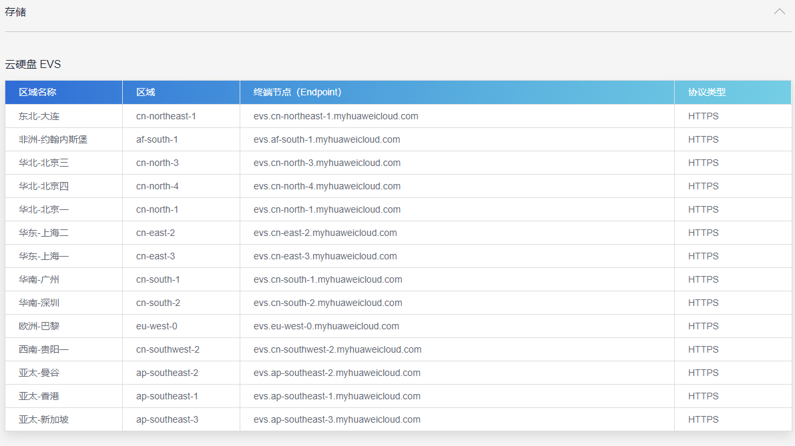
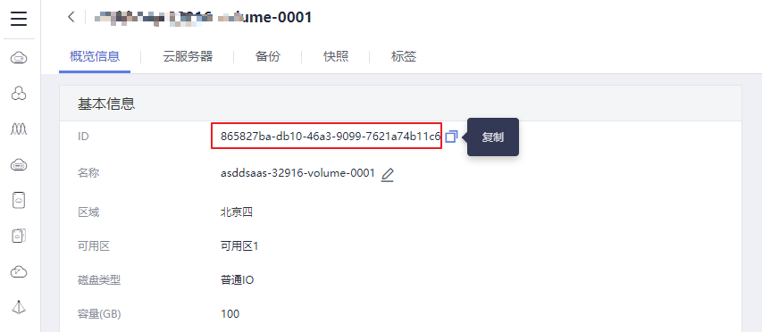

# 使用kubectl对接已有云硬盘<a name="cce_01_0256"></a>

## 操作场景<a name="section1934656185510"></a>

CCE支持使用已有的EVS云硬盘创建PersistentVolume。创建成功后，通过创建相应的PersistentVolumeClaim绑定当前PersistentVolume使用。

## 前提条件<a name="section13181839131510"></a>

-   您已经创建好一个CCE集群，并且在该集群中安装CSI插件（[Everest](Everest（系统资源插件-必装）.md)）。
-   您已通过kubectl连接到集群。具体操作请参见[通过kubectl连接集群](通过kubectl连接集群.md)。

## 约束与限制<a name="section946015116135"></a>

如下配置示例适用于Kubernetes 1.15及以上版本的集群。

## 操作步骤<a name="section265070105619"></a>

1.  登录EVS控制台，创建一个EVS云硬盘，记录云硬盘的VolumeID、容量和磁盘类型。
2.  请参见[通过kubectl连接集群](通过kubectl连接集群.md)，使用kubectl连接集群。
3.  新建两个yaml文件，用于创建PersistentVolume（PV）、PersistentVolumeClaim（PVC），假设文件名分别为**pv-evs-example.yaml**、**pvc-evs-example.yaml**。

    **touch pv-evs-example.yaml** **pvc-evs-example.yaml**

    -   **vi pv-evs-example.yaml**

        **PV yaml文件配置示例如下：**

        ```
        apiVersion: v1
        kind: PersistentVolume
        metadata:
          labels:
            failure-domain.beta.kubernetes.io/region: cn-north-4
            failure-domain.beta.kubernetes.io/zone: cn-north-4b
          annotations:
            pv.kubernetes.io/provisioned-by: everest-csi-provisioner
          name: pv-evs-example
        spec:
          accessModes:
          - ReadWriteOnce
          capacity:
            storage: 10Gi
          claimRef:
            apiVersion: v1
            kind: PersistentVolumeClaim
            name: pvc-evs-example
            namespace: default
          csi:
            driver: disk.csi.everest.io
            fsType: ext4
            volumeAttributes:
              everest.io/disk-mode: SCSI
              everest.io/disk-volume-type: SSD
              storage.kubernetes.io/csiProvisionerIdentity: everest-csi-provisioner
            volumeHandle: 0992dbda-6340-470e-a74e-4f0db288ed82
          persistentVolumeReclaimPolicy: Delete
          storageClassName: csi-disk
        ```

        **表 1**  关键参数说明

        <a name="table1819001615355"></a>
        <table><thead align="left"><tr id="row1519121663519"><th class="cellrowborder" valign="top" width="43.81%" id="mcps1.2.3.1.1"><p id="p18191161619356"><a name="p18191161619356"></a><a name="p18191161619356"></a>参数</p>
        </th>
        <th class="cellrowborder" valign="top" width="56.19%" id="mcps1.2.3.1.2"><p id="p1919116161353"><a name="p1919116161353"></a><a name="p1919116161353"></a>描述</p>
        </th>
        </tr>
        </thead>
        <tbody><tr id="row7430236123515"><td class="cellrowborder" valign="top" width="43.81%" headers="mcps1.2.3.1.1 "><p id="p165804616264"><a name="p165804616264"></a><a name="p165804616264"></a>everest.io/disk-volume-type</p>
        </td>
        <td class="cellrowborder" valign="top" width="56.19%" headers="mcps1.2.3.1.2 "><p id="p94061429143512"><a name="p94061429143512"></a><a name="p94061429143512"></a>云硬盘类型，全大写。</p>
        <p id="p865617119488"><a name="p865617119488"></a><a name="p865617119488"></a>当前支持<span id="cce_01_0255_text112910427219"><a name="cce_01_0255_text112910427219"></a><a name="cce_01_0255_text112910427219"></a>高I/O（SAS）、超高I/O（SSD）</span>。</p>
        </td>
        </tr>
        <tr id="row6232511129"><td class="cellrowborder" valign="top" width="43.81%" headers="mcps1.2.3.1.1 "><p id="p857144622619"><a name="p857144622619"></a><a name="p857144622619"></a>failure-domain.beta.kubernetes.io/region</p>
        </td>
        <td class="cellrowborder" valign="top" width="56.19%" headers="mcps1.2.3.1.2 "><p id="p991323413456"><a name="p991323413456"></a><a name="p991323413456"></a>集群所在的region。</p>
        <p id="p92141648132614"><a name="p92141648132614"></a><a name="p92141648132614"></a>Region对应的值请参见<a href="https://developer.huaweicloud.com/endpoint" target="_blank" rel="noopener noreferrer">地区和终端节点</a>。</p>
        </td>
        </tr>
        <tr id="row2318123021219"><td class="cellrowborder" valign="top" width="43.81%" headers="mcps1.2.3.1.1 "><p id="p957446102612"><a name="p957446102612"></a><a name="p957446102612"></a>failure-domain.beta.kubernetes.io/zone</p>
        </td>
        <td class="cellrowborder" valign="top" width="56.19%" headers="mcps1.2.3.1.2 "><p id="p3378436154620"><a name="p3378436154620"></a><a name="p3378436154620"></a>创建云硬盘所在的可用区，必须和工作负载规划的可用区保持一致。</p>
        <p id="p114410114509"><a name="p114410114509"></a><a name="p114410114509"></a>zone对应的值请参见<a href="https://developer.huaweicloud.com/endpoint" target="_blank" rel="noopener noreferrer">地区和终端节点</a>。</p>
        </td>
        </tr>
        <tr id="row163191830121220"><td class="cellrowborder" valign="top" width="43.81%" headers="mcps1.2.3.1.1 "><p id="p4541546112618"><a name="p4541546112618"></a><a name="p4541546112618"></a>storage</p>
        </td>
        <td class="cellrowborder" valign="top" width="56.19%" headers="mcps1.2.3.1.2 "><p id="p1721244813266"><a name="p1721244813266"></a><a name="p1721244813266"></a>云硬盘的容量，单位为Gi。</p>
        </td>
        </tr>
        <tr id="row239395619278"><td class="cellrowborder" valign="top" width="43.81%" headers="mcps1.2.3.1.1 "><p id="p1239395612712"><a name="p1239395612712"></a><a name="p1239395612712"></a>storageClassName</p>
        </td>
        <td class="cellrowborder" valign="top" width="56.19%" headers="mcps1.2.3.1.2 "><p id="p6676117163617"><a name="p6676117163617"></a><a name="p6676117163617"></a>存储卷动态供应关联的k8s storage class名称。</p>
        <p id="p739313568271"><a name="p739313568271"></a><a name="p739313568271"></a>云硬盘需使用“csi-disk”。</p>
        </td>
        </tr>
        <tr id="row2039318566273"><td class="cellrowborder" valign="top" width="43.81%" headers="mcps1.2.3.1.1 "><p id="p8393756112713"><a name="p8393756112713"></a><a name="p8393756112713"></a>accessModes</p>
        </td>
        <td class="cellrowborder" valign="top" width="56.19%" headers="mcps1.2.3.1.2 "><p id="p686319556379"><a name="p686319556379"></a><a name="p686319556379"></a>指定读写模式，显示volume实际具有的访问模式。</p>
        <p id="p183947563277"><a name="p183947563277"></a><a name="p183947563277"></a>1.15集群版本只支持非共享卷，此字段设置为“ReadWriteOnce”。</p>
        </td>
        </tr>
        <tr id="row661794144816"><td class="cellrowborder" valign="top" width="43.81%" headers="mcps1.2.3.1.1 "><p id="p136189424812"><a name="p136189424812"></a><a name="p136189424812"></a>driver</p>
        </td>
        <td class="cellrowborder" valign="top" width="56.19%" headers="mcps1.2.3.1.2 "><p id="p1952612411482"><a name="p1952612411482"></a><a name="p1952612411482"></a>挂载依赖的存储驱动。</p>
        <p id="p1561844144819"><a name="p1561844144819"></a><a name="p1561844144819"></a>EVS云硬盘配置为“disk.csi.everest.io”。</p>
        </td>
        </tr>
        <tr id="row8618742488"><td class="cellrowborder" valign="top" width="43.81%" headers="mcps1.2.3.1.1 "><p id="p12618134114814"><a name="p12618134114814"></a><a name="p12618134114814"></a>volumeHandle</p>
        </td>
        <td class="cellrowborder" valign="top" width="56.19%" headers="mcps1.2.3.1.2 "><p id="p146181448489"><a name="p146181448489"></a><a name="p146181448489"></a>云硬盘的volumeID。</p>
        <p id="p1069118611491"><a name="p1069118611491"></a><a name="p1069118611491"></a><strong id="b31904107492"><a name="b31904107492"></a><a name="b31904107492"></a>获取方法：</strong>在云服务器控制台中，单击左侧栏目树中的<span class="uicontrol" id="uicontrol1312794911"><a name="uicontrol1312794911"></a><a name="uicontrol1312794911"></a>“云硬盘 &gt; 磁盘”</span>，单击要对接的云硬盘名称进入详情页，在<span class="uicontrol" id="uicontrol10631021112"><a name="uicontrol10631021112"></a><a name="uicontrol10631021112"></a>“概览信息”</span>页签下单击<span class="uicontrol" id="uicontrol17311878495"><a name="uicontrol17311878495"></a><a name="uicontrol17311878495"></a>“ID”</span>后的复制图标即可获取云硬盘的volumeID。</p>
        </td>
        </tr>
        <tr id="row36181548486"><td class="cellrowborder" valign="top" width="43.81%" headers="mcps1.2.3.1.1 "><p id="p1561804154811"><a name="p1561804154811"></a><a name="p1561804154811"></a>everest.io/disk-mode</p>
        </td>
        <td class="cellrowborder" valign="top" width="56.19%" headers="mcps1.2.3.1.2 "><p id="p166184444820"><a name="p166184444820"></a><a name="p166184444820"></a>云硬盘磁盘模式，取值支持SCSI。</p>
        </td>
        </tr>
        <tr id="row5449102519252"><td class="cellrowborder" valign="top" width="43.81%" headers="mcps1.2.3.1.1 "><p id="p844919252256"><a name="p844919252256"></a><a name="p844919252256"></a>spec.claimRef.apiVersion</p>
        </td>
        <td class="cellrowborder" valign="top" width="56.19%" headers="mcps1.2.3.1.2 "><p id="p34491625162513"><a name="p34491625162513"></a><a name="p34491625162513"></a>固定值"v1"。</p>
        </td>
        </tr>
        <tr id="row8972110202617"><td class="cellrowborder" valign="top" width="43.81%" headers="mcps1.2.3.1.1 "><p id="p12973191018268"><a name="p12973191018268"></a><a name="p12973191018268"></a>spec.claimRef.kind</p>
        </td>
        <td class="cellrowborder" valign="top" width="56.19%" headers="mcps1.2.3.1.2 "><p id="p199736108269"><a name="p199736108269"></a><a name="p199736108269"></a>固定值"PersistentVolumeClaim"。</p>
        </td>
        </tr>
        <tr id="row4481204082618"><td class="cellrowborder" valign="top" width="43.81%" headers="mcps1.2.3.1.1 "><p id="p18482840122612"><a name="p18482840122612"></a><a name="p18482840122612"></a>spec.claimRef.name</p>
        </td>
        <td class="cellrowborder" valign="top" width="56.19%" headers="mcps1.2.3.1.2 "><p id="p1148224019267"><a name="p1148224019267"></a><a name="p1148224019267"></a>pvc名称；与下一步创建的pvc的name一致。</p>
        </td>
        </tr>
        <tr id="row105042642719"><td class="cellrowborder" valign="top" width="43.81%" headers="mcps1.2.3.1.1 "><p id="p050419612712"><a name="p050419612712"></a><a name="p050419612712"></a>spec.claimRef.namespace</p>
        </td>
        <td class="cellrowborder" valign="top" width="56.19%" headers="mcps1.2.3.1.2 "><p id="p165045614278"><a name="p165045614278"></a><a name="p165045614278"></a>pvc的namespace；与下一步创建的pvc的namespace一致。</p>
        </td>
        </tr>
        </tbody>
        </table>

    -   **vi pvc-evs-example.yaml**

        **PVC yaml文件配置示例如下：**

        ```
        apiVersion: v1  
        kind: PersistentVolumeClaim
        metadata:
          labels:
            failure-domain.beta.kubernetes.io/region: cn-north-4
            failure-domain.beta.kubernetes.io/zone: cn-north-4b
          annotations:
            everest.io/disk-volume-type: SAS
            volume.beta.kubernetes.io/storage-provisioner: everest-csi-provisioner
          name: pvc-evs-example
          namespace: default
        spec:
          accessModes:
          - ReadWriteOnce
          resources:
            requests:
              storage: 10Gi
          volumeName:  pv-evs-example
        ```

        **表 2**  关键参数说明

        <a name="table19969162117451"></a>
        <table><thead align="left"><tr id="row1996818212457"><th class="cellrowborder" valign="top" width="43.81%" id="mcps1.2.3.1.1"><p id="p296716212458"><a name="p296716212458"></a><a name="p296716212458"></a>参数</p>
        </th>
        <th class="cellrowborder" valign="top" width="56.19%" id="mcps1.2.3.1.2"><p id="p69671821154510"><a name="p69671821154510"></a><a name="p69671821154510"></a>描述</p>
        </th>
        </tr>
        </thead>
        <tbody><tr id="row2968821144514"><td class="cellrowborder" valign="top" width="43.81%" headers="mcps1.2.3.1.1 "><p id="p1596882114455"><a name="p1596882114455"></a><a name="p1596882114455"></a>everest.io/disk-volume-type</p>
        </td>
        <td class="cellrowborder" valign="top" width="56.19%" headers="mcps1.2.3.1.2 "><p id="p29681621104512"><a name="p29681621104512"></a><a name="p29681621104512"></a>云硬盘类型，全大写。</p>
        <p id="p1693742520445"><a name="p1693742520445"></a><a name="p1693742520445"></a>当前支持<span id="cce_01_0255_text112910427219_1"><a name="cce_01_0255_text112910427219_1"></a><a name="cce_01_0255_text112910427219_1"></a>高I/O（SAS）、超高I/O（SSD）</span>。</p>
        </td>
        </tr>
        <tr id="row196892118451"><td class="cellrowborder" valign="top" width="43.81%" headers="mcps1.2.3.1.1 "><p id="p169681321124512"><a name="p169681321124512"></a><a name="p169681321124512"></a>failure-domain.beta.kubernetes.io/region</p>
        </td>
        <td class="cellrowborder" valign="top" width="56.19%" headers="mcps1.2.3.1.2 "><p id="p09688215458"><a name="p09688215458"></a><a name="p09688215458"></a>集群所在的region。</p>
        <p id="p1968132154512"><a name="p1968132154512"></a><a name="p1968132154512"></a>Region对应的值请参见<a href="https://developer.huaweicloud.com/endpoint" target="_blank" rel="noopener noreferrer">地区和终端节点</a>。</p>
        </td>
        </tr>
        <tr id="row196852184514"><td class="cellrowborder" valign="top" width="43.81%" headers="mcps1.2.3.1.1 "><p id="p3968921104518"><a name="p3968921104518"></a><a name="p3968921104518"></a>failure-domain.beta.kubernetes.io/zone</p>
        </td>
        <td class="cellrowborder" valign="top" width="56.19%" headers="mcps1.2.3.1.2 "><p id="p196852114457"><a name="p196852114457"></a><a name="p196852114457"></a>EVS云硬盘所在可用区，必须和工作负载规划的可用区保持一致。</p>
        <p id="p99685214456"><a name="p99685214456"></a><a name="p99685214456"></a>zone对应的值请参见<a href="https://developer.huaweicloud.com/endpoint" target="_blank" rel="noopener noreferrer">地区和终端节点</a>。</p>
        </td>
        </tr>
        <tr id="row29685218459"><td class="cellrowborder" valign="top" width="43.81%" headers="mcps1.2.3.1.1 "><p id="p1996862119453"><a name="p1996862119453"></a><a name="p1996862119453"></a>storage</p>
        </td>
        <td class="cellrowborder" valign="top" width="56.19%" headers="mcps1.2.3.1.2 "><p id="p2968021194514"><a name="p2968021194514"></a><a name="p2968021194514"></a>PVC申请容量，单位为Gi。</p>
        <p id="p12968221204510"><a name="p12968221204510"></a><a name="p12968221204510"></a>必须和已有PV的storage大小保持一致。</p>
        </td>
        </tr>
        <tr id="row1196814217455"><td class="cellrowborder" valign="top" width="43.81%" headers="mcps1.2.3.1.1 "><p id="p796814211457"><a name="p796814211457"></a><a name="p796814211457"></a>volumeName</p>
        </td>
        <td class="cellrowborder" valign="top" width="56.19%" headers="mcps1.2.3.1.2 "><p id="p896882113459"><a name="p896882113459"></a><a name="p896882113459"></a>PV的名称。</p>
        </td>
        </tr>
        </tbody>
        </table>

4.  创建PV。

    **kubectl create -f pv-evs-example.yaml**

5.  创建PVC。

    **kubectl create -f pvc-evs-example.yaml**

    执行成功后，可以在“资源管理 \> 存储管理”的云硬盘存储中查看创建的PVC，也可以在EVS页面根据名称查看EVS云硬盘。

6.  （可选）增加集群关联的metadata，确保在删除节点或集群时避免删除已挂载的静态PV关联的EVS盘。

    > **注意：** 
    >若不执行本步骤或创建静态PV/PVC时没有执行过本步骤，请务必确保删除节点前，提前将静态PV关联的云硬盘从节点上解关联。

    1.  <a name="li6891526204113"></a>获取租户Token，详情请参见[获取用户Token](https://support.huaweicloud.com/api-cce/cce_02_0102.html)  。
    2.  <a name="li17017349418"></a>获取EVS访问地址EVS\_ENDPOINT，详情请参见[区域和终端节点](https://developer.huaweicloud.com/endpoint?EVS)。

        

    3.  给EVS静态PV关联的EVS盘补充集群关联的metadata，接口详情请参见[添加云硬盘的元数据](https://support.huaweicloud.com/api-evs/evs_04_2074.html)。

        ```
        curl -X POST ${EVS_ENDPOINT}/v2/${project_id}/volumes/${volume_id}/metadata --insecure \
            -d '{"metadata":{"cluster_id": "${cluster_id}", "namespace": "${pvc_namespace}"}}' \
            -H 'Accept:application/json' -H 'Content-Type:application/json;charset=utf8' \
            -H 'X-Auth-Token:${TOKEN}'
        ```

        **表 3**  关键参数说明

        <a name="table13625113414315"></a>
        <table><thead align="left"><tr id="row96261634739"><th class="cellrowborder" valign="top" width="28.74%" id="mcps1.2.3.1.1"><p id="p1062614347317"><a name="p1062614347317"></a><a name="p1062614347317"></a>参数</p>
        </th>
        <th class="cellrowborder" valign="top" width="71.26%" id="mcps1.2.3.1.2"><p id="p1762633415311"><a name="p1762633415311"></a><a name="p1762633415311"></a>描述</p>
        </th>
        </tr>
        </thead>
        <tbody><tr id="row862653414312"><td class="cellrowborder" valign="top" width="28.74%" headers="mcps1.2.3.1.1 "><p id="p46261934435"><a name="p46261934435"></a><a name="p46261934435"></a>EVS_ENDPOINT</p>
        </td>
        <td class="cellrowborder" valign="top" width="71.26%" headers="mcps1.2.3.1.2 "><p id="p462616341032"><a name="p462616341032"></a><a name="p462616341032"></a>EVS访问地址，配置为<a href="#li17017349418">b</a>中获取的值。</p>
        </td>
        </tr>
        <tr id="row166266343319"><td class="cellrowborder" valign="top" width="28.74%" headers="mcps1.2.3.1.1 "><p id="p176262343312"><a name="p176262343312"></a><a name="p176262343312"></a>project_id</p>
        </td>
        <td class="cellrowborder" valign="top" width="71.26%" headers="mcps1.2.3.1.2 "><p id="p662613342312"><a name="p662613342312"></a><a name="p662613342312"></a>项目ID，可在控制台页面单击右上方登录用户，在下拉列表中选择“我的凭证”，在“项目列表”页签查看项目ID。</p>
        </td>
        </tr>
        <tr id="row18626183419312"><td class="cellrowborder" valign="top" width="28.74%" headers="mcps1.2.3.1.1 "><p id="p36261341232"><a name="p36261341232"></a><a name="p36261341232"></a>volume_id</p>
        </td>
        <td class="cellrowborder" valign="top" width="71.26%" headers="mcps1.2.3.1.2 "><p id="p862733416319"><a name="p862733416319"></a><a name="p862733416319"></a>关联EVS盘的ID，配置为<a href="使用kubectl自动创建云硬盘.md#li19947131075915">2</a>待创建静态PV中的volume_id，也可在EVS控制台，单击待导入的云硬盘名称，在磁盘详情界面的“概览信息”中获取ID的值，如<a href="#fig186361614133614">图1</a>。</p>
        </td>
        </tr>
        <tr id="row113384713615"><td class="cellrowborder" valign="top" width="28.74%" headers="mcps1.2.3.1.1 "><p id="p234147769"><a name="p234147769"></a><a name="p234147769"></a>cluster_id</p>
        </td>
        <td class="cellrowborder" valign="top" width="71.26%" headers="mcps1.2.3.1.2 "><p id="p173418474610"><a name="p173418474610"></a><a name="p173418474610"></a>待创建EVS PV的集群ID。在CCE控制台中单击“资源管理 &gt; 集群管理”。单击待关联集群的名称，在集群详情页面，即可获取集群ID，如<a href="#fig3188153914187">图2</a>。</p>
        </td>
        </tr>
        <tr id="row1873715191073"><td class="cellrowborder" valign="top" width="28.74%" headers="mcps1.2.3.1.1 "><p id="p0737181912714"><a name="p0737181912714"></a><a name="p0737181912714"></a>pvc_namespace</p>
        </td>
        <td class="cellrowborder" valign="top" width="71.26%" headers="mcps1.2.3.1.2 "><p id="p273721910713"><a name="p273721910713"></a><a name="p273721910713"></a>待绑定PVC的namespace名称。</p>
        </td>
        </tr>
        <tr id="row188050161716"><td class="cellrowborder" valign="top" width="28.74%" headers="mcps1.2.3.1.1 "><p id="p108053160715"><a name="p108053160715"></a><a name="p108053160715"></a>TOKEN</p>
        </td>
        <td class="cellrowborder" valign="top" width="71.26%" headers="mcps1.2.3.1.2 "><p id="p680515161572"><a name="p680515161572"></a><a name="p680515161572"></a>用户Token，配置为<a href="#li6891526204113">a</a>中获取的值。</p>
        </td>
        </tr>
        </tbody>
        </table>

        **图 1**  获取磁盘ID<a name="fig186361614133614"></a>  
        

        **图 2**  获取cluster\_id<a name="fig3188153914187"></a>  
        

        例如，执行如下命令：

        ```
        curl -X POST https://evs.cn-north-4.myhuaweicloud.com:443/v2/060576866680d5762f52c0150e726aa7/volumes/69c9619d-174c-4c41-837e-31b892604e14/metadata --insecure \
            -d '{"metadata":{"cluster_id": "71e8277e-80c7-11ea-925c-0255ac100442", "namespace": "default"}}' \
            -H 'Accept:application/json' -H 'Content-Type:application/json;charset=utf8' \
            -H 'X-Auth-Token:MIIPe******IsIm1ldG
        ```

        请求执行完成后，执行如下命令，可查看EVS盘是否已关联集群的metadata。

        ```
        curl -X GET ${EVS_ENDPOINT}/v2/${project_id}/volumes/${volume_id}/metadata --insecure \
            -H 'X-Auth-Token:${TOKEN}'
        ```

        例如，执行如下命令：

        ```
        curl -X GET https://evs.cn-north-4.myhuaweicloud.com/v2/060576866680d5762f52c0150e726aa7/volumes/69c9619d-174c-4c41-837e-31b892604e14/metadata --insecure \
            -H 'X-Auth-Token:MIIPeAYJ***9t1c31ASaQ=='
        ```

        在回显中就可以看到该EVS盘当前的metadata。

        ```
        {
            "metadata": {
                "namespace": "default",
                "cluster_id": "71e8277e-80c7-11ea-925c-0255ac100442",
                "hw:passthrough": "true"
            }
        }
        ```


