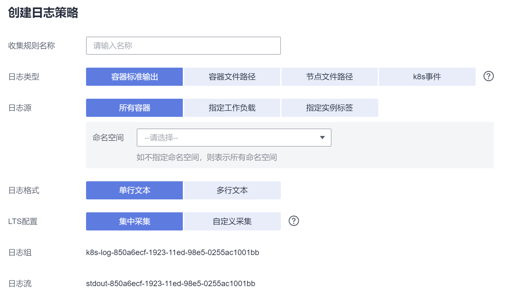

# 使用log-agent采集容器日志

## 约束与限制

log-agent有如下限制：

-   仅支持1.17及以上版本CCE集群。
-   每个集群限制20条日志规则。
-   不采集.gz .tar .zip后缀类型的日志文件。
-   采集容器文件日志时，若节点存储模式为deviceMapper模式，路径配置必须为节点数据盘挂载路径。
-   若容器运行时为containerd模式，容器标准输出日志中的多行配置暂不生效。

## 费用说明

LTS创建日志组免费，并每月赠送每个帐号一定量免费日志采集额度，超过免费额度部分将产生费用（[价格计算器](https://www.huaweicloud.com/pricing.html?tab=detail#/lts)）。

## 使用log-agent采集日志

CCE服务集成了云日志服务LTS，用户可通过自定义日志策略的方式对需要的容器、节点等资源的日志进行采集并上报至云日志服务。

1.  登录CCE控制台，单击集群名称进入集群，单击左侧“日志管理“。

    如在创建集群时未安装log-agent，可根据页面提示安装log-agent，或直接去插件管理页面安装[log-agent](log-agent.md)。

2.  创建LTS日志组和日志流。

    对接LTS需要创建LTS日志组合日志流，如果您未创建，CCE会提示您创建日志组，日志组默认名称为**k8s-log-\{集群ID\}**，如 k8s-log-bb7eaa87-07dd-11ed-ab6c-0255ac1001b3。

    对每一类日志，需要创建日志流，在CCE控制台的日志管理页面会提示您创建日志流。

    -   容器标准输出：默认名称为**stdout-\{集群ID\}**，如 stdout-bb7eaa87-07dd-11ed-ab6c-0255ac1001b3
    -   容器文件日志：默认名称为**containerfile-\{集群ID\}**，如 containerfile-bb7eaa87-07dd-11ed-ab6c-0255ac1001b3
    -   节点日志：默认名称为**hostfile-\{集群ID\}**，如 hostfile-bb7eaa87-07dd-11ed-ab6c-0255ac1001b3
    -   K8s事件：默认名称为**event-\{集群ID\}**，如 event-bb7eaa87-07dd-11ed-ab6c-0255ac1001b3

3.  创建日志采集策略。

    log-agent插件安装后，会默认生成容器标准输出策略“default-stdout”及K8s事件策略“default-event”。

    在日志管理页面，单击右上角“查看日志策略”并编辑，或单击右上角“创建日志策略”，填写相关参数。

    **图 1**  创建日志策略  
    

    **表 1**  日志策略参数

    
    <table><thead align="left"><tr id="row884816527337"><th class="cellrowborder" valign="top" width="18.62%" id="mcps1.2.3.1.1">
参数

    </th>
    <th class="cellrowborder" valign="top" width="81.38%" id="mcps1.2.3.1.2">
说明

    </th>
    </tr>
    </thead>
    <tbody><tr id="row384914524339"><td class="cellrowborder" valign="top" width="18.62%" headers="mcps1.2.3.1.1 ">
日志类型

    </td>
    <td class="cellrowborder" valign="top" width="81.38%" headers="mcps1.2.3.1.2 ">
指定采集哪类日志。

    <ul id="ul13849105243319"><li>容器标准输出</li><li>容器内日志文件</li><li>节点日志文件</li><li>K8s事件</li></ul>
    </td>
    </tr>
    <tr id="row28491252143313"><td class="cellrowborder" valign="top" width="18.62%" headers="mcps1.2.3.1.1 ">
日志源

    </td>
    <td class="cellrowborder" valign="top" width="81.38%" headers="mcps1.2.3.1.2 ">
采集哪些容器的日志。

    <ul id="ul3849125215332"><li>所有容器：可以指定采集某个命名空间的所有容器，如不指定则采集所有命名空间的容器。</li><li>指定工作负载：指定采集哪些工作负载容器的日志，可以指定采集工作负载中具体容器的日志，如不指定则采集所有容器的日志。</li><li>指定实例标签：根据标签指定采集哪些工作负载容器的日志，可以指定采集工作负载中具体容器的日志，如不指定则采集所有容器的日志。</li></ul>
    </td>
    </tr>
    <tr id="row78493527336"><td class="cellrowborder" valign="top" width="18.62%" headers="mcps1.2.3.1.1 ">
日志格式

    </td>
    <td class="cellrowborder" valign="top" width="81.38%" headers="mcps1.2.3.1.2 "><ul id="ul48491652123316"><li>单行文本
每条日志仅包含一行文本，以换行符 \n 作为各条日志的分界线。

    </li><li>多行文本
有些程序打印的日志存在一条完整的日志数据跨占多行（例如 Java 程序日志）情况，日志采集系统默认是按行采集。如果您想在日志采集系统中按整条显示日志，可以开启多行文本，采用首行正则的方式进行匹配，当选择多行文本时，需填写日志匹配格式。

    
例如：

    
需采集的日志格式如下，则需填写时间的正则匹配，在日志匹配格式处填写：\d{4}-\d{2}-\d{2} \d{2}\:\d{2}\:\d{2}.*

    
则下面以日期开头三行日志会作为一条完整日志。

    
2022-01-01 00:00:00 Exception in thread "main" java.lang.RuntimeException: Something has gone wrong, aborting!

    
at com.myproject.module.MyProject.badMethod(MyProject.java:22)

    
at com.myproject.module.MyProject.oneMoreMethod(MyProject.java:18)

    
2022-01-01 00:00:10 Normal

    </li></ul>
    </td>
    </tr>
    <tr id="row1585065223312"><td class="cellrowborder" valign="top" width="18.62%" headers="mcps1.2.3.1.1 ">
LTS配置

    </td>
    <td class="cellrowborder" valign="top" width="81.38%" headers="mcps1.2.3.1.2 "><ul id="ul48501652163319"><li>集中采集：所有日志都存储在<a href="#li79342134918">2</a>中创建的日志流中。</li><li>自定义采集：根据需要指定日志存储在哪个日志流中。</li></ul>
    </td>
    </tr>
    </tbody>
    </table>

4.  创建完成后，您可单击右上角“查看日志策略”进行查看或重新编辑。

## 查看日志

待日志采集完成后，您可登录CCE控制台，单击集群名称进入集群，单击左侧“日志管理“，在“业务日志”页签下，选择不同的日志类型进行查看。在CCE控制台中查看日志的操作方式与LTS控制台相同，详情请参见[LTS用户指南](https://support.huaweicloud.com/usermanual-lts/lts_04_0001.html)。

您也可以直接前往LTS控制台，找到集群对应的日志组（名称为k8s-log-\{集群ID\}）查看日志。

