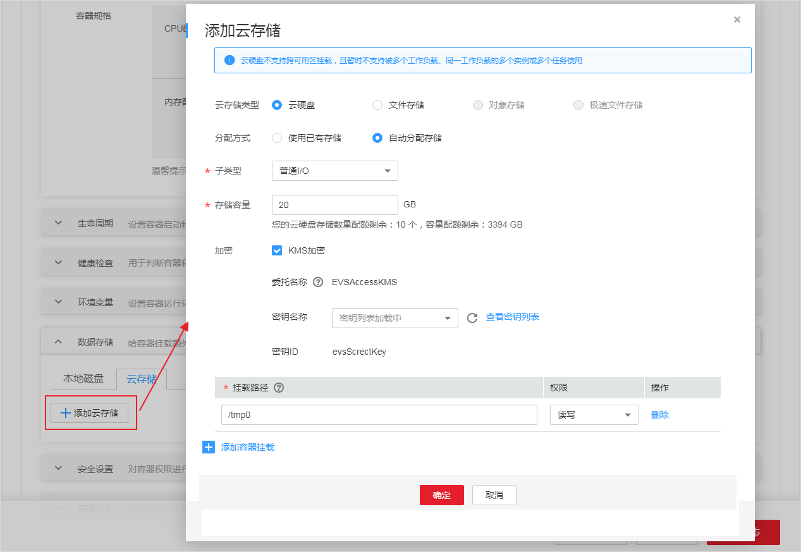

# 使用云硬盘存储卷<a name="cce_01_0044"></a>

为满足数据的持久化需求，CCE支持将云硬盘（EVS）挂载到容器中。通过云硬盘，可以将存储系统的远端文件目录挂载到容器中，数据卷中的数据将被永久保存，即使删除了容器，数据卷中的数据依然保存在存储系统中。

**图 1**  CCE挂载云硬盘存储卷<a name="fig11623870218"></a>  


## 使用说明<a name="section729922716246"></a>

-   您可以像使用传统服务器硬盘一样，对挂载到服务器上的块存储（硬盘）做格式化、创建文件系统等操作。
-   数据不共享，每台服务器使用独立的块存储（硬盘），多服务器之间数据隔离。
-   私有网络，数据访问必须在数据中心内部网络中。
-   单卷容量有限（TB级），但性能极佳（ms），主要面向数据库，企业办公应用等场景。
-   不支持导入分区过或者具有非ext4文件系统的云硬盘。
-   适用于供单实例部署的无状态负载 Deployment和普通任务（Job），以及有状态工作负载（StatefulSet）的每个实例独占式使用。

## 使用约束<a name="section1274816104391"></a>

-   CCE默认创建计费模式为“按需计费“的云硬盘。如需使用包周期的云硬盘，请参考[云硬盘包周期](#section84783474418)。
-   云硬盘不支持跨可用区挂载，且暂时不支持被多个工作负载、同一个工作负载的多个实例或多个任务使用。
-   由于CCE集群各节点之间暂不支持共享盘的数据共享功能，多个节点挂载使用同一个云硬盘可能会出现读写冲突、数据缓存冲突等问题，所以创建无状态工作负载时，若使用了EVS云硬盘，建议工作负载只选择一个实例。
-   创建有状态工作负载并添加云存储时，云硬盘暂不支持使用已有存储。
-   CCE集群中的容器存储目前已支持加密（Kubernetes 1.13版本及以上），当前仅在部分区域（Region）提供端到端支持。

## 创建云硬盘存储卷<a name="section46651332174515"></a>

1.  登录[CCE控制台](https://console.huaweicloud.com/cce2.0/?utm_source=helpcenter)，在左侧导航栏中选择“资源管理 \> 存储管理“，单击“购买云硬盘存储卷“。
2.  参照[表1](#table20328123218464)配置磁盘基本信息。

    **表 1**  创建磁盘基本信息配置

    <a name="table20328123218464"></a>
    <table><thead align="left"><tr id="row533073264618"><th class="cellrowborder" valign="top" width="26%" id="mcps1.2.3.1.1"><p id="p12330932164617"><a name="p12330932164617"></a><a name="p12330932164617"></a>参数</p>
    </th>
    <th class="cellrowborder" valign="top" width="74%" id="mcps1.2.3.1.2"><p id="p133306326467"><a name="p133306326467"></a><a name="p133306326467"></a>参数说明</p>
    </th>
    </tr>
    </thead>
    <tbody><tr id="row0330113224615"><td class="cellrowborder" valign="top" width="26%" headers="mcps1.2.3.1.1 "><p id="p18330232154618"><a name="p18330232154618"></a><a name="p18330232154618"></a>* PVC名称</p>
    </td>
    <td class="cellrowborder" valign="top" width="74%" headers="mcps1.2.3.1.2 "><p id="p929111285472"><a name="p929111285472"></a><a name="p929111285472"></a>新建PVC的名称，PVC创建时将自动创建存储卷，一个PVC对应一个存储卷。存储卷名称在PVC创建时自动生成。</p>
    </td>
    </tr>
    <tr id="row20242958195514"><td class="cellrowborder" valign="top" width="26%" headers="mcps1.2.3.1.1 "><p id="p1243195835517"><a name="p1243195835517"></a><a name="p1243195835517"></a>集群名称</p>
    </td>
    <td class="cellrowborder" valign="top" width="74%" headers="mcps1.2.3.1.2 "><p id="p4243258145517"><a name="p4243258145517"></a><a name="p4243258145517"></a>云硬盘部署所在的集群。</p>
    </td>
    </tr>
    <tr id="row198351838762"><td class="cellrowborder" valign="top" width="26%" headers="mcps1.2.3.1.1 "><p id="p4837143820613"><a name="p4837143820613"></a><a name="p4837143820613"></a>命名空间</p>
    </td>
    <td class="cellrowborder" valign="top" width="74%" headers="mcps1.2.3.1.2 "><p id="p7837143816615"><a name="p7837143816615"></a><a name="p7837143816615"></a>选择云硬盘所部署的命名空间，若无需选择，保持默认default即可。</p>
    </td>
    </tr>
    <tr id="row17020817474"><td class="cellrowborder" valign="top" width="26%" headers="mcps1.2.3.1.1 "><p id="p421381478"><a name="p421381478"></a><a name="p421381478"></a>磁盘容量</p>
    </td>
    <td class="cellrowborder" valign="top" width="74%" headers="mcps1.2.3.1.2 "><p id="p4766420114910"><a name="p4766420114910"></a><a name="p4766420114910"></a>新建存储的容量。</p>
    </td>
    </tr>
    <tr id="row423313555917"><td class="cellrowborder" valign="top" width="26%" headers="mcps1.2.3.1.1 "><p id="p112371055298"><a name="p112371055298"></a><a name="p112371055298"></a>访问模式</p>
    </td>
    <td class="cellrowborder" valign="top" width="74%" headers="mcps1.2.3.1.2 "><p id="p1823911552915"><a name="p1823911552915"></a><a name="p1823911552915"></a>ReadWriteMany，该卷能够以读写模式被多个节点同时加载。</p>
    </td>
    </tr>
    <tr id="row12462640575"><td class="cellrowborder" valign="top" width="26%" headers="mcps1.2.3.1.1 "><p id="p1246210401871"><a name="p1246210401871"></a><a name="p1246210401871"></a>可用区</p>
    </td>
    <td class="cellrowborder" valign="top" width="74%" headers="mcps1.2.3.1.2 "><p id="p34621840572"><a name="p34621840572"></a><a name="p34621840572"></a>选择云硬盘所属可用区。</p>
    </td>
    </tr>
    <tr id="row8607924123319"><td class="cellrowborder" valign="top" width="26%" headers="mcps1.2.3.1.1 "><p id="p6330173219461"><a name="p6330173219461"></a><a name="p6330173219461"></a>类型</p>
    </td>
    <td class="cellrowborder" valign="top" width="74%" headers="mcps1.2.3.1.2 "><p id="p7488131445018"><a name="p7488131445018"></a><a name="p7488131445018"></a>新建云磁盘类型，默认为普通IO。</p>
    <p id="p97378311275"><a name="p97378311275"></a><a name="p97378311275"></a>普通IO：是指由SATA存储提供资源的磁盘类型。具体请参见<a href="https://support.huaweicloud.com/productdesc-evs/zh-cn_topic_0044524691.html" target="_blank" rel="noopener noreferrer">这里</a>了解如何选择磁盘类型。</p>
    </td>
    </tr>
    <tr id="row4690726114316"><td class="cellrowborder" valign="top" width="26%" headers="mcps1.2.3.1.1 "><p id="p136915265434"><a name="p136915265434"></a><a name="p136915265434"></a>加密</p>
    </td>
    <td class="cellrowborder" valign="top" width="74%" headers="mcps1.2.3.1.2 "><p id="p1433714742818"><a name="p1433714742818"></a><a name="p1433714742818"></a><span class="uicontrol" id="uicontrol1888934414440"><a name="uicontrol1888934414440"></a><a name="uicontrol1888934414440"></a>“KMS加密”</span>默认不勾选。勾选<span class="uicontrol" id="uicontrol19364185215442"><a name="uicontrol19364185215442"></a><a name="uicontrol19364185215442"></a>“KMS加密”</span>后，若未创建委托请单击<span class="uicontrol" id="uicontrol1974018813192"><a name="uicontrol1974018813192"></a><a name="uicontrol1974018813192"></a>“创建委托”</span>，并配置如下参数：</p>
    <p id="p1816118111919"><a name="p1816118111919"></a><a name="p1816118111919"></a>密钥管理，即密钥管理服务（Key Management Service，KMS），是一种安全、可靠、简单易用的密钥托管服务，帮助您轻松创建和管理密钥，保护密钥的安全。</p>
    <a name="ul32358634612"></a><a name="ul32358634612"></a><ul id="ul32358634612"><li>委托名称：委托表示委托方通过创建信任关系，给被委托方授予访问其资源的权限。当“委托名称”为“EVSAccessKMS”时，表示已经成功授权EVS访问KMS，授权成功后，EVS可以获取KMS密钥用来加解密云硬盘系统。</li><li>密钥名称：密钥资源创建完成后，可在容器应用中加载使用。如何创建密钥请参见<a href="https://support.huaweicloud.com/usermanual-dew/zh-cn_topic_0034324884.html" target="_blank" rel="noopener noreferrer">创建密钥</a>。</li><li>密钥ID：默认生成。</li></ul>
    </td>
    </tr>
    </tbody>
    </table>

3.  单击“立即购买”。确认订单详情无误后，单击“提交“，等待创建成功。

    创建成功后，存储管理列表中会出现已创建的存储，待状态为“正常“，表示存储已创建成功。

4.  单击存储名称，进入存储详情页，可查看到存储的卷名称、存储容量等信息。

## 使用云硬盘存储卷<a name="section359413445405"></a>

1.  参照[创建无状态负载\(Deployment\)](创建无状态负载(Deployment).md)或[创建有状态负载\(StatefulSet\)](创建有状态负载(StatefulSet).md)，在添加容器后，展开“数据存储“。在“云存储“页签，单击“添加云存储“。
2.  选择存储类型为“云硬盘“。

    **表 2**  挂载云硬盘参数配置

    <a name="table9241341114317"></a>
    <table><thead align="left"><tr id="row132473414435"><th class="cellrowborder" valign="top" width="21%" id="mcps1.2.3.1.1"><p id="p1324910414436"><a name="p1324910414436"></a><a name="p1324910414436"></a>参数</p>
    </th>
    <th class="cellrowborder" valign="top" width="79%" id="mcps1.2.3.1.2"><p id="p6252164111435"><a name="p6252164111435"></a><a name="p6252164111435"></a>参数说明</p>
    </th>
    </tr>
    </thead>
    <tbody><tr id="row1425217417438"><td class="cellrowborder" valign="top" width="21%" headers="mcps1.2.3.1.1 "><p id="p18255194124313"><a name="p18255194124313"></a><a name="p18255194124313"></a><strong id="b38251881319"><a name="b38251881319"></a><a name="b38251881319"></a>云存储类型</strong></p>
    </td>
    <td class="cellrowborder" valign="top" width="79%" headers="mcps1.2.3.1.2 "><p id="p9499194511284"><a name="p9499194511284"></a><a name="p9499194511284"></a>云硬盘：<span>云硬盘的使用方式与传统服务器硬盘完全一致。同时，云硬盘具有更高的数据可靠性，更高的I/O吞吐能力和更加简单易用等特点，适用于文件系统、数据库或者其他需要块存储设备的系统软件或工作负载。</span></p>
    <div class="caution" id="note21391101616"><a name="note21391101616"></a><a name="note21391101616"></a><span class="cautiontitle"> 注意： </span><div class="cautionbody"><a name="ul112470508397"></a><a name="ul112470508397"></a><ul id="ul112470508397"><li><strong id="b8830161015511"><a name="b8830161015511"></a><a name="b8830161015511"></a>挂载云硬盘，必须为单实例。</strong></li><li>创建有状态工作负载并添加云存储时，云硬盘暂不支持使用已有存储。</li><li>云硬盘不支持跨可用区挂载，且暂时不支持被多个工作负载、同一个工作负载的多个实例或多个任务使用。</li></ul>
    </div></div>
    </td>
    </tr>
    <tr id="row226284114432"><td class="cellrowborder" colspan="2" valign="top" headers="mcps1.2.3.1.1 mcps1.2.3.1.2 "><p id="p1126514412436"><a name="p1126514412436"></a><a name="p1126514412436"></a><strong id="b16848185133"><a name="b16848185133"></a><a name="b16848185133"></a>分配方式</strong></p>
    </td>
    </tr>
    <tr id="row126744194311"><td class="cellrowborder" valign="top" width="21%" headers="mcps1.2.3.1.1 "><p id="p62691741164312"><a name="p62691741164312"></a><a name="p62691741164312"></a>使用已有存储</p>
    </td>
    <td class="cellrowborder" valign="top" width="79%" headers="mcps1.2.3.1.2 "><p id="p726915413433"><a name="p726915413433"></a><a name="p726915413433"></a>选择已创建的存储，您需要提前创建存储。</p>
    </td>
    </tr>
    <tr id="row9299164154310"><td class="cellrowborder" valign="top" width="21%" headers="mcps1.2.3.1.1 "><p id="p830134116436"><a name="p830134116436"></a><a name="p830134116436"></a>自动分配存储</p>
    </td>
    <td class="cellrowborder" valign="top" width="79%" headers="mcps1.2.3.1.2 "><p id="p13303124114313"><a name="p13303124114313"></a><a name="p13303124114313"></a><span>自动创建存储，需要输入存储的容量。</span></p>
    <a name="ol1930612417437"></a><a name="ol1930612417437"></a><ol id="ol1930612417437"><li>存储类型选择云硬盘时，需要先选择创建云硬盘的可用区。</li><li>选择存储子类型。<a name="ul14313174113435"></a><a name="ul14313174113435"></a><ul id="ul14313174113435"><li><span>高I/O：指由SAS存储介质构成的云硬盘。</span></li><li><span>普通I/O：指由SATA存储介质构成的云硬盘。</span></li><li><span>超高I/O：指由SSD存储介质构成的云硬盘</span>。</li></ul>
    </li><li>输入存储容量，单位为GB。请不要超过存储容量配额，否则会创建失败。</li><li>加密：勾选<span class="uicontrol" id="uicontrol1138919481275"><a name="uicontrol1138919481275"></a><a name="uicontrol1138919481275"></a>“KMS加密”</span>后，配置如下参数：<p id="p112086331581"><a name="p112086331581"></a><a name="p112086331581"></a>密钥管理，即密钥管理服务（Key Management Service，KMS），是一种安全、可靠、简单易用的密钥托管服务，帮助您轻松创建和管理密钥，保护密钥的安全。</p>
    <a name="ul194004160312"></a><a name="ul194004160312"></a><ul id="ul194004160312"><li>委托名称：委托表示委托方通过创建信任关系，给被委托方授予访问其资源的权限。当“委托名称”为“EVSAccessKMS”时，表示已经成功授权EVS访问KMS，授权成功后，EVS可以获取KMS密钥用来加解密云硬盘系统。</li><li>密钥名称：密钥资源创建完成后，可在容器应用中加载使用。如何创建密钥请参见<a href="https://support.huaweicloud.com/usermanual-dew/zh-cn_topic_0034324884.html" target="_blank" rel="noopener noreferrer">创建密钥</a>。</li><li>密钥ID：默认生成。</li></ul>
    </li></ol>
    </td>
    </tr>
    <tr id="row13325134164316"><td class="cellrowborder" valign="top" width="21%" headers="mcps1.2.3.1.1 "><p id="p1327194134311"><a name="p1327194134311"></a><a name="p1327194134311"></a>添加容器挂载</p>
    </td>
    <td class="cellrowborder" valign="top" width="79%" headers="mcps1.2.3.1.2 "><a name="ol153291941194312"></a><a name="ol153291941194312"></a><ol id="ol153291941194312"><li>单击<span class="uicontrol" id="uicontrol9967189131"><a name="uicontrol9967189131"></a><a name="uicontrol9967189131"></a>“添加容器挂载”</span>。</li><li>挂载路径：输入数据卷挂载到容器上的路径。<div class="notice" id="note3336941124310"><a name="note3336941124310"></a><a name="note3336941124310"></a><span class="noticetitle"> 须知： </span><div class="noticebody"><a name="ul434084115433"></a><a name="ul434084115433"></a><ul id="ul434084115433"><li>请不要挂载在系统目录下，如“<strong id="b199121841316"><a name="b199121841316"></a><a name="b199121841316"></a>/</strong>”、“<strong id="b9991018171316"><a name="b9991018171316"></a><a name="b9991018171316"></a>/var/run”</strong>等，会导致容器异常。建议挂载在空目录下，若目录不为空，请确保目录下无影响容器启动的文件，否则文件会被替换，导致容器启动异常，工作负载创建失败。</li><li>挂载高危目录的情况下 ，建议使用低权限帐号启动，否则可能会造成宿主机高危文件被破坏。</li></ul>
    </div></div>
    </li><li>设置权限。<a name="ul193486419432"></a><a name="ul193486419432"></a><ul id="ul193486419432"><li>只读：只能读容器路径中的数据卷。</li><li>读写：可修改容器路径中的数据卷，容器迁移时新写入的数据不会随之迁移，会造成数据丢失。</li></ul>
    </li></ol>
    </td>
    </tr>
    </tbody>
    </table>

    **图 2**  添加云存储<a name="fig414141394812"></a>  
    

3.  单击“确定“。

## 导入云硬盘存储卷<a name="section18528593167"></a>

CCE支持导入已有的云硬盘存储。

> **说明：**   
>一块云硬盘只能导入一个命名空间，不能同时导入多个命名空间。如果一块云硬盘已经被导入到一个命名空间，则在其他命名空间下不可见，不能再次导入。**如果需要导入已经格式化文件系统（ext4）的EVS磁盘，需要确保磁盘没有设置分区，否则可能存在数据丢失的情况。**  

1.  登录[CCE控制台](https://console.huaweicloud.com/cce2.0/?utm_source=helpcenter)，在左侧导航栏中选择“资源管理 \> 存储管理“，在“云硬盘存储卷“页签，单击“导入“。
2.  从列表里选择要导入的云硬盘存储，单击“确定“。

## 云硬盘包周期<a name="section84783474418"></a>

-   如需使用包周期的云硬盘，请参考如下转包周期指导：

    **方法一：**

    1.  使用CCE存储管理创建所需容量的云硬盘，该云硬盘默认计费模式为按需计费。
    2.  在CCE云硬盘列表点击该云硬盘的转包周期链接，对该云硬盘进行计费模式转换为包周期的操作，该操作将耗费一定时间。

    **方法二：**

    1.  在[EVS服务](https://console.huaweicloud.com/ecm/#/evs/manager/volumelist)侧创建用户所需容量的包周期云硬盘。
    2.  在CCE存储管理点击导入，选择步骤一创建的云硬盘，点击确定，将该云硬盘导入到CCE中使用。

    > **注意：**   
    >在CCE侧删除包周期云硬盘时并不会真正删除该云硬盘，CCE只做解关联操作。若用户想彻底删除该云硬盘，请先在CCE侧进行解关联操作，然后至费用中心执行[退订](https://account.huaweicloud.com/usercenter/#/userindex/retreatManagement)操作。  


## 解关联云硬盘<a name="section72768527568"></a>

创建或导入云硬盘成功后，云硬盘会自动和当前集群绑定，其它集群无法使用该存储。解关联后，将和此集群解绑，其它集群均可以导入使用该云硬盘。

若云硬盘已被工作负载挂载，将无法和集群解关联。

1.  登录[CCE控制台](https://console.huaweicloud.com/cce2.0/?utm_source=helpcenter)，在左侧导航栏中选择“资源管理 \> 存储管理“，在云硬盘存储卷列表中，单击云硬盘后的“解关联“。
2.  确认解关联后，单击“确定“。

## 使用kubectl创建云硬盘<a name="section198505107598"></a>

CCE支持使用PersistentVolumeClaim（PVC）的形式创建云硬盘。

1.  请参见[通过kubectl或web-terminal插件连接CCE集群](通过kubectl或web-terminal插件连接CCE集群.md)配置kubectl命令。
2.  执行如下命令，配置名为“pvc-evs-auto-example.yaml”的创建PVC的yaml文件。

    **touch pvc-evs-auto-example.yaml**

    **vi pvc-evs-auto-example.yaml**

    -   1.15之前的1.9、1.11、1.13版本集群，yaml文件配置示例如下：

    ```
    apiVersion: v1
    kind: PersistentVolumeClaim
    metadata:
      name: pvc-evs-auto-example
      namespace: default
      annotations:
        volume.beta.kubernetes.io/storage-class: sata
      labels:
        failure-domain.beta.kubernetes.io/region: cn-north-1
        failure-domain.beta.kubernetes.io/zone: cn-north-1a
    spec:
      accessModes:
      - ReadWriteMany
      resources:
        requests:
          storage: 10Gi
    ```

    其中：

    -   volume.beta.kubernetes.io/storage-class：云硬盘类型，当前支持高I/O（sas）、超高I/O（ssd）和普通I/O（sata）。
    -   failure-domain.beta.kubernetes.io/region：集群所在的region。Region对应的值请参见[地区和终端节点](https://developer.huaweicloud.com/endpoint)。
    -   failure-domain.beta.kubernetes.io/zone：创建云硬盘所在的可用区，必须和工作负载规划的可用区保持一致。zone对应的值请参见[地区和终端节点](https://developer.huaweicloud.com/endpoint)。
    -   storage：存储容量，单位为Gi。
    -   1.15版本集群，yaml文件配置示例如下：

        ```
        apiVersion: v1
        kind: PersistentVolumeClaim
        metadata:
          name: pvc-evs-auto-example
          namespace: default
          annotations:
            everest.io/disk-volume-type: SATA
          labels:
            failure-domain.beta.kubernetes.io/region: cn-north-1
            failure-domain.beta.kubernetes.io/zone: cn-north-1a
        spec:
          accessModes:
          - ReadWriteMany
          resources:
            requests:
              storage: 10Gi
          storageClassName: csi-disk
        ```

        其中：

        -   everest.io/disk-volume-type：云硬盘类型，全大写；当前支持高I/O（SAS）、超高I/O（SSD）和普通I/O（SATA）。
        -   failure-domain.beta.kubernetes.io/region：集群所在的region。Region对应的值请参见[地区和终端节点](https://developer.huaweicloud.com/endpoint)。
        -   failure-domain.beta.kubernetes.io/zone：创建云硬盘所在的可用区，必须和工作负载规划的可用区保持一致。zone对应的值请参见[地区和终端节点](https://developer.huaweicloud.com/endpoint)。
        -   storage：存储容量，单位为Gi。
        -   storageClassName：存储卷动态供应关联的k8s storage class名称；v1.15集群使用的csi关联的storage class名称是csi-disk

3.  执行如下命令创建PVC。

    **kubectl create -f pvc-evs-auto-example.yaml**

    命令执行完成后，会在集群所在分区创建EVS云硬盘，您可以在“存储管理 \> 云硬盘存储卷“中查看该云硬盘，也可以在EVS的控制台中根据卷名称查看该硬盘。


## 使用已有的EVS创建PVC<a name="section122885710205"></a>

CCE支持使用已有的EVS云硬盘创建PersistentVolume。创建成功后，通过创建相应的PersistentVolumeClaim绑定当前PersistentVolume使用。

1.  登录EVS控制台，创建一个EVS云硬盘，记录云硬盘的VolumeID、容量和磁盘类型。
2.  请参见[通过kubectl或web-terminal插件连接CCE集群](通过kubectl或web-terminal插件连接CCE集群.md)配置kubectl命令。
3.  新建一个yaml文件，用于创建PersistentVolume，假设文件名为**pv-evs-example.yaml**。

    **touch pv-evs-example.yaml**

    **vi pv-evs-example.yaml**

    -   1.9版本集群，yaml文件配置示例如下：

        ```
        apiVersion: v1 
        kind: PersistentVolume 
        metadata: 
          labels: 
            failure-domain.beta.kubernetes.io/region: cn-north-1
            failure-domain.beta.kubernetes.io/zone:  cn-north-1a
          name: pv-evs-example 
          namespace: default 
        spec: 
          accessModes: 
          - ReadWriteMany 
          capacity: 
            storage: 10Gi 
          flexVolume: 
            driver: huawei.com/fuxivol 
            fsType: ext4 
            options: 
              fsType: ext4 
              kubernetes.io/namespace: default 
              volumeID: 0992dbda-6340-470e-a74e-4f0db288ed82 
          persistentVolumeReclaimPolicy: Delete 
          storageClassName: sata
        ```

    -   1.11.7之前的1.11版本集群，yaml文件配置示例如下：

        ```
        apiVersion: v1 
        kind: PersistentVolume 
        metadata: 
          labels: 
            failure-domain.beta.kubernetes.io/region: cn-north-1
            failure-domain.beta.kubernetes.io/zone:  cn-north-1a
          name: pv-evs-example 
        spec: 
          accessModes: 
          - ReadWriteMany 
          capacity: 
            storage: 10Gi 
          flexVolume: 
            driver: huawei.com/fuxivol 
            fsType: ext4 
            options:
              fsType: ext4 
              volumeID: 0992dbda-6340-470e-a74e-4f0db288ed82 
          persistentVolumeReclaimPolicy: Delete 
          storageClassName: sata
        ```

    -   1.11.7以上以及1.13版本集群，yaml文件配置示例如下：

        ```
        apiVersion: v1 
        kind: PersistentVolume 
        metadata: 
          labels: 
            failure-domain.beta.kubernetes.io/region: cn-north-1
            failure-domain.beta.kubernetes.io/zone:  cn-north-1a
          name: pv-evs-example 
        spec: 
          accessModes: 
          - ReadWriteMany 
          capacity: 
            storage: 10Gi 
          flexVolume: 
            driver: huawei.com/fuxivol 
            fsType: ext4 
            options:
              disk-mode: SCSI
              fsType: ext4 
              volumeID: 0992dbda-6340-470e-a74e-4f0db288ed82 
          persistentVolumeReclaimPolicy: Delete 
          storageClassName: sata
        ```

    其中：

    -   failure-domain.beta.kubernetes.io/region：云硬盘所在region。
    -   failure-domain.beta.kubernetes.io/zone：云硬盘所在可用区，必须和工作负载规划的节点可用区保持一致。具体请参见[地区和终端节点](https://developer.huaweicloud.com/endpoint)。
    -   driver：挂载依赖的存储驱动，EVS云硬盘配置为“huawei.com/fuxivol”。
    -   volumeID：云硬盘的volumeID。
    -   disk-mode：云硬盘磁盘模式，取值可以是VBD和SCSI。v1.11.7之前的CCE集群，该字段无需填写，默认都是VBD。CCE v1.11.7+以及v1.13的Linux x86混合集群要求该字段值必须存在，且基于PVC触发动态创建的都是EVS SCSI模式的卷，因此这里静态PV形式优先选用SCSI模式的云硬盘；同时支持升级后的老集群中VBD卷能够继续正常使用。
    -   storage：云硬盘的容量，单位为Gi。
    -   storageClassName：云硬盘类型，当前支持高I/O（sas）、超高I/O（ssd）和普通I/O（sata）。

4.  创建PV。

    **kubectl create -f pv-evs-example.yaml**

5.  创建一个yaml文件，用于创建PVC，假设文件名为**pvc-evs-example.yaml**。

    **touch pvc-evs-example.yaml**

    **vi pvc-evs-example.yaml**

    -   1.9版本集群的yaml文件配置示例如下：

        ```
        apiVersion: v1  
        kind: PersistentVolumeClaim  
        metadata:  
          annotations:  
            volume.beta.kubernetes.io/storage-class: sata
            volume.beta.kubernetes.io/storage-provisioner: flexvolume-huawei.com/fuxivol 
          labels: 
            failure-domain.beta.kubernetes.io/region: cn-north-1
            failure-domain.beta.kubernetes.io/zone: cn-north-1a
          name: pvc-evs-example 
          namespace: default  
        spec:  
          accessModes:  
          - ReadWriteMany  
          resources:  
            requests:  
              storage: 10Gi
          volumeName: pv-evs-example
          volumeNamespace: default
        ```

    -   1.11及以上版本集群的yaml文件配置示例如下：

        ```
        apiVersion: v1  
        kind: PersistentVolumeClaim  
        metadata:  
          annotations:  
            volume.beta.kubernetes.io/storage-class: sata
            volume.beta.kubernetes.io/storage-provisioner: flexvolume-huawei.com/fuxivol 
          labels: 
            failure-domain.beta.kubernetes.io/region: cn-north-1
            failure-domain.beta.kubernetes.io/zone: cn-north-1a     
          name: pvc-evs-example 
          namespace: default  
        spec:  
          accessModes:  
          - ReadWriteMany  
          resources:  
            requests:  
              storage: 10Gi
          volumeName: pv-evs-example
        ```

    其中：

    -   volume.beta.kubernetes.io/storage-class：存储类型，支持sas, ssd 和 sata。必须和已有PV保持一致。
    -   volume.beta.kubernetes.io/storage-provisioner：必须使用flexvolume-huawei.com/fuxivol。
    -   failure-domain.beta.kubernetes.io/region：集群所在region。
    -   failure-domain.beta.kubernetes.io/zone：EVS云硬盘所在可用区，必须和工作负载规划的节点可用区保持一致。具体请参见[地区和终端节点](https://developer.huaweicloud.com/endpoint)。
    -   storage：PVC申请容量，必须和已有PV的storage大小保持一致。
    -   volumeName：PV的名称。

6.  创建PVC。

    **kubectl create -f pvc-evs-example.yaml**

    执行成功后，可以在“资源管理 \> 存储管理”的云硬盘存储中查看创建的PVC，也可以在EVS页面根据名称查看EVS云硬盘。


## 使用kubectl部署使用云硬盘卷的工作负载<a name="section1996254515127"></a>

云硬盘创建或导入CCE后，可以在工作负载中挂载云硬盘。

> **须知：**   
>云硬盘不支持跨可用区挂载。在挂载前，您可以使用** kubectl get pvc**  命令查询当前集群所在分区下可用PVC。  

1.  执行如下命令，配置名为“evs-pod-example.yaml“的创建Pod的yaml文件。

    **touch evs-pod-example.yaml**

    **vi evs-pod-example.yaml**

    在无状态工作负载中基于pvc共享式使用云硬盘存储示例：

    ```
    apiVersion: extensions/v1beta1 
    kind: Deployment 
    metadata: 
      name: evs-pod-example 
      namespace: default 
    spec: 
      replicas: 1 
      selector: 
        matchLabels: 
          app: evs-pod-example 
      template: 
        metadata: 
          labels: 
            app: evs-pod-example 
        spec: 
          containers: 
          - image: nginx
            name: container-0 
            volumeMounts: 
            - mountPath: /tmp 
              name: pvc-evs-example 
          restartPolicy: Always 
          volumes: 
          - name: pvc-evs-example 
            persistentVolumeClaim: 
              claimName: pvc-evs-auto-example
    ```

    其中：

    -   name：创建的无状态工作负载的名称。
    -   app：Pod工作负载名称。
    -   mountPath：容器内挂载路径，示例中挂载到“/tmp“路径。
    -   claimName：已有PVC名称。
    -   “spec.template.spec.containers.volumeMounts.name ”和 “spec.template.spec.volumes.name”有映射关系，必须保持一致。

    在有状态工作负载中基于PVCTemplate独占式使用云硬盘存储示例：

    ```
    apiVersion: apps/v1
    kind: StatefulSet
    metadata:
      name: deploy-evs-sata-in
      namespace: default
      generation: 1
      labels:
        appgroup: ''
      annotations:
        container.io/container-0: https://console.huaweicloud.com/swr/dockerimage/nginx.png
        description: ''
    spec:
      replicas: 1
      selector:
        matchLabels:
          app: deploy-evs-sata-in
          failure-domain.beta.kubernetes.io/region: cn-north-1
          failure-domain.beta.kubernetes.io/zone: cn-north-1a
      template:
        metadata:
          labels:
            app: deploy-evs-sata-in
            failure-domain.beta.kubernetes.io/region: cn-north-1
            failure-domain.beta.kubernetes.io/zone: cn-north-1a
          annotations:
            metrics.alpha.kubernetes.io/custom-endpoints: '[{"api":"","path":"","port":"","names":""}]'
            pod.alpha.kubernetes.io/initialized: 'true'
        spec:
          containers:
            - name: container-0
              image: 'nginx:1.12-alpine-perl'
              env:
                - name: PAAS_APP_NAME
                  value: deploy-evs-sata-in
                - name: PAAS_NAMESPACE
                  value: default
                - name: PAAS_PROJECT_ID
                  value: a2cd8e998dca42e98a41f596c636dbda
              resources: {}
              volumeMounts:
                - name: bs-sata-mountoptionpvc
                  mountPath: /tmp
              terminationMessagePath: /dev/termination-log
              terminationMessagePolicy: File
              imagePullPolicy: IfNotPresent
          restartPolicy: Always
          terminationGracePeriodSeconds: 30
          dnsPolicy: ClusterFirst
          securityContext: {}
          imagePullSecrets:
            - name: default-secret
          affinity: {}
          schedulerName: default-scheduler
      volumeClaimTemplates:
        - metadata:
            name: bs-sata-mountoptionpvc
            annotations:
              volume.beta.kubernetes.io/storage-class: sata
              volume.beta.kubernetes.io/storage-provisioner: flexvolume-huawei.com/fuxivol
    
          spec:
            accessModes:
              - ReadWriteMany
            resources:
              requests:
                storage: 10Gi
      serviceName: wwww
      podManagementPolicy: OrderedReady
      updateStrategy:
        type: RollingUpdate
      revisionHistoryLimit: 10
    ```

    其中：

    -   name：创建的工作负载名称。
    -   image：工作负载的镜像。
    -   mountPath：容器内挂载路径，示例中挂载到“/tmp“路径。
    -   serviceName：工作负载对应的服务，服务创建过程请参见[创建有状态负载\(StatefulSet\)](创建有状态负载(StatefulSet).md)。
    -   “spec.template.spec.containers.volumeMounts.name ”和 “spec.volumeClaimTemplates.metadata.name”有映射关系，必须保持一致。

2.  执行如下命令创建Pod。

    **kubectl create -f evs-pod-example.yaml**

    创建完成后，登录CCE控制台，在左侧导航栏中选择“存储管理 \> 云硬盘存储卷“。单击PVC名称，在PVC详情页面可查看云硬盘和PVC的绑定关系。


## 相关操作<a name="section1683811402220"></a>

云硬盘存储创建完成后，您还可以执行[表3](#table1619535674020)中的操作。

**表 3**  其他操作

<a name="table1619535674020"></a>
<table><thead align="left"><tr id="row17103718171311"><th class="cellrowborder" valign="top" width="32%" id="mcps1.2.3.1.1"><p id="p110320185130"><a name="p110320185130"></a><a name="p110320185130"></a>操作</p>
</th>
<th class="cellrowborder" valign="top" width="68%" id="mcps1.2.3.1.2"><p id="p51031018141311"><a name="p51031018141311"></a><a name="p51031018141311"></a>说明</p>
</th>
</tr>
</thead>
<tbody><tr id="row13103191815135"><td class="cellrowborder" valign="top" width="32%" headers="mcps1.2.3.1.1 "><p id="p17103171811319"><a name="p17103171811319"></a><a name="p17103171811319"></a>删除云硬盘存储</p>
</td>
<td class="cellrowborder" valign="top" width="68%" headers="mcps1.2.3.1.2 "><a name="ol1810311811318"></a><a name="ol1810311811318"></a><ol id="ol1810311811318"><li>选择需要删除的云硬盘，单击操作列的“删除”。</li><li>根据界面提示完成删除操作。</li></ol>
</td>
</tr>
</tbody>
</table>

