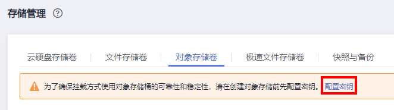

# 使用对象存储卷

## 约束与限制

-   CCE v1.7.3-r8及以下版本集群不支持创建对象存储服务，请参照界面要求创建新版本集群，再使用对象存储服务。
-   目前鲲鹏集群暂时不支持obsfs，无法挂载并行文件系统。
-   存储不支持选择企业项目，新创建的存储卷默认创建到default企业项目下。

## 前提条件

为了确保挂载方式使用对象存储桶的可靠性和稳定性，请在创建对象存储前先配置密钥。

配置密钥操作步骤如下：

1.  登录[CCE控制台](https://console.huaweicloud.com/cce2.0/?utm_source=helpcenter)，单击左侧导航栏的“资源管理 \> 存储管理“。
2.  选择“对象存储卷“页签，单击“配置密钥”。

    **图 1**  配置密钥  
    

3.  根据界面提示，单击，选择密钥文件，再单击“上传”，上传密钥文件。
4.  选择相应的工作负载，单击“重启”即可。

> **须知：** 
>创建OBS对象存储卷时必须使用永久访问密钥（AK/SK），若不上传该密钥文件，Pod会因挂卷失败而导致启动异常或者OBS数据访问异常。
>-   获取永久访问密钥的方法，具体请参见[获取永久访问密钥（AK/SK）](https://support.huaweicloud.com/qs-obs/obs_qs_0005.html)。
>-   管理访问密钥的方法，具体请参见[如何管理访问密钥](https://support.huaweicloud.com/usermanual-ca/ca_01_0003.html)。

## 创建对象存储卷

1.  登录[CCE控制台](https://console.huaweicloud.com/cce2.0/?utm_source=helpcenter)，单击左侧导航栏的“资源管理 \> 存储管理“。
2.  选择“对象存储卷“页签，单击“创建对象存储卷“。
3.  配置如[表1](#table20328123218464)基本信息。

    **表 1**  创建对象存储基本信息配置

    
    <table><thead align="left"><tr id="row533073264618"><th class="cellrowborder" valign="top" width="26%" id="mcps1.2.3.1.1">
参数

    </th>
    <th class="cellrowborder" valign="top" width="74%" id="mcps1.2.3.1.2">
参数说明

    </th>
    </tr>
    </thead>
    <tbody><tr id="row0330113224615"><td class="cellrowborder" valign="top" width="26%" headers="mcps1.2.3.1.1 ">
*PVC名称

    </td>
    <td class="cellrowborder" valign="top" width="74%" headers="mcps1.2.3.1.2 ">
新建PVC的名称，该PVC名称不同于卷名称，实际的卷名称在PVC创建时自动生成。

    
名称长度3~55个字符（不包含前缀），必须由小写字母、数字、中划线（-）组成，且中划线不可位于开头或结尾。

    </td>
    </tr>
    <tr id="row1679320313206"><td class="cellrowborder" valign="top" width="26%" headers="mcps1.2.3.1.1 ">
集群名称

    </td>
    <td class="cellrowborder" valign="top" width="74%" headers="mcps1.2.3.1.2 ">
选择所属集群。

    </td>
    </tr>
    <tr id="row1831531302018"><td class="cellrowborder" valign="top" width="26%" headers="mcps1.2.3.1.1 ">
命名空间

    </td>
    <td class="cellrowborder" valign="top" width="74%" headers="mcps1.2.3.1.2 ">
选择所属命名空间，默认为default。

    </td>
    </tr>
    <tr id="row062985115140"><td class="cellrowborder" valign="top" width="26%" headers="mcps1.2.3.1.1 ">
*实例类型

    </td>
    <td class="cellrowborder" valign="top" width="74%" headers="mcps1.2.3.1.2 ">
在<a href="https://support.huaweicloud.com/obs/index.html" target="_blank" rel="noopener noreferrer">对象存储服务OBS</a>侧对应创建的存储实例类别，可选择如下两种类型：

    <ul id="ul6442121841620"><li>并行文件系统：<strong id="b4192033102513">集群版本在v1.15及以上且Everest插件版本在1.0.2以上时</strong>，支持创建可供obsfs挂载的并行文件系统。详情请参见<a href="https://support.huaweicloud.com/pfsfg-obs/obs_13_0007.html" target="_blank" rel="noopener noreferrer">什么是并行文件系统</a>和<a href="https://support.huaweicloud.com/bestpractice-cce/cce_bestpractice_0137.html" target="_blank" rel="noopener noreferrer">OBS并行文件系统使用指导</a>。</li><li>对象桶：桶（Bucket）是对象存储服务OBS中存储对象的容器。对象存储提供了基于桶和对象的扁平化存储方式，桶中的所有对象都处于同一逻辑层级，去除了文件系统中的多层级树形目录结构。详情请参见<a href="https://support.huaweicloud.com/productdesc-obs/obs_03_0207.html" target="_blank" rel="noopener noreferrer">什么是桶</a>。</li></ul>
    
 说明： 

并行文件系统是OBS（对象存储）经过优化的高性能文件系统，在通过容器挂载方式使用OBS的场景中，<strong id="b361316388306">推荐您使用并行文件系统</strong>，不推荐使用对象桶。

    

    </td>
    </tr>
    <tr id="row20242958195514"><td class="cellrowborder" valign="top" width="26%" headers="mcps1.2.3.1.1 ">
存储类别

    </td>
    <td class="cellrowborder" valign="top" width="74%" headers="mcps1.2.3.1.2 ">
<strong id="b20314152131617">上方实例类型选择“对象桶”时显示该选项。</strong>

    
存储类型即对象存储支持的类别：

    <ul id="ul43583460173158"><li>标准存储：适用于有大量热点文件或小文件，且需要频繁访问（平均一个月多次）并快速获取数据的业务场景。</li><li>低频访问存储：适用于不频繁访问（平均一年少于12次），但需要快速获取数据的业务场景。</li></ul>
    
 须知： 

低频访问存储有额外数据读取费用。 <a href="https://support.huaweicloud.com/pro_price/#obs_detail" target="_blank" rel="noopener noreferrer">了解对象存储服务计费详情</a>

    

    </td>
    </tr>
    <tr id="row1233003234610"><td class="cellrowborder" valign="top" width="26%" headers="mcps1.2.3.1.1 ">
存储策略

    </td>
    <td class="cellrowborder" valign="top" width="74%" headers="mcps1.2.3.1.2 ">
对象存储有如下策略：

    
私有：桶的所有者拥有完全控制权限，其他用户在未经授权的情况下均无访问权限。

    </td>
    </tr>
    <tr id="row11501316111314"><td class="cellrowborder" valign="top" width="26%" headers="mcps1.2.3.1.1 ">
访问模式

    </td>
    <td class="cellrowborder" valign="top" width="74%" headers="mcps1.2.3.1.2 ">
访问模式（AccessModes）是用来对PV进行访问模式的设置，用于描述用户应用对存储资源的访问权限。

    <ul id="ul9888144214446"><li>ReadWriteOnce (RWO)：读写权限，但是该卷只能被单个节点挂载。</li><li>ReadWriteMany (RWX)：读写权限，该卷可以被多个节点同时挂载。</li></ul>
    </td>
    </tr>
    <tr id="row14260114719331"><td class="cellrowborder" valign="top" width="26%" headers="mcps1.2.3.1.1 ">
存储格式

    </td>
    <td class="cellrowborder" valign="top" width="74%" headers="mcps1.2.3.1.2 ">
默认选择CSI。

    
CSI，即Container Storage Interface，容器存储接口机制，用于在Kubernetes和外部存储系统之间建立一套标准的存储管理接口，通过该接口为容器提供存储服务。

    </td>
    </tr>
    </tbody>
    </table>

4.  单击“立即创建”，等待创建成功。

    创建成功后，存储管理列表中会出现已创建的存储。单击PVC名称，进入对象存储服务详情页，可查看到对象存储的基本信息。

## 添加对象存储卷

1.  参照[创建无状态负载\(Deployment\)](创建无状态负载(Deployment).md)、[创建有状态负载\(StatefulSet\)](创建有状态负载(StatefulSet).md)、[创建守护进程集\(DaemonSet\)](创建守护进程集(DaemonSet).md)或[创建普通任务\(Job\)](创建普通任务(Job).md)创建工作负载或普通任务，在添加容器后，展开“数据存储“，选择“云存储“页签下，单击“添加云存储“。
2.  选择存储类型为“对象存储“。

    **表 2**  对象存储参数设置

    
    <table><thead align="left"><tr id="row1123032804112"><th class="cellrowborder" valign="top" width="21%" id="mcps1.2.3.1.1">
参数

    </th>
    <th class="cellrowborder" valign="top" width="79%" id="mcps1.2.3.1.2">
参数说明

    </th>
    </tr>
    </thead>
    <tbody><tr id="row5231428164112"><td class="cellrowborder" valign="top" width="21%" headers="mcps1.2.3.1.1 ">
<strong id="b32913675144031">云存储类型</strong>

    </td>
    <td class="cellrowborder" valign="top" width="79%" headers="mcps1.2.3.1.2 ">
选择“对象存储”。

    
对象存储有标准存储和低频访问存储两个存储类型，主要适用于大数据分析、原生云应用程序数据、静态网站托管、备份/活跃归档等场景。

    </td>
    </tr>
    <tr id="row123122810414"><td class="cellrowborder" colspan="2" valign="top" headers="mcps1.2.3.1.1 mcps1.2.3.1.2 ">
<strong id="b622273216315">分配方式</strong>

    </td>
    </tr>
    <tr id="row02321728174113"><td class="cellrowborder" valign="top" width="21%" headers="mcps1.2.3.1.1 ">
使用已有存储

    </td>
    <td class="cellrowborder" valign="top" width="79%" headers="mcps1.2.3.1.2 ">
云存储名称：选择已创建的存储，您需要提前创建对象存储。

    
子类型：选择的云存储的存储类别，仅为显示用，如标准存储、低频访问存储。

    </td>
    </tr>
    <tr id="row1383163416508"><td class="cellrowborder" valign="top" width="21%" headers="mcps1.2.3.1.1 ">
自动分配存储

    </td>
    <td class="cellrowborder" valign="top" width="79%" headers="mcps1.2.3.1.2 ">
在<a href="https://support.huaweicloud.com/obs/index.html" target="_blank" rel="noopener noreferrer">对象存储服务OBS</a>侧对应创建的存储实例类别，可选择如下两种类型：

    <ul id="ul1518310119519"><li>并行文件系统：<strong id="b9184011105119">集群版本在v1.15及以上且Everest插件版本在1.0.2以上时</strong>，支持创建可供obsfs挂载的并行文件系统。详情请参见<a href="https://support.huaweicloud.com/pfsfg-obs/obs_13_0007.html" target="_blank" rel="noopener noreferrer">什么是并行文件系统</a>和<a href="https://support.huaweicloud.com/bestpractice-cce/cce_bestpractice_0137.html" target="_blank" rel="noopener noreferrer">OBS并行文件系统使用指导</a>。
存储格式：默认为CSI。

    </li><li>对象桶：桶（Bucket）是对象存储服务OBS中存储对象的容器。详情请参见<a href="https://support.huaweicloud.com/productdesc-obs/obs_03_0207.html" target="_blank" rel="noopener noreferrer">什么是桶</a>。
子类型：可选择“标准存储”或“低频访问存储”。

    
存储格式：默认为CSI。

    </li></ul>
    
 说明： 

并行文件系统是OBS（对象存储）经过优化的高性能文件系统，在通过容器挂载方式使用OBS的场景中，<strong id="b1926781565319">推荐您使用并行文件系统</strong>，不推荐使用对象桶。

    

    </td>
    </tr>
    <tr id="row102359282414"><td class="cellrowborder" valign="top" width="21%" headers="mcps1.2.3.1.1 ">
添加容器挂载

    </td>
    <td class="cellrowborder" valign="top" width="79%" headers="mcps1.2.3.1.2 ">
配置如下参数：

    <ol id="ol1295716261782"><li>挂载路径：输入挂载路径，如：/tmp。
数据存储挂载到容器上的路径，请不要挂载在系统目录下，如“<strong id="b1856425415417">/</strong>”、“<strong id="b556495410418">/var/run”</strong>等，会导致容器异常。建议挂载在空目录下，若目录不为空，请确保目录下无影响容器启动的文件，否则文件会被替换，导致容器启动异常，工作负载创建失败。
 须知： 

挂载高危目录的情况下 ，建议使用低权限帐号启动，否则可能会造成宿主机高危文件被破坏。

    

    

    </li><li>设置权限。<ul id="ul1651480165315"><li>只读：只能读容器路径中的数据卷。</li><li>读写：可修改容器路径中的数据卷，容器迁移时新写入的数据不会随之迁移，会造成数据丢失。</li></ul>
    </li></ol>
    
单击“添加容器挂载”可增加多条设置，单击“确定”完成配置。

    </td>
    </tr>
    </tbody>
    </table>

3.  单击“确定“。

## 导入对象存储卷

CCE支持导入已有的对象存储。

1.  登录[CCE控制台](https://console.huaweicloud.com/cce2.0/?utm_source=helpcenter)，单击左侧导航栏的“资源管理 \> 存储管理“，在“对象存储卷“页签下，单击“导入“。
2.  从列表里选择要导入的对象存储。

    > **说明：** 
    >并行文件系统是OBS（对象存储）经过优化的高性能文件系统，在通过容器挂载方式使用OBS的场景中，**推荐您使用并行文件系统**，不推荐使用对象桶。

3.  选择需要导入对象存储的集群名称和命名空间名称。
4.  单击“确定“。

## 解关联对象存储卷

创建对象存储卷成功后，存储卷会自动和当前集群绑定，其它服务也可以使用该存储。解关联后，将和此集群解绑，其它服务仍然可以使用该存储。

若该存储已被工作负载挂载，将无法和集群解关联。

1.  登录[CCE控制台](https://console.huaweicloud.com/cce2.0/?utm_source=helpcenter)，单击左侧导航栏的“资源管理 \> 存储管理“，在对象存储卷列表中，单击对象存储卷后的“解关联“。
2.  查看系统提示，单击“确定“。

## 相关操作

对象存储创建完成后，您还可以执行[表3](#table1619535674020)中的操作。

**表 3**  其他操作

<table><thead align="left"><tr id="row172352321036"><th class="cellrowborder" valign="top" width="32%" id="mcps1.2.3.1.1">
操作

</th>
<th class="cellrowborder" valign="top" width="68%" id="mcps1.2.3.1.2">
说明

</th>
</tr>
</thead>
<tbody><tr id="row182356329317"><td class="cellrowborder" valign="top" width="32%" headers="mcps1.2.3.1.1 ">
删除对象存储

</td>
<td class="cellrowborder" valign="top" width="68%" headers="mcps1.2.3.1.2 "><ol id="ol15235932439"><li>选择需要删除的桶名称，单击操作列的“删除”。</li><li>根据界面提示完成删除操作。</li></ol>
</td>
</tr>
</tbody>
</table>

