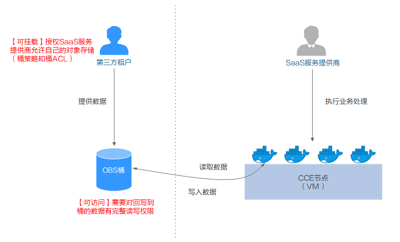

# 使用对象存储卷<a name="cce_01_0160"></a>

CCE支持创建OBS对象存储卷并挂载到容器的某一路径下，对象存储适用于云工作负载、数据分析、内容分析和热点对象等场景。

**图 1**  CCE挂载对象存储卷<a name="fig93521319153910"></a>  


CCE还支持挂载第三方租户的OBS桶，包含OBS并行文件系统（优先）和OBS对象桶，方法请参见[挂载第三方租户的对象存储](https://support.huaweicloud.com/bestpractice-cce/cce_bestpractice_00199.html)。

**图 2**  挂载第三方租户的对象存储<a name="fig1315433183918"></a>  


对象存储提供了三种存储类别：标准存储、低频访问存储、归档存储，从而满足客户业务对存储性能、成本的不同诉求。

-   标准存储：访问时延低和吞吐量高，因而适用于有大量热点文件（平均一个月多次）或小文件（小于1MB），且需要频繁访问数据的业务场景，例如：大数据、移动应用、热点视频、社交图片等场景。
-   低频访问存储：适用于不频繁访问（平均一年少于12次）但在需要时也要求快速访问数据的业务场景，例如：文件同步/共享、企业备份等场景。与标准存储相比，低频访问存储有相同的数据持久性、吞吐量以及访问时延，且成本较低，但是可用性略低于标准存储。
-   归档存储：适用于很少访问（平均一年访问一次）数据的业务场景，例如：数据归档、长期备份等场景。归档存储安全、持久且成本极低，可以用来替代磁带库。为了保持成本低廉，数据取回时间可能长达数分钟到数小时不等。

详情请参见对象存储服务的[产品优势](https://support.huaweicloud.com/productdesc-obs/obs_03_0201.html)。

## 对象存储说明<a name="section85026235402"></a>

-   具备标准Http Restful API接口，用户必须通过编程或第三方工具访问对象存储。
-   数据共享：服务器、嵌入式设备、IOT设备等所有调用相同路径，均可访问共享的对象存储数据。
-   公共/私有网络：对象存储数据允许在公网访问，满足互联网应用需求。
-   容量无限制，性能较高（IO读写时延10ms级），主要面向Web/Mobile、备份/归档、大数据/IOT等场景。
-   适用于（基于OBS界面、OBS工具、OBS SDK等）的一次上传共享多读（ReadOnlyMany）的各种工作负载（Deployment/StatefulSet）和普通任务（Job）使用。

## 准备工作<a name="section14271608324"></a>

为了确保挂载方式使用对象存储桶的可靠性和稳定性，请在创建对象存储前先配置密钥。具体请参见[如何管理访问密钥](https://support.huaweicloud.com/usermanual-ca/ca_01_0003.html)。

## 使用约束<a name="section5807185714121"></a>

-   CCE v1.7.3-r8及以下版本集群不支持创建对象存储服务，请参照界面要求创建新版本集群，再使用对象存储服务。
-   目前鲲鹏集群暂时不支持obsfs，无法挂载并行文件系统。
-   CCE支持容器挂载OBS对象存储，基于s3fs将OBS存储桶作为共享存储挂载到节点上。此方式适用于针对不同大小文件对象的一次保存和多次读取场景，不适用于对已保存文件经常做随机修改的场景。若希望访问性能更高，建议直接使用OBS SDK方式，详细请参考[OBS SDK参考](https://support.huaweicloud.com/sdkreference-obs/obs_02_0001.html)及[s3fs官网描述](https://github.com/s3fs-fuse/s3fs-fuse#limitations)。

    基于s3fs挂载的对象存储桶不能提供与本地文件系统相同的性能或语义，相关限制主要有：

    -   随机写入或添加到文件需要重写整个文件
    -   元数据操作如列出目录会因为网络延迟导致性能较差
    -   最终一致性设计可能临时产生过期数据
    -   没有对文件或目录的原子重命名功能
    -   挂载相同存储桶的多个客户端之间没有相互协调机制
    -   不支持硬链接


## 创建对象存储卷<a name="section1123416794811"></a>

1.  登录[CCE控制台](https://console.huaweicloud.com/cce2.0/?utm_source=helpcenter)，单击左侧导航栏的“资源管理 \> 存储管理“。
2.  选择“对象存储卷“页签，单击“创建对象存储卷“。
3.  配置如[表1](#table20328123218464)基本信息。

    **表 1**  创建对象存储基本信息配置

    <a name="table20328123218464"></a>
    <table><thead align="left"><tr id="row533073264618"><th class="cellrowborder" valign="top" width="26%" id="mcps1.2.3.1.1"><p id="p12330932164617"><a name="p12330932164617"></a><a name="p12330932164617"></a>参数</p>
    </th>
    <th class="cellrowborder" valign="top" width="74%" id="mcps1.2.3.1.2"><p id="p133306326467"><a name="p133306326467"></a><a name="p133306326467"></a>参数说明</p>
    </th>
    </tr>
    </thead>
    <tbody><tr id="row0330113224615"><td class="cellrowborder" valign="top" width="26%" headers="mcps1.2.3.1.1 "><p id="p18330232154618"><a name="p18330232154618"></a><a name="p18330232154618"></a>*PVC名称</p>
    </td>
    <td class="cellrowborder" valign="top" width="74%" headers="mcps1.2.3.1.2 "><p id="p376419205498"><a name="p376419205498"></a><a name="p376419205498"></a>新建PVC的名称，该PVC名称不同于卷名称，实际的卷名称在PVC创建时自动生成。</p>
    <p id="p1963791814146"><a name="p1963791814146"></a><a name="p1963791814146"></a>名称长度3~55个字符（不包含前缀），必须由小写字母、数字、中划线（-）组成，且中划线不可位于开头或结尾。</p>
    </td>
    </tr>
    <tr id="row1679320313206"><td class="cellrowborder" valign="top" width="26%" headers="mcps1.2.3.1.1 "><p id="p20794143102020"><a name="p20794143102020"></a><a name="p20794143102020"></a>集群名称</p>
    </td>
    <td class="cellrowborder" valign="top" width="74%" headers="mcps1.2.3.1.2 "><p id="p18795532202"><a name="p18795532202"></a><a name="p18795532202"></a>选择所属集群。</p>
    </td>
    </tr>
    <tr id="row1831531302018"><td class="cellrowborder" valign="top" width="26%" headers="mcps1.2.3.1.1 "><p id="p9315313132012"><a name="p9315313132012"></a><a name="p9315313132012"></a>命名空间</p>
    </td>
    <td class="cellrowborder" valign="top" width="74%" headers="mcps1.2.3.1.2 "><p id="p103151213162015"><a name="p103151213162015"></a><a name="p103151213162015"></a>选择所属命名空间，默认为default。</p>
    </td>
    </tr>
    <tr id="row062985115140"><td class="cellrowborder" valign="top" width="26%" headers="mcps1.2.3.1.1 "><p id="p26291351111418"><a name="p26291351111418"></a><a name="p26291351111418"></a>*实例类型</p>
    </td>
    <td class="cellrowborder" valign="top" width="74%" headers="mcps1.2.3.1.2 "><p id="p2630135117141"><a name="p2630135117141"></a><a name="p2630135117141"></a>在<a href="https://support.huaweicloud.com/obs/index.html" target="_blank" rel="noopener noreferrer">对象存储服务OBS</a>侧对应创建的存储实例类别：</p>
    <a name="ul6442121841620"></a><a name="ul6442121841620"></a><ul id="ul6442121841620"><li>并行文件系统：<strong id="b4192033102513"><a name="b4192033102513"></a><a name="b4192033102513"></a>集群版本在v1.15及以上且Everest插件版本在1.0.2以上时</strong>，支持创建可供obsfs挂载的并行文件系统。<p id="p1855184271919"><a name="p1855184271919"></a><a name="p1855184271919"></a>并行文件系统（Parallel File System）是对象存储服务（Object Storage Service，OBS）提供的一种经过优化的高性能文件系统，提供毫秒级别访问时延，以及TB/s 级别带宽和百万级别的IOPS，能够快速处理高性能计算（HPC）工作负载。详情请参见<a href="https://support.huaweicloud.com/pfsfg-obs/obs_13_0007.html" target="_blank" rel="noopener noreferrer">什么是并行文件系统</a>。</p>
    </li><li>对象桶：桶（Bucket）是对象存储服务OBS中存储对象的容器。对象存储提供了基于桶和对象的扁平化存储方式，桶中的所有对象都处于同一逻辑层级，去除了文件系统中的多层级树形目录结构。详情请参见<a href="https://support.huaweicloud.com/productdesc-obs/obs_03_0207.html" target="_blank" rel="noopener noreferrer">什么是桶</a>。</li></ul>
    </td>
    </tr>
    <tr id="row20242958195514"><td class="cellrowborder" valign="top" width="26%" headers="mcps1.2.3.1.1 "><p id="p20635941181513"><a name="p20635941181513"></a><a name="p20635941181513"></a>存储类别</p>
    </td>
    <td class="cellrowborder" valign="top" width="74%" headers="mcps1.2.3.1.2 "><p id="p1031415221614"><a name="p1031415221614"></a><a name="p1031415221614"></a><strong id="b20314152131617"><a name="b20314152131617"></a><a name="b20314152131617"></a>上方实例类型选择<span class="uicontrol" id="uicontrol1314172141613"><a name="uicontrol1314172141613"></a><a name="uicontrol1314172141613"></a>“对象桶”</span>时显示该选项。</strong></p>
    <p id="p30952037173155"><a name="p30952037173155"></a><a name="p30952037173155"></a>存储类型即对象存储支持的类别：</p>
    <a name="ul43583460173158"></a><a name="ul43583460173158"></a><ul id="ul43583460173158"><li>标准存储：适用于有大量热点文件或小文件，且需要频繁访问（平均一个月多次）并快速获取数据的业务场景。</li><li>低频访问存储：适用于不频繁访问（平均一年少于12次），但需要快速获取数据的业务场景。</li></ul>
    <div class="notice" id="note10353370173230"><a name="note10353370173230"></a><a name="note10353370173230"></a><span class="noticetitle"> 须知： </span><div class="noticebody"><p id="p26071469173230"><a name="p26071469173230"></a><a name="p26071469173230"></a>低频访问存储有额外数据读取费用。 <a href="https://support.huaweicloud.com/pro_price/#obs_detail" target="_blank" rel="noopener noreferrer">了解对象存储服务计费详情</a></p>
    </div></div>
    </td>
    </tr>
    <tr id="row1233003234610"><td class="cellrowborder" valign="top" width="26%" headers="mcps1.2.3.1.1 "><p id="p833073234615"><a name="p833073234615"></a><a name="p833073234615"></a>存储策略</p>
    </td>
    <td class="cellrowborder" valign="top" width="74%" headers="mcps1.2.3.1.2 "><p id="p20906622172911"><a name="p20906622172911"></a><a name="p20906622172911"></a>对象存储有如下策略：</p>
    <p id="p5264032173524"><a name="p5264032173524"></a><a name="p5264032173524"></a>私有：桶的所有者拥有完全控制权限，其他用户在未经授权的情况下均无访问权限。</p>
    </td>
    </tr>
    <tr id="row11501316111314"><td class="cellrowborder" valign="top" width="26%" headers="mcps1.2.3.1.1 "><p id="p112371055298"><a name="p112371055298"></a><a name="p112371055298"></a>访问模式</p>
    </td>
    <td class="cellrowborder" valign="top" width="74%" headers="mcps1.2.3.1.2 "><p id="p3231132814432"><a name="p3231132814432"></a><a name="p3231132814432"></a>访问模式（AccessModes）是用来对PV进行访问模式的设置，用于描述用户应用对存储资源的访问权限。</p>
    <a name="ul9888144214446"></a><a name="ul9888144214446"></a><ul id="ul9888144214446"><li>ReadWriteOnce (RWO)：读写权限，但是该卷只能被单个节点挂载。</li><li>ReadWriteMany (RWX)：读写权限，该卷可以被多个节点同时挂载。</li></ul>
    </td>
    </tr>
    <tr id="row14260114719331"><td class="cellrowborder" valign="top" width="26%" headers="mcps1.2.3.1.1 "><p id="p10260747193315"><a name="p10260747193315"></a><a name="p10260747193315"></a>存储格式</p>
    </td>
    <td class="cellrowborder" valign="top" width="74%" headers="mcps1.2.3.1.2 "><p id="p411413436364"><a name="p411413436364"></a><a name="p411413436364"></a>默认选择CSI。</p>
    <p id="p726054783312"><a name="p726054783312"></a><a name="p726054783312"></a>CSI，即Container Storage Interface，容器存储接口机制，用于在Kubernetes和外部存储系统之间建立一套标准的存储管理接口，通过该接口为容器提供存储服务。</p>
    </td>
    </tr>
    </tbody>
    </table>

4.  单击“立即创建”，等待创建成功。

    创建成功后，存储管理列表中会出现已创建的存储。单击PVC名称，进入对象存储服务详情页，可查看到对象存储的基本信息。


## 使用对象存储卷<a name="section6654427155518"></a>

1.  参照[创建无状态负载\(Deployment\)](创建无状态负载(Deployment).md)、[创建有状态负载\(StatefulSet\)](创建有状态负载(StatefulSet).md)、[创建守护进程集\(DaemonSet\)](创建守护进程集(DaemonSet).md)或[创建普通任务\(Job\)](创建普通任务(Job).md)创建工作负载或普通任务，在添加容器后，展开“数据存储“，选择“云存储“页签下，单击“添加云存储“。
2.  选择存储类型为“对象存储“。

    **表 2**  对象存储参数设置

    <a name="table92361828184111"></a>
    <table><thead align="left"><tr id="row1123032804112"><th class="cellrowborder" valign="top" width="21%" id="mcps1.2.3.1.1"><p id="p172302282414"><a name="p172302282414"></a><a name="p172302282414"></a>参数</p>
    </th>
    <th class="cellrowborder" valign="top" width="79%" id="mcps1.2.3.1.2"><p id="p3230828194110"><a name="p3230828194110"></a><a name="p3230828194110"></a>参数说明</p>
    </th>
    </tr>
    </thead>
    <tbody><tr id="row5231428164112"><td class="cellrowborder" valign="top" width="21%" headers="mcps1.2.3.1.1 "><p id="p1823022810419"><a name="p1823022810419"></a><a name="p1823022810419"></a><strong id="b32913675144031"><a name="b32913675144031"></a><a name="b32913675144031"></a>云存储类型</strong></p>
    </td>
    <td class="cellrowborder" valign="top" width="79%" headers="mcps1.2.3.1.2 "><p id="p74221416164218"><a name="p74221416164218"></a><a name="p74221416164218"></a>选择<span class="uicontrol" id="uicontrol12201928174216"><a name="uicontrol12201928174216"></a><a name="uicontrol12201928174216"></a>“对象存储”</span>。</p>
    <p id="p7613837185517"><a name="p7613837185517"></a><a name="p7613837185517"></a>对象存储有标准存储和低频访问存储两个存储类型，主要适用于大数据分析、原生云应用程序数据、静态网站托管、备份/活跃归档等场景。</p>
    </td>
    </tr>
    <tr id="row123122810414"><td class="cellrowborder" colspan="2" valign="top" headers="mcps1.2.3.1.1 mcps1.2.3.1.2 "><p id="p11231112813414"><a name="p11231112813414"></a><a name="p11231112813414"></a><strong id="b622273216315"><a name="b622273216315"></a><a name="b622273216315"></a>分配方式</strong></p>
    </td>
    </tr>
    <tr id="row02321728174113"><td class="cellrowborder" valign="top" width="21%" headers="mcps1.2.3.1.1 "><p id="p11231528124119"><a name="p11231528124119"></a><a name="p11231528124119"></a>使用已有存储</p>
    </td>
    <td class="cellrowborder" valign="top" width="79%" headers="mcps1.2.3.1.2 "><p id="p323192813419"><a name="p323192813419"></a><a name="p323192813419"></a>云存储名称：选择已创建的存储，您需要提前创建对象存储。</p>
    <p id="p1985188124412"><a name="p1985188124412"></a><a name="p1985188124412"></a>子类型：选择的云存储的存储类别，仅为显示用，如标准存储、低频访问存储。</p>
    </td>
    </tr>
    <tr id="row1383163416508"><td class="cellrowborder" valign="top" width="21%" headers="mcps1.2.3.1.1 "><p id="p17832113415502"><a name="p17832113415502"></a><a name="p17832113415502"></a>自动分配存储</p>
    </td>
    <td class="cellrowborder" valign="top" width="79%" headers="mcps1.2.3.1.2 "><p id="p7183151125111"><a name="p7183151125111"></a><a name="p7183151125111"></a>在<a href="https://support.huaweicloud.com/obs/index.html" target="_blank" rel="noopener noreferrer">对象存储服务OBS</a>侧对应创建的存储实例类别：</p>
    <a name="ul1518310119519"></a><a name="ul1518310119519"></a><ul id="ul1518310119519"><li>并行文件系统：<strong id="b9184011105119"><a name="b9184011105119"></a><a name="b9184011105119"></a>集群版本在v1.15及以上且Everest插件版本在1.0.2以上时</strong>，支持创建可供obsfs挂载的并行文件系统。详情请参见<a href="https://support.huaweicloud.com/pfsfg-obs/obs_13_0007.html" target="_blank" rel="noopener noreferrer">什么是并行文件系统</a>。<p id="p1728374713519"><a name="p1728374713519"></a><a name="p1728374713519"></a>存储格式：默认为CSI。</p>
    </li><li>对象桶：桶（Bucket）是对象存储服务OBS中存储对象的容器。详情请参见<a href="https://support.huaweicloud.com/productdesc-obs/obs_03_0207.html" target="_blank" rel="noopener noreferrer">什么是桶</a>。<p id="p18709722614"><a name="p18709722614"></a><a name="p18709722614"></a>子类型：可选择<span class="uicontrol" id="uicontrol11442945115713"><a name="uicontrol11442945115713"></a><a name="uicontrol11442945115713"></a>“标准存储”</span>或<span class="uicontrol" id="uicontrol7266749185712"><a name="uicontrol7266749185712"></a><a name="uicontrol7266749185712"></a>“低频访问存储”</span>。</p>
    <p id="p1430741012613"><a name="p1430741012613"></a><a name="p1430741012613"></a>存储格式：默认为CSI。</p>
    </li></ul>
    </td>
    </tr>
    <tr id="row102359282414"><td class="cellrowborder" valign="top" width="21%" headers="mcps1.2.3.1.1 "><p id="p823452811412"><a name="p823452811412"></a><a name="p823452811412"></a>添加容器挂载</p>
    </td>
    <td class="cellrowborder" valign="top" width="79%" headers="mcps1.2.3.1.2 "><p id="p4174161519591"><a name="p4174161519591"></a><a name="p4174161519591"></a>配置如下参数：</p>
    <a name="ol1295716261782"></a><a name="ol1295716261782"></a><ol id="ol1295716261782"><li>挂载路径：输入挂在路径，如：/tmp。<div class="p" id="p45501641058"><a name="p45501641058"></a><a name="p45501641058"></a>数据存储挂载到容器上的路径，请不要挂载在系统目录下，如“<strong id="b1856425415417"><a name="b1856425415417"></a><a name="b1856425415417"></a>/</strong>”、“<strong id="b556495410418"><a name="b556495410418"></a><a name="b556495410418"></a>/var/run”</strong>等，会导致容器异常。建议挂载在空目录下，若目录不为空，请确保目录下无影响容器启动的文件，否则文件会被替换，导致容器启动异常，工作负载创建失败。<div class="notice" id="note8564354147"><a name="note8564354147"></a><a name="note8564354147"></a><span class="noticetitle"> 须知： </span><div class="noticebody"><p id="p85554241956"><a name="p85554241956"></a><a name="p85554241956"></a>挂载高危目录的情况下 ，建议使用低权限帐号启动，否则可能会造成宿主机高危文件被破坏。</p>
    </div></div>
    </div>
    </li><li>设置权限。<a name="ul1651480165315"></a><a name="ul1651480165315"></a><ul id="ul1651480165315"><li>只读：只能读容器路径中的数据卷。</li><li>读写：可修改容器路径中的数据卷，容器迁移时新写入的数据不会随之迁移，会造成数据丢失。</li></ul>
    </li></ol>
    <p id="p165839491213"><a name="p165839491213"></a><a name="p165839491213"></a>单击<span class="uicontrol" id="uicontrol14826429075"><a name="uicontrol14826429075"></a><a name="uicontrol14826429075"></a>“添加容器挂载”</span>可增加多条设置，单击<span class="uicontrol" id="uicontrol1057018318418"><a name="uicontrol1057018318418"></a><a name="uicontrol1057018318418"></a>“确定”</span>完成配置。</p>
    </td>
    </tr>
    </tbody>
    </table>

3.  单击“确定“。

## 导入对象存储卷<a name="section1435941819190"></a>

CCE支持导入已有的对象存储。

1.  登录[CCE控制台](https://console.huaweicloud.com/cce2.0/?utm_source=helpcenter)，单击左侧导航栏的“资源管理 \> 存储管理“，在“对象存储卷“页签下，单击“导入“。
2.  从列表里选择要导入的对象存储。
3.  选择需要导入对象存储的集群名称和命名空间名称。
4.  单击“确定“。

## 解关联对象存储卷<a name="section1818108834"></a>

创建对象存储卷成功后，存储卷会自动和当前集群绑定，其它服务也可以使用该存储。解关联后，将和此集群解绑，其它服务仍然可以使用该存储。

若该存储已被工作负载挂载，将无法和集群解关联。

1.  登录[CCE控制台](https://console.huaweicloud.com/cce2.0/?utm_source=helpcenter)，单击左侧导航栏的“资源管理 \> 存储管理“，在对象存储卷存储卷列表中，单击对象存储卷后的“解关联“。
2.  查看系统提示，单击“确定“。

## 使用已有对象存储创建PVC<a name="section12537193613245"></a>

CCE支持使用已有的对象存储来创建PersistentVolume，并通过创建对应PersistentVolumeClaim绑定当前PersistentVolume使用。

1.  登录OBS控制台，创建对象存储桶，记录桶名称和存储类型。
2.  请参见[通过kubectl或web-terminal插件连接CCE集群](通过kubectl或web-terminal插件连接CCE集群.md)配置kubectl命令。
3.  新建一个文件，用于创建PV，假设文件名为**pv-obs-example.yaml。**

    **touch pv-obs-example.yaml**

    **vi pv-obs-example.yaml**

    -   **1.15版本集群的yaml配置文件配置示例：**

        ```
        apiVersion: v1
        kind: PersistentVolume
        metadata:
          name: pv-obs-example
          annotations:
            pv.kubernetes.io/provisioned-by: everest-csi-provisioner
        spec:
          accessModes:
          - ReadWriteMany
          capacity:
            storage: 1Gi
          csi:
            driver: obs.csi.everest.io
            fsType: s3fs
            volumeAttributes:
              everest.io/obs-volume-type: STANDARD
              everest.io/region: cn-north-7
              storage.kubernetes.io/csiProvisionerIdentity: everest-csi-provisioner
            volumeHandle: obs-normal-static-pv
          persistentVolumeReclaimPolicy: Delete
          storageClassName: csi-obs
        ```

        其中：

        -   driver：挂载依赖的存储驱动，对象存储配置为“obs.csi.everest.io”。
        -   everest.io/obs-volume-type：存储类型，包括STANDARD（标准桶）、WARM（低频访问桶）。
        -   everest.io/region：对象存储所在的region。具体请参见[地区和终端节点](https://developer.huaweicloud.com/endpoint)。
        -   volumeHandle：对象存储的桶名称。

            获取方法：在CCE控制台中，单击左侧栏目树中的“资源管理-存储管理“，在“对象存储卷“页签下单击PVC的名称，在PVC详情页的“PV详情“页签下复制“PV名称“后的内容即可。

        -   storage：存储容量，单位为Gi。此处配置为固定值1Gi。
        -   storageClassName：k8s storage class名称；需配置为"csi-obs”。
        -   fsType：文件类型，支持“obsfs”与“s3fs”,取值为s3fs时创建是obs对象桶，配套使用s3fs挂载；取值为obsfs时创建的是obs并行文件系统，配套使用obsfs挂载，推荐使用。

    -   **1.11及1.13版本集群的yaml文件配置示例：**

        ```
        apiVersion: v1 
        kind: PersistentVolume 
        metadata: 
          name: pv-obs-example 
          annotations:
            pv.kubernetes.io/provisioned-by: flexvolume-huawei.com/fuxiobs
        spec: 
          accessModes: 
          - ReadWriteMany 
          capacity: 
            storage: 1Gi 
          flexVolume: 
            driver: huawei.com/fuxiobs 
            fsType: obs 
            options: 
              fsType: obs 
              region: cn-north-1 
              storage_class: STANDARD 
              volumeID: test-obs 
          persistentVolumeReclaimPolicy: Delete 
          storageClassName: obs-standard
        ```

        其中：

        -   driver：挂载依赖的存储驱动，对象存储配置为“huawei.com/fuxiobs”。
        -   storage\_class：存储类型，包括STANDARD（标准桶）、STANDARD\_IA（低频访问桶）。
        -   region：对象存储所在的region。具体请参见[地区和终端节点](https://developer.huaweicloud.com/endpoint)。
        -   volumeID：对象存储的桶名称。

            获取方法：在CCE控制台中，单击左侧栏目树中的“资源管理-存储管理“，在“对象存储卷“页签下单击PVC的名称，在PVC详情页的“PV详情“页签下复制“PV名称“后的内容即可。

        -   storage：存储容量，单位为Gi。此处配置为固定值1Gi。
        -   storageClassName：对象存储支持的存储类型，包括obs-standard（标准）、obs-standard-ia（低频）。

    -   **1.9版本集群的yaml文件配置示例：**

        ```
        apiVersion: v1 
        kind: PersistentVolume 
        metadata: 
          name: pv-obs-example 
          namespace: default  
        spec: 
          accessModes: 
          - ReadWriteMany 
          capacity: 
            storage: 1Gi 
          flexVolume: 
            driver: huawei.com/fuxiobs 
            fsType: obs 
            options: 
              fsType: obs 
              kubernetes.io/namespace: default 
              region: cn-north-1 
              storage_class: STANDARD 
              volumeID: test-obs 
          persistentVolumeReclaimPolicy: Delete 
          storageClassName: obs-standard
        ```

        其中：

        -   driver：挂载依赖的存储驱动，对象存储配置为“huawei.com/fuxiobs”。
        -   storage\_class：存储类型，包括STANDARD（标准桶）、STANDARD\_IA（低频访问桶）。
        -   region：对象存储所在的region。具体请参见[地区和终端节点](https://developer.huaweicloud.com/endpoint)。
        -   volumeID：对象存储的桶名称。

            获取方法：在CCE控制台中，单击左侧栏目树中的“资源管理-存储管理“，在“对象存储卷“页签下单击PVC的名称，在PVC详情页的“PV详情“页签下复制“PV名称“后的内容即可。

        -   storage：存储容量，单位为Gi。此处配置为固定值1Gi。
        -   storageClassName：对象存储支持的存储类型，包括obs-standard（标准）、obs-standard-ia（低频）。

4.  创建PV。

    **kubectl create -f pv-obs-example.yaml**

5.  创建一个yaml文件，用于创建PVC。假设文件名为**pvc-obs-example.yaml**  。

    **touch pvc-obs-example.yaml**

    **vi pvc-obs-example.yaml**

    -   **1.15版本集群的yaml文件配置示例：**

        ```
        apiVersion: v1
        kind: PersistentVolumeClaim
        metadata:
          annotations:
            volume.beta.kubernetes.io/storage-provisioner: everest-csi-provisioner
            everest.io/obs-volume-type: STANDARD
            csi.storage.k8s.io/fstype: s3fs
          name: pvc-obs-example
          namespace: default
        spec:
          accessModes:
          - ReadWriteMany
          resources:
            requests:
              storage: 1Gi
          storageClassName: csi-obs
          volumeName: pv-obs-example
        ```

        其中：

        -   volumeName：PV的名称。
        -   storage：存储容量，单位为Gi。此处配置为固定值1Gi，必须和已有pv的storage大小保持一致。
        -   storageClassName：k8s storage class名称；需配置为"csi-obs”。
        -   everest.io/obs-volume-type：obs存储类型；当前支持标准（STANDARD）和低频（WARM）两种存储类型。
        -   csi.storage.k8s.io/fstype：指定文件类型，支持“obsfs”与“s3fs”。取值为s3fs时说明使用的obs对象桶，配套使用s3fs挂载；取值为obsfs时说明使用的是obs并行文件系统，配套使用obsfs挂载。

    -   **1.11及1.13版本集群的yaml文件配置示例：**

        ```
        apiVersion: v1
        kind: PersistentVolumeClaim
        metadata:
          annotations:
            volume.beta.kubernetes.io/storage-class: obs-standard
            volume.beta.kubernetes.io/storage-provisioner: flexvolume-huawei.com/fuxiobs
          name: pvc-obs-example
          namespace: default
        spec:
          accessModes:
          - ReadWriteMany
          resources:
            requests:
              storage: 1Gi
          volumeName: pv-obs-example
        ```

        其中：

        -   volume.beta.kubernetes.io/storage-class：对象存储支持的存储类型，包括obs-standard、obs-standard-ia。
        -   volume.beta.kubernetes.io/storage-provisioner：必须使用flexvolume-huawei.com/fuxiobs。
        -   volumeName：PV的名称。
        -   storage：存储容量，单位为Gi。此处配置为固定值1Gi。

    -   **1.9版本集群的yaml文件配置示例：**

        ```
        apiVersion: v1
        kind: PersistentVolumeClaim
        metadata:
          annotations:
            volume.beta.kubernetes.io/storage-class: obs-standard
            volume.beta.kubernetes.io/storage-provisioner: flexvolume-huawei.com/fuxiobs
          name: pvc-obs-example
          namespace: default
        spec:
          accessModes:
          - ReadWriteMany
          resources:
            requests:
              storage: 1Gi
          volumeName: pv-obs-example
          volumeNamespace: default
        ```

        其中：

        -   volume.beta.kubernetes.io/storage-class：对象存储支持的存储类型，包括obs-standard、obs-standard-ia。
        -   volume.beta.kubernetes.io/storage-provisioner：必须使用flexvolume-huawei.com/fuxiobs。
        -   volumeName：PV的名称。
        -   storage：存储容量，单位为Gi。此处配置为固定值1Gi。

6.  创建PVC。

    **kubectl create -f pvc-obs-example.yaml**


## 使用已有PVC创建有状态工作负载<a name="section597215211139"></a>

CCE支持使用已有的对象存储卷（PersistentVolumeClaim），创建有状态工作负载（StatefulSet）**。**

1.  参照[创建对象存储卷](#section1123416794811)中操作创建对象存储卷，并获取PVC名称。
2.  请参见[通过kubectl或web-terminal插件连接CCE集群](通过kubectl或web-terminal插件连接CCE集群.md)配置kubectl命令。
3.  新建一个PVC文件，用于创建工作负载。假设文件名为**obs-statefulset-example.yaml**。

    **touch obs-statefulset-example.yaml**

    **vi obs-statefulset-example.yaml**

    配置示例：

    ```
    apiVersion: apps/v1
    kind: StatefulSet
    metadata:
      name: obs-statefulset-example
      namespace: default
    spec:
      podManagementPolicy: OrderedReady
      replicas: 1
      revisionHistoryLimit: 10
      selector:
        matchLabels:
          app: obs-statefulset-example
      serviceName: qwqq
      template:
        metadata:
          annotations:
            metrics.alpha.kubernetes.io/custom-endpoints: '[{"api":"","path":"","port":"","names":""}]'
            pod.alpha.kubernetes.io/initialized: "true"
          creationTimestamp: null
          labels:
            app: obs-statefulset-example
        spec:
          affinity: {}
          containers:	
          - env:
            - name: PAAS_APP_NAME
              value: obs-statefulset-example
            - name: PAAS_NAMESPACE
              value: default
            - name: PAAS_PROJECT_ID
              value: b7bb7d77a2974a8fa8985cbfb63f23c0
            image: nginx:latest
            imagePullPolicy: Always
            name: container-0
            resources: {}
            terminationMessagePath: /dev/termination-log
            terminationMessagePolicy: File
            volumeMounts:
            - mountPath: /tmp
              name: pvc-obs-example
          dnsPolicy: ClusterFirst
          imagePullSecrets:
          - name: default-secret
          restartPolicy: Always
          schedulerName: default-scheduler
          securityContext: {}
          terminationGracePeriodSeconds: 30
          volumes:
            - name: pvc-obs-example
              persistentVolumeClaim:
                claimName: cce-obs-demo
          tolerations:
          - effect: NoExecute
            key: node.kubernetes.io/not-ready
            operator: Exists
            tolerationSeconds: 300
          - effect: NoExecute
            key: node.kubernetes.io/unreachable
            operator: Exists
            tolerationSeconds: 300
      updateStrategy:
        type: RollingUpdate
    ```

    其中：

    -   spec.template.spec.containers.volumeMounts.name和spec.template.spec.volumes.name有映射关系，必须保持一致。
    -   replicas：实例数。
    -   name：新建工作负载的名称。
    -   image：新建工作负载使用的镜像。
    -   mountPath：容器内挂载路径。
    -   serviceName：工作负载对应的服务，服务创建过程请参见[创建有状态负载\(StatefulSet\)](创建有状态负载(StatefulSet).md)。
    -   claimName：已有PVC名称。

4.  创建有状态工作负载。

    **kubectl create -f obs-statefulset-example.yaml**


## 相关操作<a name="section359413445405"></a>

对象存储创建完成后，您还可以执行[表3](#table1619535674020)中的操作。

**表 3**  其他操作

<a name="table1619535674020"></a>
<table><thead align="left"><tr id="row172352321036"><th class="cellrowborder" valign="top" width="32%" id="mcps1.2.3.1.1"><p id="p1423523214310"><a name="p1423523214310"></a><a name="p1423523214310"></a>操作</p>
</th>
<th class="cellrowborder" valign="top" width="68%" id="mcps1.2.3.1.2"><p id="p20235132536"><a name="p20235132536"></a><a name="p20235132536"></a>说明</p>
</th>
</tr>
</thead>
<tbody><tr id="row182356329317"><td class="cellrowborder" valign="top" width="32%" headers="mcps1.2.3.1.1 "><p id="p723583214310"><a name="p723583214310"></a><a name="p723583214310"></a>删除对象存储</p>
</td>
<td class="cellrowborder" valign="top" width="68%" headers="mcps1.2.3.1.2 "><a name="ol15235932439"></a><a name="ol15235932439"></a><ol id="ol15235932439"><li>选择需要删除的桶名称，单击操作列的“删除”。</li><li>根据界面提示完成删除操作。</li></ol>
</td>
</tr>
</tbody>
</table>

## 使用kubectl创建对象存储<a name="section102883211413"></a>

动态使用OBS云硬盘可以自动创建并挂载所期望的OBS对象存储，目前支持标准、低频两种类型的桶，分别对应obs-standard、obs-standard-ia。

1.  请参见[通过kubectl或web-terminal插件连接CCE集群](通过kubectl或web-terminal插件连接CCE集群.md)连接集群配置kubectl命令。
2.  执行如下命令，配置名为“pvc-obs-auto-example.yaml”的创建PVC的yaml文件。

    **_touch pvc-obs-auto-example.yaml_**

    **_vi pvc-obs-auto-example.yaml_**

    **1.15集群版本示例如下：**

    ```
    apiVersion: v1
    kind: PersistentVolumeClaim
    metadata:
      annotations:
        everest.io/obs-volume-type: STANDARD
        csi.storage.k8s.io/fstype: s3fs
      name: obs-warm-provision-pvc
      namespace: default
    spec:
      accessModes:
      - ReadWriteMany
      resources:
        requests:
          storage: 1Gi
      storageClassName: csi-obs
    ```

    其中：

    -   everest.io/obs-volume-type：桶类型，当前支持标准（STANDARD）和低频（WARM）两种桶。
    -   name：创建的PVC名称。
    -   storage：存储容量，单位为Gi，对OBS桶来说，此处仅为校验需要（不能为空和0），设置的大小不起作用，此处设定为固定值1Gi。
    -   csi.storage.k8s.io/fstype：文件类型，支持“obsfs”与“s3fs”,取值为s3fs时创建是obs对象桶，配套使用s3fs挂载；取值为obsfs时创建的是obs并行文件系统，配套使用obsfs挂载，推荐使用。

    **1.13及之前集群版本示例如下：**

    ```
    apiVersion: v1 
    kind: PersistentVolumeClaim 
    metadata: 
      annotations: 
        volume.beta.kubernetes.io/storage-class: obs-standard                         # 对象存储桶类型，当前支持标准（obs-standard）和低频（obs-standard-ia）
    
      name: pvc-obs-auto-example                                                      # PVC名称
      namespace: default 
    spec: 
      accessModes: 
      - ReadWriteMany 
      resources: 
        requests: 
          storage: 1Gi              # 存储容量，单位为Gi，对OBS桶来说，此处仅为校验需要（不能为空和0），设置的大小不起作用，此处设定为固定值1Gi
    ```

    其中：

    -   volume.beta.kubernetes.io/storage-class：桶类型，当前支持标准（obs-standard）和低频（obs-standard-ia）两种桶。
    -   name：创建的PVC名称。
    -   storage：存储容量，单位为Gi，对OBS桶来说，此处仅为校验需要（不能为空和0），设置的大小不起作用，此处设定为固定值1Gi。

3.  执行如下命令创建PVC。

    **kubectl create -f pvc-obs-auto-example.yaml**

    命令执行完成后会在集群所在VPC内创建一个对象存储桶，您可以在“存储管理 \> 对象存储卷“中单击桶名称查看该桶，也可以在OBS的控制台中查看该桶。


## 使用kubectl部署使用对象存储卷的工作负载<a name="section83940541116"></a>

1.  执行如下命令，配置名为“obs-pod-example.yaml“的创建Pod的yaml文件。

    **touch obs-pod-example.yaml**

    **vi obs-pod-example.yaml**

    在无状态工作负载中基于pvc共享式使用对象存储示例：

    ```
    apiVersion: extensions/v1beta1 
    kind: Deployment 
    metadata: 
      name: obs-pod-example                        # 工作负载名称
      namespace: default 
    spec: 
      replicas: 1 
      selector: 
        matchLabels: 
          app: obs-pod-example 
      template: 
        metadata: 
          labels: 
            app: obs-pod-example 
        spec: 
          containers: 
          - image: nginx 
            name: container-0 
            volumeMounts: 
            - mountPath: /tmp                       # 挂载路径
              name: pvc-obs-example 
          restartPolicy: Always 
          volumes: 
          - name: pvc-obs-example  
            persistentVolumeClaim: 
              claimName: pvc-obs-auto-example       # PVC名称
    ```

    其中：

    -   name：创建的Pod名称。
    -   app：Pod工作负载名称。
    -   mountPath：容器内挂载路径。
    -   “spec.template.spec.containers.volumeMounts.name”和 “spec.template.spec.volumes.name”有映射关系，必须保持一致。

    在有状态工作负载中基于PVCTemplate独占式使用对象存储

    **1.13及之前版本示例：**

    ```
    apiVersion: apps/v1
    kind: StatefulSet
    
    metadata:
      name: deploy-obs-standard-in
      namespace: default
      generation: 1
      labels:
        appgroup: ''
      annotations:
        container.io/container-0: https://console.huaweicloud.com/swr/dockerimage/nginx.png
        description: ''
    spec:
      replicas: 1
      selector:
        matchLabels:
          app: deploy-obs-standard-in
      template:
        metadata:
          labels:
            app: deploy-obs-standard-in
          annotations:
            metrics.alpha.kubernetes.io/custom-endpoints: '[{"api":"","path":"","port":"","names":""}]'
            pod.alpha.kubernetes.io/initialized: 'true'
        spec:
          containers:
            - name: container-0
              image: 'nginx:1.12-alpine-perl'
              env:
                - name: PAAS_APP_NAME
                  value: deploy-obs-standard-in
                - name: PAAS_NAMESPACE
                  value: default
                - name: PAAS_PROJECT_ID
                  value: a2cd8e998dca42e98a41f596c636dbda
              resources: {}
              volumeMounts:
                - name: obs-bs-standard-mountoptionpvc
                  mountPath: /tmp
              terminationMessagePath: /dev/termination-log
              terminationMessagePolicy: File
              imagePullPolicy: IfNotPresent
          restartPolicy: Always
          terminationGracePeriodSeconds: 30
          dnsPolicy: ClusterFirst
          securityContext: {}
          imagePullSecrets:
            - name: default-secret
          affinity: {}
          schedulerName: default-scheduler
      volumeClaimTemplates:
        - metadata:
            name: obs-bs-standard-mountoptionpvc
            annotations:
              volume.beta.kubernetes.io/storage-class: obs-standard
              volume.beta.kubernetes.io/storage-provisioner: flexvolume-huawei.com/fuxiobs
    
          spec:
            accessModes:
              - ReadWriteMany
            resources:
              requests:
                storage: 1Gi
      serviceName: wwww
      podManagementPolicy: OrderedReady
      updateStrategy:
        type: RollingUpdate
      revisionHistoryLimit: 10
    ```

    其中：

    -   name：创建的工作负载名称。
    -   image：工作负载的镜像。
    -   mountPath：容器内挂载路径，示例中挂载到“/tmp“路径。

    -   serviceName：工作负载对应的服务，服务创建过程请参见[创建有状态负载\(StatefulSet\)](创建有状态负载(StatefulSet).md)。
    -   “spec.template.spec.containers.volumeMounts.name ”和 “spec.volumeClaimTemplates.metadata.name”有映射关系，必须保持一致。

    **1.15集群版本yaml示例：**

    ```
    apiVersion: apps/v1
    kind: StatefulSet
    metadata:
      name: deploy-obs-standard-in
      namespace: default
      generation: 1
      labels:
        appgroup: ''
      annotations:
        container.io/container-0: https://console.huaweicloud.com/swr/dockerimage/nginx.png
        description: ''
    spec:
      replicas: 1
      selector:
        matchLabels:
          app: deploy-obs-standard-in
      template:
        metadata:
          labels:
            app: deploy-obs-standard-in
          annotations:
            metrics.alpha.kubernetes.io/custom-endpoints: '[{"api":"","path":"","port":"","names":""}]'
            pod.alpha.kubernetes.io/initialized: 'true'
        spec:
          containers:
            - name: container-0
              image: 'nginx:1.12-alpine-perl'
              env:
                - name: PAAS_APP_NAME
                  value: deploy-obs-standard-in
                - name: PAAS_NAMESPACE
                  value: default
                - name: PAAS_PROJECT_ID
                  value: a2cd8e998dca42e98a41f596c636dbda
              resources: {}
              volumeMounts:
                - name: obs-bs-standard-mountoptionpvc
                  mountPath: /tmp
              terminationMessagePath: /dev/termination-log
              terminationMessagePolicy: File
              imagePullPolicy: IfNotPresent
          restartPolicy: Always
          terminationGracePeriodSeconds: 30
          dnsPolicy: ClusterFirst
          securityContext: {}
          imagePullSecrets:
            - name: default-secret
          affinity: {}
          schedulerName: default-scheduler
      volumeClaimTemplates:
        - metadata:
            name: obs-bs-standard-mountoptionpvc
            namespace: default
            annotations:
              everest.io/obs-volume-type: STANDARD
          spec:
            accessModes:
              - ReadWriteMany
            resources:
              requests:
                storage: 1Gi
            storageClassName: csi-obs
      serviceName: wwww
      podManagementPolicy: OrderedReady
      updateStrategy:
        type: RollingUpdate
      revisionHistoryLimit: 10
    ```

    其中:

    -   name：创建的工作负载名称。
    -   image：工作负载的镜像。
    -   mountPath：容器内挂载路径，示例中挂载到“/tmp“路径。

    -   serviceName：工作负载对应的服务，服务创建过程请参见[创建有状态负载\(StatefulSet\)](创建有状态负载(StatefulSet).md)。
    -   “spec.template.spec.containers.volumeMounts.name ”和 “spec.volumeClaimTemplates.metadata.name”有映射关系，必须保持一致。

2.  执行如下命令创建Pod。

    **kubectl create -f obs-pod-example.yaml**

    创建完成后，在CCE界面“存储管理 \> 对象存储卷”中单击PVC名称，在PVC详情页面可查看对象存储服务和PVC的绑定关系。


