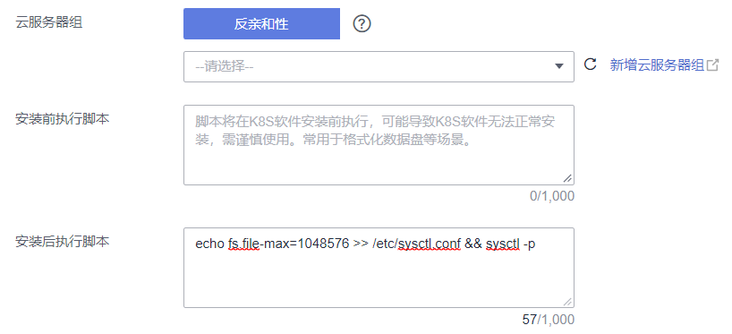

# 修改最大文件句柄数<a name="cce_10_0411"></a>

最大文件句柄数即打开文件数的最大限制，Linux系统中包含两个文件句柄限制：一个是系统级的，即所有用户的进程同时打开文件数的上限；一种是用户级的，即单个用户进程打开文件数的上限。但是在容器中，还有另一个文件句柄限制，即容器内部单进程最大文件句柄数。

> **须知：** 
>修改节点系统参数的命令仅在使用公共镜像时有效，使用私有镜像时本文中提供的命令仅供参考。

## 修改节点系统级最大文件句柄数<a name="section156844286910"></a>

1.  登录节点，查看/etc/sysctl.conf文件。

    ```
    cat /etc/sysctl.conf
    ```

2.  修改fs.file-max参数，**fs.file-max=1048576**为内核参数名称及建议取值。
    -   若查看sysctl.conf文件时，文件中已设置fs.file-max值，可通过以下命令进行修改。

        ```
        sed -i "s/fs.file-max=[0-9]*$/fs.file-max=1048576/g" /etc/sysctl.conf && sysctl -p
        ```

    -   若查看sysctl.conf文件时，文件中还未设置fs.file-max值，可通过以下命令添加。

        ```
        echo fs.file-max=1048576 >> /etc/sysctl.conf && sysctl -p
        ```

3.  执行以下命令检查是否修改成功，当返回与修改值一致时说明修改正确。

    ```
    # sysctl fs.file-max
    fs.file-max = 1048576
    ```


## 修改节点单进程最大文件句柄数<a name="section57532291011"></a>

1.  登录节点，查看/etc/security/limits.conf文件。

    ```
    cat /etc/security/limits.conf
    ```

    节点单进程最大文件句柄数通过以下参数设置：

    ```
    ...
    root soft nofile 65535
    root hard nofile 65535
    * soft nofile 65535
    * hard nofile 65535
    ```

2.  通过sed命令修改最大文件句柄数，其中65535为最大文件句柄数的建议取值。Euler2.3节点/etc/security/limits.conf中没有nofile相关的默认配置，因此不能通过sed命令进行修改。

    ```
    sed -i "s/nofile.[0-9]*$/nofile 65535/g" /etc/security/limits.conf
    ```

3.  **重新登录节点**，执行以下命令检查是否修改成功，当返回与修改值一致时说明修改正确。

    ```
    # ulimit -n
    65535
    ```


## 修改容器单进程最大文件句柄数<a name="section1732602025518"></a>

1.  登录节点，查看/usr/lib/systemd/system/docker.service文件。

    -   CentOS/EulerOS系统：

        ```
        cat /usr/lib/systemd/system/docker.service
        ```

    -   Ubuntu系统：

        ```
        cat /lib/systemd/system/docker.service
        ```

    > **说明：** 
    >LimitNOFILE或LimitNPROC参数设置为infinity时，表示容器单进程最大文件句柄数为1048576。

    容器单进程最大文件句柄数通过以下参数设置：

    ```
    ...
    LimitNOFILE=1048576
    LimitNPROC=1048576
    ...
    ```

2.  执行如下命令修改两个参数，其中1048576为最大文件句柄数的建议取值。

    > **须知：** 
    >修改容器最大文件句柄数将会重启docker进程，请知悉。

    -   CentOS/EulerOS系统：

        ```
        sed -i "s/LimitNOFILE=[0-9a-Z]*$/LimitNOFILE=1048576/g" /usr/lib/systemd/system/docker.service;sed -i "s/LimitNPROC=[0-9a-Z]*$/LimitNPROC=1048576/g" /usr/lib/systemd/system/docker.service && systemctl daemon-reload && systemctl restart docker
        ```

    -   Ubuntu系统：

        ```
        sed -i "s/LimitNOFILE=[0-9a-Z]*$/LimitNOFILE=1048576/g" /lib/systemd/system/docker.service;sed -i "s/LimitNPROC=[0-9a-Z]*$/LimitNPROC=1048576/g" /lib/systemd/system/docker.service && systemctl daemon-reload && systemctl restart docker
        ```

3.  查看容器单进程最大文件句柄数，当返回与修改值一致时说明修改正确。

    ```
    # cat /proc/`pidof dockerd`/limits | grep files
    Max open files            1048576              1048576              files   
    ```


## 创建节点/节点池时自动配置最大文件句柄数<a name="section11273934111515"></a>

您可以设置节点或节点池安装后执行脚本，在新建节点或节点池时通过脚本配置最大文件句柄数。

1.  首先您需要确认创建节点或节点池的操作系统，例如CentOS 7.6。
2.  在**同集群、同操作系统**的节点上，参考以下文档进行脚本命令可行性的测试，在节点上手动执行命令，确认脚本命令可行。
    -   [修改节点系统级最大文件句柄数](#section156844286910)
    -   [修改节点单进程最大文件句柄数](#section57532291011)
    -   [修改容器单进程最大文件句柄数](#section1732602025518)

3.  **（以下命令均需在手动执行命令验证成功后配置）**在创建节点或节点池时，在“高级配置 \> 安装后执行脚本“中添加可执行的脚本命令。

    -   修改节点系统级最大文件句柄数：

        -   登录节点查看/etc/sysctl.conf文件，若文件中已设置fs.file-max值，可通过以下命令进行修改。

            ```
            sed -i "s/fs.file-max=[0-9]*$/fs.file-max=1048576/g" /etc/sysctl.conf && sysctl -p
            ```

        -   登录节点查看/etc/sysctl.conf文件，若文件中还未设置fs.file-max值，可通过以下命令添加。

            ```
            echo fs.file-max=1048576 >> /etc/sysctl.conf && sysctl -p
            ```

        其中fs.file-max=1048576为内核参数名称及建议取值。

    -   修改节点单进程最大文件句柄数：

        ```
        sed -i "s/nofile.[0-9]*$/nofile 65535/g" /etc/security/limits.conf
        ```

        其中65535为最大文件句柄数的建议取值。

    -   修改容器单进程最大文件句柄数：

        -   CentOS/EulerOS系统：

            ```
            sed -i "s/LimitNOFILE=[0-9a-Z]*$/LimitNOFILE=1048576/g" /usr/lib/systemd/system/docker.service;sed -i "s/LimitNPROC=[0-9a-Z]*$/LimitNPROC=1048576/g" /usr/lib/systemd/system/docker.service && systemctl daemon-reload && systemctl restart docker
            ```

        -   Ubuntu系统：

            ```
            sed -i "s/LimitNOFILE=[0-9a-Z]*$/LimitNOFILE=1048576/g" /lib/systemd/system/docker.service;sed -i "s/LimitNPROC=[0-9a-Z]*$/LimitNPROC=1048576/g" /lib/systemd/system/docker.service && systemctl daemon-reload && systemctl restart docker
            ```

        其中1048576为最大文件句柄数的建议取值。

    下图中命令仅做示例，请根据实际情况填写。

    

4.  节点创建完成后，登录节点查看参数是否修改成功。

