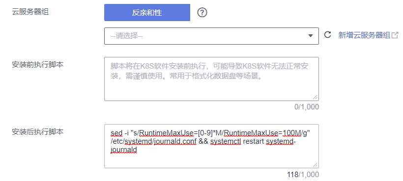

# 修改节点日志缓存内存占用量上限RuntimeMaxUse<a name="cce_10_0410"></a>

Journald是Linux中的日志系统，负责把日志信息写入二进制文件，并默认使用/run/log/journal目录做为日志缓存目录。Journald的配置文件位于节点/etc/systemd/journald.conf目录，其中RuntimeMaxUse参数表示日志缓存的最大内存占用量。若不配置RuntimeMaxUse，长时间运行会占用较大内存。

> **须知：** 
>修改节点系统参数的命令仅在使用公共镜像时有效，使用私有镜像时本文中提供的命令仅供参考。

## 修改节点RuntimeMaxUse<a name="section103357276311"></a>

1.  登录节点，查看/etc/systemd/journald.conf文件。

    ```
    cat /etc/systemd/journald.conf
    ```

2.  修改RuntimeMaxUse参数，建议值为100M。
    -   若查看journald.conf文件时，文件中已设置RuntimeMaxUse值，可通过以下命令对参数值进行修改。

        ```
        sed -i "s/RuntimeMaxUse=[0-9]*M/RuntimeMaxUse=100M/g" /etc/systemd/journald.conf && systemctl restart systemd-journald
        ```

    -   若查看journald.conf文件时，文件中还未设置RuntimeMaxUse值，可通过以下命令添加。

        ```
        echo RuntimeMaxUse=100M >> /etc/systemd/journald.conf && systemctl restart systemd-journald
        ```

3.  修改完成后，可查看是否修改成功，当返回与修改值一致时说明修改正确。

    ```
    cat /etc/systemd/journald.conf | grep RuntimeMaxUse
    ```


## 创建节点/节点池时自动配置RuntimeMaxUse<a name="section11273934111515"></a>

您可以设置节点或节点池安装后执行脚本，在新建节点或节点池时通过脚本配置RuntimeMaxUse大小。

1.  首先您需要确认创建节点或节点池的操作系统，例如CentOS 7.6。
2.  在**同集群、同操作系统**的节点上进行脚本命令可行性的测试，在节点上手动执行命令，确认脚本命令可行。手动执行脚本命令请参考[修改节点RuntimeMaxUse](#section103357276311)。
3.  **（以下命令需在手动执行命令验证成功后配置）**在创建节点或节点池时，在“高级配置 \> 安装后执行脚本“中添加可执行的脚本命令。

    -   登录节点查看/etc/systemd/journald.conf文件，若文件中已设置RuntimeMaxUse值，可通过以下命令对参数值进行修改。

        ```
        sed -i "s/RuntimeMaxUse=[0-9]*M/RuntimeMaxUse=100M/g" /etc/systemd/journald.conf && systemctl restart systemd-journald
        ```

    -   登录节点查看/etc/systemd/journald.conf文件，若文件中还未设置RuntimeMaxUse值，可通过以下命令添加。

        ```
        echo RuntimeMaxUse=100M >> /etc/systemd/journald.conf && systemctl restart systemd-journald
        ```

    下图中命令仅做示例，请根据实际情况填写。

    

4.  节点创建完成后，登录节点查看是否修改成功。

    ```
    cat /etc/systemd/journald.conf | grep RuntimeMaxUse
    ```


