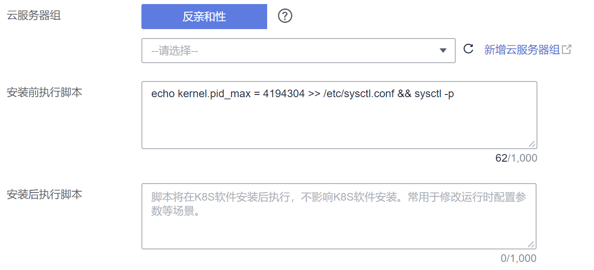

# 修改节点进程 ID数量上限kernel.pid\_max<a name="cce_10_0401"></a>

## 背景信息<a name="section854114785518"></a>

进程 ID（PID）是节点上的一种基础资源，容易在尚未超出其它资源约束的时候触及进程ID数量上限，进而导致节点不稳定。

您可以根据实际业务需求调整进程ID数量上限。

## 默认kernel.pid\_max说明<a name="section1553043412352"></a>

CCE在2022年1月底将1.17及以上集群的节点公共操作系统EulerOS 2.5、CentOS 7.6、Ubuntu 18.04镜像kernel.pid\_max默认值调整为4194304，满足如下两个条件节点的kernel.pid\_max值为4194304。

-   集群版本：1.17.17及以上版本
-   节点创建时间：2022年1月30日之后

如果不满足如上两个条件，EulerOS 2.5、CentOS 7.6、Ubuntu 18.04上kernel.pid\_max默认值32768。

**表 1**  节点kernel.pid\_max默认值

<a name="table1839654012916"></a>
<table><tbody><tr id="row17396940122917"><td class="cellrowborder" rowspan="2" valign="top"><p id="p7396174016291"><a name="p7396174016291"></a><a name="p7396174016291"></a><strong id="b0241162116442"><a name="b0241162116442"></a><a name="b0241162116442"></a>操作系统</strong></p>
</td>
<td class="cellrowborder" rowspan="2" valign="top"><p id="p1625711017411"><a name="p1625711017411"></a><a name="p1625711017411"></a><strong id="b1624622114414"><a name="b1624622114414"></a><a name="b1624622114414"></a>1.17.9及以下版本集群</strong></p>
</td>
<td class="cellrowborder" colspan="2" valign="top"><p id="p895761916402"><a name="p895761916402"></a><a name="p895761916402"></a><strong id="b361222515444"><a name="b361222515444"></a><a name="b361222515444"></a>1.17.17及以上版本集群</strong></p>
</td>
</tr>
<tr id="row11384119184219"><td class="cellrowborder" valign="top"><p id="p1814518321429"><a name="p1814518321429"></a><a name="p1814518321429"></a><strong id="b390731765419"><a name="b390731765419"></a><a name="b390731765419"></a>2022年1月30日及之前创建的节点</strong></p>
</td>
<td class="cellrowborder" valign="top"><p id="p11590225425"><a name="p11590225425"></a><a name="p11590225425"></a><strong id="b1909111775415"><a name="b1909111775415"></a><a name="b1909111775415"></a>2022年1月30日之后创建的节点</strong></p>
</td>
</tr>
<tr id="row15397154013292"><td class="cellrowborder" valign="top" width="21.17%"><p id="p139774016298"><a name="p139774016298"></a><a name="p139774016298"></a>EulerOS 2.5</p>
</td>
<td class="cellrowborder" valign="top" width="24.779999999999998%"><p id="p2397154032910"><a name="p2397154032910"></a><a name="p2397154032910"></a>32768</p>
</td>
<td class="cellrowborder" valign="top" width="26.87%"><p id="p163654613437"><a name="p163654613437"></a><a name="p163654613437"></a>32768</p>
</td>
<td class="cellrowborder" valign="top" width="27.18%"><p id="p78367124318"><a name="p78367124318"></a><a name="p78367124318"></a>4194304</p>
</td>
</tr>
<tr id="row4397124022914"><td class="cellrowborder" valign="top" width="21.17%"><p id="p1039715406296"><a name="p1039715406296"></a><a name="p1039715406296"></a>CentOS 7.6</p>
</td>
<td class="cellrowborder" valign="top" width="24.779999999999998%"><p id="p6397540182920"><a name="p6397540182920"></a><a name="p6397540182920"></a>32768</p>
</td>
<td class="cellrowborder" valign="top" width="26.87%"><p id="p203651063434"><a name="p203651063434"></a><a name="p203651063434"></a>32768</p>
</td>
<td class="cellrowborder" valign="top" width="27.18%"><p id="p15836314436"><a name="p15836314436"></a><a name="p15836314436"></a>4194304</p>
</td>
</tr>
<tr id="row1397740122915"><td class="cellrowborder" valign="top" width="21.17%"><p id="p1239734092916"><a name="p1239734092916"></a><a name="p1239734092916"></a>Ubuntu 18.04</p>
</td>
<td class="cellrowborder" valign="top" width="24.779999999999998%"><p id="p17397134010299"><a name="p17397134010299"></a><a name="p17397134010299"></a>不涉及</p>
</td>
<td class="cellrowborder" valign="top" width="26.87%"><p id="p19366156164319"><a name="p19366156164319"></a><a name="p19366156164319"></a>32768</p>
</td>
<td class="cellrowborder" valign="top" width="27.18%"><p id="p2083613124312"><a name="p2083613124312"></a><a name="p2083613124312"></a>4194304</p>
</td>
</tr>
<tr id="row112051891485"><td class="cellrowborder" valign="top" width="21.17%"><p id="p2206119184815"><a name="p2206119184815"></a><a name="p2206119184815"></a>EulerOS 2.3</p>
</td>
<td class="cellrowborder" valign="top" width="24.779999999999998%"><p id="p162068915487"><a name="p162068915487"></a><a name="p162068915487"></a>57344</p>
</td>
<td class="cellrowborder" valign="top" width="26.87%"><p id="p420612911483"><a name="p420612911483"></a><a name="p420612911483"></a>57344</p>
</td>
<td class="cellrowborder" valign="top" width="27.18%"><p id="p1620616920481"><a name="p1620616920481"></a><a name="p1620616920481"></a>57344</p>
</td>
</tr>
<tr id="row6397174017299"><td class="cellrowborder" valign="top" width="21.17%"><p id="p53974409295"><a name="p53974409295"></a><a name="p53974409295"></a>EulerOS 2.9</p>
</td>
<td class="cellrowborder" valign="top" width="24.779999999999998%"><p id="p123970408298"><a name="p123970408298"></a><a name="p123970408298"></a>不涉及</p>
</td>
<td class="cellrowborder" valign="top" width="26.87%"><p id="p103581459123912"><a name="p103581459123912"></a><a name="p103581459123912"></a>4194304</p>
</td>
<td class="cellrowborder" valign="top" width="27.18%"><p id="p883610154314"><a name="p883610154314"></a><a name="p883610154314"></a>4194304</p>
</td>
</tr>
</tbody>
</table>

**修改建议**

-   EulerOS 2.3：所有节点都涉及，建议您将kernel.pid\_max取值修改为4194304，具体方法请参见[修改节点kernel.pid\_max](#section103357276311)。且后续创建节点和节点池时配置安装前脚本修改kernel.pid\_max，具体方法请参见[配置节点池kernel.pid\_max](#section11273934111515)和[创建节点时配置kernel.pid\_max](#section12529121819573)
-   EulerOS 2.5、CentOS 7.6、Ubuntu 18.04：
    -   对于1.17.17及以上版本集群2022年1月30日及之前创建的节点，建议您将kernel.pid\_max取值修改为4194304，具体方法请参见[修改节点kernel.pid\_max](#section103357276311)。
    -   对于1.17.9及以下版本集群
        -   存量节点建议您将kernel.pid\_max取值修改为4194304，具体方法请参见[修改节点kernel.pid\_max](#section103357276311)。
        -   如果新创建节点和节点池，建议配置安装前脚本修改kernel.pid\_max，具体方法请参见[配置节点池kernel.pid\_max](#section11273934111515)和[创建节点时配置kernel.pid\_max](#section12529121819573)。


## 查看节点kernel.pid\_max<a name="section149892471822"></a>

登录节点，执行如下命令查看节点kernel.pid\_max。

**sysctl kernel.pid\_max**

```
# sysctl kernel.pid_max
kernel.pid_max = 32768
```

如果节点kernel.pid\_max大小不能满足您的业务诉求，您可以修改kernel.pid\_max大小，具体方法请参见[修改节点kernel.pid\_max](#section103357276311)。

## 查看节点当前pid用量<a name="section13991785335"></a>

登录节点，执行如下命令可查看当前pid用量。

**ps -eflL | wc -l**

```
# ps -eflL | wc -l
691
```

## 修改节点kernel.pid\_max<a name="section103357276311"></a>

登录节点，执行如下命令修改，其中4194304为kernel.pid\_max大小，可根据实际业务需求修改。

**echo kernel.pid\_max =  _4194304_  \>\> /etc/sysctl.conf && sysctl -p**

**echo  _4194304_   \> /sys/fs/cgroup/pids/kubepods/pids.max**

执行如下命令检查是否修改成功，当返回与修改值一致时说明修改正确。

```
# sysctl kernel.pid_max
kernel.pid_max = 4194304
# cat /sys/fs/cgroup/pids/kubepods/pids.max
4194304
```

## 配置节点池kernel.pid\_max<a name="section11273934111515"></a>

**EulerOS 2.3：建议配置**。

**EulerOS 2.5、CentOS 7.6、Ubuntu 18.04：1.17.9及以下版本集群建议配置；1.17.17及以上版本当前已在操作系统镜像中将kernel.pid\_max调整为4194304，无需配置。**

您可以设置节点池安装前执行脚本，在节点池中新创建节点时通过脚本配置kernel.pid\_max大小。

在创建节点池时，在“高级配置 \> 安装前执行脚本“中添加如下命令。

**echo kernel.pid\_max =  _4194304_  \>\> /etc/sysctl.conf && sysctl -p**



## 创建节点时配置kernel.pid\_max<a name="section12529121819573"></a>

**EulerOS 2.3：建议配置**。

**EulerOS 2.5、CentOS 7.6、Ubuntu 18.04：1.17.9及以下版本集群建议配置；1.17.17及以上版本当前已在操作系统镜像中将kernel.pid\_max调整为4194304，无需配置。**

您可以设置节点安装前执行脚本，在新创建节点时通过脚本配置kernel.pid\_max大小。

在创建节点时，在“高级配置 \> 安装前执行脚本“中添加如下命令。

**echo kernel.pid\_max =  _4194304_  \>\> /etc/sysctl.conf && sysctl -p**


