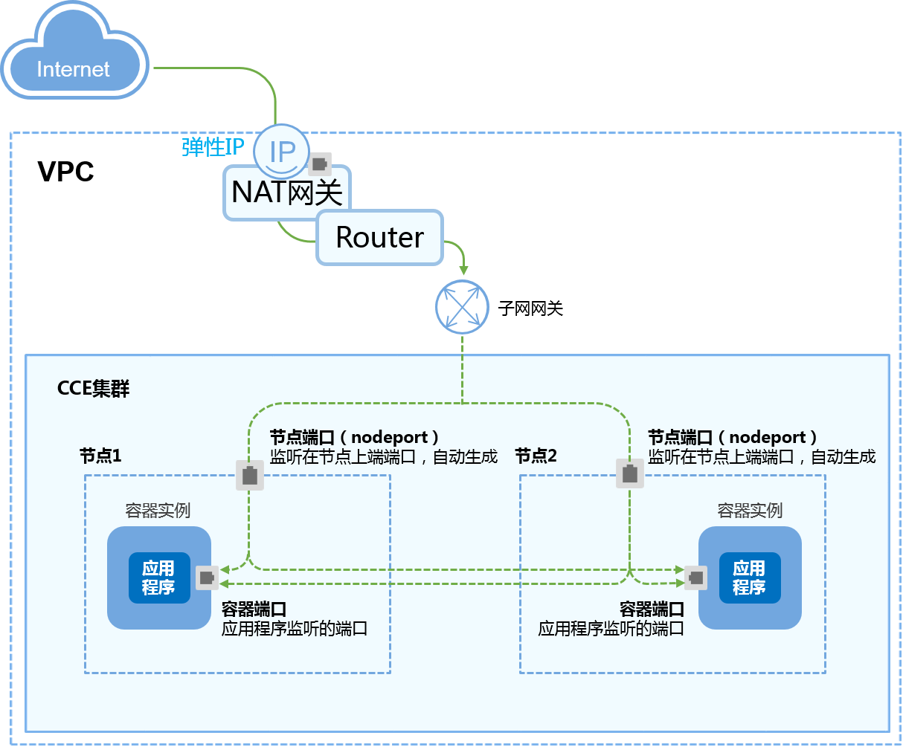
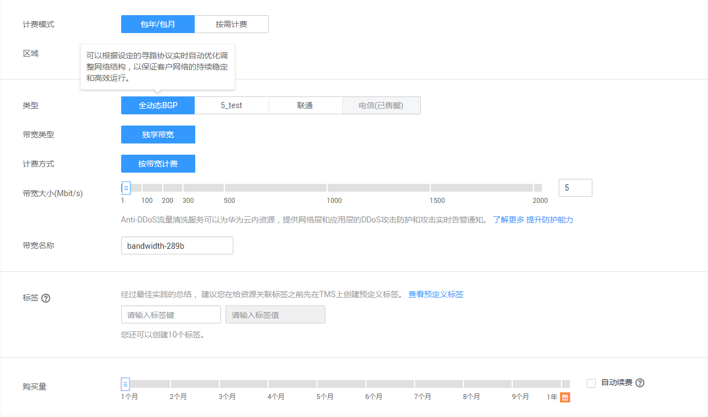

# 公网访问-NAT网关<a name="cce_01_0058"></a>

“NAT网关“可以为集群节点提供网络地址转换服务，使多个节点可以共享使用弹性IP。

NAT网关与弹性IP方式相比增强了可靠性，弹性IP无需与单个节点绑定，任何节点状态的异常不影响其访问。访问方式由公网弹性IP地址以及设置的访问端口组成，例如“10.117.117.117:80”。

**图 1**  公网访问-NAT网关<a name="fig1623231054319"></a>  


## 添加方式<a name="section10392205822818"></a>

您可以在创建工作负载时设置访问方式，也可以工作负载创建完成后添加访问方式。

-   方式一：创建工作负载时配置，请参见[通过界面创建](#section744117150366)和[kubectl命令行创建](#section1944313158364)。
-   方式二：工作负载创建完成后配置，此配置对工作负载状态无影响，且实时生效。具体步骤如下：
    1.  单击CCE左侧导航栏的“工作负载”，单击工作负载名称，进入工作负载详情页面。选择“访问方式“页签，单击“添加服务“。
    2.  参照[通过界面创建](#section744117150366)的配置参数添加访问方式。


## 更新方式<a name="section1377882410819"></a>

您可以在添加完Service后，更新此Service的端口配置，请参见[更新Service端口配置](#section1465316915912)。

## 前提条件-创建NAT网关实例和弹性IP<a name="section33871214153614"></a>

NAT网关当前处于公测状态，若需要使用NAT网关服务，需要申请公测，请参照界面申请。

已创建NAT网关实例。具体操作步骤为：

1.  登录华为云控制台首页，选择“网络 \> NAT网关”，单击页面右上角的“购买NAT网关“。

    NAT网关当前处于公测状态，若需要使用NAT网关服务，需要申请公测，请参照界面申请。申请通过后，请按照如下步骤创建NAT网关实例。请根据业务需求购买。

    > **说明：**   
    >购买NAT网关，选择VPC和子网时，请确保与CCE中运行业务的集群VPC和子网一致。  

    **图 2**  购买NAT网关<a name="fig65141147164317"></a>  
    

2.  在华为云控制台首页，选择“网络 \> 弹性公网IP”，单击右上角的“购买弹性公网IP”。下图是购买弹性IP的案例，请根据实际业务填写。

    **图 3**  购买弹性公网IP<a name="fig1665717534483"></a>  
    


## 通过界面创建<a name="section744117150366"></a>

本节以nginx为例进行说明。

1.  参考[创建无状态工作负载](创建无状态工作负载.md)或[创建有状态工作负载](创建有状态工作负载.md)，在“工作负载访问设置“步骤，单击“添加服务“。
    -   服务名称：自定义服务名称，可与工作负载名称保持一致。
    -   访问方式：公网访问。
    -   访问类型：NAT网关。
        -   请选择对应的NAT网关，若没有请单击“创建NAT网关”创建。
        -   请选择对应的弹性公网IP，若没有请单击“创建弹性公网IP”创建。

    -   协议：请根据业务的协议类型选择。
    -   容器端口：容器镜像中工作负载实际监听端口，需用户确定。nginx程序实际监听的端口为80。
    -   访问端口：容器端口映射端口，访问工作负载时使用，端口范围为1-65535，可任意指定。

2.  单击“下一步“进入“高级设置“页面，直接单击“创建“。
3.  单击“查看应用详情“，在“访问方式“页签下，获取方式地址，例如“10.154.78.160:2“。
4.  单击访问地址，即可跳转到访问页面。

    **图 4**  通过NAT网关访问nginx（一）<a name="fig1543716518012"></a>  
    


## 工作负载创建完成后设置<a name="section156711537124016"></a>

1.  登录CCE控制台，选择左侧导航栏的“资源管理 \> 网络管理”，在**Service**页签下，单击“添加Service”。选择类型为“公网访问”。
2.  设置集群内访问参数。
    -   服务名称称：自定义服务名称，可与工作负载名称保持一致。
    -   集群名称：服务所在集群。
    -   命名空间：服务所在命名空间。
    -   关联工作负载：选择需要添加Service的工作负载。
    -   访问类型：选择NAT网关。选择已创建好的NAT网关和弹性公网IP。
    -   端口配置：
        -   协议：请根据业务的协议类型选择。
        -   容器端口：容器镜像中工作负载程序实际监听端口，需用户确定。nginx程序实际监听的端口为80。
        -   访问端口：容器端口映射端口，访问工作负载时使用，端口范围为1-65535，可任意指定。


3.  单击“创建”。工作负载已添加“公网访问-NAT网关”的服务。

## kubectl命令行创建<a name="section1944313158364"></a>

本节以nginx为例，说明kubectl命令实现集群内访问的方法。

**前提条件**

请参见[通过Kubectl连接集群](通过Kubectl连接集群.md)配置kubectl命令，使弹性云服务器连接集群。

1.  登录已配置好kubectl命令的弹性云服务器。登录方法请参见[登录Linux弹性云服务器](https://support.huaweicloud.com/usermanual-ecs/zh-cn_topic_0013771089.html)。
2.  创建并编辑nginx-deployment.yaml以及nginx-nat-svc.yaml文件。

    其中，nginx-deployment.yaml和nginx-nat-svc.yaml为自定义名称，您可以随意命名。

    **vi nginx-deployment.yaml**

    ```
    apiVersion: extensions/v1beta1
    kind: Deployment
    metadata:
      name: nginx
    spec:
      replicas: 1
      selector:
        matchLabels:
          app: nginx
      strategy:
        type: RollingUpdate
      template:
        metadata:
          labels:
            app: nginx
        spec:
          containers:
          - image: nginx 
            imagePullPolicy: Always
            name: nginx
          imagePullSecrets:
          - name: default-secret
    ```

    以上字段的解释请参见[表3](创建无状态工作负载.md#table132326831016)。

    **vi nginx-nat-svc.yaml**

    ```
    apiVersion: v1 
    kind: Service 
    metadata: 
      labels: 
        app: nginx 
      name: nginx 
      annotations:
        kubernetes.io/elb.class: dnat        #该参数配置为dnat用于对接nat网关服务添加dnat规则
        kubernetes.io/natgateway.id: e4a1cfcf-29df-4ab8-a4ea-c05dc860f554       #指定nat网关ID
    spec: 
      loadBalancerIP: 10.78.42.242   #公网弹性IP
      ports: 
      - name: service0 
        port: 80             #对应界面上的访问端口 
        protocol: TCP 
        targetPort: 80       #对应界面上的容器端口 
      selector: 
        app: nginx 
      type: LoadBalancer     #NAT网关服务需要配置为LoadBalancer类型
    ```

3.  创建工作负载。

    **kubectl create -f nginx-deployment.yaml**

    回显如下表示工作负载开始创建。

    ```
    deployment "nginx" created
    ```

    **kubectl get po**

    回显如下，工作负载状态为Running，表示工作负载已运行中。

    ```
    NAME                     READY     STATUS             RESTARTS   AGE
    etcd-0                   0/1       ImagePullBackOff   0          59m
    icagent-m9dkt            0/0       Running            0          3d
    nginx-2601814895-sf71t   1/1       Running            0          8s
    ```

4.  创建服务。

    **kubectl create -f nginx-nat-svc.yaml**

    回显如下表示服务已创建成功。

    ```
    service "nginx-eip" created
    ```

    **kubectl get svc**

    回显如下表示服务访问方式已设置成功。

    ```
    NAME         TYPE        CLUSTER-IP       EXTERNAL-IP   PORT(S)        AGE 
    etcd-svc     ClusterIP   None             <none>        3120/TCP       59m 
    kubernetes   ClusterIP   10.247.0.1       <none>        443/TCP        3d 
    nginx-nat    LoadBalancer 10.247.226.2  10.154.74.98   80:30589/TCP  5s
    ```

5.  在浏览器中输入访问地址，例如为**10.154.74.98**:80访问地址。

    其中**10.154.74.98**为弹性IP地址，80为上一步中获取的节点端口号。


## 更新Service端口配置<a name="section1465316915912"></a>

1.  登录CCE控制台，选择左侧导航栏的“资源管理 \> 网络管理”，在**Service**页签下，单击需要更新端口配置的Service的“更新”。
2.  更新端口配置参数。
    -   协议：请根据业务的协议类型选择。
    -   容器端口：容器镜像中工作负载程序实际监听端口，需用户确定。nginx程序实际监听的端口为80。
    -   访问端口：容器端口映射端口，访问工作负载时使用，端口范围为1-65535，可任意指定。

3.  单击“更新”。工作负载已更新Service。

