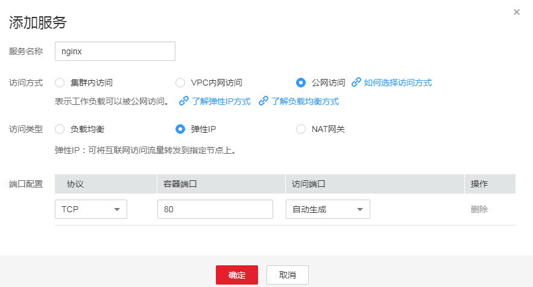

# 公网访问-弹性IP<a name="cce_01_0013"></a>

公网访问-弹性IP可以通过弹性IP从公网访问工作负载，一般用于系统中需要暴露到公网的服务。

弹性IP访问方式需要给集群内任一节点绑定弹性IP，并设置一个映射在节点上的端口，其中节点端口的范围在30000-32767之间，例如访问地址为10.117.117.117:30000。

**图 1**  公网访问-弹性IP<a name="fig57690358164948"></a>  


## 添加方式<a name="section10392205822818"></a>

您可以在创建工作负载时设置访问方式，也可以工作负载创建完成后添加访问方式。

-   方式一：创建工作负载时配置，请参见[通过界面创建](#section744117150366)和[kubectl命令行创建](#section1944313158364)。
-   方式二：工作负载创建完成后设置，请参见[工作负载创建完成后设置](#section51925078171335)。

## 更新方式<a name="section1721119381234"></a>

您可以在添加完Service后，更新此Service的端口配置，请参见[更新Service端口配置](#section1792317121155)。

## 通过界面创建<a name="section744117150366"></a>

本节以nginx为例进行说明。

1.  参考[创建无状态工作负载](创建无状态工作负载.md)或[创建有状态工作负载](创建有状态工作负载.md)，在“工作负载访问设置“步骤，单击“添加服务“。
    -   服务名称：自定义服务名称，可与工作负载名称保持一致。
    -   访问方式：公网访问。
    -   访问类型：弹性IP，请确保当前集群内至少有一个节点已绑定弹性IP。
    -   协议：请根据业务的协议类型选择。
    -   容器端口：容器镜像中工作负载实际监听端口，需用户确定。nginx程序实际监听的端口为80。
    -   访问端口：容器端口映射到弹性IP上的端口，用私有IP访问工作负载时使用，端口范围为30000-32767，建议选择“自动生成“。
        -   自动生成：系统会自动分配端口号。
        -   指定端口：指定固定的节点端口，默认取值范围为30000-32767。若指定端口时，请确保同个集群内的端口唯一性。

            **图 2**  访问类型为弹性IP<a name="fig14291820872"></a>  
            


2.  单击“下一步“进入“高级设置（可选）“页面，直接单击“创建“。
3.  单击“查看工作负载详情“，在“访问方式“页签下，获取方式地址，例如“10.78.27.59:30911“。
4.  单击访问地址，即可跳转到访问页面。

    **图 3**  通过弹性IP访问nginx（一）<a name="fig1543716518012"></a>  
    


## 工作负载创建完成后设置<a name="section51925078171335"></a>

1.  登录CCE控制台，选择左侧导航栏的“资源管理 \> 网络管理”，在**Service**页签下，单击“添加Service”。选择类型为“公网访问”。
2.  设置集群内访问参数。
    -   服务名称：自定义服务名称，可与工作负载名称保持一致。
    -   集群名称：服务所在集群。
    -   命名空间：服务所在命名空间。
    -   关联工作负载：选择需要添加Service的工作负载。
    -   访问类型：选择弹性IP。
    -   端口配置：
        -   协议：请根据业务的协议类型选择。
        -   容器端口：容器镜像中工作负载程序实际监听的端口，需用户确定。nginx程序实际监听的端口为80。
        -   访问端口：容器端口映射到节点私有IP上的端口，用私有IP访问工作负载时使用，端口范围为30000-32767，建议选择“自动生成“。
            -   自动生成：系统会自动分配端口号。
            -   指定端口：指定固定的节点端口，默认取值范围为30000-32767。若指定端口时，请确保同个集群内的端口唯一性。


3.  单击“创建”。工作负载已添加“公网访问-弹性IP”的服务。

## kubectl命令行创建<a name="section1944313158364"></a>

本节以nginx为例，说明kubectl命令实现公网访问的方法。

**前提条件**

请参见[通过Kubectl连接集群](通过Kubectl连接集群.md)配置kubectl命令，使弹性云服务器连接集群。

1.  登录已配置好kubectl命令的弹性云服务器。登录方法请参见[登录Linux弹性云服务器](https://support.huaweicloud.com/usermanual-ecs/zh-cn_topic_0013771089.html)。
2.  创建并编辑nginx-deployment.yaml以及nginx-eip-svc.yaml文件。

    其中，nginx-deployment.yaml和nginx-eip-svc.yaml为自定义名称，您可以随意命名。

    **vi nginx-deployment.yaml**

    ```
    apiVersion: extensions/v1beta1
    kind: Deployment
    metadata:
      name: nginx
    spec:
      replicas: 1cc
      selector:
        matchLabels:
          app: nginx
      strategy:
        type: RollingUpdate
      template:
        metadata:
          labels:
            app: nginx
        spec:
          containers:
          - image: nginx 
            imagePullPolicy: Always
            name: nginx
          imagePullSecrets:
          - name: default-secret
    ```

    **vi nginx-eip-svc.yaml**

    ```
    apiVersion: v1
    kind: Service
    metadata:
      annotations:
        service.protal.kubernetes.io/access-ip: 10.78.44.60  #集群内部至少有一个节点绑定弹性IP，此处填写弹性IP地址
        service.protal.kubernetes.io/type: EIP                #指定外部访问类型为弹性IP
      labels:
        app: nginx
      name: nginx-eip
    spec:
      ports:
      - name: service0
        nodePort: 30000      #对应界面上的访问端口，不填写表示自动生成
        port: 80             #集群虚拟IP的访问端口
        protocol: TCP
        targetPort: 80       #对应界面上的容器端口
      selector:
        app: nginx
      type: NodePort         #弹性IP需要基于NodePort类型的服务
    ```

3.  创建工作负载。

    **kubectl create -f nginx-deployment.yaml**

    回显如下表示工作负载开始创建。

    ```
    deployment "nginx" created
    ```

    **kubectl get po**

    回显如下，工作负载状态为Running，表示工作负载已运行中。

    ```
    NAME                     READY     STATUS             RESTARTS   AGE
    etcd-0                   0/1       ImagePullBackOff   0          59m
    icagent-m9dkt            0/0       Running            0          3d
    nginx-2601814895-sf71t   1/1       Running            0          8s
    ```

4.  创建服务。

    **kubectl create -f nginx-eip-svc.yaml**

    回显如下表示服务已创建成功。

    ```
    service "nginx-eip" created
    ```

    **kubectl get svc**

    回显如下表示服务访问方式已设置成功。

    ```
    NAME         TYPE        CLUSTER-IP       EXTERNAL-IP   PORT(S)        AGE
    etcd-svc     ClusterIP   None             <none>        3120/TCP       59m
    kubernetes   ClusterIP   10.247.0.1       <none>        443/TCP        3d
    nginx-eip    NodePort    10.247.120.135   <none>        80:30000/TCP   7s
    ```

5.  在浏览器中输入访问地址，例如为10.78.44.60:30000访问地址。

    其中10.78.44.60为弹性IP地址，30000为上一步中获取的节点端口号。

    **图 4**  通过弹性IP访问nginx（二）<a name="fig6924134814251"></a>  
    


## 更新Service端口配置<a name="section1792317121155"></a>

1.  登录CCE控制台，选择左侧导航栏的“资源管理 \> 网络管理”，在**Service**页签下，单击需要更新端口配置的Service的“更新”。
2.  更新端口配置参数。
    -   协议：请根据业务的协议类型选择。
    -   容器端口：容器镜像中工作负载程序实际监听的端口，需用户确定。nginx程序实际监听的端口为80。
    -   访问端口：容器端口映射到节点私有IP上的端口，用私有IP访问工作负载时使用，端口范围为30000-32767，建议选择“自动生成“。
        -   自动生成：系统会自动分配端口号。
        -   指定端口：指定固定的节点端口，默认取值范围为30000-32767。若指定端口时，请确保同个集群内的端口唯一性。


3.  单击“更新”。工作负载已更新Service。

