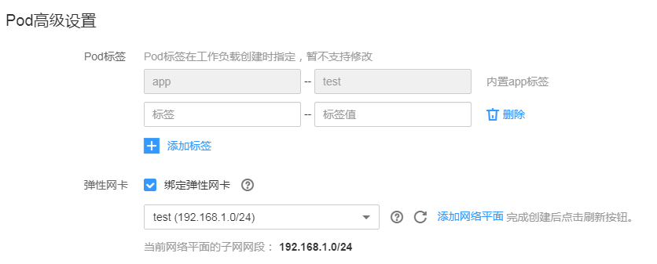

# 创建守护进程集\(DaemonSet\)

云容器引擎（CCE）提供多种类型的容器部署和管理能力，支持对容器工作负载的部署、配置、监控、扩容、升级、卸载、服务发现及负载均衡等特性。

其中守护进程集（DaemonSet）可以确保全部（或者某些）节点上仅运行一个Pod实例，当有节点加入集群时，也会为他们新增一个 Pod 。 当有节点从集群移除时，这些 Pod 也会被回收。删除 DaemonSet 将会删除它创建的所有 Pod。

使用 DaemonSet 的一些典型用法：

-   运行集群存储 daemon，例如在每个节点上运行 glusterd、ceph。
-   在每个节点上运行日志收集 daemon，例如fluentd、logstash。
-   在每个节点上运行监控 daemon，例如 Prometheus Node Exporter、collectd、Datadog 代理、New Relic 代理，或 Ganglia gmond。

一个简单的用法是在所有的节点上都启动一个 DaemonSet，将被作为每种类型的 daemon 使用。 一个稍微复杂的用法是单独对每种 daemon 类型使用多个 DaemonSet，但具有不同的标志，和/或对不同硬件类型具有不同的内存、CPU要求。

## 准备工作

在创建守护进程集前，您需要存在一个可用集群。若没有可用集群 ，请参照[购买混合集群](购买混合集群.md)中内容创建。

## 操作步骤

1.  登录[云容器引擎管理控制台](https://console.huaweicloud.com/cce2.0/?utm_source=helpcenter)。
2.  在左侧导航栏中选择“工作负载 \> 守护进程集（DaemonSet）”，单击页面右上角的“创建守护进程集”。参照[表1](#table18511927357)设置基本信息，其中带“\*”标志的参数为必填参数。

    **表 1**  工作负载基本信息

    
    <table><thead align="left"><tr id="row165111724358"><th class="cellrowborder" valign="top" width="23.07%" id="mcps1.2.3.1.1">
参数

    </th>
    <th class="cellrowborder" valign="top" width="76.92999999999999%" id="mcps1.2.3.1.2">
参数说明

    </th>
    </tr>
    </thead>
    <tbody><tr id="row165116293513"><td class="cellrowborder" valign="top" width="23.07%" headers="mcps1.2.3.1.1 ">
* 工作负载名称

    </td>
    <td class="cellrowborder" valign="top" width="76.92999999999999%" headers="mcps1.2.3.1.2 ">
新建工作负载的名称，命名必须唯一。

    </td>
    </tr>
    <tr id="row9511529359"><td class="cellrowborder" valign="top" width="23.07%" headers="mcps1.2.3.1.1 ">
* 集群名称

    </td>
    <td class="cellrowborder" valign="top" width="76.92999999999999%" headers="mcps1.2.3.1.2 ">
新建工作负载所在的集群。

    </td>
    </tr>
    <tr id="row551122123512"><td class="cellrowborder" valign="top" width="23.07%" headers="mcps1.2.3.1.1 ">
* 命名空间

    </td>
    <td class="cellrowborder" valign="top" width="76.92999999999999%" headers="mcps1.2.3.1.2 ">
在单集群中，不同命名空间中的数据彼此隔离。使应用可以共享同个集群的服务，也能够互不干扰。若您不设置命名空间，系统会默认使用default命名空间。

    </td>
    </tr>
    <tr id="row15115217354"><td class="cellrowborder" valign="top" width="23.07%" headers="mcps1.2.3.1.1 ">
时区同步

    </td>
    <td class="cellrowborder" valign="top" width="76.92999999999999%" headers="mcps1.2.3.1.2 ">
勾选“开启”，容器将和节点使用相同时区。

    
 须知： 

时区同步功能开启后，在“数据存储 &gt; 本地磁盘”中，将会自动添加HostPath类型的磁盘，请勿修改删除该磁盘。

    

    </td>
    </tr>
    <tr id="row974912231659"><td class="cellrowborder" valign="top" width="23.07%" headers="mcps1.2.3.1.1 ">
CCI弹性承载

    </td>
    <td class="cellrowborder" valign="top" width="76.92999999999999%" headers="mcps1.2.3.1.2 ">
该参数仅在安装virtual kubelet插件后才显示，具体请参见<a href="virtual-kubelet.md">virtual kubelet</a>。

    
勾选此选项后，当集群资源不足时，支持将Pod部署到CCI集群。

    </td>
    </tr>
    <tr id="row135110233512"><td class="cellrowborder" valign="top" width="23.07%" headers="mcps1.2.3.1.1 ">
工作负载描述

    </td>
    <td class="cellrowborder" valign="top" width="76.92999999999999%" headers="mcps1.2.3.1.2 ">
工作负载描述信息。

    </td>
    </tr>
    </tbody>
    </table>

3.  单击“下一步：容器设置“，添加容器。
    1.  单击“添加容器“，选择需要部署的镜像。
        -   **我的镜像：**展示了您创建的所有镜像仓库。
        -   **Dockerhub官方镜像：**展示了Dockerhub仓库中的官方镜像。
        -   **第三方镜像：**CCE支持拉取第三方镜像仓库（即镜像仓库与Dockerhub之外的镜像仓库）的镜像创建工作负载。使用第三方镜像时，请确保工作负载运行的节点可访问公网。第三方镜像的具体使用方法请参见[如何使用第三方镜像](如何使用第三方镜像.md)。
            -   若您的镜像仓库不需要认证，密钥认证请选择“否“，并输入“镜像地址“，单击“确定“。
            -   若您的镜像仓库都必须经过认证（帐号密码）才能访问，您需要先创建密钥再使用第三方镜像，具体操作请参见[如何使用第三方镜像](如何使用第三方镜像.md)。

        -   **共享镜像：**其它租户通过“容器镜像服务“共享给您的镜像将在此处展示，您可以基于共享镜像创建工作负载。

    2.  配置镜像基本信息。

        工作负载是Kubernetes对一组Pod的抽象模型，用于描述业务的运行载体，一个Pod可以封装1个或多个容器，您可以单击右上方的“添加容器”，添加多个容器镜像并分别进行设置。

        **表 2**  镜像参数说明

        
        <table><thead align="left"><tr id="cce_01_0047_row0282348486"><th class="cellrowborder" valign="top" width="23%" id="mcps1.2.3.1.1">
参数

        </th>
        <th class="cellrowborder" valign="top" width="77%" id="mcps1.2.3.1.2">
说明

        </th>
        </tr>
        </thead>
        <tbody><tr id="cce_01_0047_row1844916557597"><td class="cellrowborder" valign="top" width="23%" headers="mcps1.2.3.1.1 ">
镜像名称

        </td>
        <td class="cellrowborder" valign="top" width="77%" headers="mcps1.2.3.1.2 ">
导入的镜像，您可单击“更换镜像”进行更换。

        </td>
        </tr>
        <tr id="cce_01_0047_row338117362515"><td class="cellrowborder" valign="top" width="23%" headers="mcps1.2.3.1.1 ">
* 镜像版本

        </td>
        <td class="cellrowborder" valign="top" width="77%" headers="mcps1.2.3.1.2 ">
若选择Dockerhub官方镜像，请选择需要部署的镜像版本。

        </td>
        </tr>
        <tr id="cce_01_0047_row32839494813"><td class="cellrowborder" valign="top" width="23%" headers="mcps1.2.3.1.1 ">
* 容器名称

        </td>
        <td class="cellrowborder" valign="top" width="77%" headers="mcps1.2.3.1.2 ">
容器的名称，可修改。

        </td>
        </tr>
        <tr id="cce_01_0047_row1449911299503"><td class="cellrowborder" valign="top" width="23%" headers="mcps1.2.3.1.1 ">
特权容器

        </td>
        <td class="cellrowborder" valign="top" width="77%" headers="mcps1.2.3.1.2 ">
特权容器是指容器里面的程序具有一定的特权。

        
若选中，容器将获得超级权限，例如可以操作宿主机上面的网络设备、修改内核参数等。

        </td>
        </tr>
        <tr id="cce_01_0047_row152831345485"><td class="cellrowborder" valign="top" width="23%" headers="mcps1.2.3.1.1 ">
容器规格

        </td>
        <td class="cellrowborder" valign="top" width="77%" headers="mcps1.2.3.1.2 ">
<strong id="cce_01_0047_b2155195713314">CPU配额：</strong>

        <ul id="cce_01_0047_ul67283495467"><li>申请：容器需要使用的最小CPU值，默认0.25Core。</li><li>限制：允许容器使用的CPU最大值。建议设容器配额的最高限额，避免容器资源超额导致系统故障。</li></ul>
        
<strong id="cce_01_0047_b5114173113411">内存配额：</strong>

        <ul id="cce_01_0047_ul14326165915010"><li>申请：容器需要使用的内存最小值，默认512MiB。</li><li>限制：允许容器使用的内存最大值。如果超过，容器会被终止。</li></ul>
        
申请和限制的具体请参见<a href="设置容器规格.md">设置容器规格</a>。

        
<strong id="cce_01_0047_b11557151512341">GPU配额：</strong>当集群中包含GPU节点时，才能设置GPU，无GPU节点不显示此选项。

        
容器需要使用的GPU百分比。勾选“使用”并设置百分比，例如设置为10%，表示该容器需使用GPU资源的10%。若不勾选“使用”，或设置为0，则无法使用GPU资源。

        
<strong id="cce_01_0047_b423894943411">GPU显卡：</strong>工作负载实例将被调度到GPU显卡类型为指定显卡的节点上。

        
若勾选“不限制”，容器将会随机使用节点中的任一显卡。您也可以勾选某个显卡，容器将使用特定显卡。

        
<strong id="cce_01_0047_b188666944516">昇腾&nbsp;310配额：</strong>容器需要使用的昇腾 310芯片个数，此处须为整数。

        
选用AI加速型节点并安装<strong id="cce_01_0047_b99085210250">huawei-npu</strong>插件后该参数设置将生效。AI加速型节点目前已开放公测，该实例搭载高性能、低功耗的海思Ascend 310 AI处理器，适用于图像识别、视频处理、推理计算以及机器学习等场景，点此可<a href="https://account.huaweicloud.com/usercenter/#/userindex/betaManagement?serviceCode=ecs_ascend_ai1" target="_blank" rel="noopener noreferrer">立即申请</a>。

        </td>
        </tr>
        </tbody>
        </table>

    3.  **生命周期：**用于设置容器启动和运行时需要执行的命令。
        -   启动命令：设置容器启动时执行的命令，具体请参见[设置容器启动命令](设置容器启动命令.md)。
        -   启动后处理：设置容器成功运行后执行的命令，详细配置方法请参见[设置容器生命周期](设置容器生命周期.md)。
        -   停止前处理：设置容器结束前执行的命令，通常用于删除日志/临时文件等，详细配置方法请参见[设置容器生命周期](设置容器生命周期.md)。

    4.  **健康检查：**CCE提供了存活与业务两种探针，用于判断容器和用户业务是否正常运行。详细配置方法请参见[设置容器健康检查](设置容器健康检查.md)。
        -   工作负载存活探针：检查容器是否正常，不正常则重启实例。
        -   工作负载业务探针：检查用户业务是否就绪，不就绪则不转发流量到当前实例。

    5.  **环境变量：**在容器中添加环境变量，一般用于通过环境变量设置参数。

        在“环境变量“页签，单击“添加环境变量“，当前支持三种类型：

        -   手动添加：输入变量名称、变量/变量引用。
        -   密钥导入：输入变量名称，选择导入的密钥名称和数据。您需要提前创建密钥，具体请参见[创建密钥](创建密钥.md)。
        -   配置项导入：输入变量名称，选择导入的配置项名称和数据。您需要提前创建配置项，具体请参见[创建配置项](创建配置项.md)。

            > **说明：**   
            >对于已设置的环境变量，单击环境变量后的“编辑”，可对该环境变量进行编辑。单击环境变量后的“删除”，可删除该环境变量。  

    6.  **数据存储：**给容器挂载数据存储，支持本地磁盘和云存储，适用于需持久化存储、高磁盘IO等场景。具体请参见[使用本地磁盘存储](使用本地磁盘存储.md)、[使用文件存储卷](使用文件存储卷.md)、[使用对象存储卷](使用对象存储卷.md)、[使用极速文件存储卷](使用极速文件存储卷.md)。
    7.  **安全设置：**对容器权限进行设置，保护系统和其他容器不受其影响。

        请输入用户ID，容器将以当前用户权限运行。

    8.  **容器日志：**设置容器日志采集策略、配置日志目录。用于收集容器日志便于统一管理和分析。详细配置请参见[采集容器标准输出日志](采集容器标准输出日志.md)、[采集容器内路径日志](采集容器内路径日志.md)。

4.  单击“下一步：工作负载访问设置“，单击“添加服务“，设置工作负载访问方式。

    若工作负载需要和其它服务互访，或需要被公网访问，您需要添加服务，设置工作负载访问方式。

    工作负载访问的方式决定了这个工作负载的网络属性，不同访问方式的工作负载可以提供不同网络能力，具体请参见[网络概述](网络概述.md)。

5.  单击“下一步“，进行高级设置。
    -   **升级策略：**
        -   升级方式：支持“滚动升级“。滚动升级将逐步用新版本的实例替换旧版本的实例，升级的过程中，业务流量会同时负载均衡分布到新老的实例上，因此业务不会中断。
        -   最大无效实例数：每次滚动升级允许的最大无效实例数，如果等于实例数有断服风险（最小存活实例数 = 实例数 - 最大无效实例数）。

    -   **缩容策略：**

        缩容时间窗：请输入时间。为工作负载删除提供一个时间窗，预留给生命周期中PreStop阶段执行命令。若超过此时间窗，进程仍未停止，该工作负载将被强制删除。

    -   **调度策略：**你可以根据需要自由组合静态的全局调度策略或动态的运行时调度策略来实现自己的需求。具体请参见[调度策略概述](调度策略概述.md)。
    -   **Pod高级设置**

        -   Pod标签：内置app标签在工作负载创建时指定，暂不支持修改。您可以单击下方的“添加标签“增加标签。
        -   弹性网卡：Pod中的容器支持绑定弹性网卡。单击选中“绑定弹性网卡“可以绑定已有的网络平面，如果没有可绑定的网络平面，请单击右侧的“添加网络平面“，完成添加后单击刷新按钮。更多网络平面信息请参见[网络平面（NetworkAttachmentDefinition）](网络平面（NetworkAttachmentDefinition）.md)。

            > **说明：**   
            >-   仅v1.13.7-r0及以上版本且网络模型为VPC网络的混合集群才能绑定弹性网卡，不符合条件的集群将不显示“弹性网卡“选项。  
            >-   网络平面是CCE新增的一种crd资源，记录了租户ID，子网ID，安全组等的配置项，作为申请弹性网卡的配置信息。  
            >-   创建工作负载时，在[设置工作负载访问方式](#li3580132418215)步骤中如果添加了节点级别的Service，将无法绑定弹性网卡；同理，绑定了弹性网卡的工作负载，将无法添加节点级别的Service。  

        **图 1**  Pod高级设置  
        

    -   **客户端DNS配置**：CCE集群内置DNS插件CoreDNS，为集群内的工作负载提供域名解析服务。详细使用方法请参见[Kubernetes集群内置DNS使用指南](Kubernetes集群内置DNS使用指南.md)。
        -   DNS策略：
            -   追加域名解析配置：将保留默认配置，以下“IP地址“和“搜索域“配置可能不生效。
            -   替换域名解析配置：将仅使用以下配置进行域名解析。
            -   继承Pod所在节点域名解析配置：将继承Pod所在节点的域名解析配置。

        -   IP地址：您可对自定义的域名配置域名服务器，值为一个或一组DNS IP地址，如“1.2.3.4”。
        -   搜索域：定义域名的搜索域列表，当访问的域名不能被DNS解析时，会把该域名与搜索域列表中的域依次进行组合，并重新向DNS发起请求，直到域名被正确解析或者尝试完搜索域列表为止。
        -   超时时间（s）：查询超时时间，请自定义。
        -   ndots：表示域名中必须出现的“.”的个数，如果域名中的“.”的个数不小于ndots，则该域名为一个FQDN，操作系统会直接查询；如果域名中的“.”的个数小于ndots，操作系统会在搜索域中进行查询。

    -   **自定义指标监控：**是指监控系统提供的一种指标收集机制，该机制允许工作负载在部署时自定义需要上报的指标名称以及获取这些指标数据的接入点信息，在应用运行时由监控系统按固定的频率访问接入点进行指标的收集。详细请参见[对接普罗米修斯（自定义监控）](对接普罗米修斯（自定义监控）.md)。
    -   **性能管理配置：**华为云的性能管理服务可协助您快速进行工作负载的问题定位与性能瓶颈分析。详细请参见[性能管理配置（性能瓶颈分析）](性能管理配置（性能瓶颈分析）.md)。

6.  配置完成后，单击“创建”，在创建成功页面单击“返回工作负载列表”，查看工作负载状态。

    在工作负载列表中，当工作负载状态为“运行中”时，表示工作负载创建成功。

    工作负载状态不会实时更新，请单击右上角的图标或按F5刷新页面查看。

