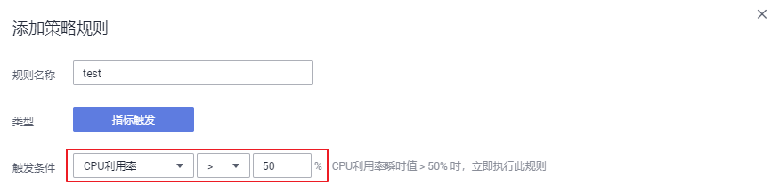
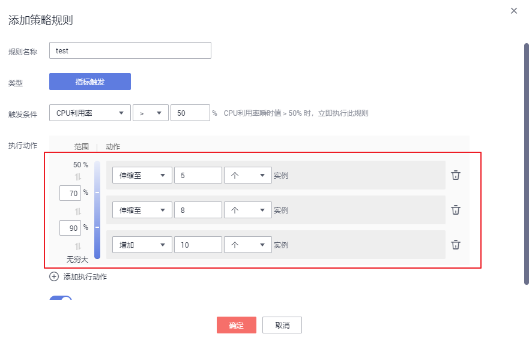
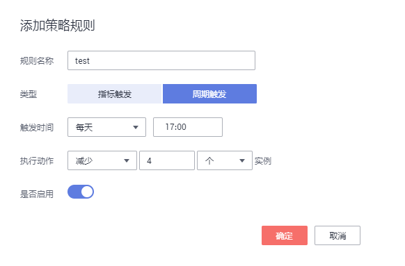

# 创建工作负载弹性伸缩（CustomedHPA）

CustomedHPA策略是华为云自研的弹性伸缩增强能力，能够基于指标（CPU利用率、内存利用率）或周期（每天、每周、每月或每年的具体时间点），对无状态工作负载进行弹性扩缩容。

主要功能如下：

-   支持按照当前实例数的百分比进行扩缩容。
-   支持设置一次扩缩容的最小步长。
-   支持按照实际指标值执行不同的扩缩容动作。

## 前提条件

若使用CustomedHPA策略，则必须安装[cce-hpa-controller](cce-hpa-controller.md)和[prometheus](prometheus.md)插件，且两个插件版本均需为1.1.0及以上：

-   cce-hpa-controller：支持按照当前实例数的百分比进行扩缩容；支持设置一次扩缩容的最小步长；支持按照实际指标值执行不同的扩缩容动作。创建CustomedHPA策略必须安装此插件。
-   prometheus：负责采集kubernetes集群中kubelet的公开指标项（CPU利用率、内存利用率）。创建CustomedHPA策略必须安装此插件。

## 约束与限制

-   CustomedHPA策略：仅支持1.15及以上版本的集群创建。
-   CustomedHPA策略不支持鲲鹏集群。
-   每个工作负载只能创建一个策略，即如果您创建了一个[HPA策略](创建工作负载弹性伸缩（HPA）.md)，则不能再对其创建CustomedHPA策略或其他HPA策略，您可以删除该HPA策略后再创建。

## 操作步骤

1.  在[CCE控制台](https://console.huaweicloud.com/cce2.0/?utm_source=helpcenter)中，单击左侧导航栏的“弹性伸缩“，在“工作负载伸缩“页签下，单击“创建CustomedHPA策略“按钮。
2.  进入创建工作负载CustomedHPA策略页面，在“插件检测“步骤中：
    -   若插件名称后方显示，请单击插件后方的“现在安装“按钮，根据业务需求配置插件参数后单击“立即安装“，等待插件安装完成。
    -   若插件名称后方显示，则说明插件已安装成功。

3.  确认插件已安装成功后，单击“下一步：策略配置“。

    > **说明：** 
    >如果插件已提前安装成功，单击“创建CustomedHPA策略”按钮后，在“插件检测“步骤中经过短暂检测后将直接进入“策略配置“步骤。

4.  在“策略配置“步骤中，参照[表1](#table1318553420299)设置策略参数。

    **表 1**  CustomedHPA策略参数配置

    
    <table><thead align="left"><tr id="row1718512347298"><th class="cellrowborder" valign="top" width="20.02%" id="mcps1.2.3.1.1">
参数

    </th>
    <th class="cellrowborder" valign="top" width="79.97999999999999%" id="mcps1.2.3.1.2">
参数说明

    </th>
    </tr>
    </thead>
    <tbody><tr id="row13185434192914"><td class="cellrowborder" valign="top" width="20.02%" headers="mcps1.2.3.1.1 ">
策略名称

    </td>
    <td class="cellrowborder" valign="top" width="79.97999999999999%" headers="mcps1.2.3.1.2 ">
新建策略的名称，请自定义。

    </td>
    </tr>
    <tr id="row6185133422918"><td class="cellrowborder" valign="top" width="20.02%" headers="mcps1.2.3.1.1 ">
集群名称

    </td>
    <td class="cellrowborder" valign="top" width="79.97999999999999%" headers="mcps1.2.3.1.2 ">
请选择工作负载所在的集群。

    </td>
    </tr>
    <tr id="row14185173417296"><td class="cellrowborder" valign="top" width="20.02%" headers="mcps1.2.3.1.1 ">
命名空间

    </td>
    <td class="cellrowborder" valign="top" width="79.97999999999999%" headers="mcps1.2.3.1.2 ">
请选择工作负载所在的命名空间。

    </td>
    </tr>
    <tr id="row2018563419298"><td class="cellrowborder" valign="top" width="20.02%" headers="mcps1.2.3.1.1 ">
关联工作负载

    </td>
    <td class="cellrowborder" valign="top" width="79.97999999999999%" headers="mcps1.2.3.1.2 ">
请选择要设置CustomedHPA策略的工作负载。

    </td>
    </tr>
    <tr id="row1318511345294"><td class="cellrowborder" valign="top" width="20.02%" headers="mcps1.2.3.1.1 ">
实例范围

    </td>
    <td class="cellrowborder" valign="top" width="79.97999999999999%" headers="mcps1.2.3.1.2 ">
请输入最小实例数和最大实例数。

    
策略触发时，工作负载实例将在此范围内伸缩。

    </td>
    </tr>
    <tr id="row1428311016121"><td class="cellrowborder" valign="top" width="20.02%" headers="mcps1.2.3.1.1 ">
冷却时间

    </td>
    <td class="cellrowborder" valign="top" width="79.97999999999999%" headers="mcps1.2.3.1.2 ">
请输入冷却时间值，单位为分钟。

    
策略成功触发后，在此冷却时间内，不会再次触发缩容/扩容，目的是等待伸缩动作完成后在系统稳定且集群正常的情况下进行下一次策略匹配。

    </td>
    </tr>
    <tr id="row20185183462913"><td class="cellrowborder" valign="top" width="20.02%" headers="mcps1.2.3.1.1 ">
策略规则

    </td>
    <td class="cellrowborder" valign="top" width="79.97999999999999%" headers="mcps1.2.3.1.2 ">
单击“添加策略规则”在弹出的窗口中设置伸缩策略参数：

    <ul id="ul1118523472911"><li>规则名称：请输入规则名称，可自定义。</li><li>类型：可选择“指标触发”或“周期触发”。</li></ul>
    
<strong id="b112712277447">指标触发</strong>

    <ul id="ul7210112510444"><li>触发条件：请选择“CPU利用率”或“内存利用率”，选择“&gt;”或“&lt;”，并输入百分比的值。如<a href="#fig16210182584412">图1</a>中所示，则表示CPU利用率瞬时值 &gt; 50% 时，立即执行此规则。
<b>图1 </b>触发条件 

    </li><li>执行动作：与上述“触发条件”相对应，达到触发条件值后所要执行的动作，可添加多个执行动作。如<a href="#fig921072518446">图2</a>中所示，当CPU利用率超过50%时将伸缩至5个实例，当超过70%时伸缩至8个实例，当超过90%时在8个实例基础上再增加10个实例。反之，按此规则执行缩容。
<b>图2 </b>执行动作 

    </li><li>是否启用：可单击启用或关闭该策略规则。</li></ul>
    
<strong id="b1244574912453">周期触发</strong>

    <ul id="ul676113102462"><li>触发时间：可选择每天、每周、每月或每年的具体时间点，如设置为<a href="#fig626073005017">图3</a>所示，则为每天17:00触发。
<b>图3 </b>周期触发-每天 

    </li><li>执行动作：与上述“触发时间”相对应，达到触发时间值后所要执行的动作。如<a href="#fig5492546111720">图4</a>中所示，即每天17:00时将执行减少4个实例的动作。
<b>图4 </b>周期触发-执行动作 

    </li><li>是否启用：可单击启用或关闭该策略规则。</li></ul>
    
单击确定后，您可以在“策略规则”列表中查看添加的规则，并可执行开启关闭、编辑、删除等操作。

    
单击“策略规则”列表下方的“添加策略规则”，可设置多条策略。

    </td>
    </tr>
    </tbody>
    </table>

5.  设置完成后，单击“创建“，在“完成“步骤中若显示“创建工作负载策略\*\*\*提交成功“，可单击“返回工作负载伸缩策略“。
6.  在“工作负载伸缩“页签下，可以看到刚刚创建的CustomedHPA策略。

    **图 5**  创建CustomedHPA策略  
    

