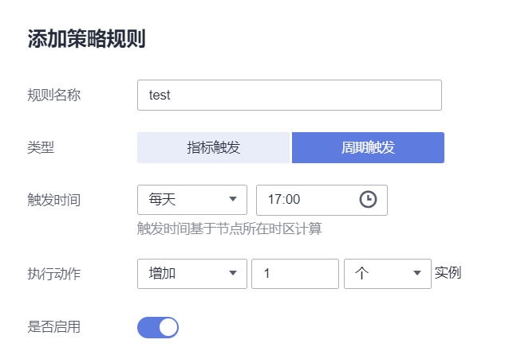

# 创建工作负载弹性伸缩（CustomedHPA）<a name="cce_10_0292"></a>

CustomedHPA策略是自研的弹性伸缩增强能力，能够基于指标（CPU利用率、内存利用率）或周期（每天、每周、每月或每年的具体时间点），对无状态工作负载进行弹性扩缩容。

主要功能如下：

-   支持按照当前实例数的百分比进行扩缩容。
-   支持设置一次扩缩容的最小步长。
-   支持按照实际指标值执行不同的扩缩容动作。

## 前提条件<a name="section194973810277"></a>

使用CustomedHPA策略必须安装[cce-hpa-controller](cce-hpa-controller.md)。若cce-hpa-controller版本低于1.2.11，则必须安装[prometheus](prometheus.md)插件；若版本大于或等于1.2.11，则需要安装能够提供Metrics API的插件，如kube-prometheus-stack、metrics-server或Prometheus。

## 约束与限制<a name="section107429267459"></a>

-   CustomedHPA策略：仅支持1.15及以上版本的集群创建。
-   每个工作负载只能创建一个[HPA策略](创建工作负载弹性伸缩（HPA）.md)或CustomedHPA策略。
-   1.19.10以下版本的集群中，如果使用HPA策略对挂载了EVS卷的负载进行扩容，当新Pod被调度到另一个节点时，会导致之前Pod不能正常读写。

    1.19.10及以上版本集群中，如果使用HPA策略对挂载了EVS卷的负载进行扩容，新Pod会因为无法挂载云硬盘导致无法成功启动。

-   cce-hpa-controller插件的资源使用量主要受集群中总容器数量和伸缩策略数量影响，通常场景下建议每5000容器配置CPU 500m, 内存1000Mi资源，每1000伸缩策略CPU 100m，内存500Mi。
-   若cce-hpa-controller插件版本低于1.2.11，不支持使用[kube-prometheus-stack](kube-prometheus-stack.md)插件提供Metrics API来实现工作负载弹性伸缩。

## 操作步骤<a name="section15633192745418"></a>

1.  在CCE控制台，单击集群名称进入集群。
2.  单击左侧导航栏的“负载伸缩“，选择“CustomedHPA策略“。
    -   若插件名称后方显示“未安装“，请单击插件后方的“安装“按钮，根据业务需求配置插件参数后单击“安装“，等待插件安装完成。
    -   若插件名称后方显示“已安装“，则说明插件已安装成功。

3.  确认插件已安装成功后，单击右上角“创建CustomedHPA策略“。
4.  填写策略参数。

    **表 1**  CustomedHPA策略参数配置

    <a name="table1318553420299"></a>
    <table><thead align="left"><tr id="row1718512347298"><th class="cellrowborder" valign="top" width="20.02%" id="mcps1.2.3.1.1"><p id="p21851034142915"><a name="p21851034142915"></a><a name="p21851034142915"></a>参数</p>
    </th>
    <th class="cellrowborder" valign="top" width="79.97999999999999%" id="mcps1.2.3.1.2"><p id="p9185134122918"><a name="p9185134122918"></a><a name="p9185134122918"></a>参数说明</p>
    </th>
    </tr>
    </thead>
    <tbody><tr id="row13185434192914"><td class="cellrowborder" valign="top" width="20.02%" headers="mcps1.2.3.1.1 "><p id="p1818519343291"><a name="p1818519343291"></a><a name="p1818519343291"></a>策略名称</p>
    </td>
    <td class="cellrowborder" valign="top" width="79.97999999999999%" headers="mcps1.2.3.1.2 "><p id="p171851134112914"><a name="p171851134112914"></a><a name="p171851134112914"></a>新建策略的名称，请自定义。</p>
    </td>
    </tr>
    <tr id="row14185173417296"><td class="cellrowborder" valign="top" width="20.02%" headers="mcps1.2.3.1.1 "><p id="p61852346296"><a name="p61852346296"></a><a name="p61852346296"></a>命名空间</p>
    </td>
    <td class="cellrowborder" valign="top" width="79.97999999999999%" headers="mcps1.2.3.1.2 "><p id="p12185163410297"><a name="p12185163410297"></a><a name="p12185163410297"></a>请选择工作负载所在的命名空间。</p>
    </td>
    </tr>
    <tr id="row2018563419298"><td class="cellrowborder" valign="top" width="20.02%" headers="mcps1.2.3.1.1 "><p id="p13185133415295"><a name="p13185133415295"></a><a name="p13185133415295"></a>关联工作负载</p>
    </td>
    <td class="cellrowborder" valign="top" width="79.97999999999999%" headers="mcps1.2.3.1.2 "><p id="p181851934122917"><a name="p181851934122917"></a><a name="p181851934122917"></a>请选择要设置CustomedHPA策略的工作负载。</p>
    </td>
    </tr>
    <tr id="row1318511345294"><td class="cellrowborder" valign="top" width="20.02%" headers="mcps1.2.3.1.1 "><p id="p1918573418291"><a name="p1918573418291"></a><a name="p1918573418291"></a>实例范围</p>
    </td>
    <td class="cellrowborder" valign="top" width="79.97999999999999%" headers="mcps1.2.3.1.2 "><p id="p17739423181414"><a name="p17739423181414"></a><a name="p17739423181414"></a>请输入最小实例数和最大实例数。</p>
    <p id="p1718553411296"><a name="p1718553411296"></a><a name="p1718553411296"></a>策略触发时，工作负载实例将在此范围内伸缩。</p>
    </td>
    </tr>
    <tr id="row1428311016121"><td class="cellrowborder" valign="top" width="20.02%" headers="mcps1.2.3.1.1 "><p id="p1328314013126"><a name="p1328314013126"></a><a name="p1328314013126"></a>冷却时间</p>
    </td>
    <td class="cellrowborder" valign="top" width="79.97999999999999%" headers="mcps1.2.3.1.2 "><p id="p161910175143"><a name="p161910175143"></a><a name="p161910175143"></a>请输入冷却时间值，单位为分钟。</p>
    <p id="p9283180161212"><a name="p9283180161212"></a><a name="p9283180161212"></a>策略成功触发后，在此冷却时间内，不会再次触发缩容/扩容，目的是等待伸缩动作完成后在系统稳定且集群正常的情况下进行下一次策略匹配。</p>
    </td>
    </tr>
    <tr id="row20185183462913"><td class="cellrowborder" valign="top" width="20.02%" headers="mcps1.2.3.1.1 "><p id="p918583418295"><a name="p918583418295"></a><a name="p918583418295"></a>策略规则</p>
    </td>
    <td class="cellrowborder" valign="top" width="79.97999999999999%" headers="mcps1.2.3.1.2 "><p id="p3272153618157"><a name="p3272153618157"></a><a name="p3272153618157"></a>单击<a name="image122890257013"></a><a name="image122890257013"></a><span></span>在弹出的窗口中设置伸缩策略参数：</p>
    <a name="ul1118523472911"></a><a name="ul1118523472911"></a><ul id="ul1118523472911"><li>规则名称：请输入规则名称，可自定义。</li><li>类型：可选择<span class="uicontrol" id="uicontrol111853343295"><a name="uicontrol111853343295"></a><a name="uicontrol111853343295"></a>“指标触发”</span>或<span class="uicontrol" id="uicontrol8537183924318"><a name="uicontrol8537183924318"></a><a name="uicontrol8537183924318"></a>“周期触发”</span>。</li></ul>
    <p id="p51991125164415"><a name="p51991125164415"></a><a name="p51991125164415"></a><strong id="b112712277447"><a name="b112712277447"></a><a name="b112712277447"></a>指标触发</strong></p>
    <a name="ul7210112510444"></a><a name="ul7210112510444"></a><ul id="ul7210112510444"><li>触发条件：请选择<span class="uicontrol" id="uicontrol139971753132917"><a name="uicontrol139971753132917"></a><a name="uicontrol139971753132917"></a>“CPU利用率”</span>或<span class="uicontrol" id="uicontrol8997553182915"><a name="uicontrol8997553182915"></a><a name="uicontrol8997553182915"></a>“内存利用率”</span>，选择<span class="uicontrol" id="uicontrol199971353172910"><a name="uicontrol199971353172910"></a><a name="uicontrol199971353172910"></a>“&gt;”</span>或<span class="uicontrol" id="uicontrol099715534291"><a name="uicontrol099715534291"></a><a name="uicontrol099715534291"></a>“&lt;”</span>，并输入百分比的值。如下图中所示，则表示CPU利用率瞬时值 &gt; 50% 时，立即执行此规则。<div class="note" id="note1751133503518"><a name="note1751133503518"></a><a name="note1751133503518"></a><span class="notetitle"> 说明： </span><div class="notebody"><p id="p12511735183515"><a name="p12511735183515"></a><a name="p12511735183515"></a>利用率 = 工作负载容器组（Pod）的实际使用量 / 申请量</p>
    </div></div>
    </li><li>执行动作：与上述<span class="uicontrol" id="uicontrol252785574112"><a name="uicontrol252785574112"></a><a name="uicontrol252785574112"></a>“触发条件”</span>相对应，达到触发条件值后所要执行的动作，可添加多个执行动作。如下图中所示，当CPU利用率超过50%时将伸缩至5个实例，当超过70%时伸缩至8个实例，当超过90%时在8个实例基础上再增加10个实例。反之，按此规则执行缩容。</li><li>是否启用：可选择启用或关闭该策略规则。</li></ul>
    <div class="fignone" id="fig543116367335"><a name="fig543116367335"></a><a name="fig543116367335"></a><span class="figcap"><b>图1 </b>触发条件</span><br><a name="image4198220619"></a><a name="image4198220619"></a><span></span></div>
    <p id="p1559773314518"><a name="p1559773314518"></a><a name="p1559773314518"></a><strong id="b1244574912453"><a name="b1244574912453"></a><a name="b1244574912453"></a>周期触发</strong></p>
    <a name="ul676113102462"></a><a name="ul676113102462"></a><ul id="ul676113102462"><li>触发时间：可选择每天、每周、每月或每年的具体时间点。</li><li>执行动作：与上述<span class="uicontrol" id="uicontrol9492546161716"><a name="uicontrol9492546161716"></a><a name="uicontrol9492546161716"></a>“触发时间”</span>相对应，达到触发时间值后所要执行的动作。如下图中所示，即每天17:00时将执行增加1个实例的动作。</li><li>是否启用：可选择启用或关闭该策略规则。</li></ul>
    <div class="fignone" id="fig626073005017"><a name="fig626073005017"></a><a name="fig626073005017"></a><span class="figcap"><b>图2 </b>周期触发-每天</span><br><a name="image1336892817615"></a><a name="image1336892817615"></a><span></span></div>
    <p id="p16849185724113"><a name="p16849185724113"></a><a name="p16849185724113"></a>单击确定后，您可以在列表中查看添加的策略规则。</p>
    </td>
    </tr>
    </tbody>
    </table>

5.  设置完成后，单击“创建“。

## 使用kubectl创建<a name="section13568124612282"></a>

CustomHPA是一种CRD资源，可按如下YAML定义。

```
apiVersion: autoscaling.cce.io/v1alpha1
kind: CustomedHorizontalPodAutoscaler
metadata:
  name: customhpa-example
  namespace: default
spec:
  coolDownTime: 3m             # 冷却时间
  maxReplicas: 10              # 最大实例数
  minReplicas: 1               # 最小实例数
  rules:
    - actions:                          # 策略规则
        - metricRange: 0,0.1            # 指标范围，表示从0到10%
          operationType: ScaleDown      # 伸缩类型，ScaleDown表示减少
          operationUnit: Task           # 操作单位，Task表示个数
          operationValue: 1             # 每次伸缩的数量
        - metricRange: 0.1,0.3          # 指标范围，表示从10%到30%
          operationType: ScaleDown
          operationUnit: Task
          operationValue: 2
      disable: false
      metricTrigger:
        hitThreshold: 1
        metricName: CPURatioToRequest   # 指标名称，CPURatioToRequest为CPU利用率
        metricOperation: <              # 指标表达式操作符
        metricValue: 0.3                # 指标表达式右侧取值
        periodSeconds: 60               # 
        statistic: instantaneous        #
      ruleName: low
      ruleType: Metric
    - actions:
        - metricRange: 0.7,0.9
          operationType: ScaleUp
          operationUnit: Task
          operationValue: 1
        - metricRange: 0.9,+Infinity
          operationType: ScaleUp
          operationUnit: Task
          operationValue: 2
      disable: false
      metricTrigger:
        hitThreshold: 1
        metricName: CPURatioToRequest
        metricOperation: '>'
        metricValue: 0.7
        periodSeconds: 60
        statistic: instantaneous
      ruleName: high
      ruleType: Metric
  scaleTargetRef:                # 关联负载      
    apiVersion: apps/v1
    kind: Deployment
    name: nginx
```

