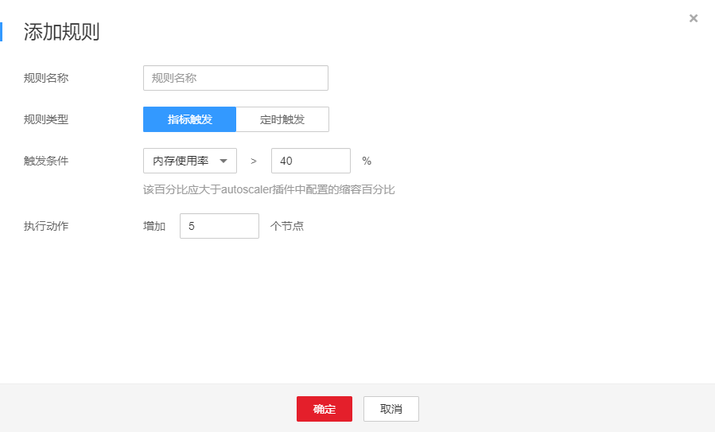
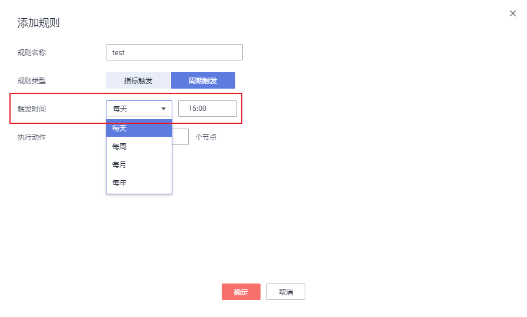
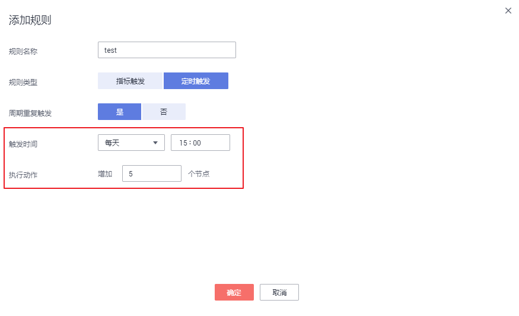

# 创建节点伸缩策略<a name="cce_01_0209"></a>

本章节介绍CCE中集群节点进行扩缩容的步骤。

## 前提条件<a name="section194973810277"></a>

使用节点伸缩功能前，需要安装[autoscaler](autoscaler.md)插件，插件版本要求1.13.8及以上。

## 操作步骤<a name="section4444195220142"></a>

1.  在[CCE控制台](https://console.huaweicloud.com/cce2.0/?utm_source=helpcenter)中，单击左侧导航栏的“弹性伸缩“，在“节点伸缩“页签下，单击“创建节点伸缩策略“按钮。
2.  进入创建节点伸缩策略页面，在“插件检测“步骤中：
    -   若插件名称后方显示，请单击插件后方的“现在安装“按钮，根据业务需求配置插件参数后单击“立即安装“，等待插件安装完成。
    -   若插件名称后方显示，则说明插件已安装成功。

3.  确认插件已安装成功后，单击“下一步：策略配置“。

    > **说明：**   
    >如果插件已提前安装成功，单击“创建节点伸缩策略”按钮后，在“插件检测“步骤中经过短暂检测后将直接进入“策略配置“步骤。  

4.  在打开的“创建节点伸缩策略“页面中，参照[表1](#table8638121213265)设置策略参数。

    **表 1**  节点伸缩策略参数配置

    <a name="table8638121213265"></a>
    <table><thead align="left"><tr id="row10638181262612"><th class="cellrowborder" valign="top" width="20.02%" id="mcps1.2.3.1.1"><p id="p1063821214265"><a name="p1063821214265"></a><a name="p1063821214265"></a>参数</p>
    </th>
    <th class="cellrowborder" valign="top" width="79.97999999999999%" id="mcps1.2.3.1.2"><p id="p1638181232617"><a name="p1638181232617"></a><a name="p1638181232617"></a>参数说明</p>
    </th>
    </tr>
    </thead>
    <tbody><tr id="row1922964644615"><td class="cellrowborder" valign="top" width="20.02%" headers="mcps1.2.3.1.1 "><p id="p9231104613468"><a name="p9231104613468"></a><a name="p9231104613468"></a>策略名称</p>
    </td>
    <td class="cellrowborder" valign="top" width="79.97999999999999%" headers="mcps1.2.3.1.2 "><p id="p285719544104"><a name="p285719544104"></a><a name="p285719544104"></a>新建策略的名称，请自定义。</p>
    </td>
    </tr>
    <tr id="row42961494311"><td class="cellrowborder" valign="top" width="20.02%" headers="mcps1.2.3.1.1 "><p id="p2714182116117"><a name="p2714182116117"></a><a name="p2714182116117"></a>关联节点池</p>
    </td>
    <td class="cellrowborder" valign="top" width="79.97999999999999%" headers="mcps1.2.3.1.2 "><p id="p189054447531"><a name="p189054447531"></a><a name="p189054447531"></a>请单击<span class="uicontrol" id="uicontrol16980163075118"><a name="uicontrol16980163075118"></a><a name="uicontrol16980163075118"></a>“添加节点池”</span>后选择要操作的节点池。您可以关联多个节点池，以使用相同的伸缩策略。</p>
    </td>
    </tr>
    <tr id="row572593234714"><td class="cellrowborder" valign="top" width="20.02%" headers="mcps1.2.3.1.1 "><p id="p14725432104718"><a name="p14725432104718"></a><a name="p14725432104718"></a>执行规则</p>
    </td>
    <td class="cellrowborder" valign="top" width="79.97999999999999%" headers="mcps1.2.3.1.2 "><p id="p14777027105419"><a name="p14777027105419"></a><a name="p14777027105419"></a>单击<span class="uicontrol" id="uicontrol125601469558"><a name="uicontrol125601469558"></a><a name="uicontrol125601469558"></a>“添加规则”</span>，在弹出的添加规则窗口中设置如下参数：</p>
    <p id="p661454207"><a name="p661454207"></a><a name="p661454207"></a><strong id="b146932024105818"><a name="b146932024105818"></a><a name="b146932024105818"></a>规则名称：</strong>请输入规则名称，可自定义。</p>
    <p id="p2614341704"><a name="p2614341704"></a><a name="p2614341704"></a><strong id="b116662273582"><a name="b116662273582"></a><a name="b116662273582"></a>规则类型：</strong>可选择<span class="uicontrol" id="uicontrol111853343295"><a name="uicontrol111853343295"></a><a name="uicontrol111853343295"></a>“指标触发”</span>或<span class="uicontrol" id="uicontrol146674905714"><a name="uicontrol146674905714"></a><a name="uicontrol146674905714"></a>“周期触发”</span>，两种类型区别如下：</p>
    <a name="ul56611653205511"></a><a name="ul56611653205511"></a><ul id="ul56611653205511"><li><strong id="b56106448161"><a name="b56106448161"></a><a name="b56106448161"></a>指标触发：</strong><a name="ul1350972245920"></a><a name="ul1350972245920"></a><ul id="ul1350972245920"><li>触发条件：请选择<span class="uicontrol" id="uicontrol219310529203"><a name="uicontrol219310529203"></a><a name="uicontrol219310529203"></a>“CPU分配率”</span>或<span class="uicontrol" id="uicontrol19952559102017"><a name="uicontrol19952559102017"></a><a name="uicontrol19952559102017"></a>“内存分配率”</span>，输入百分比的值。该百分比应大于autoscaler插件中配置的缩容百分比。<div class="note" id="note15358132231516"><a name="note15358132231516"></a><a name="note15358132231516"></a><span class="notetitle"> 说明： </span><div class="notebody"><p id="p1189683819150"><a name="p1189683819150"></a><a name="p1189683819150"></a>分配率 = 节点池容器组（Pod）资源申请量 / 节点池Pod可用资源量 (Node Allocatable) 。</p>
    </div></div>
    </li><li>执行动作：与上述<span class="uicontrol" id="uicontrol11314145173716"><a name="uicontrol11314145173716"></a><a name="uicontrol11314145173716"></a>“触发条件”</span>相对应，达到触发条件值后所要执行的动作。如<a href="#fig515211863120">图1</a>中所示，当内存分配率超过40%时将增加5个节点。<div class="fignone" id="fig515211863120"><a name="fig515211863120"></a><a name="fig515211863120"></a><span class="figcap"><b>图1 </b>指标触发-执行动作</span><br><a name="image1734771352112"></a><a name="image1734771352112"></a><span></span></div>
    </li></ul>
    </li><li><strong id="b22786482163"><a name="b22786482163"></a><a name="b22786482163"></a>周期触发：</strong><a name="ul102271758646"></a><a name="ul102271758646"></a><ul id="ul102271758646"><li>触发时间：可选择每天、每周、每月或每年的具体时间点，如<a href="#fig12500037161219">图2</a>所示，则为每天15:00触发。<div class="fignone" id="fig12500037161219"><a name="fig12500037161219"></a><a name="fig12500037161219"></a><span class="figcap"><b>图2 </b>周期触发时间</span><br><a name="image211521212574"></a><a name="image211521212574"></a><span></span></div>
    </li><li>执行动作：与上述<span class="uicontrol" id="uicontrol9492546161716"><a name="uicontrol9492546161716"></a><a name="uicontrol9492546161716"></a>“触发时间”</span>相对应，达到触发时间值后所要执行的动作。如<a href="#fig5492546111720">图3</a>中所示，即每天15:00时将执行增加5个节点的动作。<div class="fignone" id="fig5492546111720"><a name="fig5492546111720"></a><a name="fig5492546111720"></a><span class="figcap"><b>图3 </b>定时触发-执行动作</span><br><a name="image280502305813"></a><a name="image280502305813"></a><span></span></div>
    </li></ul>
    </li></ul>
    <p id="p162368519564"><a name="p162368519564"></a><a name="p162368519564"></a>您可以单击<span class="uicontrol" id="uicontrol14739184295617"><a name="uicontrol14739184295617"></a><a name="uicontrol14739184295617"></a>“添加规则”</span>，设置多条节点伸缩策略。您最多可以添加1条CPU使用率指标规则、1条内存使用率指标规则，且规则总数小于等于10条。</p>
    </td>
    </tr>
    </tbody>
    </table>

5.  设置完成后，单击“创建“，在“完成“步骤中若显示“创建节点伸缩策略\*\*\*任务提交成功“，可单击“返回节点策略“。
6.  在“节点伸缩“页签下，可以看到刚刚创建的节点伸缩策略。

    **图 4**  节点伸缩策略<a name="fig196162491011"></a>  
    


## Yaml样例<a name="section3613595209"></a>

节点伸缩策略Yaml样例如下：

```
apiVersion: autoscaling.cce.io/v1alpha1
kind: HorizontalNodeAutoscaler
metadata:
  creationTimestamp: "2020-02-13T12:47:49Z"
  generation: 1
  name: xxxx
  namespace: kube-system
  resourceVersion: "11433270"
  selfLink: /apis/autoscaling.cce.io/v1alpha1/namespaces/kube-system/horizontalnodeautoscalers/xxxx
  uid: c2bd1e1d-60aa-47b5-938c-6bf3fadbe91f
spec:
  disable: false
  rules:
  - action:
      type: ScaleUp
      unit: Node
      value: 1
    cronTrigger:
      schedule: 47 20 * * *
    disable: false
    ruleName: cronrule
    type: Cron
  - action:
      type: ScaleUp
      unit: Node
      value: 2
    disable: false
    metricTrigger:
      metricName: Cpu
      metricOperation: '>'
      metricValue: "40"
      unit: Percent
    ruleName: metricrule
    type: Metric
  targetNodepoolIds:
  - 7d48eca7-3419-11ea-bc29-0255ac1001a8
```

**表 2**  关键参数说明

<a name="table18763092201"></a>
<table><thead align="left"><tr id="row12761209132012"><th class="cellrowborder" valign="top" width="39.43394339433943%" id="mcps1.2.4.1.1"><p id="p10761892207"><a name="p10761892207"></a><a name="p10761892207"></a>参数</p>
</th>
<th class="cellrowborder" valign="top" width="16.121612161216124%" id="mcps1.2.4.1.2"><p id="p07611972013"><a name="p07611972013"></a><a name="p07611972013"></a>参数类型</p>
</th>
<th class="cellrowborder" valign="top" width="44.44444444444445%" id="mcps1.2.4.1.3"><p id="p2761179192020"><a name="p2761179192020"></a><a name="p2761179192020"></a>描述</p>
</th>
</tr>
</thead>
<tbody><tr id="row876119932015"><td class="cellrowborder" valign="top" width="39.43394339433943%" headers="mcps1.2.4.1.1 "><p id="p157612932014"><a name="p157612932014"></a><a name="p157612932014"></a>spec.disable</p>
</td>
<td class="cellrowborder" valign="top" width="16.121612161216124%" headers="mcps1.2.4.1.2 "><p id="p187611398202"><a name="p187611398202"></a><a name="p187611398202"></a>Bool</p>
</td>
<td class="cellrowborder" valign="top" width="44.44444444444445%" headers="mcps1.2.4.1.3 "><p id="p1476115922010"><a name="p1476115922010"></a><a name="p1476115922010"></a>伸缩策略开关，会对策略中的所有规则生效</p>
</td>
</tr>
<tr id="row18761199152019"><td class="cellrowborder" valign="top" width="39.43394339433943%" headers="mcps1.2.4.1.1 "><p id="p1076179202019"><a name="p1076179202019"></a><a name="p1076179202019"></a>spec.rules</p>
</td>
<td class="cellrowborder" valign="top" width="16.121612161216124%" headers="mcps1.2.4.1.2 "><p id="p1176199132018"><a name="p1176199132018"></a><a name="p1176199132018"></a>Array</p>
</td>
<td class="cellrowborder" valign="top" width="44.44444444444445%" headers="mcps1.2.4.1.3 "><p id="p4761209152012"><a name="p4761209152012"></a><a name="p4761209152012"></a>伸缩策略中的所有规则</p>
</td>
</tr>
<tr id="row1876119912207"><td class="cellrowborder" valign="top" width="39.43394339433943%" headers="mcps1.2.4.1.1 "><p id="p976116910202"><a name="p976116910202"></a><a name="p976116910202"></a>spec.rules[x].ruleName</p>
</td>
<td class="cellrowborder" valign="top" width="16.121612161216124%" headers="mcps1.2.4.1.2 "><p id="p1576179142015"><a name="p1576179142015"></a><a name="p1576179142015"></a>String</p>
</td>
<td class="cellrowborder" valign="top" width="44.44444444444445%" headers="mcps1.2.4.1.3 "><p id="p2076179192017"><a name="p2076179192017"></a><a name="p2076179192017"></a>规则名称</p>
</td>
</tr>
<tr id="row776129162011"><td class="cellrowborder" valign="top" width="39.43394339433943%" headers="mcps1.2.4.1.1 "><p id="p976109102012"><a name="p976109102012"></a><a name="p976109102012"></a>spec.rules[x].type</p>
</td>
<td class="cellrowborder" valign="top" width="16.121612161216124%" headers="mcps1.2.4.1.2 "><p id="p17761899200"><a name="p17761899200"></a><a name="p17761899200"></a>String</p>
</td>
<td class="cellrowborder" valign="top" width="44.44444444444445%" headers="mcps1.2.4.1.3 "><p id="p97615952019"><a name="p97615952019"></a><a name="p97615952019"></a>规则类型，当前支持“Cron”和“Metric”两种类型</p>
</td>
</tr>
<tr id="row1376119102017"><td class="cellrowborder" valign="top" width="39.43394339433943%" headers="mcps1.2.4.1.1 "><p id="p1976119911207"><a name="p1976119911207"></a><a name="p1976119911207"></a>spec.rules[x].disable</p>
</td>
<td class="cellrowborder" valign="top" width="16.121612161216124%" headers="mcps1.2.4.1.2 "><p id="p107613972014"><a name="p107613972014"></a><a name="p107613972014"></a>Bool</p>
</td>
<td class="cellrowborder" valign="top" width="44.44444444444445%" headers="mcps1.2.4.1.3 "><p id="p197611696205"><a name="p197611696205"></a><a name="p197611696205"></a>规则开关，当前仅支持“false”</p>
</td>
</tr>
<tr id="row16761119142014"><td class="cellrowborder" valign="top" width="39.43394339433943%" headers="mcps1.2.4.1.1 "><p id="p57616910204"><a name="p57616910204"></a><a name="p57616910204"></a>spec.rules[x].action.type</p>
</td>
<td class="cellrowborder" valign="top" width="16.121612161216124%" headers="mcps1.2.4.1.2 "><p id="p476129122013"><a name="p476129122013"></a><a name="p476129122013"></a>String</p>
</td>
<td class="cellrowborder" valign="top" width="44.44444444444445%" headers="mcps1.2.4.1.3 "><p id="p1476116972016"><a name="p1476116972016"></a><a name="p1476116972016"></a>规则操作类型，当前仅支持“ScaleUp”</p>
</td>
</tr>
<tr id="row87621197201"><td class="cellrowborder" valign="top" width="39.43394339433943%" headers="mcps1.2.4.1.1 "><p id="p17611910205"><a name="p17611910205"></a><a name="p17611910205"></a>spec.rules[x].action.unit</p>
</td>
<td class="cellrowborder" valign="top" width="16.121612161216124%" headers="mcps1.2.4.1.2 "><p id="p1476214918204"><a name="p1476214918204"></a><a name="p1476214918204"></a>String</p>
</td>
<td class="cellrowborder" valign="top" width="44.44444444444445%" headers="mcps1.2.4.1.3 "><p id="p167625982016"><a name="p167625982016"></a><a name="p167625982016"></a>规则操作单位，当前仅支持“Node”</p>
</td>
</tr>
<tr id="row1476213962014"><td class="cellrowborder" valign="top" width="39.43394339433943%" headers="mcps1.2.4.1.1 "><p id="p157625922019"><a name="p157625922019"></a><a name="p157625922019"></a>spec.rules[x].action.value</p>
</td>
<td class="cellrowborder" valign="top" width="16.121612161216124%" headers="mcps1.2.4.1.2 "><p id="p0762179122011"><a name="p0762179122011"></a><a name="p0762179122011"></a>Integer</p>
</td>
<td class="cellrowborder" valign="top" width="44.44444444444445%" headers="mcps1.2.4.1.3 "><p id="p187622962018"><a name="p187622962018"></a><a name="p187622962018"></a>规则操作数值</p>
</td>
</tr>
<tr id="row18762793203"><td class="cellrowborder" valign="top" width="39.43394339433943%" headers="mcps1.2.4.1.1 "><p id="p137624952012"><a name="p137624952012"></a><a name="p137624952012"></a>spec.rules[x].cronTrigger</p>
</td>
<td class="cellrowborder" valign="top" width="16.121612161216124%" headers="mcps1.2.4.1.2 "><p id="p67625918202"><a name="p67625918202"></a><a name="p67625918202"></a>/</p>
</td>
<td class="cellrowborder" valign="top" width="44.44444444444445%" headers="mcps1.2.4.1.3 "><p id="p11762892207"><a name="p11762892207"></a><a name="p11762892207"></a>可选，仅在周期规则中有效</p>
</td>
</tr>
<tr id="row5762597202"><td class="cellrowborder" valign="top" width="39.43394339433943%" headers="mcps1.2.4.1.1 "><p id="p5762189122014"><a name="p5762189122014"></a><a name="p5762189122014"></a>spec.rules[x].cronTrigger.schedule</p>
</td>
<td class="cellrowborder" valign="top" width="16.121612161216124%" headers="mcps1.2.4.1.2 "><p id="p15762199112011"><a name="p15762199112011"></a><a name="p15762199112011"></a>String</p>
</td>
<td class="cellrowborder" valign="top" width="44.44444444444445%" headers="mcps1.2.4.1.3 "><p id="p67621932020"><a name="p67621932020"></a><a name="p67621932020"></a>周期规则的cron表达式</p>
</td>
</tr>
<tr id="row37621496208"><td class="cellrowborder" valign="top" width="39.43394339433943%" headers="mcps1.2.4.1.1 "><p id="p157621398201"><a name="p157621398201"></a><a name="p157621398201"></a>spec.rules[x].metricTrigger</p>
</td>
<td class="cellrowborder" valign="top" width="16.121612161216124%" headers="mcps1.2.4.1.2 "><p id="p17762394209"><a name="p17762394209"></a><a name="p17762394209"></a>/</p>
</td>
<td class="cellrowborder" valign="top" width="44.44444444444445%" headers="mcps1.2.4.1.3 "><p id="p3762189152010"><a name="p3762189152010"></a><a name="p3762189152010"></a>可选，仅在指标规则中有效</p>
</td>
</tr>
<tr id="row776299102010"><td class="cellrowborder" valign="top" width="39.43394339433943%" headers="mcps1.2.4.1.1 "><p id="p576289152018"><a name="p576289152018"></a><a name="p576289152018"></a>spec.rules[x].metricTrigger.metricName</p>
</td>
<td class="cellrowborder" valign="top" width="16.121612161216124%" headers="mcps1.2.4.1.2 "><p id="p13762139192010"><a name="p13762139192010"></a><a name="p13762139192010"></a>String</p>
</td>
<td class="cellrowborder" valign="top" width="44.44444444444445%" headers="mcps1.2.4.1.3 "><p id="p1176218992015"><a name="p1176218992015"></a><a name="p1176218992015"></a>指标规则对应的指标，当前支持“Cpu”和“Memory”两种类型</p>
</td>
</tr>
<tr id="row876217919201"><td class="cellrowborder" valign="top" width="39.43394339433943%" headers="mcps1.2.4.1.1 "><p id="p187626913202"><a name="p187626913202"></a><a name="p187626913202"></a>spec.rules[x].metricTrigger.metricOperation</p>
</td>
<td class="cellrowborder" valign="top" width="16.121612161216124%" headers="mcps1.2.4.1.2 "><p id="p87622098209"><a name="p87622098209"></a><a name="p87622098209"></a>String</p>
</td>
<td class="cellrowborder" valign="top" width="44.44444444444445%" headers="mcps1.2.4.1.3 "><p id="p07621298205"><a name="p07621298205"></a><a name="p07621298205"></a>指标规则的比较符，当前仅支持“&gt;”</p>
</td>
</tr>
<tr id="row77631922017"><td class="cellrowborder" valign="top" width="39.43394339433943%" headers="mcps1.2.4.1.1 "><p id="p1762693205"><a name="p1762693205"></a><a name="p1762693205"></a>spec.rules[x].metricTrigger.metricValue</p>
</td>
<td class="cellrowborder" valign="top" width="16.121612161216124%" headers="mcps1.2.4.1.2 "><p id="p776219920206"><a name="p776219920206"></a><a name="p776219920206"></a>String</p>
</td>
<td class="cellrowborder" valign="top" width="44.44444444444445%" headers="mcps1.2.4.1.3 "><p id="p4762159162010"><a name="p4762159162010"></a><a name="p4762159162010"></a>指标规则的阈值，支持1-100之间的所有整数，需以字符串表示</p>
</td>
</tr>
<tr id="row12763169172011"><td class="cellrowborder" valign="top" width="39.43394339433943%" headers="mcps1.2.4.1.1 "><p id="p57639982014"><a name="p57639982014"></a><a name="p57639982014"></a>spec.rules[x].metricTrigger.Unit</p>
</td>
<td class="cellrowborder" valign="top" width="16.121612161216124%" headers="mcps1.2.4.1.2 "><p id="p19763189122011"><a name="p19763189122011"></a><a name="p19763189122011"></a>String</p>
</td>
<td class="cellrowborder" valign="top" width="44.44444444444445%" headers="mcps1.2.4.1.3 "><p id="p14763298203"><a name="p14763298203"></a><a name="p14763298203"></a>指标规则阈值的单位，当前仅支持“%”</p>
</td>
</tr>
<tr id="row1276313914203"><td class="cellrowborder" valign="top" width="39.43394339433943%" headers="mcps1.2.4.1.1 "><p id="p157634914202"><a name="p157634914202"></a><a name="p157634914202"></a>spec.targetNodepoolIds</p>
</td>
<td class="cellrowborder" valign="top" width="16.121612161216124%" headers="mcps1.2.4.1.2 "><p id="p2076314918202"><a name="p2076314918202"></a><a name="p2076314918202"></a>Array</p>
</td>
<td class="cellrowborder" valign="top" width="44.44444444444445%" headers="mcps1.2.4.1.3 "><p id="p127636972016"><a name="p127636972016"></a><a name="p127636972016"></a>伸缩策略关联的所有节点池</p>
</td>
</tr>
<tr id="row1776316942015"><td class="cellrowborder" valign="top" width="39.43394339433943%" headers="mcps1.2.4.1.1 "><p id="p19763199132011"><a name="p19763199132011"></a><a name="p19763199132011"></a>spec.targetNodepoolIds[x]</p>
</td>
<td class="cellrowborder" valign="top" width="16.121612161216124%" headers="mcps1.2.4.1.2 "><p id="p4763390209"><a name="p4763390209"></a><a name="p4763390209"></a>String</p>
</td>
<td class="cellrowborder" valign="top" width="44.44444444444445%" headers="mcps1.2.4.1.3 "><p id="p157631591201"><a name="p157631591201"></a><a name="p157631591201"></a>伸缩策略关联节点池的uid</p>
</td>
</tr>
</tbody>
</table>

## 常见问题<a name="section141326110362"></a>

1.  **如果多条规则同时满足条件，会如何执行？**

    该问题有如下两种情况：

    -   如果同时配置了“CPU分配率“和“内存分配率“的规则，两种或多种规则同时满足扩容条件时，执行扩容节点数更多的规则。
    -   如果同时配置了“CPU分配率“和“周期触发“的规则，当达到“周期触发“的时间值时CPU也满足扩容条件时，较早执行的A规则会将节点池状态置为伸缩中状态，导致B规则无法正常执行。待A规则执行完毕，节点池状态恢复正常后，B规则也不会执行。

2.  **配置了CPU或者内存规则后，策略的检测周期是多久？是否只要一次检测出满足条件就会触发扩容节点？**

    周期不固定，会因autoscaler每次循环的处理逻辑而变动。只要一次检测出满足条件就会触发扩容（当然还要满足冷却时间、节点池状态等约束条件）。

3.  **节点伸缩和autoscaler插件的本身功能如何配合？**

    节点伸缩中创建的策略和autoscaler插件中的配置同时生效时，比如不可调度和指标规则同时满足时，优先执行不可调度扩容。

    -   若不可调度执行成功，跳过指标规则逻辑，进入下一次循环。
    -   若不可调度执行失败，才执行指标规则逻辑。


