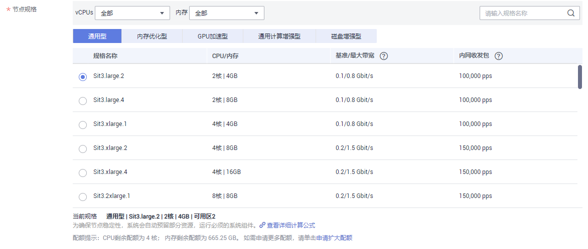
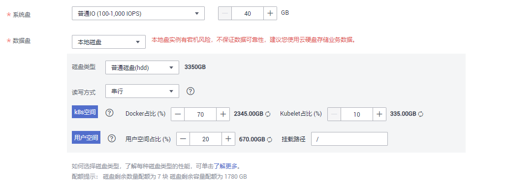
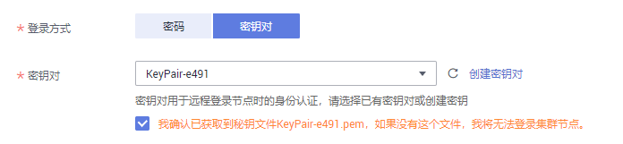
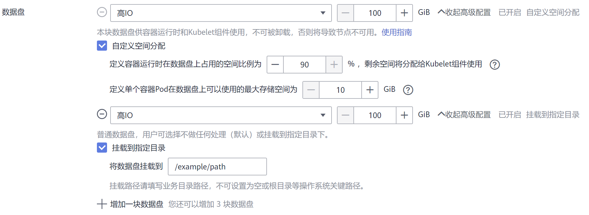
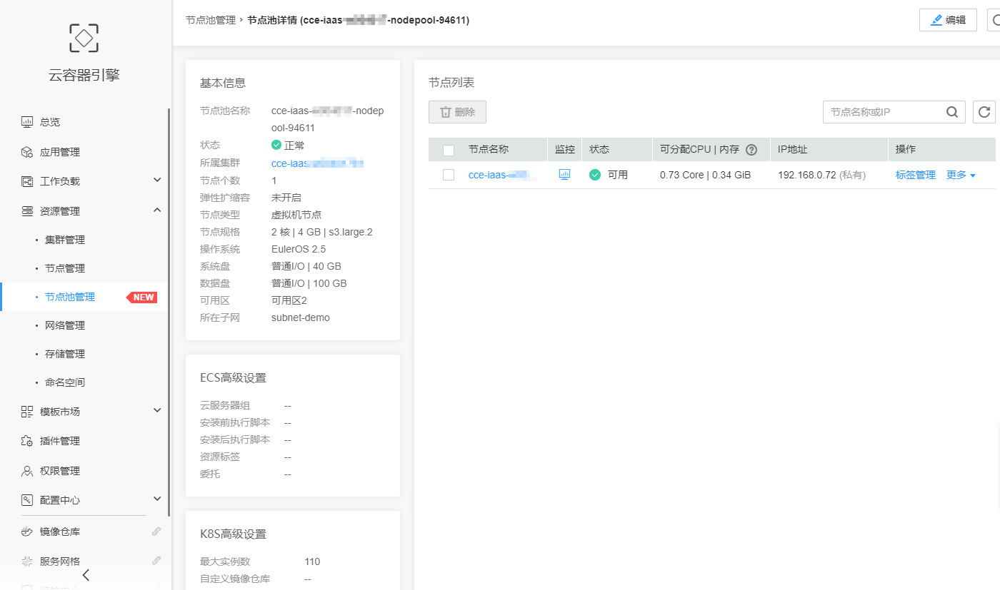

# 创建节点池

## 操作场景

本章介绍了如何添加运行节点池以及对节点池执行操作。要了解节点池的工作原理，请参阅[节点池概述](节点池概述.md)。

## 约束与限制

-   CCE Turbo集群仅支持在新版本UI设置弹性扩缩容，具体设置请参见[操作步骤-新UI](#section953835110714)。
-   支持在新版本UI设置节点池包周期计费，具体设置请参见[操作步骤-新UI](#section953835110714)。
-   节点弹性伸缩功能需要安装autoscaler插件，具体安装与参数配置请参见[autoscaler](autoscaler.md)。
-   仅按需计费支持节点弹性伸缩，包年/包月计费模式不支持弹性伸缩。

## 操作步骤

将节点池添加到现有集群。

1.  登录CCE控制台，在左侧导航栏中选择“资源管理 \> 节点池管理“。
2.  单击右上角的“创建节点池“。
3.  在创建节点池页面中，参照如下说明设置节点池选型参数。
    -   **计费模式：**

        节点池仅支持“按需计费“的计费模式，该模式将根据实际使用的资源按小时计费。

        节点池创建后，自建的节点池里的资源无法转包周期，默认节点池里的资源可以转包周期。您可以把自建节点池里的资源迁移到默认的节点池里后再进行转包周期的操作。如何迁移请参见[迁移节点](管理节点池.md#section8215206283)。

    -   **当前区域：**指节点实例所在的物理位置。

        请就近选择靠近您业务的区域，可减少网络时延，提高访问速度；不同区域的云服务产品之间内网互不相通。

    -   **节点池名称：**新建节点池的名称，默认按“集群名-nodepool-随机数”生成名称，可自定义。
    -   **节点类型：**目前仅支持虚拟机节点。
    -   **节点购买数量：**该节点池下购买的节点数量，此处设置的节点数不能超过集群管理的最大节点规模，请根据业务需求和界面提示选择，如需更多配额，请单击[提交工单](https://console.huaweicloud.com/quota/?locale=zh-cn#/quota)申请扩大配额。
    -   **弹性扩缩容：**（CCE Turbo集群仅支持在新版本UI设置弹性扩缩容，具体设置请参见[操作步骤-新UI](#section953835110714)）
        -   默认不开启。
        -   单击开启后，节点池将根据集群负载情况自动创建或删除节点池内的节点，参数设置如下：

            -   节点数上限和节点数下限：您可设置节点数的上限和下限，保证节点数在合理的范围内伸缩。
            -   优先级：请根据业务需要设置相应数值，该数值表示节点池之间进行弹性扩缩容的优先级，数值越大优先级越高，如设置为4的节点池比设置为1的节点池优先启动弹性伸缩。若多个节点池的值设置相同，如都设置为2，表示这几个节点池之间不分优先级，系统将按最小资源浪费原则进行伸缩。

                > **说明：** 
                >弹性扩容时CCE将按照如下策略来选择节点池进行扩容：
                >1.  通过预判算法判断节点池是否能满足让Pending的Pod正常调度的条件，包括节点资源大于Pod的request值、nodeSelect、nodeAffinity和taints等是否满足Pod正常调度的条件；另外还会过滤掉扩容失败（因为资源不足等原因）还处于15min冷却时间的节点池。
                >2.  有多个节点池满足条件时，判断节点池设置的优先级（优先级默认值为0，取值范围为0-100，其中100为最高，0为最低），选择优先级最高的节点池扩容。
                >3.  如果有多个节点池处于相同的优先级，或者都没有配置优先级时，通过最小浪费原则，根据节点池里设置的虚拟机规格，计算刚好能满足Pending的Pod正常调度，且浪费资源最少的节点池。
                >4.  如果还是有多个节点池的虚拟机规格都一样，只是AZ不同，那么会随机选择其中一个节点池触发扩容。

            -   弹性缩容冷却时间：请设置时间，单位为分钟或小时。弹性缩容冷却时间是指当前节点池扩容出的节点多长时间不能被缩容。

                节点池中配置的缩容冷却时间和[autoscaler插件](autoscaler.md)中配置的缩容冷却时间之间的影响和关系如下：

                **节点池配置的缩容冷却时间**

                弹性缩容冷却时间：当前节点池扩容出的节点多长时间不能被缩容，作用范围为节点池级别。

                **autoscaler插件配置的缩容冷却时间**

                扩容后缩容冷却时间：autoscaler触发扩容后（不可调度、指标、周期策略）整个集群多长时间内不能被缩容，作用范围为集群级别。

                节点删除后缩容冷却时间：autoscaler触发缩容后整个集群多长时间内不能继续缩容，作用范围为集群级别。

                缩容失败后缩容冷却时间：autoscaler触发缩容失败后整个集群多长时间内不能继续缩容，作用范围为集群级别。

            > **说明：** 
            >节点池中的节点建议不要放置重要数据，以防止节点被弹性缩容，数据无法恢复。

            为保证功能的正常使用，节点池开启弹性扩缩容功能后，请务必安装[AutoScaler插件](autoscaler.md)。

    -   **可用区：**可用区是在同一区域下，电力、网络隔离的物理区域，可用区之间内网互通，不同可用区之间物理隔离。

        请根据业务需要进行选择。**节点池创建之后不支持修改可用区属性，请谨慎选择。**

        如果您需要提高工作负载的高可靠性，建议您选择“**随机可用区**”，将节点随机均匀分布在不同可用区中。

    -   **节点规格：**请根据业务需求选择相应的节点规格。

        -   通用型：该类型实例提供均衡的计算、存储以及网络配置，适用于大多数的使用场景。通用型实例可用于Web服务器、开发测试环境以及小型数据库工作负载等场景。
        -   内存优化型：该类型实例提供内存比例更高的实例，可以用于对内存要求较高、数据量大的工作负载，例如关系数据库、NoSQL等场景。
        -   通用入门型：通用入门型实例提供均衡的计算、存储以及网络配置，利用CPU积分机制保证基准性能，适合平时不会持续高压力使用CPU，但偶尔需要提高计算性能完成工作负载的场景，可用于轻量级Web服务器、开发、测试环境以及中低性能数据库等场景。
        -   GPU加速型：提供优秀的浮点计算能力，从容应对高实时、高并发的海量计算场景。P系列适合于深度学习，科学计算，CAE等；G系列适合于3D动画渲染，CAD等。**仅支持1.11及以上版本集群添加GPU加速型节点。**
        -   高性能计算型：实例提供具有更稳定、超高性能计算性能的实例，可以用于超高性能计算能力、高吞吐量的工作负载场景，例如科学计算。
        -   通用计算增强型：该类型实例具有性能稳定且资源独享的特点，满足计算性能高且稳定的企业级工作负载诉求。
        -   磁盘增强型：该类型实例能提供可使用[本地磁盘存储](本地磁盘存储.md)以及更高网络性能的实例，可以用于处理需要高吞吐以及高数据交换处理的工作负载，例如大数据工作负载等场景。
        -   超高I/O型：该类型实例提供超低SSD盘访问延迟和超高IOPS性能，适用于高性能关系型数据库、NoSQL数据库（如Cassandra、MongoDB）、ElasticSearch搜索等场景。
        -   AI加速型：AI加速型节点实例，搭载高性能、低功耗的海思Ascend 310 AI处理器，实现快速高效地处理推理和图像识别等工作，适用于图像识别、视频处理、推理计算以及机器学习等场景。

            > **说明：** 
            >-   当前AI加速型节点仅在部分可用区可选。
            >-   选用AI加速型的节点前需要安装[huawei-npu](huawei-npu.md)插件，以保证使用昇腾 310芯片资源的负载可以正常运行。
            >-   节点创建成功后会安装D310芯片驱动并自动触发节点重启，期间会有短暂的节点不可用，属于正常现象，重启完成后可恢复正常。

        **图 1**  选择节点规格  
        

        为确保节点稳定性，系统会自动预留部分资源，用于运行必须的系统组件。详细请参见[节点预留资源计算公式](节点预留资源计算公式.md)。

    -   **操作系统：**部分Region不显示下方分类，请直接选择节点对应的操作系统。

        -   公共镜像：请选择节点对应的操作系统。
        -   私有镜像（公测中）：若没有私有镜像可选择，请单击“创建私有镜像指引“进行制作，**该功能仅支持v1.15及以上版本集群。**详细操作步骤请参见[如何使用私有镜像制作工作节点镜像？](https://support.huaweicloud.com/bestpractice-cce/cce_bestpractice_00026.html)。

        > **须知：** 
        >重装操作系统或修改操作系统配置将导致节点不可用，请务必谨慎操作，具体请参见[高危操作及解决方案](高危操作及解决方案.md)。

    -   **虚拟私有云：**跟随集群，不可变更。

        **该参数仅在v1.13.10-r0及以上版本的集群中支持，否则不显示。**

    -   **所在子网：**通过子网提供与其他网络隔离的、可以独享的网络资源，以提高网络安全。

        可选择该集群虚拟私有云下的任意子网，集群节点支持跨子网。

        请确保子网下的DNS服务器可以解析OBS服务域名，否则无法创建节点。

        **该参数仅在v1.13.10-r0及以上版本的集群中支持，否则不显示。**

    -   **系统盘：**设置工作节点的系统盘空间。您可以设置系统盘的规格为40GB-1024GB之间的数值，缺省值为40GB。

        在默认情况下，系统盘可提供高I/O（SAS）、超高I/O（SSD）几种基本的云硬盘类型，关于云硬盘的详细信息请参见[云硬盘概述](https://support.huaweicloud.com/usermanual-ecs/ecs_03_0301.html)。

        加密：数据盘加密功能可为您的数据提供强大的安全防护，加密磁盘生成的快照及通过这些快照创建的磁盘将自动继承加密功能。**目前仅在部分Region显示此选项，具体以界面为准。**

        -   默认不加密。
        -   点选“加密“后，可在弹出的“加密设置“对话框中，选择已有的密钥，若没有可选的密钥，请单击后方的链接创建新密钥，完成创建后单击刷新按钮。

    -   **数据盘：**设置工作节点的数据盘空间。您可以设置数据盘的规格为100GB-32768GB之间的数值，缺省值为100GB。数据盘可提供的云硬盘类型与上方系统盘一致。

        > **注意：** 
        >若数据盘卸载或损坏，会导致docker服务异常，最终导致节点不可用。建议不要删除该数据盘。

        -   LVM管理：CCE数据盘使用LVM（Logical Volume Manager）进行磁盘管理，开启后您可以通过空间分配调整数据盘中不同资源的空间占比。第一块盘默认选中不可更改，新增数据盘后可开启或关闭该功能：
            -   默认选中，开启LVM管理。
            -   取消选中，关闭LVM管理。

                > **注意：** 
                >-   开启LVM管理的数据盘将按照设置的比例进行统一分配。
                >-   1.13.10及更高版本的集群创建节点时，若未开启LVM管理的数据盘，请参考[给CCE集群的节点添加第二块数据盘](给CCE集群的节点添加第二块数据盘.md)填写安装前执行脚本进行格式化，否则该数据盘仍会被LVM管理。
                >-   1.13.10之前版本的集群创建节点时，若未开启LVM管理的数据盘请务必格式化，否则会与第一块数据盘进行二选一被LVM管理，进而导致与预期不符的情况。

        -   加密：数据盘加密功能可为您的数据提供强大的安全防护，加密磁盘生成的快照及通过这些快照创建的磁盘将自动继承加密功能。

            **该功能仅在部分Region的1.13.10及以上版本的集群中支持**，1.13.10之前版本的集群不显示此选项。

            -   默认不加密。
            -   点选“加密“后，可在弹出的“加密设置“对话框中，选择已有的密钥，若没有可选的密钥，请单击后方的链接创建新密钥，完成创建后单击刷新按钮。

        -   新增数据盘：当前仅支持挂载两块数据盘，您可以在节点创建完成后前往ECS添加更多数据盘。部分集群版本不支持此功能，具体以界面为准。
        -   数据盘空间分配：单击后方的，可以对数据盘中的“k8s空间“和“用户空间“占比进行自定义设置，开启LVM管理的数据盘将按照设置的比例进行统一分配。部分集群版本不支持此功能，具体以界面为准。
            -   k8s空间：您可以自定义数据盘中Docker和Kubelet的资源占比。Docker资源包含Docker工作目录、Docker镜像数据以及镜像元数据；Kubelet资源包含Pod配置文件、密钥以及临时存储EmptyDir等挂载数据。

                Docker占比不能小于10%，且空间大小不能小于60G；Kubelet占比不能小于10%。

                Docker空间大小配置跟实际业务有关，详细的说明请参见[数据盘空间分配说明](数据盘空间分配说明.md)。

            -   用户空间：定义本地盘中不分配给kubernetes使用的空间大小和用户空间挂载路径。

                > **说明：** 
                >注意挂载路径不能设置为 /、/home/paas、/var/paas、/var/lib、/var/script、/var/log/、/mnt/paas、/opt/cloud，不能和系统目录冲突（例如bin、lib、home、root、boot、dev、etc、lost+found、mnt、proc、sbin、srv、tmp、var、media、opt、selinux、sys、usr等），否则会导致系统或节点安装失败。

        **当集群版本为v1.13.10-r0及以上，且节点规格为“磁盘增强型”或“超高I/O型”时，数据盘将显示如下选项：**

        -   云硬盘：与节点类型为非“磁盘增强型”或“超高I/O型”时的数据盘一致，此处不再赘述，详情参见上方的[数据盘](#li1931815591054)。
        -   本地磁盘：本地磁盘实例有宕机风险，不保证数据可靠性，建议您使用**云硬盘**存储您的业务数据。

            本地磁盘配置参数如下：

            -   磁盘类型：节点类型为“磁盘增强型“时支持普通磁盘\(hdd\)；节点类型为“超高I/O型“时支持固态硬盘\(ssd\)。
            -   读写方式：当**存在多块本地盘时**可以设置读写方式，支持“串行“和“并行“两种方式。串行表示数据读写为线性模式，当一块盘使用完才会使用下一块；并行表示数据读写为条带模式，可以同时读写多块本地盘。
            -   k8s空间：您可以自定义数据盘中Docker和Kubelet的资源占比。Docker资源包含Docker工作目录、Docker镜像数据以及镜像元数据；Kubelet资源包含Pod配置文件、密钥以及临时存储EmptyDir等挂载数据。
            -   用户空间：定义本地盘中不分配给kubernetes使用的空间大小和用户空间挂载路径。

        > **须知：** 
        >-   在数据盘中设置“k8s空间“和“用户空间“占比时，需满足k8s空间和用户空间总和为100%，设置后可单击自动调整数据。
        >-   磁盘使用direct-lvm模式，移除将使用loop-lvm模式，有影响系统稳定性的风险。

        **图 2**  设置本地磁盘  
        

    -   **登录方式：**支持密码和密钥对。
        -   选择“密码“：用户名默认为“root”，请输入登录节点的密码，并确认密码。

            登录节点时需要使用该密码，请妥善管理密码，系统无法获取您设置的密码内容。

        -   选择“密钥对“：选择用于登录本节点的密钥对，支持选择共享密钥。

            密钥对用于远程登录节点时的身份认证。若没有密钥对，可单击选项框右侧的“创建密钥对”来新建，创建密钥对操作步骤请参见[创建密钥对](https://support.huaweicloud.com/usermanual-ecs/zh-cn_topic_0014250631.html)。

            > **须知：** 
            >如果子用户创建节点选择密钥对创建，这个密钥只对创建这个密钥的子用户有效，即使其他子用户在同一个组也无法选择，也无法使用。例如：A用户创建的密钥，B用户无法使用这个密钥对创建节点，并且Console也选不到。

            **图 3**  密钥对  
            

4.  **云服务器高级设置：**（可选），单击展开后可对节点进行如下高级功能配置：
    -   **云服务器组：**云服务器组是对云服务器的一种逻辑划分，同一云服务器组中的云服务器遵从同一策略。

        -   反亲和性策略：同一云服务器组中的云服务器分散地创建在不同主机上，提高业务的可靠性。
        -   故障域策略：同一云服务器组中分布多个故障域，指定不同故障域可以实现云服务器的故障隔离，提高业务的可靠性。当环境支持故障域时，才会显示该选项。随机可用区不支持故障域策略。

        选择已创建的云服务器组，或单击“新建云服务器组“创建，创建完成后单击刷新按钮。

    -   **资源标签：**通过为资源添加标签，可以对资源进行自定义标记，实现资源的分类。

        您可以在TMS中创建“预定义标签“，预定义标签对所有支持标签功能的服务资源可见，通过使用预定义标签可以提升标签创建和迁移效率。具体请参见[创建预定义标签](https://support.huaweicloud.com/usermanual-tms/zh-cn_topic_0144368884.html)。

        CCE服务会自动帮您创建CCE-Dynamic-Provisioning-Node=节点id的标签，允许增加5个标签。

    -   **委托：**委托是由租户管理员在统一身份认证服务上创建的。通过委托，可以将云主机资源共享给其他帐号，或委托更专业的人或团队来代为管理。新建委托请参见[委托其他云服务管理资源](https://support.huaweicloud.com/usermanual-iam/iam_06_0004.html)，创建委托时委托类型选择“云服务“，单击“选择“按钮并在弹出的窗口中选择“ECS BMS“，即允许ECS或BMS调用云服务。
    -   **安装前执行脚本：**请输入脚本命令，大小限制为0\~1000字符。

        脚本将在Kubernetes软件安装前执行，可能导致Kubernetes软件无法正常安装，需谨慎使用。常用于格式化数据盘等场景。

    -   **安装后执行脚本：**请输入脚本命令，大小限制为0\~1000字符。

        脚本将在Kubernetes软件安装后执行，不影响Kubernetes软件安装。常用于修改Docker配置参数等场景。

    -   **子网IP：**可选择“自动分配IP地址“和“手动分配IP地址“，推荐使用“自动分配IP地址“。

5.  **Kubernetes高级设置：**（可选），单击展开后可对集群进行如下高级功能配置：
    -   **最大实例数：**节点最大允许创建的实例数\(Pod\)，该数量包含系统默认实例。集群网络模型为“VPC网络“时，此处的最大值取决于您选择的每个节点可供分配的容器IP个数。

        该设置的目的为防止节点因管理过多实例而负载过重，请根据您的业务需要进行设置。

    -   **Taints：**默认为空。支持给该节点池扩容出来的节点加Taints来设置反亲和性，每个节点最多配置10条Taints，每条Taints包含以下3个参数：

        -   Key：必须以字母或数字开头，可以包含字母、数字、连字符、下划线和点，最长63个字符；另外可以使用DNS子域作为前缀。
        -   Value：必须以字符或数字开头，可以包含字母、数字、连字符、下划线和点，最长63个字符。
        -   Effect：只可选NoSchedule，PreferNoSchedule或NoExecute。

        > **须知：** 
        >-   Taints配置时需要配合Pod的toleration使用，否则可能导致扩容失败或者Pod无法调度到扩容节点。
        >-   节点池创建后可单击列表项的“编辑“修改配置，修改后将同步到节点池下的已有节点。

    -   **K8S标签：**K8S标签是附加到Kubernetes 对象（比如Pods）上的键值对，旨在用于指定对用户有意义且相关的对象的标识属性，但不直接对核心系统有语义含义。 详细请参见[Labels and Selectors](https://kubernetes.io/docs/concepts/overview/working-with-objects/labels/)。
    -   **单容器可用数据空间：**该参数用于设置一个容器可用的数据空间大小，设置范围为10G到80G。如果设置的参数超过数据盘中Docker可占用的实际数据空间（由数据盘设置项中的资源分配自定义参数指定，默认为数据盘大小的90%），将以Docker的实际空间大小为主。该参数仅在v1.13.10-r0及以上版本的集群中显示。

6.  （可选）您可以单击左侧的按钮添加多个节点池，在按钮下方可以查看您可用的节点池配额数量。
7.  完成配置后，单击“下一步：配置确认”，确认所设置的服务选型参数、规格和费用等信息。
8.  确认规格和费用后，单击“提交”，节点池开始创建。

    节点池创建预计需要6-10分钟，您可以单击“返回节点池管理“进行其他操作或单击“查看节点池事件列表“后查看节点池详情。待节点池状态为“正常”，表示节点池创建成功。

## 操作步骤-新UI

新UI支持节点池中节点包周期。

1.  登录CCE控制台。
2.  进入集群，在左侧选择“节点管理“，在右侧选择“节点池“页签。
3.  单击右上角“创建节点池“。
4.  填写**基础配置**参数。
    -   **节点池名称：**新建节点池的名称，默认按“集群名-nodepool-随机数”生成名称，可自定义。
    -   **节点数量：**创建节点池时，创建节点的数量。
    -   **弹性伸缩：**
        -   默认不开启。包年/包月不支持弹性伸缩，仅按需支持。
        -   单击开启后，节点池将根据集群负载情况自动创建或删除节点池内的节点，参数设置如下：

            -   节点数上限和节点数下限：您可设置节点数的上限和下限，保证节点数在合理的范围内伸缩。
            -   节点池优先级：请根据业务需要设置相应数值，该数值表示节点池之间进行弹性扩缩容的优先级，数值越大优先级越高，如设置为4的节点池比设置为1的节点池优先启动弹性伸缩。若多个节点池的值设置相同，如都设置为2，表示这几个节点池之间不分优先级，系统将按最小资源浪费原则进行伸缩。

                > **说明：** 
                >弹性扩容时CCE将按照如下策略来选择节点池进行扩容：
                >1.  通过预判算法判断节点池是否能满足让Pending的Pod正常调度的条件，包括节点资源大于Pod的request值、nodeSelect、nodeAffinity和taints等是否满足Pod正常调度的条件；另外还会过滤掉扩容失败（因为资源不足等原因）还处于15min冷却时间的节点池。
                >2.  有多个节点池满足条件时，判断节点池设置的优先级（优先级默认值为0，取值范围为0-100，其中100为最高，0为最低），选择优先级最高的节点池扩容。
                >3.  如果有多个节点池处于相同的优先级，或者都没有配置优先级时，通过最小浪费原则，根据节点池里设置的虚拟机规格，计算刚好能满足Pending的Pod正常调度，且浪费资源最少的节点池。
                >4.  如果还是有多个节点池的虚拟机规格都一样，只是AZ不同，那么会随机选择其中一个节点池触发扩容。

            > **说明：** 
            >节点池中的节点建议不要放置重要数据，以防止节点被弹性缩容，数据无法恢复。

            为保证功能的正常使用，节点池开启弹性扩缩容功能后，请务必安装[AutoScaler插件](autoscaler.md)。

5.  填写**计算配置**参数。
    -   **计费模式**：按需计费或包年/包月。包年/包月可选择时长和自动续费，按月购买自动续费周期为1个月，按年购买自动续费周期为1年。
    -   **可用区：**可用区是在同一区域下，电力、网络隔离的物理区域，可用区之间内网互通，不同可用区之间物理隔离。

        请根据业务需要进行选择。**节点池创建之后不支持修改可用区属性，请谨慎选择。**

        如果您需要提高工作负载的高可靠性，建议您选择“**随机可用区**”，将节点随机均匀分布在不同可用区中。

    -   **节点类型**：虚拟机节点或裸金属节点。
    -   **节点规格：**请根据业务需求选择相应的节点规格。

        -   通用型：该类型实例提供均衡的计算、存储以及网络配置，适用于大多数的使用场景。通用型实例可用于Web服务器、开发测试环境以及小型数据库工作负载等场景。
        -   内存优化型：该类型实例提供内存比例更高的实例，可以用于对内存要求较高、数据量大的工作负载，例如关系数据库、NoSQL等场景。
        -   通用入门型：通用入门型实例提供均衡的计算、存储以及网络配置，利用CPU积分机制保证基准性能，适合平时不会持续高压力使用CPU，但偶尔需要提高计算性能完成工作负载的场景，可用于轻量级Web服务器、开发、测试环境以及中低性能数据库等场景。
        -   GPU加速型：提供优秀的浮点计算能力，从容应对高实时、高并发的海量计算场景。P系列适合于深度学习，科学计算，CAE等；G系列适合于3D动画渲染，CAD等。**仅支持1.11及以上版本集群添加GPU加速型节点。**
        -   高性能计算型：实例提供具有更稳定、超高性能计算性能的实例，可以用于超高性能计算能力、高吞吐量的工作负载场景，例如科学计算。
        -   通用计算增强型：该类型实例具有性能稳定且资源独享的特点，满足计算性能高且稳定的企业级工作负载诉求。
        -   磁盘增强型：该类型实例能提供可使用[本地磁盘存储](本地磁盘存储.md)以及更高网络性能的实例，可以用于处理需要高吞吐以及高数据交换处理的工作负载，例如大数据工作负载等场景。
        -   超高I/O型：该类型实例提供超低SSD盘访问延迟和超高IOPS性能，适用于高性能关系型数据库、NoSQL数据库（如Cassandra、MongoDB）、ElasticSearch搜索等场景。
        -   AI加速型：AI加速型节点实例，搭载高性能、低功耗的海思Ascend 310 AI处理器，实现快速高效地处理推理和图像识别等工作，适用于图像识别、视频处理、推理计算以及机器学习等场景。

            > **说明：** 
            >-   当前AI加速型节点仅在部分可用区可选。
            >-   选用AI加速型的节点前需要安装[huawei-npu](huawei-npu.md)插件，以保证使用昇腾 310芯片资源的负载可以正常运行。
            >-   节点创建成功后会安装D310芯片驱动并自动触发节点重启，期间会有短暂的节点不可用，属于正常现象，重启完成后可恢复正常。

        **图 4**  选择节点规格  
        

        为确保节点稳定性，系统会自动预留部分资源，用于运行必须的系统组件。详细请参见[节点预留资源计算公式](节点预留资源计算公式.md)。

    -   **操作系统：**部分Region不显示下方分类，请直接选择节点对应的操作系统。

        -   公共镜像：请选择节点对应的操作系统。
        -   私有镜像（公测中）：若没有私有镜像可选择，请单击“创建私有镜像指引“进行制作，**该功能仅支持v1.15及以上版本集群。**详细操作步骤请参见[如何使用私有镜像制作工作节点镜像？](https://support.huaweicloud.com/bestpractice-cce/cce_bestpractice_00026.html)。

        > **须知：** 
        >重装操作系统或修改操作系统配置将导致节点不可用，请务必谨慎操作，具体请参见[高危操作及解决方案](高危操作及解决方案.md)。

    -   **登录方式：**支持密码和密钥对。
        -   选择“密码“：用户名默认为“root”，请输入登录节点的密码，并确认密码。

            登录节点时需要使用该密码，请妥善管理密码，系统无法获取您设置的密码内容。

        -   选择“密钥对“：选择用于登录本节点的密钥对，支持选择共享密钥。

            密钥对用于远程登录节点时的身份认证。若没有密钥对，可单击选项框右侧的“创建密钥对”来新建，创建密钥对操作步骤请参见[创建密钥对](https://support.huaweicloud.com/usermanual-ecs/zh-cn_topic_0014250631.html)。

            > **须知：** 
            >如果子用户创建节点选择密钥对创建，这个密钥只对创建这个密钥的子用户有效，即使其他子用户在同一个组也无法选择，也无法使用。例如：A用户创建的密钥，B用户无法使用这个密钥对创建节点，并且Console也选不到。

            **图 5**  密钥对  
            

6.  填写**存储配置**参数。
    -   **系统盘：**设置工作节点的系统盘空间。您可以设置系统盘的规格为40GB-1024GB之间的数值，缺省值为50GB。

        在默认情况下，系统盘可提供高I/O（SAS）、超高I/O（SSD）几种基本的云硬盘类型，关于云硬盘的详细信息请参见[云硬盘概述](https://support.huaweicloud.com/usermanual-ecs/ecs_03_0301.html)。

    -   **数据盘：**设置工作节点的数据盘空间。您可以设置数据盘的规格为100GB-32768GB之间的数值，缺省值为100GB。数据盘空间大小配置跟实际业务有关，详细的说明请参见[数据盘空间分配说明](数据盘空间分配说明.md)。

        **当集群版本为v1.13.10-r0及以上，且节点类型为“磁盘增强型”或“超高I/O型”时，数据盘支持使用云硬盘或本地盘。**

        

        > **注意：** 
        >若数据盘卸载或损坏，会导致docker服务异常，最终导致节点不可用。建议不要删除该数据盘。

        -   数据盘空间分配：单击后方的“展开高级配置”，勾选下面“自定义空间分配”可以对数据盘空间使用占比进行自定义设置。

            您可以自定义数据盘中容器运行时和Kubelet的资源占比。默认90%空间分配给容器运行时使用，剩余空间分配给kubelet组件使用。

            您还可以定义单个容器最大能够占用多少空间，默认为10G。

        -   新增数据盘：节点至少需要一块数据盘，且可以增加数据盘。单击“增加一块数据盘”，可以增加数据盘，单击后方的“展开高级配置”可以选择将新增数据盘 挂载到指定目录。

            > **说明：** 
            >注意挂载路径不能设置为 /、/home/paas、/var/paas、/var/lib、/var/script、/var/log/、/mnt/paas、/opt/cloud，不能和系统目录冲突（例如bin、lib、home、root、boot、dev、etc、lost+found、mnt、proc、sbin、srv、tmp、var、media、opt、selinux、sys、usr等），否则会导致系统或节点安装失败。

7.  填写**网络配置**参数。
    -   **虚拟私有云：**跟随集群，不可变更。

        **该参数仅在v1.13.10-r0及以上版本的集群中支持，否则不显示。**

    -   **所在子网：**通过子网提供与其他网络隔离的、可以独享的网络资源，以提高网络安全。

        可选择该集群虚拟私有云下的任意子网，集群节点支持跨子网。

        请确保子网下的DNS服务器可以解析OBS服务域名，否则无法创建节点。

        **该参数仅在v1.13.10-r0及以上版本的集群中支持，否则不显示。**

8.  填写**高级配置**参数。
    -   **K8S标签**：K8S标签是Kubernetes自带的标签能力，可以通过kubectl命令使用标签过滤节点资源。
    -   **资源标签：**通过为资源添加标签，可以对资源进行自定义标记，实现资源的分类。

        您可以在TMS中创建“预定义标签“，预定义标签对所有支持标签功能的服务资源可见，通过使用预定义标签可以提升标签创建和迁移效率。具体请参见[创建预定义标签](https://support.huaweicloud.com/usermanual-tms/zh-cn_topic_0144368884.html)。

        CCE服务会自动帮您创建CCE-Dynamic-Provisioning-Node=节点id的标签，允许增加5个标签。

    -   **污点\(Taints\)**：使用污点\(Taints\)可优化容器在集群间的调度，结合工作负载的容忍能力可以避免容器Pod被分配到不合适的节点上。详细说明请参见[节点调度设置（污点taint）](节点调度设置（污点taint）.md)。
    -   **最大实例数：**节点最大允许创建的实例数\(Pod\)，该数量包含系统默认实例。集群网络模型为“VPC网络“时，此处的最大值取决于您选择的每个节点可供分配的容器IP个数。

        该设置的目的为防止节点因管理过多实例而负载过重，请根据您的业务需要进行设置。

    -   **云服务器组：**云服务器组是对云服务器的一种逻辑划分，同一云服务器组中的云服务器遵从同一策略。
    -   **安装前执行脚本：**请输入脚本命令，大小限制为0\~1000字符。

        脚本将在Kubernetes软件安装前执行，可能导致Kubernetes软件无法正常安装，需谨慎使用。常用于格式化数据盘等场景。

    -   **安装后执行脚本：**请输入脚本命令，大小限制为0\~1000字符。

        脚本将在Kubernetes软件安装后执行，不影响Kubernetes软件安装。常用于修改Docker配置参数等场景。

    -   **委托：**委托是由租户管理员在统一身份认证服务上创建的。通过委托，可以将云主机资源共享给其他帐号，或委托更专业的人或团队来代为管理。新建委托请参见[委托其他云服务管理资源](https://support.huaweicloud.com/usermanual-iam/iam_06_0004.html)，创建委托时委托类型选择“云服务“，单击“选择“按钮并在弹出的窗口中选择“ECS BMS“，即允许ECS或BMS调用云服务。

9.  单击“下一步：规格确认“。
10. 单击“提交“。

## 查看创建的节点池

1.  登录CCE控制台，在左侧导航栏中选择“资源管理 \> 节点池管理“。
2.  在节点池管理页面中，单击右上角的集群选择框，选择集群后可显示当前集群下所有的节点池，并可查看每个节点池的节点类型、节点规格、弹性扩缩容状态和操作系统等。

    **图 6**  查看集群下的节点池  
    

    > **说明：** 
    >-   节点池功能上线后，会在每个集群中创建一个默认节点池“DefaultPool”，该节点池不能被编辑、删除或迁移，集群中原有的节点及节点池外创建的节点均会显示在默认节点池“DefaultPool”中。
    >-   单击默认节点池“DefaultPool”中“节点“数据框，可查看DefaultPool中的节点列表。

3.  单击右上角的Autoscaler状态选择框，可筛选全部、已启用、未启用Autoscaler功能的节点池。
4.  在节点池列表中，单击节点池的名称，在节点池详情页面，可查看节点池的基本信息、ECS高级设置、Kubernetes高级设置、节点列表等信息。

    **图 7**  节点池详情  
    

