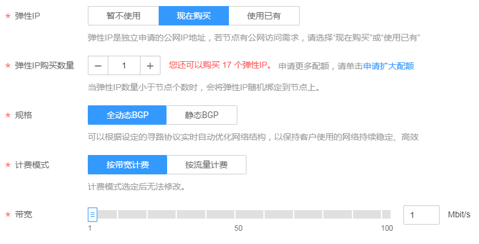
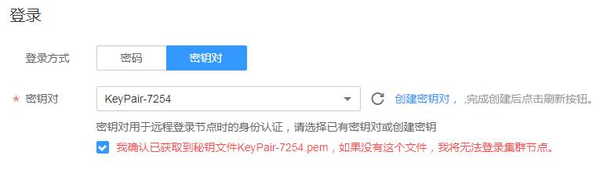

# 创建虚拟机集群

Kubernetes是大规模容器集群管理软件，一个集群可以管理一组节点资源，支持虚拟机和物理机的管理。在创建容器工作负载前，您需要存在一个可用集群。

## 创建集群须知

创建集群过程中会创建一些基础资源，列表如下：

**表 1**  创建集群须知

<table><thead align="left"><tr id="row20811252105914"><th class="cellrowborder" valign="top" width="30%" id="mcps1.2.3.1.1">
资源名称

</th>
<th class="cellrowborder" valign="top" width="70%" id="mcps1.2.3.1.2">
描述

</th>
</tr>
</thead>
<tbody><tr id="row88111652155915"><td class="cellrowborder" valign="top" width="30%" headers="mcps1.2.3.1.1 ">
控制节点及其相关资源

</td>
<td class="cellrowborder" valign="top" width="70%" headers="mcps1.2.3.1.2 ">
存在于云容器引擎资源租户下，用户不可见。

</td>
</tr>
<tr id="row981135210590"><td class="cellrowborder" valign="top" width="30%" headers="mcps1.2.3.1.1 ">
弹性云服务器（可选创建）

</td>
<td class="cellrowborder" valign="top" width="70%" headers="mcps1.2.3.1.2 ">
集群节点，即用户的计算资源，对应“弹性云服务器”中的ECS。

ECS命名规则为：集群名称-随机数，可自定义，批量创建时会再加一串随机数。

</td>
</tr>
<tr id="row6811952165919"><td class="cellrowborder" valign="top" width="30%" headers="mcps1.2.3.1.1 ">
安全组

</td>
<td class="cellrowborder" valign="top" width="70%" headers="mcps1.2.3.1.2 ">
集群会创建两个安全组，一个用于管理集群控制节点的安全组，一个用于管理集群node节点的安全组。

 注意： 

禁止删除创建集群时创建的安全组以及安全组规则，否则会导致集群异常。

<ol id="ol57751237359"><li>控制节点安全组
命名规则：集群名称-cce-controller-随机数

作用：

<ul id="ul516535584419"><li>出方向允许</li><li>其他节点访问控制节点kubernetes相关服务</li></ul>
</li><li>node节点安全组
命名规则：集群名称-cce-node-随机数

作用：

<ul id="ul1579276164613"><li>出方向允许</li><li>开放linux或windows远程登录（22、3389）</li><li>kubernetes组件之间访问使用（4789、10250）</li><li>kubernetes用于对外开放的端口（30000-32767）</li><li>相同安全组之间可以互相访问</li></ul>
</li></ol>
</td>
</tr>
<tr id="row7811135245911"><td class="cellrowborder" valign="top" width="30%" headers="mcps1.2.3.1.1 ">
磁盘（可选创建）

</td>
<td class="cellrowborder" valign="top" width="70%" headers="mcps1.2.3.1.2 ">
分别给各个节点创建两个磁盘，一个是节点的系统盘，一个是给docker运行使用的数据盘。

</td>
</tr>
<tr id="row13811752135919"><td class="cellrowborder" valign="top" width="30%" headers="mcps1.2.3.1.1 ">
弹性IP（可选创建）

</td>
<td class="cellrowborder" valign="top" width="70%" headers="mcps1.2.3.1.2 ">
需用户选择，给节点绑定弹性IP ，可以使节点访问外网。

</td>
</tr>
</tbody>
</table>

## 创建虚拟私有云

创建首个集群前，您必须先确保已存在虚拟私有云，否则无法创建集群。虚拟私有云为CCE集群提供一个隔离的、用户自主配置和管理的虚拟网络环境。

1.  登录华为云控制台。
2.  在服务列表中，选择“网络 \> 虚拟私有云”。
3.  在“虚拟私有云”界面，单击“创建虚拟私有云”。
4.  根据界面提示创建虚拟私有云。如无特殊需求，界面参数均可保持默认。

## 创建密钥对

您需要新建一个密钥对，用于远程登录节点时的身份认证。若使用密码登录节点，请跳过此操作。

1.  登录华为云控制台。
2.  在服务列表中，选择“计算 \> 弹性云服务器”。
3.  选择左侧导航中的“密钥对”，单击“创建密钥对”。
4.  输入密钥对名称后，单击“确定”。
5.  在弹出的对话框中，单击“确定”。

    请根据提示信息，查看并保存密钥对。为保证安全，私钥只能下载一次，请妥善保管，否则将无法登录节点。

## 创建集群

1.  登录CCE控制台，在总览页面单击“购买Kubernetes集群“，或在左侧导航栏中单击“资源管理  \>  集群管理”，单击“虚拟机集群“下的“购买”。

    服务选型：参照[表2](#table8638121213265)设置服务选型参数，其中带“\*”的参数为必填参数。

    **表 2**  创建集群参数配置

    
    <table><thead align="left"><tr id="row10638181262612"><th class="cellrowborder" valign="top" width="20.02%" id="mcps1.2.3.1.1">
参数

    </th>
    <th class="cellrowborder" valign="top" width="79.97999999999999%" id="mcps1.2.3.1.2">
参数说明

    </th>
    </tr>
    </thead>
    <tbody><tr id="row1922964644615"><td class="cellrowborder" valign="top" width="20.02%" headers="mcps1.2.3.1.1 ">
* 计费模式

    </td>
    <td class="cellrowborder" valign="top" width="79.97999999999999%" headers="mcps1.2.3.1.2 "><ul id="ul463941414445"><li>按需计费：根据实际使用的资源按小时计费。</li><li>包年/包月：包周期计费。包年/包月集群创建后不能删除，如需停止使用，请到“费用中心”执行退订操作。详细请参见<a href="https://support.huaweicloud.com/usermanual-cce/cce_01_0003.html" target="_blank" rel="noopener noreferrer">新建节点（包年包月）</a>。</li></ul>
    </td>
    </tr>
    <tr id="row42961494311"><td class="cellrowborder" valign="top" width="20.02%" headers="mcps1.2.3.1.1 ">
* 区域

    </td>
    <td class="cellrowborder" valign="top" width="79.97999999999999%" headers="mcps1.2.3.1.2 ">
请就近选择靠近您业务的区域，可减少网络时延，提高访问速度。

    </td>
    </tr>
    <tr id="row1063812126263"><td class="cellrowborder" valign="top" width="20.02%" headers="mcps1.2.3.1.1 ">
* 集群名称

    </td>
    <td class="cellrowborder" valign="top" width="79.97999999999999%" headers="mcps1.2.3.1.2 ">
新建集群的名称。

    </td>
    </tr>
    <tr id="row6649879161231"><td class="cellrowborder" valign="top" width="20.02%" headers="mcps1.2.3.1.1 ">
* 版本

    </td>
    <td class="cellrowborder" valign="top" width="79.97999999999999%" headers="mcps1.2.3.1.2 ">
选择集群对应的版本，对应Kubernetes社区基线版本。

    </td>
    </tr>
    <tr id="row572593234714"><td class="cellrowborder" valign="top" width="20.02%" headers="mcps1.2.3.1.1 ">
* 集群管理规模

    </td>
    <td class="cellrowborder" valign="top" width="79.97999999999999%" headers="mcps1.2.3.1.2 ">
当前集群支持管理的最大节点规模。若选择50节点，表示当前集群最多可管理50个节点。

    
任何一个集群中均包含“管理节点”和“Node节点”，解释如下：<ul id="ul1045015327013"><li>管理节点：集群的控制节点，在创建集群时会自动创建管理节点，负责整个集群的管理和控制。</li><li>Node节点：用户新建或纳管的节点是集群的Node节点，即工作负载节点。Node节点由管理节点分配，当某个Node节点宕机时，管理节点会将工作负载转移到其他Node节点上。</li></ul>
    

    </td>
    </tr>
    <tr id="row680585841419"><td class="cellrowborder" valign="top" width="20.02%" headers="mcps1.2.3.1.1 ">
* 高可用

    </td>
    <td class="cellrowborder" valign="top" width="79.97999999999999%" headers="mcps1.2.3.1.2 "><ul id="ul97916871415"><li>是：集群将创建三个管理节点，当其中某两个管理节点故障时，集群依然可用。</li><li>否：集群仅创建一个管理节点，当这个管理节点故障时，集群将不可用，但已运行的工作负载不受影响。</li></ul>
    
 注意： 
<ul id="ul1279710812141"><li>集群一旦创建，便无法更改集群模式，需要重新创建集群才能调整。</li><li>针对开发和测试环境等对可靠性要求不高的场景，可根据需求选择是否开启“高可用”。针对生产环境，为提高集群容灾能力，建议开启“高可用”。</li></ul>
    

    </td>
    </tr>
    <tr id="row1763991215268"><td class="cellrowborder" valign="top" width="20.02%" headers="mcps1.2.3.1.1 ">
* 虚拟私有云

    </td>
    <td class="cellrowborder" valign="top" width="79.97999999999999%" headers="mcps1.2.3.1.2 ">
新建集群所在的虚拟私有云。

    
若没有可选虚拟私有云，单击“创建虚拟私有云”进行创建，操作步骤请参见<a href="https://support.huaweicloud.com/usermanual-cce/cce_01_0028.html#section1" target="_blank" rel="noopener noreferrer">创建虚拟私有云</a> 。

    </td>
    </tr>
    <tr id="row15639412132615"><td class="cellrowborder" valign="top" width="20.02%" headers="mcps1.2.3.1.1 ">
* 所在子网

    </td>
    <td class="cellrowborder" valign="top" width="79.97999999999999%" headers="mcps1.2.3.1.2 ">
节点虚拟机运行的子网环境。虚拟私有云、子网、集群的关系请参见<a href="https://support.huaweicloud.com/usermanual-cce/cce_01_0002.html" target="_blank" rel="noopener noreferrer">集群概述</a>。

    </td>
    </tr>
    <tr id="row482955911270"><td class="cellrowborder" valign="top" width="20.02%" headers="mcps1.2.3.1.1 ">
* 网络模型

    </td>
    <td class="cellrowborder" valign="top" width="79.97999999999999%" headers="mcps1.2.3.1.2 "><ul id="ul19705159132810"><li>容器隧道网络（Overlay）：基于VXLAN技术实现的Overlay容器网络。VXLAN是将以太网报文封装成UDP报文进行隧道传输。容器网络是承载于VPC网络之上的Overlay网络平面，具有付出少量隧道封装性能损耗，获得了通用性强、互通性强、高级特性支持全面（例如Network Policy网络隔离）的优势，可以满足大多数应用需求。</li><li>VPC网络：基于VPC网络的自定义路由，直接将容器网络承载于VPC网络之中。每个节点将会被分配固定大小的IP地址段。vpc-router网络由于没有隧道封装的消耗，容器网络性能相对于容器隧道网络有一定优势。vpc-router集群由于VPC路由中配置有容器网段与节点IP的路由，可以支持集群外直接访问容器实例等特殊场景。</li></ul>
    </td>
    </tr>
    <tr id="row64648564171234"><td class="cellrowborder" valign="top" width="20.02%" headers="mcps1.2.3.1.1 ">
* 容器网段

    </td>
    <td class="cellrowborder" valign="top" width="79.97999999999999%" headers="mcps1.2.3.1.2 ">
请根据业务需求选择容器网段，确定容器网段后，容器实例将在规划的网段内分配IP。

    
 注意： 
<ul id="ul10579113961"><li>集群一旦创建，便无法更改容器网段，需要重新创建集群才能调整。</li><li>创建集群前，请提前规划好网段。不同集群使用相同的容器网段，会导致容器IP冲突，应用访问异常。</li><li>容器网段要设置合理的掩码，掩码决定集群内可用节点数量。集群中容器网段掩码设置不合适，会导致集群实际可用的节点较少。</li></ul>
    

    </td>
    </tr>
    <tr id="row6775143217241"><td class="cellrowborder" valign="top" width="20.02%" headers="mcps1.2.3.1.1 ">
服务网段

    </td>
    <td class="cellrowborder" valign="top" width="79.97999999999999%" headers="mcps1.2.3.1.2 ">
服务网段为kubernetes service ip网段，请根据业务需求选择该网段。

    
 注意： 
<ul id="ul18837252152517"><li>此参数仅支持1.11.7及以上版本的集群。</li><li>创建集群前，请提前规划好网段，集群一旦创建，便无法更改服务网段，需要重新创建集群才能调整。</li><li>服务网段要设置合理的掩码，掩码决定集群内可用service ip数量。</li></ul>
    

    </td>
    </tr>
    <tr id="row1610917221609"><td class="cellrowborder" valign="top" width="20.02%" headers="mcps1.2.3.1.1 ">
* 认证方式

    </td>
    <td class="cellrowborder" valign="top" width="79.97999999999999%" headers="mcps1.2.3.1.2 ">
认证机制主要用于对集群下的资源做权限控制。例如A用户只能对某个命名空间下的应用有读写权限，B用户对集群下的资源只有读权限等等。

    <ul id="ul159513321026"><li>RBAC：开启Kubernetes的RBAC功能，详情请参见<a href="https://kubernetes.io/docs/reference/access-authn-authz/rbac/" target="_blank" rel="noopener noreferrer">Kubernetes官方文档</a>。</li><li>若需要对集群进行权限控制，请勾选“认证能力增强”，选择“Authenticating Proxy”。请单击“CA根证书”后的“上传文件”，上传符合规范且合法的证书。角色权限控制的操作请参见<a href="https://support.huaweicloud.com/usermanual-cce/cce_01_0085.html" target="_blank" rel="noopener noreferrer">3.7-集群管理权限控制</a> 。
 说明： 

IAM认证暂不支持。

    

    </li></ul>
    </td>
    </tr>
    <tr id="row463941216264"><td class="cellrowborder" valign="top" width="20.02%" headers="mcps1.2.3.1.1 ">
集群描述

    </td>
    <td class="cellrowborder" valign="top" width="79.97999999999999%" headers="mcps1.2.3.1.2 ">
新建容器集群的描述信息。

    </td>
    </tr>
    <tr id="row96582533813"><td class="cellrowborder" valign="top" width="20.02%" headers="mcps1.2.3.1.1 ">
高级配置

    </td>
    <td class="cellrowborder" valign="top" width="79.97999999999999%" headers="mcps1.2.3.1.2 ">
一些高级功能统一存放的位置，如果该区域（Region）不支持高级功能，则高级配置项隐藏。

    <ul id="ul2309153715491"><li>暂不设置：不对高级功能做任何设置。</li><li>现在设置：显示高级功能，并可对其进行设置。
目前仅支持“多可用区”功能，如果对应集群Master的flavor不支持，则不可以选择。

    <ul id="ul1429210548347"><li>是：控制节点分布在不同可用区中，单可用区故障，集群仍然可用。</li><li>否：控制节点部署在同一个可用区中，如果对应可用区故障，集群将不可用，但已运行工作负载不受影响。</li></ul>
    </li></ul>
    </td>
    </tr>
    <tr id="row76532194177"><td class="cellrowborder" valign="top" width="20.02%" headers="mcps1.2.3.1.1 ">
* 购买时长

    </td>
    <td class="cellrowborder" valign="top" width="79.97999999999999%" headers="mcps1.2.3.1.2 ">
若选择创建“包年/包月”的集群，请设置购买时长。

    </td>
    </tr>
    </tbody>
    </table>

2.  创建节点。
    -   选择是否创建节点。
        -   是：为集群创建第一个节点。

            > **说明：**   
            >若需要使用服务网格能力，请选择“是“，至少创建一个节点以供控制面节点安装。  

        -   否：创建一个集群，不需要添加节点，请直接单击“下一步“，再单击“提交订单“。

    -   计费模式：支持按需计费和包年/包月类型。

        > **说明：**   
        >添加的第一个节点的付费方式只能是“按需付费”，若想要给集群添加付费方式为“包年/包月”的节点，请参考[新建节点（包年包月）](https://support.huaweicloud.com/usermanual-cce/cce_01_0003.html)操作。  

    -   当前区域：节点实例所在的物理位置。
    -   可用区：指在同一区域下，电力、网络隔离的物理区域，可用区之间内网互通，不同可用区之间物理隔离。若需要GPU加速型节点，请选择有GPU节点的可用区。
    -   节点名称：自定义节点名称。
    -   节点规格：请根据业务需求选择相应的节点规格。

        **图 1**  选择节点规格  
        

        > **说明：**   
        >为确保节点稳定性，系统会自动预留部分资源，运行必须的系统组件。详细请参见[节点预留资源计算公式](https://support.huaweicloud.com/usermanual-cce/cce_01_0178.html)  。  

    -   操作系统：请选择节点对应的操作系统。
    -   配置网络。弹性IP是独立申请的公网IP地址。

        > **说明：**   
        >若新增节点有互联网访问的需求，则弹性IP请选择“现在购买或使用已有“。若新增节点未绑定弹性IP，则在该节点上运行的工作负载将不能被外网访问。  

        -   暂不使用：不使用弹性IP的节点不能与互联网互通，仅可作为私有网络中部署业务或者集群所需云服务器进行使用。
        -   现在购买：自动为每台云服务器分配独享带宽的弹性IP。创建弹性云服务器过程中，请确保弹性IP配额充足。请根据界面要求，选择规格、购买量、计费模式、带宽等。
        -   使用已有：为当前节点分配已有弹性IP，请选择已有的弹性IP。

            **图 2**  配置节点网络  
            

    -   设置节点磁盘空间，分为系统盘和数据盘。

        -   系统盘的规格为\[40,1024\]GB，用户可以配置，缺省值为40GB。
        -   数据盘的规格为\[100,32678\]GB，用户可以配置，缺省值为100GB。

        提供以下性能规格的云硬盘。

        -   普通IO：提供可靠的块存储，单个云硬盘的最大IOPS可达到1000，可运行关键应用程序。
        -   高IO：提供可达到3000的高IO和低至1 ms的读写延时，支持NoSQL/关系型数据库，数据仓库，文件系统等应用。
        -   超高IO：提供可达到20000的超高IO和低至1 ms超低读写时延，支持NoSQL/关系型数据库，数据仓库等应用。

        资源分配自定义：用户可自定义数据盘中Docker和Kubelet的资源占比，Docker资源包含Docker镜像数据以及镜像元数据，Kubelet资源包含Pod配置文件、密钥以及临时存储EmptyDir等挂载数据。

    -   选择登录方式。当前支持密码和密钥对。
        -   登录方式为“密码“：请输入登录节点的密码，并确认密码。请牢记该密码，登录节点时需要使用该密码。
        -   登录方式为“密钥对“：选择登录节点的密钥对。

            密钥对用于远程登录节点时的身份认证，若没有密钥对，可单击“创建密钥对”来新建。创建密钥对操作步骤请参见[创建密钥对](https://support.huaweicloud.com/usermanual-cce/cce_01_0028.html#section2)  。

            **图 3**  密钥对  
            

    -   高级配置 \> 文件注入：当您有如下需求时，请单击“现在配置“，使用文件注入功能将文件注入到节点。

        -   需要通过脚本简化弹性云服务器配置。
        -   通过脚本初始化系统。
        -   已有脚本，在创建弹性云服务器时一并上传到服务器。
        -   其他可以使用脚本完成的事情。

        **操作步骤如下：**

        > **说明：**   
        >详细的使用方法请参见[这里](https://support.huaweicloud.com/usermanual-ecs/zh-cn_topic_0013898301.html)。  

        1.  设置最大实例数。

            最大实例数是指节点允许创建的最大实例数（Pod），包含系统默认的实例，防止节点因管理过多的实例而负载过重。

        2.  单击“增加一个文件“。
        3.  输入保存路径或文件名：Linux系统请输入注入文件保存路径，例如 “/etc/foo.txt”，文件名只能包含字母和数字。
        4.  单击“选择文件“，选择已写好的脚本，脚本符合操作系统要求即可。

    -   设置节点购买数量。

        此处设置的节点数不能超过集群管理的最大节点规模，请根据业务需求选择。

3.  安装插件。

    系统资源插件必须要安装，高级功能插件可根据实际需求选择性进行安装。插件相关功能请参见[13-插件管理](https://support.huaweicloud.com/usermanual-cce/cce_01_0064.html)  。

4.  规格确认。

    确认所设置的服务选型参数好规格。

5.  单击“立即购买”，确认费用后，单击“提交”。

    集群创建预计需要6-10分钟。请根据界面提示查看集群创建过程。

    > **说明：**   
    >-   在集群创建完成页面中，可以通过选择“启用Istio服务网格“，在虚拟机集群中使能Istio服务网格。详情请参见[5.2-启用服务网格](https://support.huaweicloud.com/usermanual-cce/cce_01_0036.html)。  
    >-   若选择创建包年包月的集群，请根据界面提示进行付款操作。  

## 相关操作

-   通过命令行工具连接集群：请参见[通过Kubectl连接集群](通过Kubectl连接集群.md)。
-   添加节点：集群创建完成后，若您需要为集群添加更多节点，请参见[新建节点（按需计费）](新建节点（按需计费）.md)和[新建节点（包年包月）](新建节点（包年包月）.md)。
-   登录节点：请参见[登录节点](新建节点（按需计费）.md#section16476192312530)。

-   创建命名空间：同个集群内可创建多个命名空间，形成逻辑上的不同分组，便于不同的分组在共享使用集群资源时还能被分别管理。若您需要为集群创建命名空间，请参见[命名空间使用指引](命名空间使用指引.md)。
-   单击已成功创建的集群名称，进入“集群详情“页可查看集群详情。

    **表 3**  已创建的集群详情

    
    <table><thead align="left"><tr id="row1264365516359"><th class="cellrowborder" valign="top" width="20%" id="mcps1.2.3.1.1">
页签类别

    </th>
    <th class="cellrowborder" valign="top" width="80%" id="mcps1.2.3.1.2">
说明

    </th>
    </tr>
    </thead>
    <tbody><tr id="row5975069716956"><td class="cellrowborder" valign="top" width="20%" headers="mcps1.2.3.1.1 ">
集群详情

    </td>
    <td class="cellrowborder" valign="top" width="80%" headers="mcps1.2.3.1.2 ">
可查看该集群的详情及运行状态等。

    </td>
    </tr>
    <tr id="row106431055133510"><td class="cellrowborder" valign="top" width="20%" headers="mcps1.2.3.1.1 ">
监控

    </td>
    <td class="cellrowborder" valign="top" width="80%" headers="mcps1.2.3.1.2 ">
查看集群近1小时、近3小时或近12小时的CPU和内存占用情况。

    </td>
    </tr>
    <tr id="row1464335593515"><td class="cellrowborder" valign="top" width="20%" headers="mcps1.2.3.1.1 ">
事件

    </td>
    <td class="cellrowborder" valign="top" width="80%" headers="mcps1.2.3.1.2 "><ul id="ul42186174161243"><li>可以直接在“事件”页签下查看集群的事件。</li><li>可以设置查询条件，比如设置事件产生的时间段或搜索事件名称，查看相关事件。</li></ul>
    </td>
    </tr>
    </tbody>
    </table>

