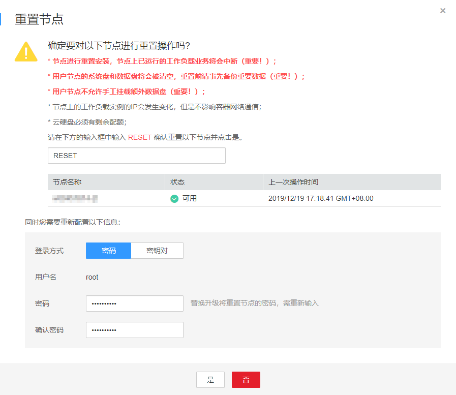

# 删除节点

在CCE集群中删除节点会将该节点以及节点内运行的业务都销毁，删除前请确认您的正常业务运行不受影响，请谨慎操作。

> **须知：**   
>-   删除CCE集群时，ECS节点也将一起删除，暂不支持删除CCE集群而保留ECS节点的需求。  
>-   对于包周期（包年/包月）预付费的ECS节点不能直接删除，请通过页面右上角的“费用-我的订单”，执行资源退订操作。  

## 背景信息

-   删除节点会涉及Pod迁移，可能会影响业务，请在业务低峰期操作。
-   操作过程中可能存在非预期风险，请提前做好相关的数据备份。
-   操作过程中，后台会把当前节点设置为不可调度状态。
-   删除节点仅能移除Worker节点，不会移除Master节点。

## 操作步骤

1.  登录[CCE控制台](https://console.huaweicloud.com/cce2.0/?utm_source=helpcenter)，在左侧导航栏中选择“资源管理 \> 节点管理“，单击节点后的“更多 \> 删除“。

    **图 1**  删除节点  
    

2.  在弹出的“删除节点“窗口中输入  **DELETE **，单击“是“，等待完成节点删除。

    **图 2**  确认删除  
    

    > **说明：**   
    >-   删除节点后，原有节点上的工作负载实例会自动迁移至其他可用节点。  
    >-   释放ECS实例仅释放“按需计费“的ECS实例。  
    >-   若未按照界面提示清理CCE相关资源，后续需要清理资源时请参照[如何快速清理已删除节点上的CCE组件？](https://support.huaweicloud.com/cce_faq/cce_faq_00008.html)中操作处理。  

