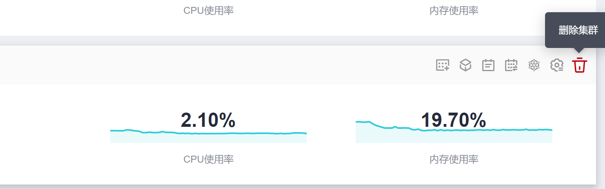
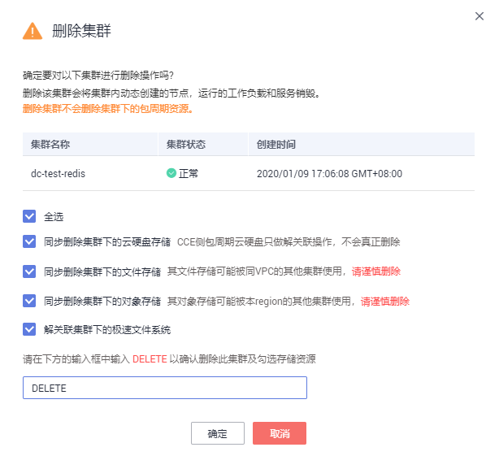

# 删除集群

本章节以删除混合集群为例，GPU集群和裸金属集群操作方式与其相同。

> **须知：**   
>删除集群会将集群内的节点以及运行的业务都销毁，请谨慎操作。  

1.  登录[CCE控制台](https://console.huaweicloud.com/cce2.0/?utm_source=helpcenter)，在左侧导航栏中选择“资源管理 \> 集群管理”。
2.  单击待删除集群后的“更多 \> 删除集群“。

    **图 1**  删除集群  
    

3.  在弹出的“删除集群“窗口中，根据系统提示进行删除操作。

    > **说明：**   
    >-   删除该集群会将集群内的节点（纳管节点和包周期节点除外）以及运行的工作负载和服务都销毁。  
    >-   删除集群需要花费1\~3分钟，请耐心等候。  
    >-   请在窗口下方的输入框中输入  **DELETE**  以确认删除此集群。  
    >-   集群不可用时删除集群，存储会残留。  
    >-   如果通过网络平面添加了弹性网卡，请在删除集群时选择“删除集群下的弹性网卡“，更多网络平面信息请参见[网络平面（NetworkAttachmentDefinition）](网络平面（NetworkAttachmentDefinition）.md)。  

    **图 2**  删除集群  
    

4.  单击“确定“，开始执行删除集群操作。

