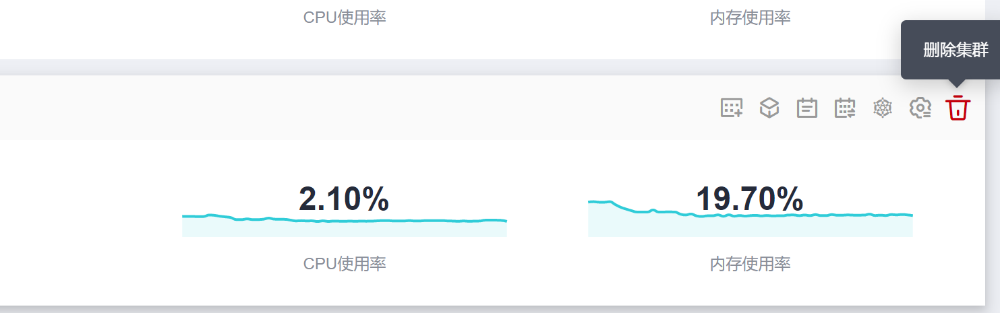

# 删除集群（按需计费）

## 操作场景

本章节以计费模式为“按需计费“的CCE集群为例，介绍如何删除集群。

包周期的集群支持退订操作，不能直接删除，详情请参见[退订/释放集群（包年/包月）](退订-释放集群（包年-包月）.md)。

## 注意事项

-   删除集群不会删除集群下包周期的资源，相关资源在集群删除后将会继续计费，请妥善处理。
-   删除集群会删除集群下的节点（纳管节点不会被删除）、节点挂载的数据盘、工作负载与服务，相关业务将无法恢复。在执行操作前，请确保相关数据已完成备份或者迁移，删除完成后数据无法找回，请谨慎操作。

    部分不是在CCE中创建的资源不会删除：

    -   纳管的节点（仅删除在CCE中创建的节点）
    -   Service和Ingress关联的ELB实例（仅删除自动创建的ELB实例）
    -   手动创建PV关联的云存储/导入的云存储（仅删除PVC自动创建的云存储）

-   处于休眠状态的集群无法直接删除，请将集群唤醒后重试。
-   集群不可用时删除集群，存储会残留。
-   集群版本为v1.13.10及之前版本时，请勿在ELB服务手动修改监听器名称和后端服务器名称，否则删除集群会有资源残留。

## 操作步骤

1.  登录CCE控制台，在左侧导航栏中选择“集群管理“。
2.  单击待删除集群后的。

    **图 1**  删除集群  
    

3.  在弹出的“删除集群“窗口中，根据系统提示进行删除操作。
4.  单击“是“，开始执行删除集群操作。

    删除集群需要花费1\~3分钟，请耐心等候。

