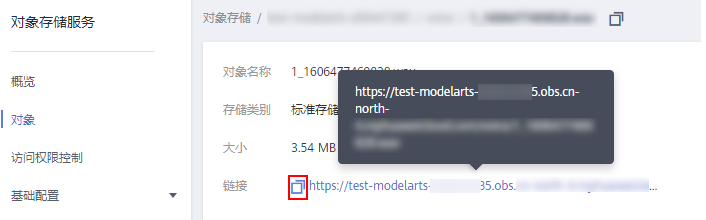

# 升级节点操作系统内核<a name="cce_01_0179"></a>

## 操作场景<a name="section2811633111714"></a>

CCE集群依赖系统内核版本，[升级集群](升级集群.md)时会默认升级节点的操作系统版本，由于升级节点的操作系统内核有一定的风险，我们不建议您进行此操作，若您仍需要升级请务必谨慎操作。

强烈建议您在升级前备份节点中的数据，如果升级后导致节点和集群不可用、网络异常等问题，您可以选择重置节点，具体请参见[重置节点](重置节点.md)。

## 注意事项<a name="section20676195331717"></a>

-   Centos 7.6虚拟机支持升级内核到：3.10.0-1127.18.2.el7.x86\_64；BMS支持升级到：3.10.0-514.44.5.10.h275.x86\_64。
-   Euleros2.2支持升级内核到：3.10.0-327.62.59.83.h162.x86\_64
-   Euleros2.5支持升级内核到：3.10.0-862.14.1.0.h197.eulerosv2r7.x86\_64
-   节点需绑定EIP，内核升级完成后，需重启系统。
-   升级过程中，下列报错不影响功能，为正常现象。

    


## Centos升级步骤<a name="section49692118275"></a>

可对CentOS Linux内核3.10.0-1127.el7之前的版本进行升级，支持升级的集群版本包括：v1.15.6-r1、v1.15.11-r1、v.1.17.9-r0。

> **须知：** 
>-   若集群已安装gpu-beta插件，请检查gpu-beta插件的版本号，当gpu-beta插件版本号低于1.1.13时，请先将gpu-beta插件升级到1.1.13或以上版本后，再升级内核补丁。详情请参见[gpu-beta插件](https://support.huaweicloud.com/usermanual-cce/cce_01_0141.html)。
>-   内核升级完无法回退。
>-   节点升级内核之前请做好节点上关键数据的备份。
>-   内核升级过程需要重启节点，建议您升级前驱逐节点上的工作负载。

**场景一：存量节点**

1.  以root用户登录node节点。
2.  执行如下命令安装补丁：

    ```
    cd /root; curl http://{obs_package_bucket}/cluster-versions/CCE-Kernel-Patch-1127.18.2.1.tgz -1 -O; tar -zxf CCE-Kernel-Patch-1127.18.2.1.tgz; bash update.sh; script_path=`cat /etc/crontab | grep 'run/update.sh' | awk -F " " '{print $8}'`; if [ $script_path"x" != "x" ];then sed -i "/grub2-mkconfig/d" $script_path; fi
    ```

    其中，obs\_package\_bucket是OBS桶的域名地址。

3.  执行完成后，重启操作系统

**场景二：新建节点**

1.  登录CCE控制台，在左侧导航栏中选择“资源管理 \> 集群管理”，在集群列表页面单击需要添加节点集群下方的“购买节点”按钮。
2.  在“安装后执行脚本”中填入如下命令：

    ```
    cd /root; curl http://{obs_package_bucket}/cluster-versions/CCE-Kernel-Patch-1127.18.2.1.tgz -1 -O; tar -zxf CCE-Kernel-Patch-1127.18.2.1.tgz; bash update.sh; script_path=`cat /etc/crontab | grep 'run/update.sh' | awk -F " " '{print $8}'`; if [ $script_path"x" != "x" ];then sed -i "/grub2-mkconfig/d" $script_path; fi
    ```

    其中，_obs\_package\_bucket_是OBS桶的域名地址。

3.  节点创建完成后，登录节点重启操作系统，使内核补丁生效。重启前建议您驱逐节点上的工作负载，避免对运行业务产生影响。

**场景三：存量BMS节点**

1.  以root用户登录node节点，**确保当前的BMS内核版本为h275**。

    在节点上执行：

    ```
    uname -r
    ```

    

2.  执行如下命令安装补丁：

    ```
    mkdir -p /root/upgrade_ovs/;cd /root/upgrade_ovs/;wget https://{obs_package_bucket}/package/canal-agent/canal-agent-20.6.0.B005.sp1.tgz;tar zxvf canal-agent-20.6.0.B005.sp1.tgz;tar zxvf canal-agent/package/openvswitch-20.6.0.B003-x86_64.tar.gz;bash openvswitch/can_ovs.sh;bash openvswitch/can_ovs.sh  uninstall;bash openvswitch/can_ovs.sh install;
    ```

    其中，obs\_package\_bucket是OBS桶的域名地址。

3.  执行完成后，执行modinfo openvswitch查看当前openvswitch版本为3.10.0-514.44.5.10.h142.x86\_64。

    


## EulerOS升级步骤<a name="section159981166179"></a>

1.  连接集群master操作，驱逐受影响节点上的pod，pod会在其他节点进行重建以满足副本数要求。如何连接集群master，请参见[通过kubectl或web-terminal插件操作CCE集群](通过kubectl或web-terminal插件操作CCE集群.md)。

    执行以下命令：

    **kubectl drain  _<node name\>_  --ignore-daemonsets**

2.  root用户使用如下命令更新内核（保证节点拥有EIP）并重启系统。
    -   EulerOS 2.2系统执行以下命令：

        ```
        bash /var/paas/kubernetes/canal/openvswitch/can_ovs.sh uninstall
        yum update kernel -y
        reboot
        ```

    -   EulerOS 2.5系统执行以下命令：

        ```
        bash /var/paas/kubernetes/canal/openvswitch/can_ovs.sh uninstall
        wget http://obs.cn-east-2.myhuaweicloud.com/cce-east/cce-openvswitch/kernel-3.10.0-862.14.1.0.h197.eulerosv2r7.x86_64.rpm
        rpm -ihv kernel-3.10.0-862.14.1.0.h197.eulerosv2r7.x86_64.rpm
        reboot
        ```


3.  root用户下执行以下命令升级cce组件适配新内核：

    -   EulerOS 2.2执行以下命令

        ```
        bash /var/paas/kubernetes/canal/openvswitch/can_ovs.sh install
        su paas; monit restart ovsdb-server ovs-vswitchd
        ```

    -   EulerOS 2.5执行以下脚本

        ```
        function upgrade_ovs()
        {
        	wget http://obs.cn-east-2.myhuaweicloud.com/cce-east/cce-openvswitch/openvswitch-1.0.RC10.SPC100.B050.tar.gz
        	mv /var/paas/kubernetes/canal/openvswitch /var/paas/kubernetes/canal/openvswitch.bak
        	tar zxvf openvswitch-1.0.RC10.SPC100.B050.tar.gz -C /var/paas/kubernetes/canal/
        	bash /var/paas/kubernetes/canal/openvswitch/can_ovs.sh install
        	systemctl restart  ovsdb-server ovs-vswitchd 
        }
        upgrade_ovs
        ```


    > **说明：** 
    >环境地址请通过[表1](#table184691746285)获取。

4.  恢复节点调度。

    执行以下命令：

    ```
    kubectl uncordon <node name>
    ```


## 附录<a name="section112406171884"></a>

**表 1**  各Region参数-obs\_package\_bucket

<a name="table184691746285"></a>
<table><thead align="left"><tr id="row15192046185"><th class="cellrowborder" valign="top" width="25.55%" id="mcps1.2.3.1.1"><p id="p20519946687"><a name="p20519946687"></a><a name="p20519946687"></a>环境名称</p>
</th>
<th class="cellrowborder" valign="top" width="74.45%" id="mcps1.2.3.1.2"><p id="p155191246983"><a name="p155191246983"></a><a name="p155191246983"></a>参数值</p>
</th>
</tr>
</thead>
<tbody><tr id="row55194461982"><td class="cellrowborder" valign="top" width="25.55%" headers="mcps1.2.3.1.1 "><p id="p155194462087"><a name="p155194462087"></a><a name="p155194462087"></a>华东-上海二</p>
</td>
<td class="cellrowborder" valign="top" width="74.45%" headers="mcps1.2.3.1.2 "><p id="p85191461815"><a name="p85191461815"></a><a name="p85191461815"></a>cce-east.obs.cn-east-2.myhuaweicloud.com</p>
</td>
</tr>
<tr id="row1351920461789"><td class="cellrowborder" valign="top" width="25.55%" headers="mcps1.2.3.1.1 "><p id="p3519846287"><a name="p3519846287"></a><a name="p3519846287"></a>华北-北京一</p>
</td>
<td class="cellrowborder" valign="top" width="74.45%" headers="mcps1.2.3.1.2 "><p id="p1351911466819"><a name="p1351911466819"></a><a name="p1351911466819"></a>cce-north.obs.cn-north-1.myhuaweicloud.com</p>
</td>
</tr>
<tr id="row1751974617814"><td class="cellrowborder" valign="top" width="25.55%" headers="mcps1.2.3.1.1 "><p id="p105192461683"><a name="p105192461683"></a><a name="p105192461683"></a>华北-北京四</p>
</td>
<td class="cellrowborder" valign="top" width="74.45%" headers="mcps1.2.3.1.2 "><p id="p155195461812"><a name="p155195461812"></a><a name="p155195461812"></a>cce-north-4.obs.cn-north-4.myhuaweicloud.com</p>
</td>
</tr>
<tr id="row1351984612810"><td class="cellrowborder" valign="top" width="25.55%" headers="mcps1.2.3.1.1 "><p id="p65194461688"><a name="p65194461688"></a><a name="p65194461688"></a>亚太-香港</p>
</td>
<td class="cellrowborder" valign="top" width="74.45%" headers="mcps1.2.3.1.2 "><p id="p35191046582"><a name="p35191046582"></a><a name="p35191046582"></a>cce-ap-southeast.obs.ap-southeast-1.myhuaweicloud.com</p>
</td>
</tr>
<tr id="row12519174619814"><td class="cellrowborder" valign="top" width="25.55%" headers="mcps1.2.3.1.1 "><p id="p185193461788"><a name="p185193461788"></a><a name="p185193461788"></a>华南-广州</p>
</td>
<td class="cellrowborder" valign="top" width="74.45%" headers="mcps1.2.3.1.2 "><p id="p155192467817"><a name="p155192467817"></a><a name="p155192467817"></a>cce-south.obs.cn-south-1.myhuaweicloud.com</p>
</td>
</tr>
<tr id="row11519134616814"><td class="cellrowborder" valign="top" width="25.55%" headers="mcps1.2.3.1.1 "><p id="p2051910461289"><a name="p2051910461289"></a><a name="p2051910461289"></a>泰国-曼谷</p>
</td>
<td class="cellrowborder" valign="top" width="74.45%" headers="mcps1.2.3.1.2 "><p id="p145197469815"><a name="p145197469815"></a><a name="p145197469815"></a>cce-ap-southeast-2.obs.ap-southeast-2.myhuaweicloud.com</p>
</td>
</tr>
<tr id="row2519134618817"><td class="cellrowborder" valign="top" width="25.55%" headers="mcps1.2.3.1.1 "><p id="p651904610810"><a name="p651904610810"></a><a name="p651904610810"></a>西南-贵阳一</p>
</td>
<td class="cellrowborder" valign="top" width="74.45%" headers="mcps1.2.3.1.2 "><p id="p551984618814"><a name="p551984618814"></a><a name="p551984618814"></a>cce-static.cn-southwest-2.obs.cn-southwest-2.myhuaweicloud.com</p>
</td>
</tr>
<tr id="row9519134614817"><td class="cellrowborder" valign="top" width="25.55%" headers="mcps1.2.3.1.1 "><p id="p051919461182"><a name="p051919461182"></a><a name="p051919461182"></a>东北-大连</p>
</td>
<td class="cellrowborder" valign="top" width="74.45%" headers="mcps1.2.3.1.2 "><p id="p6519246387"><a name="p6519246387"></a><a name="p6519246387"></a>cce-statics.cn-northeast-1.obs.cn-northeast-1.myhuaweicloud.com</p>
</td>
</tr>
<tr id="row165196469820"><td class="cellrowborder" valign="top" width="25.55%" headers="mcps1.2.3.1.1 "><p id="p12519346187"><a name="p12519346187"></a><a name="p12519346187"></a>华南-深圳</p>
</td>
<td class="cellrowborder" valign="top" width="74.45%" headers="mcps1.2.3.1.2 "><p id="p175197461284"><a name="p175197461284"></a><a name="p175197461284"></a>cce-south-2.obs.cn-south-2.myhuaweicloud.com</p>
</td>
</tr>
<tr id="row951911461983"><td class="cellrowborder" valign="top" width="25.55%" headers="mcps1.2.3.1.1 "><p id="p175199461287"><a name="p175199461287"></a><a name="p175199461287"></a>拉美-布宜诺斯艾利斯一</p>
</td>
<td class="cellrowborder" valign="top" width="74.45%" headers="mcps1.2.3.1.2 "><p id="p1651934620811"><a name="p1651934620811"></a><a name="p1651934620811"></a>brazil-cce-static.obs.sa-argentina-1.myhuaweicloud.com</p>
</td>
</tr>
<tr id="row1551964618817"><td class="cellrowborder" valign="top" width="25.55%" headers="mcps1.2.3.1.1 "><p id="p185197462085"><a name="p185197462085"></a><a name="p185197462085"></a>拉美-圣保罗一</p>
</td>
<td class="cellrowborder" valign="top" width="74.45%" headers="mcps1.2.3.1.2 "><p id="p451910461782"><a name="p451910461782"></a><a name="p451910461782"></a>brazil-cce-static.obs.sa-brazil-1.myhuaweicloud.com</p>
</td>
</tr>
<tr id="row10519134613814"><td class="cellrowborder" valign="top" width="25.55%" headers="mcps1.2.3.1.1 "><p id="p2519154614815"><a name="p2519154614815"></a><a name="p2519154614815"></a>非洲-约翰内斯堡</p>
</td>
<td class="cellrowborder" valign="top" width="74.45%" headers="mcps1.2.3.1.2 "><p id="p115196460819"><a name="p115196460819"></a><a name="p115196460819"></a>cce-statics.af-south-1.obs.af-south-1.myhuaweicloud.com</p>
</td>
</tr>
<tr id="row25196461089"><td class="cellrowborder" valign="top" width="25.55%" headers="mcps1.2.3.1.1 "><p id="p651913460811"><a name="p651913460811"></a><a name="p651913460811"></a>亚太-新加坡</p>
</td>
<td class="cellrowborder" valign="top" width="74.45%" headers="mcps1.2.3.1.2 "><p id="p6519446886"><a name="p6519446886"></a><a name="p6519446886"></a>cce-statics.ap-southeast-3.obs.ap-southeast-3.myhuaweicloud.com</p>
</td>
</tr>
<tr id="row115191046587"><td class="cellrowborder" valign="top" width="25.55%" headers="mcps1.2.3.1.1 "><p id="p251914463817"><a name="p251914463817"></a><a name="p251914463817"></a>俄罗斯-莫斯科二</p>
</td>
<td class="cellrowborder" valign="top" width="74.45%" headers="mcps1.2.3.1.2 "><p id="p205201746681"><a name="p205201746681"></a><a name="p205201746681"></a>obs.ru-northwest-2.myhuaweicloud.com</p>
</td>
</tr>
<tr id="row1452015461789"><td class="cellrowborder" valign="top" width="25.55%" headers="mcps1.2.3.1.1 "><p id="p452014462810"><a name="p452014462810"></a><a name="p452014462810"></a>拉美-圣地亚哥</p>
</td>
<td class="cellrowborder" valign="top" width="74.45%" headers="mcps1.2.3.1.2 "><p id="p55201946481"><a name="p55201946481"></a><a name="p55201946481"></a>obs.la-south-2.myhuaweicloud.com</p>
</td>
</tr>
<tr id="row15520946587"><td class="cellrowborder" valign="top" width="25.55%" headers="mcps1.2.3.1.1 "><p id="p15201946987"><a name="p15201946987"></a><a name="p15201946987"></a>华东-上海一</p>
</td>
<td class="cellrowborder" valign="top" width="74.45%" headers="mcps1.2.3.1.2 "><p id="p1552012464820"><a name="p1552012464820"></a><a name="p1552012464820"></a>cce-statics.cn-east-3.obs.cn-east-3.myhuaweicloud.com</p>
</td>
</tr>
<tr id="row55201846286"><td class="cellrowborder" valign="top" width="25.55%" headers="mcps1.2.3.1.1 "><p id="p25201246087"><a name="p25201246087"></a><a name="p25201246087"></a>拉美-利马一</p>
</td>
<td class="cellrowborder" valign="top" width="74.45%" headers="mcps1.2.3.1.2 "><p id="p252014466820"><a name="p252014466820"></a><a name="p252014466820"></a>obs.myhuaweicloud.com</p>
</td>
</tr>
<tr id="row252019466819"><td class="cellrowborder" valign="top" width="25.55%" headers="mcps1.2.3.1.1 "><p id="p135208466812"><a name="p135208466812"></a><a name="p135208466812"></a>拉美-圣地亚哥二</p>
</td>
<td class="cellrowborder" valign="top" width="74.45%" headers="mcps1.2.3.1.2 "><p id="p1852084611811"><a name="p1852084611811"></a><a name="p1852084611811"></a>brazil-cce-static.obs.sa-brazil-1.myhuaweicloud.com</p>
</td>
</tr>
</tbody>
</table>

