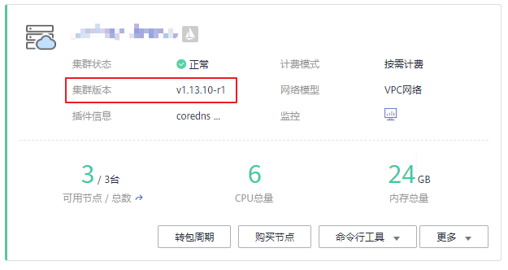

# 升级集群<a name="cce_01_0120"></a>

您可以通过云容器引擎管理控制台快速升级到Kubernetes最新版本或者bugfix版本，以支持新特性的使用。

## 注意事项<a name="section4557144475115"></a>

-   **集群升级属于不可逆操作，升级后无法回滚到之前版本，请谨慎进行。**
-   请在升级集群前，请查看集群状态是否均为健康状态。若集群不正常，您可以自行修复，若仍有问题请[提交工单](https://console.huaweicloud.com/ticket/#/ticketindex/createIndex)联系我们协助您进行修复。
-   为了您的数据安全，强烈建议您先备份数据然后再升级，升级过程中不建议对集群进行任何操作。
-   升级前，请在CCE控制台中确认您的集群是否可以进行升级操作，确认方法：单击“资源管理 \> 集群管理“，单击待升级集群右下方的“更多 \> 集群升级“，若“集群升级“按钮为灰色不可点击状态，则该集群不可升级，更多详细信息请参见[集群大版本升级说明](集群大版本升级说明.md)。

## 升级方式<a name="section18921193519591"></a>

集群升级页面会根据集群版本以及不同局点提供三种升级方式，三种方式的控制节点升级流程是一致的，用户节点的升级方式区别及优缺点如下：

1.  **平滑升级：**

    方式： 采取传统软件升级方式，在用户节点按组件逐个进行升级。

    优点：用户介入的操作较少，等同于一键式升级。

    缺点：跨版本由于OS会升级，节点会重启，会有一段时间业务受损。

2.  **重置升级：**

    方式：对用户节点使用最新的node镜像进行操作系统重置。

    优点：时间最短，用户介入操作也较少。

    缺点：如果节点上有数据或者配置，会丢失，同样会有一段时间业务受损。

3.  **灰度升级:**

    方式：节点上只升级k8s组件以及网络部分组件，存量节点将全部打上SchedulingDisabled标签，仅保证原本运行的应用不受影响，升级完成后，用户还需手动新建节点，并逐步释放老节点，将应用逐步迁移到新节点上。

    优点：可以基本上保证业务不断。

    缺点：用户操作比较多。


## 准备工作<a name="section9871020102918"></a>

请在集群升级前检查集群的健康状况，并且确保集群健康。

1.  登录 Master 节点，具体请参见[通过Kubectl连接集群](通过kubectl或web-terminal插件连接CCE集群.md)。
2.  执行如下命令，确保所有模块都处于健康状态。

    **kubectl get cs**

    命令行终端显示如下信息：

    ```
    NAME                 STATUS    MESSAGE              ERROR
     scheduler            Healthy   ok
     controller-manager   Healthy   ok
     etcd-0               Healthy   {"health": "true"}
     etcd-1               Healthy   {"health": "true"}
     etcd-2               Healthy   {"health": "true"}
    ```

3.  执行如下命令，确保所有节点都处于 Ready 状态。

    **kubectl get nodes**

    > **说明：** 
    >所有节点只能Ready状态，不能包含其他状态。

    ```
     NAME                   STATUS    ROLES     AGE       VERSION
     cn-north-1a-xxx   Ready     master    38d       v1.9.7-r1
     cn-north-1a-xxx   Ready     <none>    38d       v1.9.7-r1
     cn-north-1a-xxx   Ready     <none>    38d       v1.9.7-r1
     cn-north-1a-xxx   Ready     <none>    38d       v1.9.7-r1
     cn-north-1a-xxx   Ready     master    38d       v1.9.7-r1
     cn-north-1a-xxx   Ready     master    38d       v1.9.7-r1
    ```


## 集群升级前排查项<a name="section14190181819293"></a>

在集群升级前，请根据如下Checklist进行排查，以便提前发现风险和问题。

**表 1**  集群升级排查项

<a name="table1238111218323"></a>
<table><thead align="left"><tr id="row132391129329"><th class="cellrowborder" valign="top" width="16.91%" id="mcps1.2.3.1.1"><p id="p1423913122324"><a name="p1423913122324"></a><a name="p1423913122324"></a>类别</p>
</th>
<th class="cellrowborder" valign="top" width="83.09%" id="mcps1.2.3.1.2"><p id="p18239161220325"><a name="p18239161220325"></a><a name="p18239161220325"></a>检查项</p>
</th>
</tr>
</thead>
<tbody><tr id="row424018124321"><td class="cellrowborder" rowspan="2" valign="top" width="16.91%" headers="mcps1.2.3.1.1 "><p id="p1524071220320"><a name="p1524071220320"></a><a name="p1524071220320"></a>集群</p>
</td>
<td class="cellrowborder" valign="top" width="83.09%" headers="mcps1.2.3.1.2 "><p id="p1324061214324"><a name="p1324061214324"></a><a name="p1324061214324"></a>确认当前集群的Node IP（包括EIP），是否有作为其他的配置或者白名单等。</p>
</td>
</tr>
<tr id="row824016123329"><td class="cellrowborder" valign="top" headers="mcps1.2.3.1.1 "><p id="p20240812143219"><a name="p20240812143219"></a><a name="p20240812143219"></a>执行升级前预检查功能。</p>
</td>
</tr>
<tr id="row924013120321"><td class="cellrowborder" rowspan="2" valign="top" width="16.91%" headers="mcps1.2.3.1.1 "><p id="p1724021216325"><a name="p1724021216325"></a><a name="p1724021216325"></a>工作负载</p>
</td>
<td class="cellrowborder" valign="top" width="83.09%" headers="mcps1.2.3.1.2 "><p id="p1424041263216"><a name="p1424041263216"></a><a name="p1424041263216"></a>记录工作负载的数量、工作负载状态，便于升级后对比。</p>
</td>
</tr>
<tr id="row1296933813911"><td class="cellrowborder" valign="top" headers="mcps1.2.3.1.1 "><p id="p59693385919"><a name="p59693385919"></a><a name="p59693385919"></a>针对您使用的数据库（例如云专线Redis、Mongdb等），要提前考虑白名单、路由或安全组策略变化等问题。</p>
</td>
</tr>
<tr id="row15579521103820"><td class="cellrowborder" valign="top" width="16.91%" headers="mcps1.2.3.1.1 "><p id="p12579172163813"><a name="p12579172163813"></a><a name="p12579172163813"></a>存储</p>
</td>
<td class="cellrowborder" valign="top" width="83.09%" headers="mcps1.2.3.1.2 "><p id="p257992123818"><a name="p257992123818"></a><a name="p257992123818"></a>记录存储状态，保证升级后存储不丢失。</p>
</td>
</tr>
<tr id="row1740471712383"><td class="cellrowborder" rowspan="2" valign="top" width="16.91%" headers="mcps1.2.3.1.1 "><p id="p640513174387"><a name="p640513174387"></a><a name="p640513174387"></a>网络</p>
</td>
<td class="cellrowborder" valign="top" width="83.09%" headers="mcps1.2.3.1.2 "><p id="p340521718381"><a name="p340521718381"></a><a name="p340521718381"></a>检查使用的负载均衡服务、Ingress，并做好备份。</p>
</td>
</tr>
<tr id="row1178610472077"><td class="cellrowborder" valign="top" headers="mcps1.2.3.1.1 "><p id="p1478694720715"><a name="p1478694720715"></a><a name="p1478694720715"></a>针对使用云专线的业务场景，需重点关注业务所在节点或实例IP发生变化时，应提前在云专线开通路由。</p>
</td>
</tr>
<tr id="row146320432505"><td class="cellrowborder" valign="top" width="16.91%" headers="mcps1.2.3.1.1 "><p id="p7631443125015"><a name="p7631443125015"></a><a name="p7631443125015"></a>插件</p>
</td>
<td class="cellrowborder" valign="top" width="83.09%" headers="mcps1.2.3.1.2 "><p id="p106364317505"><a name="p106364317505"></a><a name="p106364317505"></a>社区Kubernetes 1.9版本升级1.11版本时，集群的kube-dns会被卸载并替换为CoreDNS，请备份您配置在kube-dns中的DNS地址，以便在域名解析异常时重新在CoreDNS中进行配置。</p>
</td>
</tr>
<tr id="row96853135389"><td class="cellrowborder" rowspan="2" valign="top" width="16.91%" headers="mcps1.2.3.1.1 "><p id="p46861813153810"><a name="p46861813153810"></a><a name="p46861813153810"></a>运维</p>
</td>
<td class="cellrowborder" valign="top" width="83.09%" headers="mcps1.2.3.1.2 "><p id="p868691311386"><a name="p868691311386"></a><a name="p868691311386"></a>私有配置：在升级前的集群中检查是否在节点或容器中放置了数据面密码、证书、环境变量等配置，当容器重启（例如节点异常重新调度pod），会导致配置丢失，业务异常。</p>
</td>
</tr>
<tr id="row202401212143211"><td class="cellrowborder" valign="top" headers="mcps1.2.3.1.1 "><p id="p142408126323"><a name="p142408126323"></a><a name="p142408126323"></a>检查并备份内核参数或者系统配置。</p>
</td>
</tr>
</tbody>
</table>

## 操作步骤<a name="section9456205813519"></a>

本章节以将混合集群v1.9.10-r2升级到v1.13.10-r1版本为例进行说明，其他集群操作请参考本例。

1.  登录[云容器引擎管理控制台](https://console.huaweicloud.com/cce2.0/)，单击左侧导航栏的“资源管理 \> 集群管理“，在集群列表页面查看您的集群版本，本例以v1.9.10-r2版本的集群为例。

    > **说明：** 
    >若您的集群当前已是最新版本，则“集群升级“按钮为灰色不可用状态。

2.  单击待升级集群后的“更多 \> 集群升级“。
3.  在弹出的“升级前预检查“对话框中，单击“开始检查“。
4.  升级前预检查开始启动，在此过程中集群状态将显示为“升级中“，期间该集群不能进行新业务下发，运行中的业务不受影响，该过程将持续3-5分钟。
5.  待升级前预检查的状态显示为“已完成“时，单击“去升级“。
6.  进入集群升级页面，确认基本信息后单击“下一步“。
7.  进入升级插件步骤，选择所需要的升级模式单击右下角的“升级“。
8.  在弹出的集群升级对话框中阅读确认信息，集群升级后不可回退，确认后单击“确定“。
9.  您可以单击“返回集群管理“或“查看集群详情“查看集群的升级状态。

    集群升级需要一段时间，请耐心等待。升级完成后，您可以在集群列表页面查看集群升级后的版本。

10. 在集群列表页面中可以看到集群的状态为“升级中“，请耐心等待升级完成。
11. 升级完成后，您可以在集群列表页面查看集群升级后的版本。

    **图 1**  确认升级成功<a name="fig155151553016"></a>  
    

12. 确认升级完成后，请单击左侧导航栏的“插件管理“，在插件管理页面中确认所有插件是否升级完成，并且在ICAgent页面[升级ICAgent](https://support.huaweicloud.com/usermanual-aom/aom_02_0095.html)。

