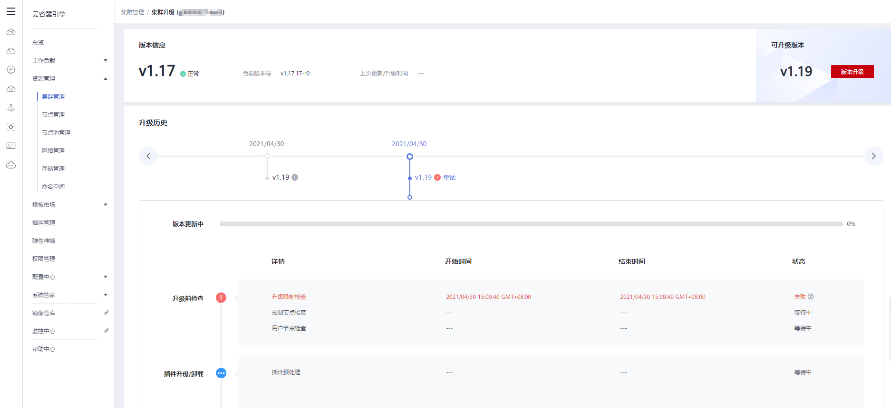
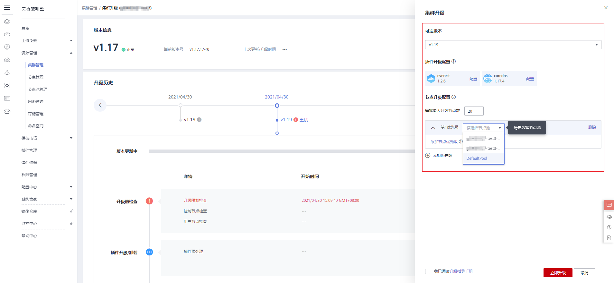
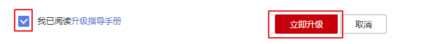
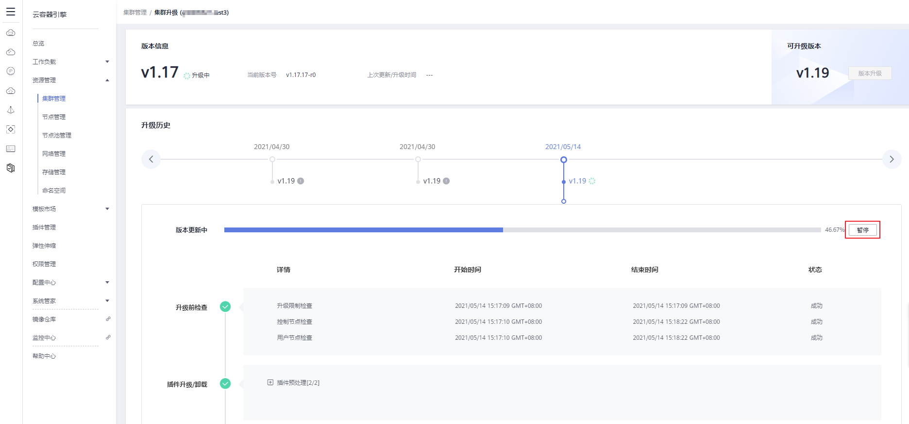
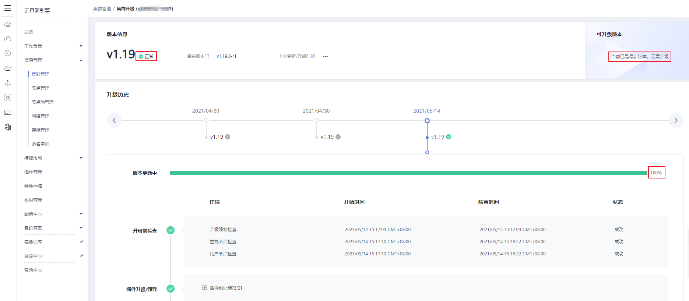
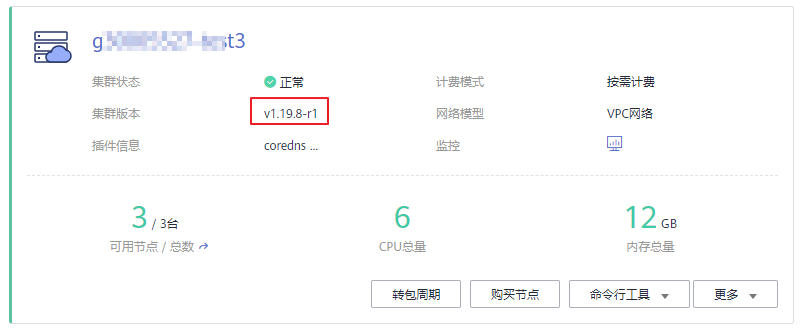

# 升级集群（1.15及以上版本）

## 操作场景

您可以通过云容器引擎管理控制台，可视化的将1.15和1.17版本的集群升级到1.19版本，以支持新特性的使用。

升级前，请先了解CCE各集群版本能够升级到的目标版本，以及升级方式和升级影响，详情请参见[集群升级概述](集群升级概述.md)和[升级前须知](升级前须知.md)。

## 升级说明

-   集群的升级采用原地升级方式更新节点上的Kubernetes组件，升级后不会改变节点上的OS版本。
-   数据面节点升级时将采用分批升级的方式，默认会选择根据CPU、内存、PDB（Pod Disruption Budget，即[为应用程序设置干扰预算](https://kubernetes.io/zh/docs/tasks/run-application/configure-pdb/)）等设置节点升级的优先级，您也可以根据您的业务需要自行设置优先级。

## 注意事项

-   集群升级过程中会自动升级插件到目标集群兼容的版本，升级过程中请不要卸载或者重装插件。
-   升级之前请确认所有的插件都处于运行状态，如果插件升级失败可以在插件问题修复后，重试升级。
-   升级时会检查插件运行状态，部分插件（如CoreDNS）需要至少两个节点才能维持正常状态，那此时升级就至少需要两个节点。
-   若在集群升级过程中出现升级失败的提示，请参照提示信息修复问题后点击重试，若重试后仍未成功升级，请[提交工单](https://console.huaweicloud.com/ticket/#/ticketindex/createIndex)联系我们协助您进行修复。

更多注意事项请参见[升级前须知](升级前须知.md)。

## 操作步骤

本章节内容仅支持将CCE集群从1.15和1.17版本升级到1.19版本，其他版本操作请参考[升级集群（1.13及以下版本）](升级集群（1-13及以下版本）.md)。

1.  登录CCE控制台，单击左侧导航栏的“资源管理 \> 集群管理“，在集群列表页面查看您的集群版本，本例以v1.17.17-r0版本的集群为例。
2.  单击待升级集群右下角的“更多 \> 集群升级“。

    **图 1**  升级集群  
    

    > **说明：** 
    >-   若您的集群当前已是最新版本，则“集群升级“按钮为灰色不可用状态。
    >-   若您的集群状态为“不可用“，则右上角的“可升级”将为灰色，请参考[升级前须知](升级前须知.md)检查集群状态。

3.  在“集群升级“页面中，可以看到当前集群的版本信息（当前版本号、上次更新/升级时间）、可升级版本以及升级历史。

    集群升级步骤包括：升级前检查、插件升级/卸载、控制节点升级、用户节点升级、升级后处理，如下图。

    **图 2**  集群版本升级  
    

4.  单击右侧的“版本升级“按钮，在页面右侧可进行升级参数的配置。

    -   **可选版本：**可以选择本集群能够升级到的Kubernetes版本。
    -   **插件升级配置：**此处列出了您的集群中已安装的插件。在集群升级过程中系统会自动升级插件，以兼容升级后的集群版本，您可以单击插件右侧的“配置”重新定义插件参数。

        > **说明：** 
        >插件右侧如有红色标记.png)，表明该插件将不能兼容升级后的集群版本，升级过程中会卸载并重装该插件，请您务必确认插件的配置参数。

    -   **节点升级配置：**优先级设置时需要先选择节点池，再设置节点池中节点的升级批次，并按照您设置的节点池以及节点顺序进行升级。您可以设置每批升级的最大节点数量，也可以自行定义节点升级的优先级顺序，若不选择，默认情况下系统会根据您节点的情况优选后分批升级。
        -   添加优先级：添加节点池的优先级，自行定义节点池升级的优先级顺序。
        -   添加节点优先级：添加节点池的优先级后，可以设置该节点池内节点升级的优先级顺序，升级时系统将按照您设置的顺序依次对节点进行升级，如不设置该优先级，系统将按照默认的策略执行。

    **图 3**  升级参数配置  
    

5.  认真阅读升级指导手册后，勾选“我已阅读升级指导手册”，单击“立即升级“按钮。

    **图 4**  立即升级  
    

6.  单击“立即升级“后集群开始升级，您可以在页面下方查看版本升级的进程。

    升级过程中，您可以单击右侧的“暂停“按钮，暂停集群版本的升级，若想继续升级，可单击“继续“。

    若在集群升级过程中出现升级失败的提示，请参照提示信息修复问题后点击重试，若重试后仍未成功升级，请[提交工单](https://console.huaweicloud.com/ticket/#/ticketindex/createIndex)联系我们协助您进行修复。

    **图 5**  集群升级中  
    

7.  版本更新进度条显示100%时，表示集群已完成升级，此时版本信息处显示“正常“，可升级版本处显示“当前已是最新版本，无需升级“。

    **图 6**  完成升级  
    

8.  升级完成后，您可以在集群列表页面查看集群当前的Kubernetes版本，确认升级成功。

    **图 7**  确认升级成功  
    

