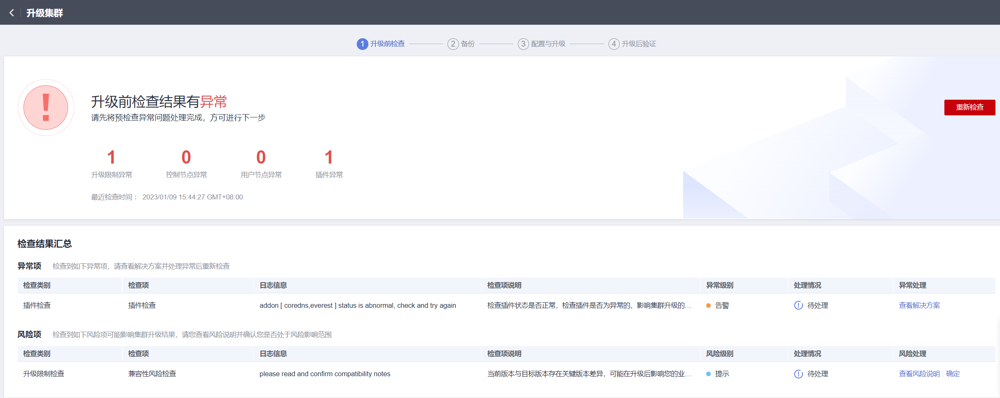

# 原地升级

## 操作场景

您可以通过云容器引擎管理控制台升级集群版本，以支持新特性的使用。

升级前，请先了解CCE各集群版本能够升级到的目标版本，以及升级方式和升级影响，详情请参见[集群升级概述](集群升级概述.md)和[升级前须知](升级前须知.md)。

## 升级说明

-   集群的升级采用原地升级方式更新节点上的Kubernetes组件，升级后不会改变节点上的OS版本。
-   数据面节点升级时将采用分批升级的方式，默认会选择根据CPU、内存、PDB（Pod Disruption Budget，即[为应用程序设置干扰预算](https://kubernetes.io/zh/docs/tasks/run-application/configure-pdb/)）等设置节点升级的优先级，您也可以根据您的业务需要自行设置优先级。

## 注意事项

-   集群升级过程中会自动升级插件到目标集群兼容的版本，升级过程中请不要卸载或者重装插件。
-   升级之前请确认所有的插件都处于运行状态，如果插件升级失败可以在插件问题修复后，重试升级。
-   升级时会检查插件运行状态，部分插件（如CoreDNS）需要至少两个节点才能维持正常状态，那此时升级就至少需要两个节点。
-   若在集群升级过程中出现升级失败的提示，请参照提示信息修复问题后点击重试，若重试后仍未成功升级，请[提交工单](https://console.huaweicloud.com/ticket/#/ticketindex/createIndex)联系我们协助您进行修复。

更多注意事项请参见[升级前须知](升级前须知.md)。

## 操作步骤

集群升级步骤包括：升级前检查、备份、配置与升级、升级后处理。

1.  登录CCE控制台，单击集群名称进入集群。
2.  在左侧导航栏选择“集群升级“，在右侧可以看到推荐升级的版本。

    在“集群升级“页面中，可以看到当前集群的版本信息（当前版本号、上次更新/升级时间）、可升级版本、升级须知以及升级历史。

3.  选择可升级的集群版本，并单击“升级前检查”。

    > **说明：** 
    >-   若您的集群存在更新的小版本，此处无需选择集群版本，默认为最新的小版本。
    >-   若您的集群存在更新的大版本，您可根据需要选择升级的目标版本。
    >-   若您的集群当前已是最新版本，升级前检查入口将会隐藏。

    

4.  单击“开始检查“并确认。如集群中存在异常项或风险项，请根据页面提示的检查结果进行处理，处理完成后需重新进行升级前检查。

    -   异常项：请查看页面提示的解决方案并处理异常后，重新进行升级前检查。
    -   风险项：表示该结果可能会影响集群升级结果，请您查看风险说明并确认您是否处于风险影响范围。如确认无风险，可单击该风险项后的“确认”按钮，手动跳过该风险项，然后重新进行升级前检查。

    待升级前检查通过后，单击“下一步 备份”。

    

5.  （可选）手动进行集群备份。集群升级时会提供默认的数据备份，如需手动备份可单击“备份“按钮执行备份，如无需手动备份可直接单击“下一步 配置与升级“。

    手动单击“备份“按钮会对集群的Master节点进行整机备份，备份过程会使用云备份服务，备份通常耗时在20分钟左右，若当前局点云备份任务排队较多时，备份时间可能同步延长。备份过程中集群将不允许升级。

6.  配置升级参数。
    -   **插件升级配置：**此处列出了您的集群中已安装的插件。在集群升级过程中系统会自动升级插件，以兼容升级后的集群版本，您可以单击插件右侧的“配置”重新定义插件参数。

        > **说明：** 
        >插件右侧如有红色标记.png)，表明该插件将不能兼容升级后的集群版本，升级过程中会卸载并重装该插件，请您务必确认插件的配置参数。

    -   **节点升级配置：**您可以设置每批升级的最大节点数量。
    -   **节点优先级配置：**您可以自行定义节点升级的优先级顺序，若不选择，默认情况下系统会根据您节点的情况优选后分批升级。优先级设置时需要先选择节点池，再设置节点池中节点的升级批次，并按照您设置的节点池以及节点顺序进行升级。
        -   添加优先级：添加节点池的优先级，自行定义节点池升级的优先级顺序。
        -   添加节点优先级：添加节点池的优先级后，可以设置该节点池内节点升级的优先级顺序，升级时系统将按照您设置的顺序依次对节点进行升级，如不设置该优先级，系统将按照默认的策略执行。

7.  配置完成后，单击“升级“按钮，并确认升级操作后集群开始升级。您可以在页面下方查看版本升级的进程。

    升级过程中，您可以单击右侧的“暂停“按钮，暂停集群版本的升级，若想继续升级，可单击“继续“。当版本更新进度条显示100%时，表示集群已完成升级。

    > **说明：** 
    >若在集群升级过程中出现升级失败的提示，请参照提示信息修复问题后重试。

8.  升级完成后，单击“下一步 升级后验证“，请根据页面提示的检查项进行升级后验证。确认所有检查项均正常后，可单击“完成“按钮，并确认完成升级后检查。

    您可以在集群列表页面查看集群当前的Kubernetes版本，确认升级成功。

## 常见问题

-   [CCE集群升级时，升级集群插件失败如何排查解决？](https://support.huaweicloud.com/cce_faq/cce_faq_00402.html)

