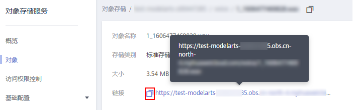
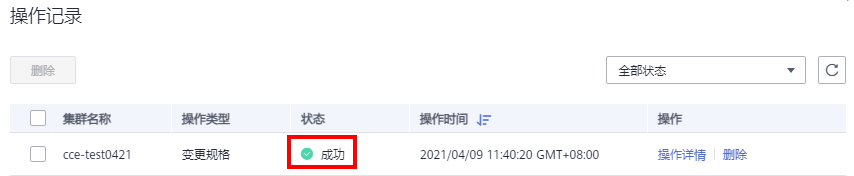

# 变更集群规格

## 操作场景

当前集群管理规模可支持管理的用户节点个数不能满足用户诉求，可通过“变更集群规格”功能来扩大使用的用户节点个数。

## 约束限制

-   集群v1.15及以上版本支持变更集群规格。
-   集群v1.15.11开始支持变更到2000节点，单控制节点不允许变更到1000节点及以上。
-   变更集群规格目前只支持扩容到更大规格，不支持降低集群规格。
-   集群变更规格不支持回退，一旦变更失败将会上报告警。
-   集群规格变更不会影响集群中已运行业务，但变更过程中管理面（Master节点）会有短暂中断，建议变更期间停止其他操作（如创建工作负载等）。

## 操作步骤

1.  登录CCE控制台，在左侧导航栏中选择“资源管理 \> 集群管理”。
2.  在集群卡片中，单击“更多 \> 变更规格“。

    

3.  在弹出的页面，在“集群管理规模” 后根据实际需求选择集群管理规模。
4.  单击“提交”。

    您可以单击“返回集群管理“，在左上角单击“操作记录“，可查看集群变更记录。状态从“进行中”变为“成功”，表示集群规格变更成功。

    

5.  （可选）如果集群规格变更失败，您可继续单击“更多 \> 变更规格”重试，变更集群规格。

