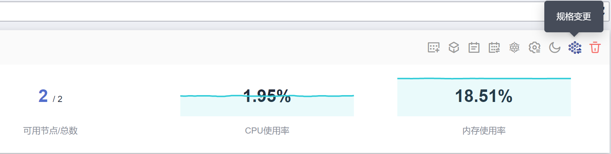

# 变更集群规格

## 操作场景

当前集群管理规模可支持管理的用户节点个数不能满足用户诉求，可通过“变更集群规格”功能来扩大使用的用户节点个数。

## 约束限制

-   集群v1.15及以上版本支持变更集群规格。
-   集群v1.15.11开始支持变更到2000节点，单控制节点的集群不允许变更到1000节点及以上。
-   变更集群规格目前只支持扩容到更大规格，不支持降低集群规格。
-   规格变更期间，控制节点存在开关机动作，集群将无法正常使用，请尽量在业务平稳期执行变更操作。
-   集群规格变更不会影响集群中已运行业务，但变更过程中管理面（Master节点）会有短暂中断，建议变更期间停止其他操作（如创建工作负载等）。
-   规格变更失败后集群将尽可能回退到正常状态，若回退异常可提交工单进行处理。

## 操作步骤

1.  登录CCE控制台，在左侧导航栏中选择“集群管理”。
2.  单击需要变更规格集群后的。

    **图 1**  变更规格  
    

3.  在弹出的页面，在“可选规格“后根据实际需求选择新的集群规格。
4.  单击“确定“。

    您可以单击在左上角单击“操作记录“查看集群变更记录。状态从“执行中“变为“成功“，表示集群规格变更成功。

    **图 2**  操作记录  
    

