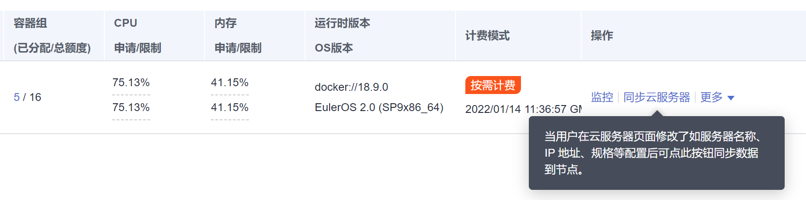

# 同步云服务器

## 操作场景

集群中的每一个节点对应一台云服务器，集群节点创建成功后，您仍可以根据需求，修改云服务器的名称或变更规格。

CCE节点的部分信息是独立于弹性云服务器ECS维护的，当您在ECS控制台修改云服务器的名称、弹性公网IP，以及变更计费方式或变更规格后，需要通过“同步节点信息“功能将信息同步到CCE控制台相应节点中，同步后信息将保持一致。

ECS常见信息修改如下：

-   修改节点名称请参见[修改云服务器名称](https://support.huaweicloud.com/usermanual-ecs/ecs_03_0145.html)。
-   当您购买的节点规格无法满足业务需要时，可参考[变更规格通用操作](https://support.huaweicloud.com/usermanual-ecs/zh-cn_topic_0013771092.html)变更节点规格，升级vCPU、内存。

## 操作步骤

1.  登录CCE控制台。
2.  进入集群，在左侧选择“节点管理“。
3.  单击节点后的“更多 \> 同步云服务器“。

    **图 1**  同步节点信息  
    

    同步完成后，页面右上角将会提示“同步云服务器任务下发成功“。

