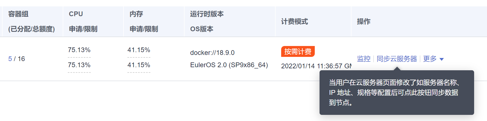

# 同步节点信息

## 背景信息

集群中的每一个节点对应一台弹性云服务器，集群节点创建成功后，您可以根据需求，修改云服务器的名称或变更规格。修改节点名称请参见[修改云服务器名称](https://support.huaweicloud.com/usermanual-ecs/zh-cn_topic_0142266317.html)。

当您在[ECS控制台](https://console.huaweicloud.com/ecm/#/ecs/manager/vmList)中修改云服务的“名称“或变更规格后，需要通过“同步节点信息功能“将信息同步到[CCE控制台](https://console.huaweicloud.com/cce2.0/?utm_source=helpcenter)相应节点中，同步后信息将保持一致。

## 操作步骤

1.  登录[CCE控制台](https://console.huaweicloud.com/cce2.0/?utm_source=helpcenter)，在左侧导航栏中选择“资源管理 \> 节点管理”。
2.  单击节点后的“更多 \> 同步节点信息”。

    > **说明：**   
    >您也可以单击节点名称进入节点详情页，单击右上角“同步节点信息”。  

    **图 1**  同步节点信息  
    

    同步完成后，页面右上角将会提示“同步成功“。

    **图 2**  信息同步成功  
    

