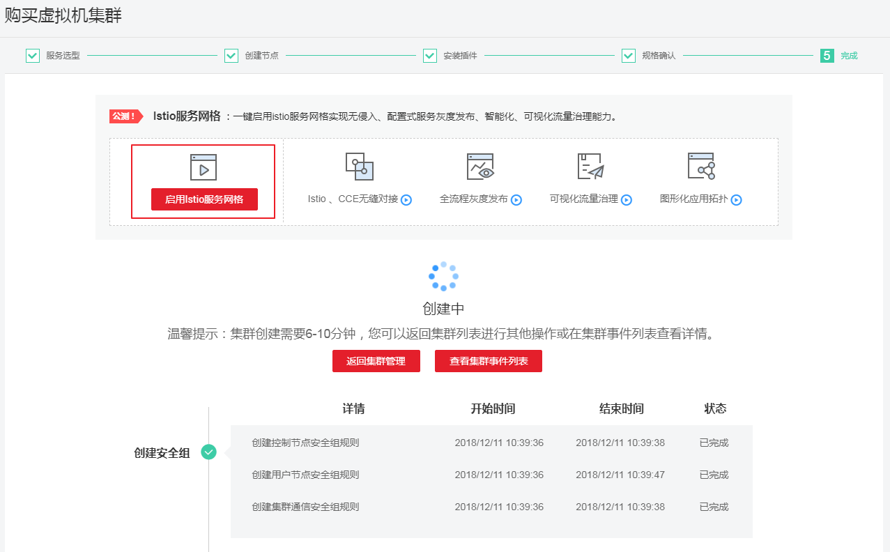
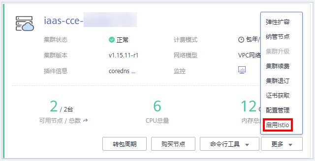

# 启用服务网格

启用应用服务网格将为您的服务以无侵入的方式提供灵活的服务治理能力。云容器引擎深度集成了Istio服务网格，无需修改任何服务代码，也无需手动安装代理，只需开启Istio服务网格功能，即可实现灰度发布、流量管理、熔断、监控、调用链等丰富的服务治理能力。

1.  通过如下两种方式启用Istio服务网格：
    -   方式一：在集群创建完成后，单击创建页面的“启用Istio服务网格“进行启用。 创建集群步骤请参见[创建虚拟机集群](https://support.huaweicloud.com/usermanual-cce/cce_01_0028.html)。

        **图 1**  启用Istio服务网格  
        

    -   方式二：在“资源管理 \> 集群管理“中，单击集群卡片上的“启用Istio“进行启用。

        **图 2**  启用Istio  
        

2.  服务选型。

    单击启用Istio后进入服务选型页面，参照[表1](#table330213222506)设置服务选型参数。

    **表 1**  启用Istio服务网格参数配置

    
    <table><thead align="left"><tr id="row830332265020"><th class="cellrowborder" valign="top" width="17.330000000000002%" id="mcps1.2.3.1.1">
参数

    </th>
    <th class="cellrowborder" valign="top" width="82.67%" id="mcps1.2.3.1.2">
参数说明

    </th>
    </tr>
    </thead>
    <tbody><tr id="row7303202215503"><td class="cellrowborder" valign="top" width="17.330000000000002%" headers="mcps1.2.3.1.1 ">
部署模式

    </td>
    <td class="cellrowborder" valign="top" width="82.67%" headers="mcps1.2.3.1.2 ">
独享模式：

    
将为您纳管专属节点，用于部署Istio控制面组件，非Istio控制面负载将无法调度到该专属节点上，资源隔离，推荐使用；独享模式需要您有充足的节点配额和磁盘配额，一个节点需要配备40G系统盘及100G数据盘，高可用模式需要两个节点配额（四个磁盘配额），单点模式需要一个节点配额（两个磁盘配额）；

    
共享模式：

    
会将Istio控制面组件部署在您的集群节点上，请确保集群内有可用节点，否则无法启用共享模式Istio服务网格；共享模式Istio控制面与数据面未做隔离，可能产生未知问题，生产环境建议您使用独享模式。

    </td>
    </tr>
    <tr id="row13030224505"><td class="cellrowborder" valign="top" width="17.330000000000002%" headers="mcps1.2.3.1.1 ">
计费模式

    </td>
    <td class="cellrowborder" valign="top" width="82.67%" headers="mcps1.2.3.1.2 ">
支持“按需计费”和“包年/包月”类型。

    </td>
    </tr>
    <tr id="row1030342255013"><td class="cellrowborder" valign="top" width="17.330000000000002%" headers="mcps1.2.3.1.1 ">
高可用

    </td>
    <td class="cellrowborder" valign="top" width="82.67%" headers="mcps1.2.3.1.2 ">
是，选择高可用模式将为您纳管两个独享节点，Istio控制面多实例部署，显著提升Istio控制面稳定性，推荐使用；

    
否，仅为您纳管一个独享节点，单点模式，Istio控制面组件单实例，性能及稳定性欠佳。

    </td>
    </tr>
    <tr id="row17303112235015"><td class="cellrowborder" valign="top" width="17.330000000000002%" headers="mcps1.2.3.1.1 ">
当前区域

    </td>
    <td class="cellrowborder" valign="top" width="82.67%" headers="mcps1.2.3.1.2 ">
节点实例所在的物理位置。

    </td>
    </tr>
    <tr id="row11834233161712"><td class="cellrowborder" valign="top" width="17.330000000000002%" headers="mcps1.2.3.1.1 ">
可用区

    </td>
    <td class="cellrowborder" valign="top" width="82.67%" headers="mcps1.2.3.1.2 ">
指在同一区域下，电力、网络隔离的物理区域，可用区之间内网互通，不同可用区之间物理隔离。

    </td>
    </tr>
    <tr id="row133044222501"><td class="cellrowborder" valign="top" width="17.330000000000002%" headers="mcps1.2.3.1.1 ">
节点规格

    </td>
    <td class="cellrowborder" valign="top" width="82.67%" headers="mcps1.2.3.1.2 ">
请单击，选择所需的规格。新建节点的CPU配额和内存配额，请根据业务需求，参考提供的推荐规格来选择，参见<a href="规格推荐.md">规格推荐</a>。

    </td>
    </tr>
    <tr id="row41171850195411"><td class="cellrowborder" valign="top" width="17.330000000000002%" headers="mcps1.2.3.1.1 ">
登录方式

    </td>
    <td class="cellrowborder" valign="top" width="82.67%" headers="mcps1.2.3.1.2 ">
当前支持密码和密钥对。

    <ul id="ul1150620635513"><li>登录方式为“密码”：请输入登录节点的密码，并确认密码。</li><li>登录方式为“密钥对”：选择登录节点的密钥对。
 说明： 

密钥对用于远程登录节点时的身份认证，若没有密钥对，可单击“创建密钥对”来新建。参见<a href="https://support.huaweicloud.com/usermanual-cce/cce_01_0028.html" target="_blank" rel="noopener noreferrer">创建密钥对</a>。

    

    </li></ul>
    </td>
    </tr>
    <tr id="row10197184895414"><td class="cellrowborder" valign="top" width="17.330000000000002%" headers="mcps1.2.3.1.1 ">
节点配额

    </td>
    <td class="cellrowborder" valign="top" width="82.67%" headers="mcps1.2.3.1.2 ">
此处为节点配额提示。

    </td>
    </tr>
    </tbody>
    </table>

3.  单击“立即购买“提交配置。
    -   若为共享模式，则选择负载均衡实例后，单击“立即购买”，将直接跳转到提交成功页，预计需要5分钟；
    -   若为独享-按需模式，单击“立即购买”，确认订单无误后，单击“提交“，开始启用Istio，预计需要6-10分钟；
    -   若为独享-包周期，需选择购买时长，确认订单无误后，单击“去支付”，请根据界面提示进行付款，付款成功开始启用Istio，预计需要6-10分钟。

        > **说明：**   
        >选择“立即购买”后，会进行启用Istio的操作，期间会操作您的一些资源：  
        >1、若为独享型，则创建1或2个ECS节点，作为Istio控制面运行节点。  
        >2、创建一个Helm应用编排release对象，作为Istio控制面的资源 。  
        >3、开通ECS节点的安全组，允许7443端口的入流量，使其支持对Pod进行自动注入。  
        >4、为该集群的default的命名空间打上inject=true标签。  

4.  提交或订单支付成功后，可在集群列表中查看Istio启用状态。
    -   若Istio正常运行，则在集群卡片的集群名称右侧显示。
    -   若Istio未正常运行，则在集群卡片的集群名称右侧显示。

        > **说明：**   
        >包年包月购买方式，会自动创建云服务器。若创建失败，该失败回滚过程会根据云服务器的统一收费策略来收取费用。若出现失败回滚类的收费，支持填写工单申请退款。  

