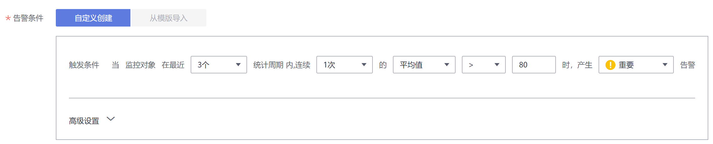

# 告警配置

CCE对接AOM并上报告警和事件，通过在AOM中设置告警规则，您可以及时了解集群中各种资源是否存在异常。

## 告警配置流程

1.  [在SMN创建主题](#cce_10_0394_section195323513222)。
2.  [创建行动策略](#cce_10_0394_section7253105714217)。
3.  添加告警规则。
    1.  事件类告警：根据集群上报到AOM的事件配置告警。推荐配置的事件和配置方法请参见[添加事件类告警](#cce_10_0394_section4751134363617)。
    2.  阈值类告警：实时监控环境中主机、组件等资源使用情况，根据监控指标阈值告警。推荐配置阈值指标和配置方法请参见[添加阈值类告警](#cce_10_0394_section1217328131)。

## 在SMN创建主题

SMN（Simple Message Notification，消息通知服务）是向订阅者主动推送消息的服务，订阅者可以是电子邮件、短信、HTTP和HTTPS等。

主题是消息发布或客户端订阅通知的特定事件类型。它作为发送消息和订阅通知的信道，为发布者和订阅者提供一个可以相互交流的通道。

您需要创建一个主题，并订阅。具体方法请参见[创建主题](https://support.huaweicloud.com/usermanual-smn/zh-cn_topic_0043961401.html)和[订阅主题](https://support.huaweicloud.com/usermanual-smn/zh-cn_topic_0043961402.html)。

> **说明：** 
>订阅主题后，请前往您的订阅终端（邮件或短信）手动确认添加订阅，消息通知才可生效。

## 创建行动策略

AOM提供告警行动策略定制功能，您可以通过创建告警行动策略关联SMN主题与消息模板，通过创建消息模板，自定义通知消息配置。

具体方法请参见[创建告警行动策略](https://support.huaweicloud.com/usermanual-aom/aom_02_0926.html)。创建时选择[在SMN创建主题](#cce_10_0394_section195323513222)创建并订阅的主题。

## 添加事件类告警

以添加“节点状态异常告警“为例，展示添加事件类告警的步骤。

此功能为AOM的功能，详细的参数说明请参见[创建事件类告警规则](https://support.huaweicloud.com/usermanual-aom/aom_02_0061.html)。

**表 1**  推荐配置的事件类告警

<table><thead align="left"><tr id="cce_10_0394_row1960019963813"><th class="cellrowborder" valign="top" width="15.770000000000001%" id="mcps1.2.5.1.1">
事件名称

</th>
<th class="cellrowborder" valign="top" width="11.44%" id="mcps1.2.5.1.2">
来源

</th>
<th class="cellrowborder" valign="top" width="23.24%" id="mcps1.2.5.1.3">
事件说明

</th>
<th class="cellrowborder" valign="top" width="49.55%" id="mcps1.2.5.1.4">
处理建议

</th>
</tr>
</thead>
<tbody><tr id="cce_10_0394_row9600139163812"><td class="cellrowborder" valign="top" width="15.770000000000001%" headers="mcps1.2.5.1.1 ">
节点状态异常

</td>
<td class="cellrowborder" valign="top" width="11.44%" headers="mcps1.2.5.1.2 ">
CCE

</td>
<td class="cellrowborder" valign="top" width="23.24%" headers="mcps1.2.5.1.3 ">
节点异常立即触发告警

</td>
<td class="cellrowborder" valign="top" width="49.55%" headers="mcps1.2.5.1.4 ">
登录集群查看告警节点状态，确认异常后，优先将此节点设置为不可调度，并将业务pod调度到其他节点

</td>
</tr>
<tr id="cce_10_0394_row36001299383"><td class="cellrowborder" valign="top" width="15.770000000000001%" headers="mcps1.2.5.1.1 ">
节点重启

</td>
<td class="cellrowborder" valign="top" width="11.44%" headers="mcps1.2.5.1.2 ">
CCE

</td>
<td class="cellrowborder" valign="top" width="23.24%" headers="mcps1.2.5.1.3 ">
节点重启立即触发告警

</td>
<td class="cellrowborder" valign="top" width="49.55%" headers="mcps1.2.5.1.4 ">
登录集群查看告警节点状态，并确保节点正常启动可用，关注重启原因

</td>
</tr>
<tr id="cce_10_0394_row156001963811"><td class="cellrowborder" valign="top" width="15.770000000000001%" headers="mcps1.2.5.1.1 ">
节点kubelet故障

</td>
<td class="cellrowborder" valign="top" width="11.44%" headers="mcps1.2.5.1.2 ">
CCE

</td>
<td class="cellrowborder" valign="top" width="23.24%" headers="mcps1.2.5.1.3 ">
节点异常立即触发告警

</td>
<td class="cellrowborder" valign="top" width="49.55%" headers="mcps1.2.5.1.4 ">
登录集群查看告警节点状态，确认异常后，优先将此节点设置为不可调度，并将业务pod调度到其他节点；重启kubelet

</td>
</tr>
<tr id="cce_10_0394_row13601394384"><td class="cellrowborder" valign="top" width="15.770000000000001%" headers="mcps1.2.5.1.1 ">
节点docker故障

</td>
<td class="cellrowborder" valign="top" width="11.44%" headers="mcps1.2.5.1.2 ">
CCE

</td>
<td class="cellrowborder" valign="top" width="23.24%" headers="mcps1.2.5.1.3 ">
节点异常立即触发告警

</td>
<td class="cellrowborder" valign="top" width="49.55%" headers="mcps1.2.5.1.4 ">
登录集群查看告警节点状态，确认异常后，优先将此节点设置为不可调度，并将业务pod调度到其他节点；重启docker

</td>
</tr>
<tr id="cce_10_0394_row7601189153817"><td class="cellrowborder" valign="top" width="15.770000000000001%" headers="mcps1.2.5.1.1 ">
节点kube-proxy故障

</td>
<td class="cellrowborder" valign="top" width="11.44%" headers="mcps1.2.5.1.2 ">
CCE

</td>
<td class="cellrowborder" valign="top" width="23.24%" headers="mcps1.2.5.1.3 ">
节点异常立即触发告警

</td>
<td class="cellrowborder" valign="top" width="49.55%" headers="mcps1.2.5.1.4 ">
登录集群查看告警节点状态，确认异常后，优先将此节点设置为不可调度，并将业务pod调度到其他节点

</td>
</tr>
<tr id="cce_10_0394_row460113973813"><td class="cellrowborder" valign="top" width="15.770000000000001%" headers="mcps1.2.5.1.1 ">
节点操作系统内核故障

</td>
<td class="cellrowborder" valign="top" width="11.44%" headers="mcps1.2.5.1.2 ">
CCE

</td>
<td class="cellrowborder" valign="top" width="23.24%" headers="mcps1.2.5.1.3 ">
节点异常立即触发告警

</td>
<td class="cellrowborder" valign="top" width="49.55%" headers="mcps1.2.5.1.4 ">
登录集群查看告警节点状态，确认异常后，优先将此节点设置为不可调度，并将业务pod调度到其他节点

</td>
</tr>
<tr id="cce_10_0394_row760119203816"><td class="cellrowborder" valign="top" width="15.770000000000001%" headers="mcps1.2.5.1.1 ">
节点的连接跟踪表已满

</td>
<td class="cellrowborder" valign="top" width="11.44%" headers="mcps1.2.5.1.2 ">
CCE

</td>
<td class="cellrowborder" valign="top" width="23.24%" headers="mcps1.2.5.1.3 ">
节点异常立即触发告警

</td>
<td class="cellrowborder" valign="top" width="49.55%" headers="mcps1.2.5.1.4 ">
登录集群查看告警节点状态，确认异常后，优先将此节点设置为不可调度，并将业务pod调度到其他节点

</td>
</tr>
<tr id="cce_10_0394_row46014915383"><td class="cellrowborder" valign="top" width="15.770000000000001%" headers="mcps1.2.5.1.1 ">
节点池资源售罄

</td>
<td class="cellrowborder" valign="top" width="11.44%" headers="mcps1.2.5.1.2 ">
CCE

</td>
<td class="cellrowborder" valign="top" width="23.24%" headers="mcps1.2.5.1.3 ">
节点池资源售罄立即告警

</td>
<td class="cellrowborder" valign="top" width="49.55%" headers="mcps1.2.5.1.4 ">
设置自动节点池切换或更换节点池规格

</td>
</tr>
<tr id="cce_10_0394_row166016973816"><td class="cellrowborder" valign="top" width="15.770000000000001%" headers="mcps1.2.5.1.1 ">
节点创建失败

</td>
<td class="cellrowborder" valign="top" width="11.44%" headers="mcps1.2.5.1.2 ">
CCE

</td>
<td class="cellrowborder" valign="top" width="23.24%" headers="mcps1.2.5.1.3 ">
创建节点失败立即触发

</td>
<td class="cellrowborder" valign="top" width="49.55%" headers="mcps1.2.5.1.4 ">
查看创建节点失败原因，尝试重新创建节点

</td>
</tr>
<tr id="cce_10_0394_row1860115911380"><td class="cellrowborder" valign="top" width="15.770000000000001%" headers="mcps1.2.5.1.1 ">
扩容节点超时

</td>
<td class="cellrowborder" valign="top" width="11.44%" headers="mcps1.2.5.1.2 ">
CCE

</td>
<td class="cellrowborder" valign="top" width="23.24%" headers="mcps1.2.5.1.3 ">
扩容节点超时立即触发

</td>
<td class="cellrowborder" valign="top" width="49.55%" headers="mcps1.2.5.1.4 ">
查看扩容节点失超时原因，尝试重新扩容节点

</td>
</tr>
<tr id="cce_10_0394_row16011913384"><td class="cellrowborder" valign="top" width="15.770000000000001%" headers="mcps1.2.5.1.1 ">
缩容节点失败

</td>
<td class="cellrowborder" valign="top" width="11.44%" headers="mcps1.2.5.1.2 ">
CCE

</td>
<td class="cellrowborder" valign="top" width="23.24%" headers="mcps1.2.5.1.3 ">
缩容节点超时立即触发

</td>
<td class="cellrowborder" valign="top" width="49.55%" headers="mcps1.2.5.1.4 ">
查看缩容节点失超时原因，尝试重新缩容节点

</td>
</tr>
<tr id="cce_10_0394_row10602299387"><td class="cellrowborder" valign="top" width="15.770000000000001%" headers="mcps1.2.5.1.1 ">
拉取镜像重试失败

</td>
<td class="cellrowborder" valign="top" width="11.44%" headers="mcps1.2.5.1.2 ">
CCE

</td>
<td class="cellrowborder" valign="top" width="23.24%" headers="mcps1.2.5.1.3 ">
拉取镜像重试失败

</td>
<td class="cellrowborder" valign="top" width="49.55%" headers="mcps1.2.5.1.4 ">
登录集群查看拉取镜像失败原因，重新部署业务负载

</td>
</tr>
</tbody>
</table>

1.  登录AOM控制台。
2.  在左侧导航栏选择“告警 \> 告警规则“，在右上角单击“添加告警“。
3.  设置告警规则。

    -   规则类型：选择事件类告警。
    -   告警来源：选择CCE。
    -   触发对象：根据事件名称触发，选择“节点状态异常\#\#NodeNotReady“事件。触发对象可以通过多个维度（通知类型、事件名称、告警级别、自定义属性、命名空间、集群名称）进行筛选，您可以根据需要选择。
    -   触发方式：选择立即触发。
    -   告警方式：直接告警。
    -   行动策略：选择[创建行动策略](#cce_10_0394_section7253105714217)创建的行动策略。

    这里设置告警的意思为：

    集群中有节点状态异常时，CCE会上报“节点状态异常\#\#NodeNotReady“的事件到AOM，AOM根据这里设置的告警规则，当有“节点状态异常\#\#NodeNotReady“事件时，立即触发告警通知，并根据行动策略，通过SMN通知到您。

    **图 1**  创建事件类告警  
    

4.  单击“立即创建“。

    创建后在规则列表中可以看到如下一行，表示创建成功。

    

事件类告警是根据CCE上报到AOM的事件来决定是否告警，CCE上报了一系列事件到AOM，您可以在配置事件告警的处查看具体事件，根据自身需求添加事件类告警。

**图 2**  CCE上报的事件  

当前支持如下事件：

-   扩容节点超时
-   数据卷扩容失败
-   主机卸载块存储失败
-   节点池资源充足
-   卷回收策略未知
-   太多活跃Pod
-   挂载数据卷失败
-   节点kubelet故障
-   标签选择器冲突
-   缩容节点
-   节点内存空间不足
-   卷PVC丢失
-   节点上发现未注册的网络设备
-   数据卷回收失败
-   未触发节点扩容
-   删除未注册节点成功
-   状态异常
-   删除失败
-   网卡未发现
-   太多成功Pod
-   缩容空闲节点成功
-   未拉取镜像异常
-   节点重启
-   节点kube-proxy故障
-   扩容失败
-   节点磁盘空间已满
-   节点任务夯住
-   等待主机挂载块存储失败
-   启动失败
-   拉取镜像失败
-   废弃节点清理
-   副本集创建异常
-   CIDR不可用
-   节点的连接跟踪表已满
-   节点磁盘空间不足
-   待机失败
-   缩容节点失败
-   节点不可调度
-   节点池扩容节点失败
-   更新配置失败
-   节点池扩容节点成功
-   节点纳管失败
-   创建负载均衡失败
-   查询失败
-   数据卷删除失败
-   节点操作系统内核故障
-   扩容节点失败
-   挂载盘符失败
-   删除负载均衡失败
-   修复节点池节点个数成功
-   卸载数据卷失败
-   激活失败
-   节点内存不足强杀进程
-   卸载盘符失败
-   节点docker故障
-   回滚失败
-   CIDR分配失败
-   节点docker夯住
-   标签选择器异常
-   节点状态异常
-   创建卷失败
-   创建卷清理失败
-   节点池退避重试中
-   启动重试失败
-   部署回滚版本未发现
-   调度失败
-   修复节点池节点个数失败
-   节点文件系统只读
-   更新失败
-   节点ntp服务故障
-   节点创建失败
-   拉取镜像重试失败
-   节点卸载失败
-   卷误绑定
-   查询Pod列表失败
-   节点池资源售罄
-   节点磁盘卸载夯住
-   创建失败
-   更新负载均衡失败
-   未知Job
-   缩容失败
-   触发节点扩容
-   主机挂载块存储失败
-   重启失败
-   节点cni插件故障
-   节点池扩容节点启动
-   缩容空闲节点启动
-   删除未注册节点失败
-   内部故障
-   外部依赖异常
-   初始化执行线程失败
-   更新数据库失败
-   节点池触发创建节点失败
-   节点池触发删除节点失败
-   创建包周期节点失败
-   解除资源租户访问控制节点镜像的授权失败
-   创建虚拟IP失败
-   删除节点虚拟机失败
-   删除节点安全组失败
-   删除控制节点安全组失败
-   删除控制节点网卡安全组失败
-   删除集群ENI/SubENI安全组失败
-   解绑控制节点网卡失败
-   删除控制节点网卡失败
-   删除控制节点虚拟机失败
-   删除控制节点密钥对失败
-   删除控制节点subnet失败
-   删除控制节点VPC失败
-   删除集群证书失败
-   删除控制节点云服务器组失败
-   删除虚拟IP失败
-   获取控制节点浮动IP失败
-   获取集群规格信息失败
-   获取集群endpoint失败
-   获取kubernetes集群连接失败
-   更新集群Secret失败
-   处理用户操作超时
-   连接kubernetes集群超时
-   检查组件状态失败或组件状态异常
-   无法在kubernetes集群中找到该节点
-   节点在kubernetes集群中状态异常
-   无法在ECS服务中找到该节点对应的虚拟机
-   升级控制节点失败
-   升级节点失败
-   变更控制节点规格失败
-   变更控制节点规格超时
-   创建包周期节点校验不通过
-   安装节点失败
-   清理VPC中集群容器网络路由表条目失败
-   集群状态不可用
-   集群状态故障
-   集群状态长时间不更新
-   集群升级超时后更新控制节点状态失败
-   集群升级超时后更新运行中的任务失败
-   更新集群状态失败
-   更新节点状态失败
-   纳管节点超时后移除数据库中的节点记录失败
-   节点处理超时后更新节点状态为异常失败
-   更新集群访问地址失败
-   删除不可用的Kubernetes连接失败
-   同步集群证书失败

## 添加阈值类告警

以添加“工作负载CPU使用率告警“为例，展示添加阈值类告警的步骤。其他阈值类告警也可以使用相同方法创建。

此功能为AOM的功能，详细的参数说明请参见[自定义静态阈值规则](https://support.huaweicloud.com/usermanual-aom/aom_02_0060.html#section2)。

阈值类告警建议按[表2](#cce_10_0394_table118812074015)配置。

> **须知：** 
>everest-csi-controller、everest-csi-driver、coredns、autoscaler、yangtse组件必须配置Pod的cpu使用率、物理mem使用率、文件系统使用率告警。如果资源使用率较高，请及时扩大规格，以免部分系统功能不可用。

**表 2**  推荐阈值类告警配置

<table><thead align="left"><tr id="cce_10_0394_row131884011403"><th class="cellrowborder" valign="top" width="11.018898110188982%" id="mcps1.2.5.1.1">
资源类型

</th>
<th class="cellrowborder" valign="top" width="14.478552144785523%" id="mcps1.2.5.1.2">
监控项

</th>
<th class="cellrowborder" valign="top" width="37.1962803719628%" id="mcps1.2.5.1.3">
监控说明

</th>
<th class="cellrowborder" valign="top" width="37.3062693730627%" id="mcps1.2.5.1.4">
推荐触发条件

</th>
</tr>
</thead>
<tbody><tr id="cce_10_0394_row16188106406"><td class="cellrowborder" rowspan="4" valign="top" width="11.018898110188982%" headers="mcps1.2.5.1.1 ">
集群

</td>
<td class="cellrowborder" valign="top" width="14.478552144785523%" headers="mcps1.2.5.1.2 ">
CPU使用率

</td>
<td class="cellrowborder" valign="top" width="37.1962803719628%" headers="mcps1.2.5.1.3 ">
该指标用于统计测量对象的CPU使用率。

</td>
<td class="cellrowborder" valign="top" width="37.3062693730627%" headers="mcps1.2.5.1.4 ">
阈值条件：&gt;85%; 统计周期(分钟)1; 连续周期：3

</td>
</tr>
<tr id="cce_10_0394_row618819074015"><td class="cellrowborder" valign="top" headers="mcps1.2.5.1.1 ">
磁盘使用率

</td>
<td class="cellrowborder" valign="top" headers="mcps1.2.5.1.2 ">
已使用的磁盘空间占总的磁盘空间容量百分比。

</td>
<td class="cellrowborder" valign="top" headers="mcps1.2.5.1.3 ">
阈值条件：&gt;85%; 统计周期(分钟)1; 连续周期：3

</td>
</tr>
<tr id="cce_10_0394_row1818813016405"><td class="cellrowborder" valign="top" headers="mcps1.2.5.1.1 ">
物理内存使用率

</td>
<td class="cellrowborder" valign="top" headers="mcps1.2.5.1.2 ">
该指标用于统计测量对象已使用内存占申请物理内存总量的百分比。

</td>
<td class="cellrowborder" valign="top" headers="mcps1.2.5.1.3 ">
阈值条件：&gt;85%; 统计周期(分钟)1; 连续周期：3

</td>
</tr>
<tr id="cce_10_0394_row91897015406"><td class="cellrowborder" valign="top" headers="mcps1.2.5.1.1 ">
虚拟内存使用率

</td>
<td class="cellrowborder" valign="top" headers="mcps1.2.5.1.2 ">
该指标用于统计测量对象已使用虚拟内存占虚拟内存总量的百分比。

</td>
<td class="cellrowborder" valign="top" headers="mcps1.2.5.1.3 ">
阈值条件：&gt;85%; 统计周期(分钟)1; 连续周期：3

</td>
</tr>
<tr id="cce_10_0394_row181895024015"><td class="cellrowborder" rowspan="3" valign="top" width="11.018898110188982%" headers="mcps1.2.5.1.1 ">
主机

</td>
<td class="cellrowborder" valign="top" width="14.478552144785523%" headers="mcps1.2.5.1.2 ">
CPU使用率

</td>
<td class="cellrowborder" valign="top" width="37.1962803719628%" headers="mcps1.2.5.1.3 ">
该指标用于统计测量对象的CPU使用率。

</td>
<td class="cellrowborder" valign="top" width="37.3062693730627%" headers="mcps1.2.5.1.4 ">
阈值条件：&gt;85%; 统计周期(分钟)1; 连续周期：3

</td>
</tr>
<tr id="cce_10_0394_row91894004010"><td class="cellrowborder" valign="top" headers="mcps1.2.5.1.1 ">
物理内存使用率

</td>
<td class="cellrowborder" valign="top" headers="mcps1.2.5.1.2 ">
该指标用于统计测量对象已使用内存占申请物理内存总量的百分比。

</td>
<td class="cellrowborder" valign="top" headers="mcps1.2.5.1.3 ">
阈值条件：&gt;85%; 统计周期(分钟)1; 连续周期：3

</td>
</tr>
<tr id="cce_10_0394_row41891705400"><td class="cellrowborder" valign="top" headers="mcps1.2.5.1.1 ">
虚拟内存使用率

</td>
<td class="cellrowborder" valign="top" headers="mcps1.2.5.1.2 ">
该指标用于统计测量对象已使用虚拟内存占虚拟内存总量的百分比。

</td>
<td class="cellrowborder" valign="top" headers="mcps1.2.5.1.3 ">
阈值条件：&gt;85%; 统计周期(分钟)1; 连续周期：3

</td>
</tr>
<tr id="cce_10_0394_row1418940104017"><td class="cellrowborder" rowspan="2" valign="top" width="11.018898110188982%" headers="mcps1.2.5.1.1 ">
主机-网络

</td>
<td class="cellrowborder" valign="top" width="14.478552144785523%" headers="mcps1.2.5.1.2 ">
接收错包率

</td>
<td class="cellrowborder" valign="top" width="37.1962803719628%" headers="mcps1.2.5.1.3 ">
每秒网卡接收的错误包个数。

</td>
<td class="cellrowborder" valign="top" width="37.3062693730627%" headers="mcps1.2.5.1.4 ">
阈值条件：&gt;0; 统计周期(分钟)1; 连续周期：3

</td>
</tr>
<tr id="cce_10_0394_row118990194013"><td class="cellrowborder" valign="top" headers="mcps1.2.5.1.1 ">
发送错包率

</td>
<td class="cellrowborder" valign="top" headers="mcps1.2.5.1.2 ">
每秒网卡发送的错误包个数。

</td>
<td class="cellrowborder" valign="top" headers="mcps1.2.5.1.3 ">
阈值条件：&gt;0; 统计周期(分钟)1; 连续周期：3

</td>
</tr>
<tr id="cce_10_0394_row91897044012"><td class="cellrowborder" rowspan="2" valign="top" width="11.018898110188982%" headers="mcps1.2.5.1.1 ">
主机-文件系统

</td>
<td class="cellrowborder" valign="top" width="14.478552144785523%" headers="mcps1.2.5.1.2 ">
磁盘使用率

</td>
<td class="cellrowborder" valign="top" width="37.1962803719628%" headers="mcps1.2.5.1.3 ">
已使用的磁盘空间占总的磁盘空间容量百分比。

</td>
<td class="cellrowborder" valign="top" width="37.3062693730627%" headers="mcps1.2.5.1.4 ">
阈值条件：&gt;85%; 统计周期(分钟)1; 连续周期：3

</td>
</tr>
<tr id="cce_10_0394_row1318913014011"><td class="cellrowborder" valign="top" headers="mcps1.2.5.1.1 ">
磁盘读写状态

</td>
<td class="cellrowborder" valign="top" headers="mcps1.2.5.1.2 ">
统计主机上磁盘的读写状态。

</td>
<td class="cellrowborder" valign="top" headers="mcps1.2.5.1.3 ">
阈值条件：&gt;=1; 统计周期(分钟)1; 连续周期：1

</td>
</tr>
<tr id="cce_10_0394_row181908084016"><td class="cellrowborder" rowspan="4" valign="top" width="11.018898110188982%" headers="mcps1.2.5.1.1 ">
工作负载

</td>
<td class="cellrowborder" valign="top" width="14.478552144785523%" headers="mcps1.2.5.1.2 ">
工作负载状态

</td>
<td class="cellrowborder" valign="top" width="37.1962803719628%" headers="mcps1.2.5.1.3 ">
工作负载状态异常。

</td>
<td class="cellrowborder" valign="top" width="37.3062693730627%" headers="mcps1.2.5.1.4 ">
阈值条件：&gt;=1; 统计周期(分钟)1; 连续周期：1

</td>
</tr>
<tr id="cce_10_0394_row1119016013409"><td class="cellrowborder" valign="top" headers="mcps1.2.5.1.1 ">
CPU使用率

</td>
<td class="cellrowborder" valign="top" headers="mcps1.2.5.1.2 ">
该指标用于统计测量对象的CPU使用率。服务实际使用的与申请的CPU核数量比率。

</td>
<td class="cellrowborder" valign="top" headers="mcps1.2.5.1.3 ">
阈值条件：&gt;85%; 统计周期(分钟)1; 连续周期：3

</td>
</tr>
<tr id="cce_10_0394_row619010164011"><td class="cellrowborder" valign="top" headers="mcps1.2.5.1.1 ">
物理内存使用率

</td>
<td class="cellrowborder" valign="top" headers="mcps1.2.5.1.2 ">
该指标用于统计测量对象已使用内存占申请物理内存总量的百分比。

</td>
<td class="cellrowborder" valign="top" headers="mcps1.2.5.1.3 ">
阈值条件：&gt;85%; 统计周期(分钟)1; 连续周期：3

</td>
</tr>
<tr id="cce_10_0394_row1319013012402"><td class="cellrowborder" valign="top" headers="mcps1.2.5.1.1 ">
文件系统使用率

</td>
<td class="cellrowborder" valign="top" headers="mcps1.2.5.1.2 ">
该指标用于统计测量对象文件系统使用率。实际使用量与文件系统容量的百分比。仅支持1.11及其更高版本的kubernetes集群中驱动模式为devicemapper的容器。

</td>
<td class="cellrowborder" valign="top" headers="mcps1.2.5.1.3 ">
阈值条件：&gt;85%; 统计周期(分钟)1; 连续周期：3

</td>
</tr>
<tr id="cce_10_0394_row1519010004014"><td class="cellrowborder" rowspan="7" valign="top" width="11.018898110188982%" headers="mcps1.2.5.1.1 ">
Pod

</td>
<td class="cellrowborder" valign="top" width="14.478552144785523%" headers="mcps1.2.5.1.2 ">
CPU使用率

</td>
<td class="cellrowborder" valign="top" width="37.1962803719628%" headers="mcps1.2.5.1.3 ">
该指标用于统计测量对象的CPU使用率。服务实际使用的与申请的CPU核数量比率。

</td>
<td class="cellrowborder" valign="top" width="37.3062693730627%" headers="mcps1.2.5.1.4 ">
阈值条件：&gt;85%; 统计周期(分钟)1; 连续周期：3

</td>
</tr>
<tr id="cce_10_0394_row4190607406"><td class="cellrowborder" valign="top" headers="mcps1.2.5.1.1 ">
文件系统使用率

</td>
<td class="cellrowborder" valign="top" headers="mcps1.2.5.1.2 ">
该指标用于统计测量对象文件系统使用率。实际使用量与文件系统容量的百分比。仅支持1.11及其更高版本的kubernetes集群中驱动模式为devicemapper的容器。

</td>
<td class="cellrowborder" valign="top" headers="mcps1.2.5.1.3 ">
阈值条件：&gt;85%; 统计周期(分钟)1; 连续周期：3

</td>
</tr>
<tr id="cce_10_0394_row141901005400"><td class="cellrowborder" valign="top" headers="mcps1.2.5.1.1 ">
物理内存使用率

</td>
<td class="cellrowborder" valign="top" headers="mcps1.2.5.1.2 ">
该指标用于统计测量对象已使用内存占申请物理内存总量的百分比。

</td>
<td class="cellrowborder" valign="top" headers="mcps1.2.5.1.3 ">
阈值条件：&gt;85%; 统计周期(分钟)1; 连续周期：3

</td>
</tr>
<tr id="cce_10_0394_row175901331184015"><td class="cellrowborder" valign="top" headers="mcps1.2.5.1.1 ">
容器状态

</td>
<td class="cellrowborder" valign="top" headers="mcps1.2.5.1.2 ">
该指标用于统计Docker容器状态是否正常。

</td>
<td class="cellrowborder" valign="top" headers="mcps1.2.5.1.3 ">
阈值条件：&gt;=1; 统计周期(分钟)1; 连续周期：1

</td>
</tr>
<tr id="cce_10_0394_row101914094012"><td class="cellrowborder" valign="top" headers="mcps1.2.5.1.1 ">
接收错包率

</td>
<td class="cellrowborder" valign="top" headers="mcps1.2.5.1.2 ">
每秒网卡接收的错误包个数。

</td>
<td class="cellrowborder" valign="top" headers="mcps1.2.5.1.3 ">
阈值条件：&gt;0; 统计周期(分钟)1; 连续周期：3

</td>
</tr>
<tr id="cce_10_0394_row419130154010"><td class="cellrowborder" valign="top" headers="mcps1.2.5.1.1 ">
容器错包个数

</td>
<td class="cellrowborder" valign="top" headers="mcps1.2.5.1.2 ">
该指标用于统计测量对象收到错误包的数量。

</td>
<td class="cellrowborder" valign="top" headers="mcps1.2.5.1.3 ">
阈值条件：&gt;0; 统计周期(分钟)1; 连续周期：3

</td>
</tr>
<tr id="cce_10_0394_row5191409400"><td class="cellrowborder" valign="top" headers="mcps1.2.5.1.1 ">
发送错包率

</td>
<td class="cellrowborder" valign="top" headers="mcps1.2.5.1.2 ">
每秒网卡发送的错误包个数。

</td>
<td class="cellrowborder" valign="top" headers="mcps1.2.5.1.3 ">
阈值条件：&gt;0; 统计周期(分钟)1; 连续周期：3

</td>
</tr>
</tbody>
</table>

1.  登录AOM控制台。
2.  在左侧导航栏选择“告警 \> 告警规则“，在右上角单击“添加告警“。
3.  设置告警规则。
    -   规则类型：选择“阈值规则“。
    -   监控对象：单击“选择资源对象“，选择“按指标维度添加“，指标名称选择“CCE/工作负载/CPU使用率“，可以通过多个维度进行筛选，您可以根据需要选择。

        

    -   告警条件：设置统计周期、连续周期、阈值条件等触发条件参数，如下所示，请根据具体需求设置。

        

    -   触发方式：选择立即触发。
    -   告警方式：直接告警。
    -   行动策略：选择[创建行动策略](#cce_10_0394_section7253105714217)创建的行动策略。

4.  单击“立即创建“。

    创建后在规则列表中可以看到如下一行，表示创建成功。此处现在多个工作负载，是因为上面设置的筛选条件并未指定特定工作负载，所以会刷新出集群中所有工作负载。

    

