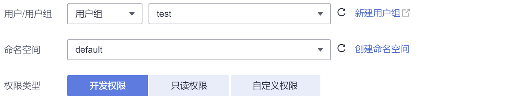

# 命名空间权限（Kubernetes RBAC授权）<a name="cce_10_0189"></a>

## 命名空间权限（kubernetes RBAC授权）<a name="section54736241399"></a>

命名空间权限是基于Kubernetes RBAC能力的授权，通过权限设置可以让不同的用户或用户组拥有操作不同Kubernetes资源的权限。Kubernetes RBAC API定义了四种类型：Role、ClusterRole、RoleBinding与ClusterRoleBinding，这四种类型之间的关系和简要说明如下：

-   Role：角色，其实是定义一组对Kubernetes资源（命名空间级别）的访问规则。
-   RoleBinding：角色绑定，定义了用户和角色的关系。
-   ClusterRole：集群角色，其实是定义一组对Kubernetes资源（集群级别，包含全部命名空间）的访问规则。
-   ClusterRoleBinding：集群角色绑定，定义了用户和集群角色的关系。

Role和ClusterRole指定了可以对哪些资源做哪些动作，RoleBinding和ClusterRoleBinding将角色绑定到特定的用户、用户组或ServiceAccount上。如下图所示。

**图 1**  角色绑定<a name="zh-cn_topic_0084600596_fig1751131311103"></a>  


在CCE控制台可以授予用户或用户组命名空间权限，可以对某一个命名空间或全部命名空间授权，CCE控制台默认提供如下ClusterRole。

-   view（只读权限）：对全部或所选命名空间下大多数资源的只读权限。
-   edit（开发权限）：对全部或所选命名空间下多数资源的读写权限。当配置在全部命名空间时能力与运维权限一致。
-   admin（运维权限）：对全部命名空间下大多数资源的读写权限，对节点、存储卷，命名空间和配额管理的只读权限。
-   cluster-admin（管理员权限）：对全部命名空间下所有资源的读写权限。

## 集群权限（IAM授权）与命名空间权限（Kubernetes RBAC授权）的关系<a name="section207514572488"></a>

拥有不同集群权限（IAM授权）的用户，其拥有的命名空间权限（Kubernetes RBAC授权）不同。[表1](#cce_10_0187_table886210176509)给出了不同用户拥有的命名空间权限详情。

**表 1**  不同用户拥有的命名空间权限

<a name="cce_10_0187_table886210176509"></a>
<table><thead align="left"><tr id="cce_10_0187_row14863201719502"><th class="cellrowborder" valign="top" width="46.54%" id="mcps1.2.3.1.1"><p id="cce_10_0187_p14863111718502"><a name="cce_10_0187_p14863111718502"></a><a name="cce_10_0187_p14863111718502"></a>用户类型</p>
</th>
<th class="cellrowborder" valign="top" width="53.459999999999994%" id="mcps1.2.3.1.2"><p id="cce_10_0187_p10295153183913"><a name="cce_10_0187_p10295153183913"></a><a name="cce_10_0187_p10295153183913"></a>1.13及以上版本的集群</p>
</th>
</tr>
</thead>
<tbody><tr id="cce_10_0187_row138631617185012"><td class="cellrowborder" valign="top" width="46.54%" headers="mcps1.2.3.1.1 "><p id="cce_10_0187_p1787744075015"><a name="cce_10_0187_p1787744075015"></a><a name="cce_10_0187_p1787744075015"></a>拥有Tenant Administrator权限的用户（例如帐号）</p>
</td>
<td class="cellrowborder" valign="top" width="53.459999999999994%" headers="mcps1.2.3.1.2 "><p id="cce_10_0187_p1829523133913"><a name="cce_10_0187_p1829523133913"></a><a name="cce_10_0187_p1829523133913"></a>全部命名空间权限</p>
</td>
</tr>
<tr id="cce_10_0187_row138631317205019"><td class="cellrowborder" valign="top" width="46.54%" headers="mcps1.2.3.1.1 "><p id="cce_10_0187_p3878104075018"><a name="cce_10_0187_p3878104075018"></a><a name="cce_10_0187_p3878104075018"></a>拥有CCE Administrator权限的IAM用户</p>
</td>
<td class="cellrowborder" valign="top" width="53.459999999999994%" headers="mcps1.2.3.1.2 "><p id="cce_10_0187_p172951435393"><a name="cce_10_0187_p172951435393"></a><a name="cce_10_0187_p172951435393"></a>全部命名空间权限</p>
</td>
</tr>
<tr id="cce_10_0187_row1386412176506"><td class="cellrowborder" valign="top" width="46.54%" headers="mcps1.2.3.1.1 "><p id="cce_10_0187_p187854025013"><a name="cce_10_0187_p187854025013"></a><a name="cce_10_0187_p187854025013"></a>拥有CCE&nbsp;FullAccess或者CCE&nbsp;ReadOnlyAccess权限的IAM用户</p>
</td>
<td class="cellrowborder" valign="top" width="53.459999999999994%" headers="mcps1.2.3.1.2 "><p id="cce_10_0187_p7321956194312"><a name="cce_10_0187_p7321956194312"></a><a name="cce_10_0187_p7321956194312"></a>按Kubernetes RBAC授权</p>
</td>
</tr>
<tr id="cce_10_0187_row28641117145019"><td class="cellrowborder" valign="top" width="46.54%" headers="mcps1.2.3.1.1 "><p id="cce_10_0187_p11879440195014"><a name="cce_10_0187_p11879440195014"></a><a name="cce_10_0187_p11879440195014"></a>拥有Tenant Guest权限的IAM用户</p>
</td>
<td class="cellrowborder" valign="top" width="53.459999999999994%" headers="mcps1.2.3.1.2 "><p id="cce_10_0187_p1932115664317"><a name="cce_10_0187_p1932115664317"></a><a name="cce_10_0187_p1932115664317"></a>按Kubernetes RBAC授权</p>
</td>
</tr>
</tbody>
</table>

## 注意事项<a name="section320111415506"></a>

-   Kubernetes RBAC的授权能力支持1.11.7-r2及以上版本集群。若需使用RBAC功能请将集群升级至1.11.7-r2或以上版本，升级方法请参见[重置升级/滚动升级（1.13版本）](重置升级-滚动升级（1-13版本）.md)。
-   任何用户创建1.11.7-r2或以上版本集群后，CCE会自动为该用户添加该集群的所有命名空间的cluster-admin权限，也就是说该用户允许对集群以及所有命名空间中的全部资源进行完全控制。联邦用户由于每次登录注销都会改变用户ID，所以权限用户会显示已删除，此情况下请勿删除该权限，否则会导致鉴权失败。此种情况下建议在CCE为某个用户组创建cluster-admin权限，将联邦用户加入此用户组。
-   拥有Security Administrator（IAM除切换角色外所有权限）权限的用户（如帐号所在的admin用户组默认拥有此权限），才能在CCE控制台命名空间权限页面进行授权操作。

## 配置命名空间权限（控制台）<a name="section14142185815219"></a>

CCE中的命名空间权限是基于Kubernetes RBAC能力的授权，通过权限设置可以让不同的用户或用户组拥有操作不同Kubernetes资源的权限。

1.  登录CCE控制台，在左侧导航栏中选择“权限管理“。
2.  在右边下拉列表中选择要添加权限的集群。
3.  在右上角单击“添加权限“，进入添加授权页面。
4.  在添加权限页面，确认集群名称，选择该集群下要授权使用的命名空间，例如选择“全部命名空间”，选择要授权的用户或用户组，再选择具体权限。

    > **说明：** 
    >对于没有IAM权限的用户，给其他用户和用户组配置权限时，无法选择用户和用户组，此时支持填写用户ID或用户组ID进行配置。

    **图 2**  配置命名空间权限<a name="fig1333741815411"></a>  
    

    其中自定义权限可以根据需要自定义，选择自定义权限后，在自定义权限一行右侧单击新建自定义权限，在弹出的窗口中填写名称并选择规则。创建完成后，在添加权限的自定义权限下拉框中可以选择。

    **图 3**  自定义权限<a name="fig43382183546"></a>  
    

5.  单击“确定“。

## 自定义命名空间权限（kubectl）<a name="section1273861718819"></a>

> **说明：** 
>kubectl访问CCE集群是通过集群上生成的配置文件（kubeconfig.json）进行认证，kubeconfig.json文件内包含用户信息，CCE根据用户信息的权限判断kubectl有权限访问哪些Kubernetes资源。即哪个用户获取的kubeconfig.json文件，kubeconfig.json就拥有哪个用户的信息，这样使用kubectl访问时就拥有这个用户的权限。而用户拥有的权限就是[集群权限（IAM授权）与命名空间权限（Kubernetes RBAC授权）的关系](#section207514572488)所示的权限。

除了使用cluster-admin、admin、edit、view这4个最常用的clusterrole外，您还可以通过定义Role和RoleBinding来进一步对命名空间中不同类别资源（如Pod、Deployment、Service等）的增删改查权限进行配置，从而做到更加精细化的权限控制。

Role的定义非常简单，指定namespace，然后就是rules规则。如下面示例中的规则就是允许对default命名空间下的Pod进行GET、LIST操作。

```
kind: Role
apiVersion: rbac.authorization.k8s.io/v1
metadata:
  namespace: default                          # 命名空间
  name: role-example
rules:
- apiGroups: [""]
  resources: ["pods"]                         # 可以访问pod
  verbs: ["get", "list"]                      # 可以执行GET、LIST操作
```

-   apiGroups表示资源所在的API分组。
-   resources表示可以操作哪些资源：pods表示可以操作pod，其他Kubernetes的资源如deployments、configmaps等都可以操作
-   verbs表示可以执行的操作：get表示查询一个Pod，list表示查询所有Pod。您还可以使用create（创建）, update（更新）,  delete（删除）等操作词。

详细的类型和操作请参见[使用 RBAC 鉴权](https://kubernetes.io/zh/docs/reference/access-authn-authz/rbac/)。

有了Role之后，就可以将Role与具体的用户绑定起来，实现这个的就是RoleBinding了。如下所示。

```
kind: RoleBinding
apiVersion: rbac.authorization.k8s.io/v1
metadata:
  name: RoleBinding-example
  namespace: default
  annotations:
    CCE.com/IAM: 'true'
roleRef:
  kind: Role
  name: role-example
  apiGroup: rbac.authorization.k8s.io
subjects:
- kind: User
  name: 0c97ac3cb280f4d91fa7c0096739e1f8    # user-example的用户ID
  apiGroup: rbac.authorization.k8s.io
```

这里的subjects就是将Role与IAM用户绑定起来，从而使得IAM用户获取role-example这个Role里面定义的权限，如下图所示。

**图 4**  RoleBinding绑定Role和用户<a name="fig9473195372813"></a>  


subjects下用户的类型还可以是用户组，这样配置可以对用户组下所有用户生效。

```
subjects:
- kind: Group
  name: 0c96fad22880f32a3f84c009862af6f7    # 用户组ID
  apiGroup: rbac.authorization.k8s.io
```

使用IAM用户user-example连接集群，获取Pod信息，发现可获取到Pod的信息。

```
# kubectl get pod
NAME                                   READY   STATUS    RESTARTS   AGE
deployment-389584-2-6f6bd4c574-2n9rk   1/1     Running   0          4d7h
deployment-389584-2-6f6bd4c574-7s5qw   1/1     Running   0          4d7h
deployment-3895841-746b97b455-86g77    1/1     Running   0          4d7h
deployment-3895841-746b97b455-twvpn    1/1     Running   0          4d7h
nginx-658dff48ff-7rkph                 1/1     Running   0          4d9h
nginx-658dff48ff-njdhj                 1/1     Running   0          4d9h
# kubectl get pod nginx-658dff48ff-7rkph
NAME                     READY   STATUS    RESTARTS   AGE
nginx-658dff48ff-7rkph   1/1     Running   0          4d9h
```

然后查看Deployment和Service，发现没有权限；再查询kube-system命名空间下的Pod信息，发现也没有权限。这就说明IAM用户user-example仅拥有defaul这个命名空间下GET和LIST Pod的权限，与前面定义的没有偏差。

```
# kubectl get deploy
Error from server (Forbidden): deployments.apps is forbidden: User "0c97ac3cb280f4d91fa7c0096739e1f8" cannot list resource "deployments" in API group "apps" in the namespace "default"
# kubectl get svc
Error from server (Forbidden): services is forbidden: User "0c97ac3cb280f4d91fa7c0096739e1f8" cannot list resource "services" in API group "" in the namespace "default"
# kubectl get pod --namespace=kube-system
Error from server (Forbidden): pods is forbidden: User "0c97ac3cb280f4d91fa7c0096739e1f8" cannot list resource "pods" in API group "" in the namespace "kube-system"
```

## 示例：授予集群全部权限（cluster-admin）<a name="section914518255314"></a>

集群全部权限可以使用cluster-admin权限，cluster-admin包含集群级别资源（PV、StorageClass等）的权限。

**图 5**  授予集群全部权限（cluster-admin）<a name="fig887052410553"></a>  


如果使用kubectl查看可以看到创建了一个ClusterRoleBinding，将cluster-admin和cce-role-group这个用户组绑定了起来。

```
# kubectl get clusterrolebinding
NAME                                                              ROLE                           AGE
clusterrole_cluster-admin_group0c96fad22880f32a3f84c009862af6f7   ClusterRole/cluster-admin      61s

# kubectl get clusterrolebinding clusterrole_cluster-admin_group0c96fad22880f32a3f84c009862af6f7 -oyaml
apiVersion: rbac.authorization.k8s.io/v1
kind: ClusterRoleBinding
metadata:
  annotations:
    CCE.com/IAM: "true"
  creationTimestamp: "2021-06-23T09:15:22Z"
  name: clusterrole_cluster-admin_group0c96fad22880f32a3f84c009862af6f7
  resourceVersion: "36659058"
  selfLink: /apis/rbac.authorization.k8s.io/v1/clusterrolebindings/clusterrole_cluster-admin_group0c96fad22880f32a3f84c009862af6f7
  uid: d6cd43e9-b4ca-4b56-bc52-e36346fc1320
roleRef:
  apiGroup: rbac.authorization.k8s.io
  kind: ClusterRole
  name: cluster-admin
subjects:
- apiGroup: rbac.authorization.k8s.io
  kind: Group
  name: 0c96fad22880f32a3f84c009862af6f7
```

使用被授予用户连接集群，如果能正常查询PV、StorageClass的信息，则说明权限配置正常。

```
# kubectl get pv
No resources found
# kubectl get sc
NAME                PROVISIONER                     RECLAIMPOLICY   VOLUMEBINDINGMODE      ALLOWVOLUMEEXPANSION   AGE
csi-disk            everest-csi-provisioner         Delete          Immediate              true                   75d
csi-disk-topology   everest-csi-provisioner         Delete          WaitForFirstConsumer   true                   75d
csi-nas             everest-csi-provisioner         Delete          Immediate              true                   75d
csi-obs             everest-csi-provisioner         Delete          Immediate              false                  75d
csi-sfsturbo        everest-csi-provisioner         Delete          Immediate              true                   75d
```

## 示例：授予命名空间全部权限（admin）<a name="section6257142116414"></a>

admin权限拥有命名空间全部权限，您可以授予用户/用户组某个命名空间或全部命名空间admin权限。

**图 6**  授予default命名空间全部权限（admin）<a name="fig966535195416"></a>  


如果使用kubectl查看可以看到创建了一个RoleBinding，将admin和cce-role-group这个用户组绑定了起来，且权限范围是default这个命名空间。

```
# kubectl get rolebinding
NAME                                                      ROLE                AGE
clusterrole_admin_group0c96fad22880f32a3f84c009862af6f7   ClusterRole/admin   18s
# kubectl get rolebinding clusterrole_admin_group0c96fad22880f32a3f84c009862af6f7 -oyaml
apiVersion: rbac.authorization.k8s.io/v1
kind: RoleBinding
metadata:
  annotations:
    CCE.com/IAM: "true"
  creationTimestamp: "2021-06-24T01:30:08Z"
  name: clusterrole_admin_group0c96fad22880f32a3f84c009862af6f7
  namespace: default
  resourceVersion: "36963685"
  selfLink: /apis/rbac.authorization.k8s.io/v1/namespaces/default/rolebindings/clusterrole_admin_group0c96fad22880f32a3f84c009862af6f7
  uid: 6c6f46a6-8584-47da-83f5-9eef1f7b75d6
roleRef:
  apiGroup: rbac.authorization.k8s.io
  kind: ClusterRole
  name: admin
subjects:
- apiGroup: rbac.authorization.k8s.io
  kind: Group
  name: 0c96fad22880f32a3f84c009862af6f7
```

使用被授予用户连接集群，您会发现可以查询和创建default命名空间的资源，但无法查询kube-system命名空间资源，也无法查询集群级别的资源。

```
# kubectl get pod
NAME                    READY   STATUS    RESTARTS   AGE
test-568d96f4f8-brdrp   1/1     Running   0          33m
test-568d96f4f8-cgjqp   1/1     Running   0          33m
# kubectl get pod -nkube-system
Error from server (Forbidden): pods is forbidden: User "0c97ac3cb280f4d91fa7c0096739e1f8" cannot list resource "pods" in API group "" in the namespace "kube-system"
# kubectl get pv
Error from server (Forbidden): persistentvolumes is forbidden: User "0c97ac3cb280f4d91fa7c0096739e1f8" cannot list resource "persistentvolumes" in API group "" at the cluster scope
```

## 示例：授予命名空间只读权限（view）<a name="section797615691612"></a>

view权限拥有命名空间查看权限，您可以给某个或全部命名空间授权。

**图 7**  授予default命名空间只读权限（view）<a name="fig1980215481568"></a>  


如果使用kubectl查看可以看到创建了一个RoleBinding，将view和cce-role-group这个用户组绑定了起来，且权限范围是default这个命名空间。

```
# kubectl get rolebinding
NAME                                                     ROLE               AGE
clusterrole_view_group0c96fad22880f32a3f84c009862af6f7   ClusterRole/view   7s

# kubectl get rolebinding clusterrole_view_group0c96fad22880f32a3f84c009862af6f7 -oyaml
apiVersion: rbac.authorization.k8s.io/v1
kind: RoleBinding
metadata:
  annotations:
    CCE.com/IAM: "true"
  creationTimestamp: "2021-06-24T01:36:53Z"
  name: clusterrole_view_group0c96fad22880f32a3f84c009862af6f7
  namespace: default
  resourceVersion: "36965800"
  selfLink: /apis/rbac.authorization.k8s.io/v1/namespaces/default/rolebindings/clusterrole_view_group0c96fad22880f32a3f84c009862af6f7
  uid: b86e2507-e735-494c-be55-c41a0c4ef0dd
roleRef:
  apiGroup: rbac.authorization.k8s.io
  kind: ClusterRole
  name: view
subjects:
- apiGroup: rbac.authorization.k8s.io
  kind: Group
  name: 0c96fad22880f32a3f84c009862af6f7
```

使用被授予用户连接集群，您会发现可以查询default命名空间的资源，但无法创建资源。

```
# kubectl get pod
NAME                    READY   STATUS    RESTARTS   AGE
test-568d96f4f8-brdrp   1/1     Running   0          40m
test-568d96f4f8-cgjqp   1/1     Running   0          40m
# kubectl run -i --tty --image tutum/dnsutils dnsutils --restart=Never --rm /bin/sh
Error from server (Forbidden): pods is forbidden: User "0c97ac3cb280f4d91fa7c0096739e1f8" cannot create resource "pods" in API group "" in the namespace "default"
```

## 示例：授予某类Kubernetes资源权限<a name="section1471852343"></a>

上面几个示例都是集群全部资源（cluster-admin）、命名空间全部资源（admin、view），也可以对某类Kubernetes资源授权，如Pod、Deployment、Service这些资源，具体请参见[自定义命名空间权限（kubectl）](#section1273861718819)。

