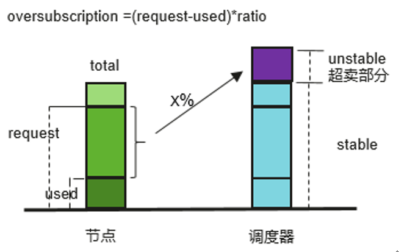
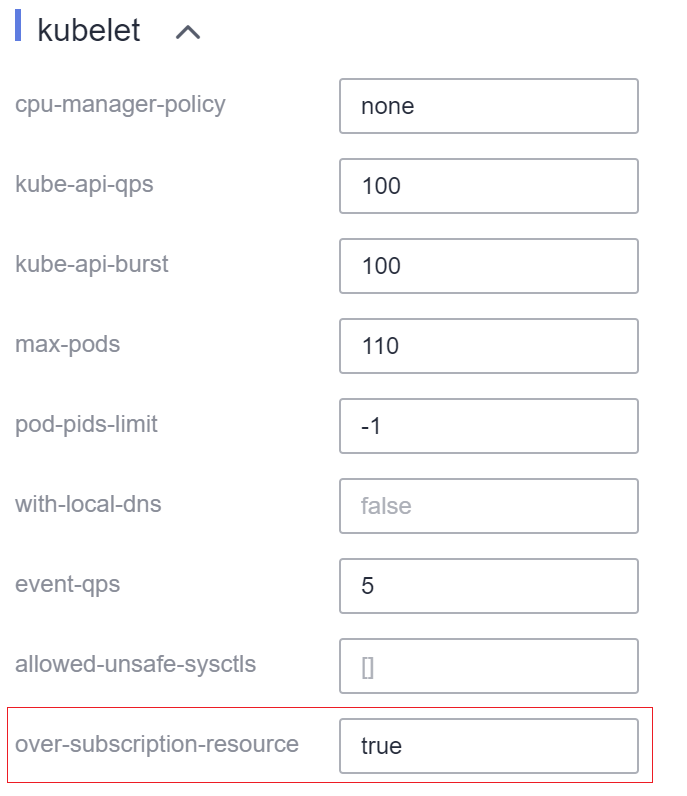

# 在线离线作业混合部署<a name="cce_10_0384"></a>

## 在线作业与离线作业<a name="section37571116112019"></a>

从业务是否一直在线的角度看，其类型可分为在线作业和离线作业。

-   **在线作业**：一般运行时间长，服务流量呈周期性，资源存在潮汐现象，但对服务SLA要求较高，如广告业务、电商业务等。
-   **离线作业**：往往运行时间短，计算需求大，可容忍较高的时延，如AI/大数据业务。

## 资源超卖与混合部署<a name="section79851928172111"></a>

当前很多业务有波峰和波谷，部署服务时，为了保证服务的性能和稳定性，通常会按照波峰时需要的资源申请，但是波峰的时间可能很短，这样在非波峰时段就有资源浪费。另外，由于在线作业SLA要求较高，为了保证服务的性能和可靠性，通常会申请大量的冗余资源，因此，会导致资源利用率很低、浪费比较严重。

将这些申请而未使用的资源（即申请量与使用量的差值）利用起来，就是资源超卖。超卖资源适合部署离线作业，离线作业通常关注吞吐量，SLA要求不高，容忍一定的失败。

在线作业和离线作业混合部署在Kubernetes集群中将有效的提升集群整体资源利用率。

**图 1**  资源超卖示意图<a name="fig49992297287"></a>  


## 在线离线作业混部超卖功能特性<a name="section134433136240"></a>

当前特性支持集群内在离线作业混部以及节点CPU和内存资源超卖，关键特性如下：

-   离线作业优先使用超卖节点

    若同时存在超卖与非超卖节点，在离线作业调度过程中，超卖节点得分高于非超卖节点，离线作业优先调度到超卖节点。


-   在线作业预选超卖节点时只能使用其非超卖资源

    在线作业只能使用超卖节点的非超卖资源，离线作业可以使用超卖节点的超卖及非超卖资源。


-   同一调度周期在线作业先于离线作业调度

    在线作业和离线作业同时存在时，优先调度在线作业。当节点资源使用率超过设定的驱逐上限且节点request值超过100%时，将会驱逐离线作业。

-   内核提供CPU/内存隔离特性

    CPU隔离：在线作业能够快速抢占离线作业的CPU资源，并压制离线作业的CPU使用。

    内存隔离：系统内存资源用尽触发OOM Kill时，内核优先驱逐离线作业。

-   Kubelet离线作业准入规则

    在调度器将Pod调度到某个节点上之后，Kubelet在启动该Pod之前，会对该Pod进行准入判断，如果此时节点资源无法满足该Pod的Request值，kubelet则拒绝启动该Pod（predicateAdmitHandler.Admit）。满足以下两个条件时，Kubelet准入该Pod：

    -   待启动Pod Request与运行的在线作业Request之和 < 节点Allocatable
    -   待启动Pod Request与运行的在/离线作业Request之和 < 节点Allocatable + 节点超卖资源


## 约束与限制<a name="section102385261413"></a>

**规格约束**

-   集群K8S版本：1.19.16-r2及以上版本。
-   集群类型：CCE集群或CCE Turbo集群。
-   节点OS：EulerOS 2.9 \(内核kernel-4.18.0-147.5.1.6.h729.6.eulerosv2r9.x86\_64\)。
-   节点类型：弹性虚拟机。
-   Vocalno插件版本：1.3.4及以上版本。

**使用限制**

-   使用超卖特性时，需保证Volcano未启用overcommit插件。
-   使用超卖特性时，需保证Kubelet未启用cpu-manager-policy和topology-manager-scope。
-   使用autoscaler插件的集群，不支持使用混部超卖特性。
-   使用CPU潮汐亲和性的集群，不支持使用超卖特性。
-   修改超卖节点标签不会影响已经运行的pod。
-   运行中的pod无法进行在线和离线业务转换，如需转换需要重建pod。
-   集群中有节点配置超卖标签volcano.sh/oversubscription=true时，volcano插件必须要增加oversubscription配置，否则会导致超卖节点调度异常。标签配置需要由用户保证，调度器不会对插件和节点配置进行检查。详细标签说明请参见[超卖标签配置调度说明](#section1940910414220)。
-   超卖特性开关目前不支持统一配置，若要关闭超卖特性，需要同时进行以下操作：
    -   去掉超卖节点的volcano.sh/oversubscription标签。
    -   设置节点池的超超卖开关over-subscription-resource为false。
    -   修改volcano调度器的名字为volcano-scheduler-configmap的configmap，并去掉oversubscription插件。

-   超卖资源的上报取的是历史平均值，当前计算的实时超卖资源与当前节点的超卖资源相比，变化超过10%时，kubelet才会将超卖信息更新到节点上，其他情况超卖资源无变化。因此在Pod的request值较小时（比如CPU request为100m），概率性存在加压前后超卖资源上报量不一致，导致加压后可用超卖资源变少，进而可调度的离线Pod变少的情况。

## 超卖标签配置调度说明<a name="section1940910414220"></a>

集群中有节点配置超卖标签volcano.sh/oversubscription=true时，volcano插件必须要增加oversubscription配置，否则会导致超卖节点调度异常。相关配置情况如[表1](#table152481219311)所示。

标签配置需要您自行保证，调度器不会对插件和节点配置进行检查。

**表 1**  超卖标签配置调度说明

<a name="table152481219311"></a>
<table><thead align="left"><tr id="row13248611314"><th class="cellrowborder" valign="top" width="23.32%" id="mcps1.2.4.1.1"><p id="p1824814115313"><a name="p1824814115313"></a><a name="p1824814115313"></a>插件超卖配置</p>
</th>
<th class="cellrowborder" valign="top" width="23.32%" id="mcps1.2.4.1.2"><p id="p124801530"><a name="p124801530"></a><a name="p124801530"></a>节点超卖标签</p>
</th>
<th class="cellrowborder" valign="top" width="53.36%" id="mcps1.2.4.1.3"><p id="p82481611537"><a name="p82481611537"></a><a name="p82481611537"></a>调度行为</p>
</th>
</tr>
</thead>
<tbody><tr id="row1024811633"><td class="cellrowborder" valign="top" width="23.32%" headers="mcps1.2.4.1.1 "><p id="p32481911317"><a name="p32481911317"></a><a name="p32481911317"></a>有</p>
</td>
<td class="cellrowborder" valign="top" width="23.32%" headers="mcps1.2.4.1.2 "><p id="p72483119318"><a name="p72483119318"></a><a name="p72483119318"></a>有</p>
</td>
<td class="cellrowborder" valign="top" width="53.36%" headers="mcps1.2.4.1.3 "><p id="p15248413313"><a name="p15248413313"></a><a name="p15248413313"></a>超卖调度</p>
</td>
</tr>
<tr id="row1324819110312"><td class="cellrowborder" valign="top" width="23.32%" headers="mcps1.2.4.1.1 "><p id="p182491411939"><a name="p182491411939"></a><a name="p182491411939"></a>有</p>
</td>
<td class="cellrowborder" valign="top" width="23.32%" headers="mcps1.2.4.1.2 "><p id="p102491411135"><a name="p102491411135"></a><a name="p102491411135"></a>无</p>
</td>
<td class="cellrowborder" valign="top" width="53.36%" headers="mcps1.2.4.1.3 "><p id="p20249517310"><a name="p20249517310"></a><a name="p20249517310"></a>正常调度</p>
</td>
</tr>
<tr id="row162491815313"><td class="cellrowborder" valign="top" width="23.32%" headers="mcps1.2.4.1.1 "><p id="p524911113316"><a name="p524911113316"></a><a name="p524911113316"></a>无</p>
</td>
<td class="cellrowborder" valign="top" width="23.32%" headers="mcps1.2.4.1.2 "><p id="p1249513311"><a name="p1249513311"></a><a name="p1249513311"></a>无</p>
</td>
<td class="cellrowborder" valign="top" width="53.36%" headers="mcps1.2.4.1.3 "><p id="p142491810318"><a name="p142491810318"></a><a name="p142491810318"></a>正常调度</p>
</td>
</tr>
<tr id="row1824961238"><td class="cellrowborder" valign="top" width="23.32%" headers="mcps1.2.4.1.1 "><p id="p1724951432"><a name="p1724951432"></a><a name="p1724951432"></a>无</p>
</td>
<td class="cellrowborder" valign="top" width="23.32%" headers="mcps1.2.4.1.2 "><p id="p19249141338"><a name="p19249141338"></a><a name="p19249141338"></a>有</p>
</td>
<td class="cellrowborder" valign="top" width="53.36%" headers="mcps1.2.4.1.3 "><p id="p132491117313"><a name="p132491117313"></a><a name="p132491117313"></a>无法调度，或者调度失败，应避免这种配置</p>
</td>
</tr>
</tbody>
</table>

## 使用混部特性的步骤<a name="section1425191115439"></a>

1.  配置Volcano插件。
    1.  使用kubectl连接集群。
    2.  执行如下命令, 在volcano- scheduler-configmap中增加oversubscription插件配置。同时确保插件配置中不能包含overcommit插件，如果存在（- name: overcommit），则需要删除该配置。

        ```
        # kubectl edit cm volcano-scheduler-configmap -n kube-system
        apiVersion: v1
        data:
          volcano-scheduler.conf: |
            actions: "enqueue, allocate, backfill"
            tiers:
            - plugins:
              - name: gang
              - name: priority
              - name: conformance
              - name: oversubscription
            - plugins:
              - name: drf
              - name: predicates
              - name: nodeorder
              - name: binpack
            - plugins:
              - name: cce-gpu-topology-predicate
              - name: cce-gpu-topology-priority
              - name: cce-gpu
        ```

2.  开启节点超卖特性。

    开启超卖特性的节点，才能配置标签使用超卖资源。相关节点只能在节点池中创建。当前超卖特性开关配置方式如下：

    1.  创建节点池。
    2.  节点池创建完成后，单击节点池名称后的“更多\>配置管理”。
    3.  在侧边栏滑出的“配置管理”窗口中，将kubelet组件下的“over-subscription-resource”参数设置为“true”，并单击“确定”。

    

3.  设置节点超卖标签。

    超卖节点需增加超卖标签volcano.sh/oversubscription。当节点设置该标签并且值为true时，该节点为超卖节点，否则为非超卖节点。

    ```
    kubectl label node 192.168.0.0 volcano.sh/oversubscription=true
    ```

    节点还支持如下超卖相关的阈值，如[表2](#table1853397191112)所示。您可以使用kubectl annotate node nodeIP xxxxxx=xxxxxx命令。示例如下：

    ```
    kubectl annotate node 192.168.0.0 volcano.sh/oversubscription-evicting-cpu-high-watermark=70
    ```

    查询该节点信息：

    ```
    # kubectl describe node 192.168.0.0
    Name:             192.168.0.0
    Roles:              <none>
    Labels:           ...
                      volcano.sh/oversubscription=true
    Annotations:      ...
                      volcano.sh/oversubscription-evicting-cpu-high-watermark: 70
    ```

    **表 2**  节点超卖annotations

    <a name="table1853397191112"></a>
    <table><thead align="left"><tr id="row105951715118"><th class="cellrowborder" valign="top" width="48%" id="mcps1.2.3.1.1"><p id="p185951711115"><a name="p185951711115"></a><a name="p185951711115"></a>名称</p>
    </th>
    <th class="cellrowborder" valign="top" width="52%" id="mcps1.2.3.1.2"><p id="p259510717114"><a name="p259510717114"></a><a name="p259510717114"></a>说明</p>
    </th>
    </tr>
    </thead>
    <tbody><tr id="row45951176117"><td class="cellrowborder" valign="top" width="48%" headers="mcps1.2.3.1.1 "><p id="p259557171110"><a name="p259557171110"></a><a name="p259557171110"></a>volcano.sh/oversubscription-evicting-cpu-high-watermark</p>
    </td>
    <td class="cellrowborder" valign="top" width="52%" headers="mcps1.2.3.1.2 "><p id="p41092413154"><a name="p41092413154"></a><a name="p41092413154"></a>当节点CPU使用率超过设置值时，触发离线作业驱逐，节点不可调度。</p>
    <p id="p259511741114"><a name="p259511741114"></a><a name="p259511741114"></a>默认值80，即当节点CPU使用率超过80%时，触发离线作业驱逐。</p>
    </td>
    </tr>
    <tr id="row11595577116"><td class="cellrowborder" valign="top" width="48%" headers="mcps1.2.3.1.1 "><p id="p1859513716115"><a name="p1859513716115"></a><a name="p1859513716115"></a>volcano.sh/oversubscription-evicting-cpu-low-watermark</p>
    </td>
    <td class="cellrowborder" valign="top" width="52%" headers="mcps1.2.3.1.2 "><p id="p17595137161114"><a name="p17595137161114"></a><a name="p17595137161114"></a>触发驱逐后，当节点CPU使用率低于设置值后，重新开始调度。</p>
    <p id="p16595197161115"><a name="p16595197161115"></a><a name="p16595197161115"></a>默认值为30，即当节点CPU使用率低于30%后，重新开始调度。</p>
    </td>
    </tr>
    <tr id="row17595167181110"><td class="cellrowborder" valign="top" width="48%" headers="mcps1.2.3.1.1 "><p id="p1459517791112"><a name="p1459517791112"></a><a name="p1459517791112"></a>volcano.sh/oversubscription-evicting-memory-high-watermark</p>
    </td>
    <td class="cellrowborder" valign="top" width="52%" headers="mcps1.2.3.1.2 "><p id="p13595770114"><a name="p13595770114"></a><a name="p13595770114"></a>当节点内存使用率超过设置值时，触发离线作业驱逐，节点不可调度。</p>
    <p id="p125952715117"><a name="p125952715117"></a><a name="p125952715117"></a>默认值60，即当节点内存使用率超过60%时，触发离线作业驱逐。</p>
    </td>
    </tr>
    <tr id="row45958731118"><td class="cellrowborder" valign="top" width="48%" headers="mcps1.2.3.1.1 "><p id="p105958710119"><a name="p105958710119"></a><a name="p105958710119"></a>volcano.sh/oversubscription-evicting-memory-low-watermark</p>
    </td>
    <td class="cellrowborder" valign="top" width="52%" headers="mcps1.2.3.1.2 "><p id="p10595197171117"><a name="p10595197171117"></a><a name="p10595197171117"></a>触发驱逐后，当节点内存使用率低于设置值后，重新开始调度。</p>
    <p id="p1259519712115"><a name="p1259519712115"></a><a name="p1259519712115"></a>默认值为30，即当节点内存使用率低于30%后，重新开始调度。</p>
    </td>
    </tr>
    <tr id="row25953771110"><td class="cellrowborder" valign="top" width="48%" headers="mcps1.2.3.1.1 "><p id="p19595974119"><a name="p19595974119"></a><a name="p19595974119"></a>volcano.sh/oversubscription-types</p>
    </td>
    <td class="cellrowborder" valign="top" width="52%" headers="mcps1.2.3.1.2 "><p id="p1359567101115"><a name="p1359567101115"></a><a name="p1359567101115"></a>超卖资源类型，支持如下三种配置</p>
    <a name="ul440551111316"></a><a name="ul440551111316"></a><ul id="ul440551111316"><li>cpu (超卖CPU)</li><li>memory (超卖Memory)</li><li>cpu,memory (超卖CPU和memory)</li></ul>
    <p id="p175951741117"><a name="p175951741117"></a><a name="p175951741117"></a>默认值为“cpu,memory”</p>
    </td>
    </tr>
    </tbody>
    </table>

4.  部署在离线作业。

    离线作业需在annotation中增加volcano.sh/preemptable标签以区分其为离线作业，在线作业不需要设置该标签。在线、离线作业均需设置schedulerName字段的值为“volcano”，启用Volcano调度器。

    离线作业：

    ```
    kind: Deployment
    apiVersion: apps/v1
    spec:
      replicas: 4
      template:
        metadata:
          annotations:
            metrics.alpha.kubernetes.io/custom-endpoints: '[{"api":"","path":"","port":"","names":""}]'
            volcano.sh/preemptable: ‘true’ # 离线作业标签
        spec:
          schedulerName: volcano             # 调度器使用volcano
          ...
    ```

    在线作业：

    ```
    kind: Deployment
    apiVersion: apps/v1
    spec:
      replicas: 4
      template:
        metadata:
          annotations:
            metrics.alpha.kubernetes.io/custom-endpoints: '[{"api":"","path":"","port":"","names":""}]'
        spec:
          schedulerName: volcano          # 调度器使用volcano
          ...
    ```

5.  通过如下命令可查看当前超卖资源量以及资源使用情况。

    kubectl describe node  _<nodeIP\>_

    ```
    # kubectl describe node 192.168.0.0
    Name:             192.168.0.0
    Roles:              <none>
    Labels:           ...
                      volcano.sh/oversubscription=true
    Annotations:      ...
                      volcano.sh/oversubscription-cpu: 2335
                      volcano.sh/oversubscription-memory: 341753856
    Allocatable:
      cpu:               3920m
      memory:            6263988Ki
    Allocated resources:
      (Total limits may be over 100 percent, i.e., overcommitted.)
      Resource           Requests      Limits
      --------           --------      ------
      cpu                 4950m (126%)  4950m (126%)
      memory             1712Mi (27%)  1712Mi (27%)
    ```


## 混合部署示例<a name="section20146113631217"></a>

下面将通过示例演示混合部署离线作业和在线作业。

1.  假设一个集群存在两个节点，1个超卖节点和1个非超卖节点，如下所示。

    ```
    # kubectl get node
    NAME           STATUS   ROLES    AGE    VERSION
    192.168.0.173   Ready    <none>   4h58m   v1.19.16-r2-CCE22.5.1
    192.168.0.3     Ready    <none>   148m    v1.19.16-r2-CCE22.5.1
    ```

    -   192.168.0.173为超卖节点（包含标签volcano.sh/oversubscirption=true）
    -   192.168.0.3为非超卖节点（不包含标签volcano.sh/oversubscirption=true）

    ```
    # kubectl describe node 192.168.0.173
    Name:               192.168.0.173
    Roles:              <none>
    Labels:             beta.kubernetes.io/arch=amd64
                        ...
                        volcano.sh/oversubscription=true
    ```

2.  提交离线作业，资源充足的情况下，离线作业都调度到了超卖节点上。

    离线作业模板如下。

    ```
    apiVersion: apps/v1
    kind: Deployment
    metadata:
      name: offline
      namespace: default
    spec:
      replicas: 2
      selector:
        matchLabels:
          app: offline
      template:
        metadata:
          labels:
            app: offline
          annotations:
            volcano.sh/preemptable: "true"       #离线作业标签
        spec:
          schedulerName: volcano               #调度器使用volcano
          containers:
            - name: container-1
              image: nginx:latest
              imagePullPolicy: IfNotPresent
              resources:
                requests:
                  cpu: 500m
                  memory: 512Mi
                limits:
                  cpu: "1"
                  memory: 512Mi
          imagePullSecrets:
            - name: default-secret
    ```

    离线作业调度到超卖节点上运行。

    ```
    # kubectl get pod -o wide
    NAME                      READY   STATUS   RESTARTS  AGE     IP             NODE 
    offline-69cdd49bf4-pmjp8   1/1    Running   0         5s    192.168.10.178   192.168.0.173
    offline-69cdd49bf4-z8kxh   1/1    Running   0         5s    192.168.10.131   192.168.0.173
    ```

3.  提交在线作业，资源充足时，在线作业调度到了非超卖节点。

    在线作业模板如下。

    ```
    apiVersion: apps/v1
    kind: Deployment
    metadata:
      name: online
      namespace: default
    spec:
      replicas: 2
      selector:
        matchLabels:
          app: online
      template:
        metadata:
          labels:
            app: online
        spec:
          schedulerName: volcano                 #调度器使用volcano
          containers:
            - name: container-1
              image: resource_consumer:latest
              imagePullPolicy: IfNotPresent
              resources:
                requests:
                  cpu: 1400m
                  memory: 512Mi
                limits:
                  cpu: "2"
                  memory: 512Mi
          imagePullSecrets:
            - name: default-secret
    ```

    在线作业调度到非超卖节点上运行。

    ```
    # kubectl get pod -o wide
    NAME                   READY   STATUS   RESTARTS  AGE     IP             NODE 
    online-ffb46f656-4mwr6  1/1    Running   0         5s    192.168.10.146   192.168.0.3
    online-ffb46f656-dqdv2   1/1    Running   0         5s    192.168.10.67   192.168.0.3
    ```

4.  提升超卖节点资源使用率，观察触发离线作业驱逐。

    部署在线任务到超卖节点（192.168.0.173）上：

    ```
    apiVersion: apps/v1
    kind: Deployment
    metadata:
      name: online
      namespace: default
    spec:
      replicas: 2
      selector:
        matchLabels:
          app: online
      template:
        metadata:
          labels:
            app: online
        spec:
           affinity:                              #提交在线任务至超卖节点
            nodeAffinity:
              requiredDuringSchedulingIgnoredDuringExecution:
                nodeSelectorTerms:
                - matchExpressions:
                  - key: kubernetes.io/hostname
                    operator: In
                    values:
                    - 192.168.0.173
          schedulerName: volcano                 #调度器使用volcano
          containers:
            - name: container-1
              image: resource_consumer:latest
              imagePullPolicy: IfNotPresent
              resources:
                requests:
                  cpu: 700m
                  memory: 512Mi
                limits:
                  cpu: 700m
                  memory: 512Mi
          imagePullSecrets:
            - name: default-secret
    ```

    同时提交在/离线作业到超卖节点（192.168.0.173）上。

    ```
    # kubectl get pod -o wide
    NAME                     READY   STATUS   RESTARTS  AGE     IP             NODE 
    offline-69cdd49bf4-pmjp8  1/1     Running    0      13m   192.168.10.178   192.168.0.173 
    offline-69cdd49bf4-z8kxh  1/1     Running     0      13m   192.168.10.131   192.168.0.173 
    online-6f44bb68bd-b8z9p  1/1     Running     0     3m4s   192.168.10.18   192.168.0.173 
    online-6f44bb68bd-g6xk8  1/1     Running     0     3m12s   192.168.10.69   192.168.0.173
    ```

    观察超卖节点（192.168.0.173），可以看出存在超卖资源，同时CPU分配率已超过100%。

    ```
    # kubectl describe node 192.168.0.173
    Name:              192.168.0.173
    Roles:              <none>
    Labels:              …
                        volcano.sh/oversubscription=true
    Annotations:         …                  
                        volcano.sh/oversubscription-cpu: 2343
                        volcano.sh/oversubscription-memory: 3073653200
                        …
    Allocated resources:
      (Total limits may be over 100 percent, i.e., overcommitted.)
      Resource               Requests      Limits
      --------               --------        ------
      cpu                    4750m (121%)  7350m (187%)
      memory                 3760Mi (61%)  4660Mi (76%)
                             …
    ```

    增大节点上在线作业的CPU使用率，可以观察到触发离线作业驱逐。

    ```
    # kubectl get pod -o wide
    NAME                     READY   STATUS   RESTARTS  AGE     IP             NODE 
    offline-69cdd49bf4-bwdm7  1/1    Running   0       11m   192.168.10.208  192.168.0.3 
    offline-69cdd49bf4-pmjp8   0/1    Evicted    0       26m   <none>         192.168.0.173
    offline-69cdd49bf4-qpdss   1/1     Running   0       11m   192.168.10.174  192.168.0.3  
    offline-69cdd49bf4-z8kxh   0/1     Evicted    0       26m   <none>        192.168.0.173
    online-6f44bb68bd-b8z9p   1/1     Running   0       24m   192.168.10.18  192.168.0.173
    online-6f44bb68bd-g6xk8   1/1     Running   0       24m   192.168.10.69  192.168.0.173
    ```


## 错误处理建议<a name="section441525519717"></a>

-   超卖节点kubelet重启后，由于volcano调度器和kubelet的资源视图不同步，部分新调度的作业会出现OutOfCPU的情况，属于正常现象，一段时间后会恢复正常，volcano调度器能够正常调度在/离线作业。
-   在/离线作业提交后，因当前内核不支持离线作业修改为在线作业，因此不建议动态修改作业类型（添加或者删除annotation volcano.sh/preemptable: ‘true’）。
-   CCE通过cgroups系统中的状态信息收集节点上所有运行的Pod占用的资源量（CPU/内存），可能与用户监控到的资源使用率有所不同，例如使用top命令看到的资源统计。
-   操作系统内存隔离功能由/proc/sys/vm/memcg\_qos\_enable开启，若无法编辑可参考[Linux内存映像文件编辑方式](https://askubuntu.com/questions/642817/how-do-i-edit-a-file-in-proc-that-can-be-viewed-with-cat-but-is-not-editable-b)。
-   对于增加超卖资源类型，如超卖资源由cpu变为cpu、memory，此时可以随时添加。

    对于减少超卖资源类型，如由cpu、memory变为仅超卖cpu，此时需要在合适的时间进行更改，即分配率不超过100%时才可进行安全更改。


