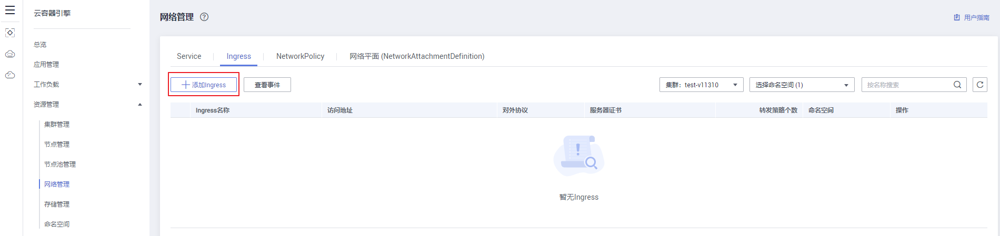
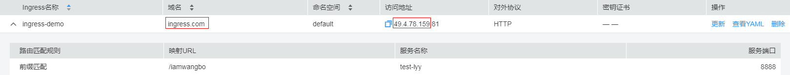
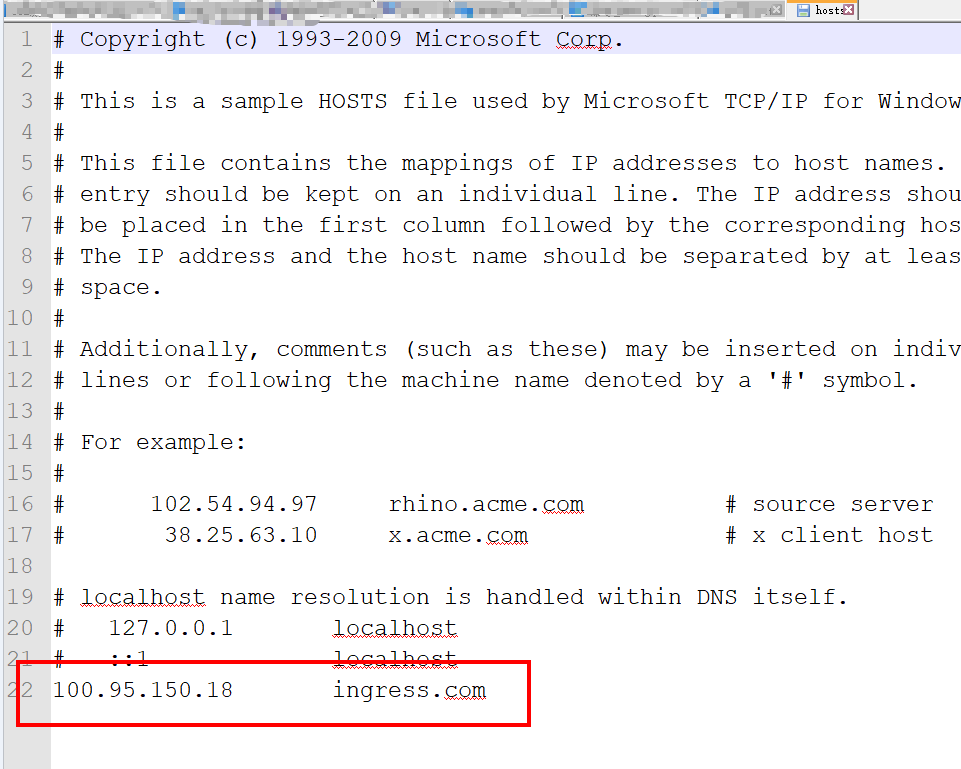

# 基本功能操作

-   [前提条件](#section2042610683912)
-   [创建Ingress](#section8419121241611)
-   [更新Ingress](#section49241995184)
-   [相关操作](#section156961091811)

## 前提条件

已在管理控制台中创建“弹性负载均衡“实例。

1.  登录管理控制台首页，在服务列表中选择“网络  \> 弹性负载均衡 ELB“。
2.  单击右上角的“购买弹性负载均衡“，详细操作步骤请参见[创建负载均衡器](https://support.huaweicloud.com/usermanual-elb/zh-cn_topic_0015479967.html)。

> **说明：** 
>CCE中的负载均衡 \( LoadBalancer \)访问类型使用[弹性负载均衡 ELB](https://support.huaweicloud.com/productdesc-elb/zh-cn_topic_0015479966.html)提供网络访问，存在如下产品约束：
>-   自动创建的ELB实例建议不要被其他资源使用，否则会在删除时被占用，导致资源残留。

## 创建Ingress

您可以在创建工作负载时通过CCE控制台设置访问方式，本节以创建一个nginx工作负载并添加Ingress类型的Service为例进行说明。

1.  创建工作负载，详细步骤请参见[创建无状态负载\(Deployment\)](创建无状态负载(Deployment).md)、[创建有状态负载\(StatefulSet\)](创建有状态负载(StatefulSet).md)或[创建守护进程集\(DaemonSet\)](创建守护进程集(DaemonSet).md)。
    -   若创建工作负载时，部署了“节点访问\( NodePort \)”类型的Service，请直接执行[3](#li45981923161059)。
    -   若创建工作负载时，未部署“节点访问\( NodePort \)”类型的Service，请先执行[2](#li248013365354)。

2.  （可选）若创建工作负载时，未配置“节点访问 \( NodePort \)”，请执行如下操作。
    1.  登录CCE控制台，在左侧导航栏中选择“资源管理 \> 网络管理”。
    2.  在Service页签下，单击“添加Service”。选择类型为“节点访问 \( NodePort \)”。
        -   **Service名称：**自定义服务名称，可与工作负载名称保持一致。
        -   **集群名称：**选择需要添加Service的集群。
        -   **命名空间：**选择需要添加Service的命名空间。
        -   **关联工作负载：**单击“选择工作负载”，选择需要配置节点访问 \( NodePort \)的工作负载名称，单击“确定”。
        -   **服务亲和：**
            -   集群级别：集群下所有节点的IP+访问端口均可以访问到此服务关联的负载，服务访问会因路由跳转导致一定性能损失，且无法获取到客户端源IP。
            -   节点级别：只有通过负载所在节点的IP+访问端口才可以访问此服务关联的负载，服务访问没有因路由跳转导致的性能损失，且可以获取到客户端源IP。

        -   **IPv6：**默认不开启，开启后服务的集群内IP地址（ClusterIP）变为IPv6地址，具体请参见[如何通过CCE搭建IPv4/IPv6双栈集群？](https://support.huaweicloud.com/bestpractice-cce/cce_bestpractice_00222.html)。**该功能仅在1.15及以上版本的集群创建时开启了IPv6功能才会显示。**
        -   **端口配置：**
            -   协议：请根据业务的协议类型选择。
            -   容器端口：容器镜像中工作负载实际监听的端口，需用户确定。nginx程序实际监听的端口为80。
            -   访问端口：容器端口映射到节点私有IP上的端口，用私有IP访问工作负载时使用，端口范围为30000-32767，建议选择“自动生成”。
                -   自动生成：系统会自动分配端口号。
                -   指定端口：指定固定的节点端口，默认取值范围为30000-32767。若指定端口时，请确保同个集群内的端口唯一性。

    3.  单击“创建”，节点访问方式设置成功。

3.  添加Ingress类型的Service。
    1.  单击CCE左侧导航栏的“资源管理 \>  网络管理”。
    2.  在Ingress页签下，单击“添加Ingress”。

        **图 1**  添加Ingress  
        

        -   **Ingress名称：**自定义Ingress名称，例如ingress-demo。
        -   **集群名称：**选择需要添加Ingress的集群。
        -   **命名空间：**选择需要添加Ingress的命名空间。
        -   **对接Nginx：**集群中已安装[nginx-ingress模板](https://support.huaweicloud.com/bestpractice-cce/cce_bestpractice_00237.html)后显示此选项，未安装nginx-ingress模板时本选项不显示。

            单击开启后将对接nginx-ingress提供7层访问，可配置如下参数：

            **表 1**  Nginx配置参数

            
            <table><thead align="left"><tr id="row14537184814714"><th class="cellrowborder" valign="top" width="23.400000000000002%" id="mcps1.2.3.1.1">
参数

            </th>
            <th class="cellrowborder" valign="top" width="76.6%" id="mcps1.2.3.1.2">
参数说明

            </th>
            </tr>
            </thead>
            <tbody><tr id="row642311116124"><td class="cellrowborder" valign="top" width="23.400000000000002%" headers="mcps1.2.3.1.1 ">
对外协议

            </td>
            <td class="cellrowborder" valign="top" width="76.6%" headers="mcps1.2.3.1.2 ">
支持“HTTP”和“HTTPS”两种协议。

            </td>
            </tr>
            <tr id="row826304681311"><td class="cellrowborder" valign="top" width="23.400000000000002%" headers="mcps1.2.3.1.1 ">
对外端口

            </td>
            <td class="cellrowborder" valign="top" width="76.6%" headers="mcps1.2.3.1.2 ">
安装nginx-ingress插件时预留的监听端口，HTTP为80，HTTPS为443。

            </td>
            </tr>
            <tr id="row205371848144711"><td class="cellrowborder" valign="top" width="23.400000000000002%" headers="mcps1.2.3.1.1 ">
超时时间

            </td>
            <td class="cellrowborder" valign="top" width="76.6%" headers="mcps1.2.3.1.2 ">
描述客户端与代理服务器建立连接的超时时间。

            </td>
            </tr>
            <tr id="row25383486478"><td class="cellrowborder" valign="top" width="23.400000000000002%" headers="mcps1.2.3.1.1 ">
重定向地址

            </td>
            <td class="cellrowborder" valign="top" width="76.6%" headers="mcps1.2.3.1.2 ">
将所有的内容重定向到指定地址，例如输入"https://www.huaweicloud.com/"。

            </td>
            </tr>
            <tr id="row1153816485478"><td class="cellrowborder" valign="top" width="23.400000000000002%" headers="mcps1.2.3.1.1 ">
自定义配置

            </td>
            <td class="cellrowborder" valign="top" width="76.6%" headers="mcps1.2.3.1.2 ">
Ingress通过Annotations设置来修改nginx.conf里面的配置，如需设置key: value，可通过<a href="https://kubernetes.github.io/ingress-nginx/user-guide/nginx-configuration/annotations/" target="_blank" rel="noopener noreferrer">Annotations</a>查询。

            </td>
            </tr>
            </tbody>
            </table>

        -   **负载均衡配置：**Ingress使用弹性负载均衡服务（ELB）的负载均衡器提供七层网络访问。

            > **须知：** 
            >1.  ingress创建后请在CCE页面对所选ELB实例进行配置升级和维护，否则可能导致ingress服务异常。
            >2.  自动创建的ELB实例尽可能不要被其他ingress或者service使用，否则可能导致资源残留。

            **开启“对接Nginx“后，将使用Nginx插件中配置的负载均衡设置，该配置区域将不显示。**

            负载均衡：负载均衡实例需与当前集群处于相同VPC且为相同公网或私网类型。

            -   共享型：用户共享集群资源，集群支持超大性能。
            -   独享型：用户独享资源，高性能保障。独享型负载均衡目前在公测阶段，公测期间免费，如需申请请点此[立即体验](https://account.huaweicloud.com/usercenter/#/userindex/betaManagement?serviceCode=elb_guaranteed)。

            请根据业务需求选择“公网“或“私网“，具体请参见[公网和私网负载均衡器](https://support.huaweicloud.com/productdesc-elb/zh_cn_elb_01_0004.html)。

            -   公网：支持自动创建和使用已有负载均衡实例两种方式。如果帐号下无共享型负载均衡，请通过新建[共享型弹性负载均衡](https://console.huaweicloud.com/vpc/#/ulb/createUlb)创建，完成后单击刷新按钮。
                -   企业项目：对接ELB的企业项目，可以选择直接创建在具体的ELB企业项目下。
                -   更改配置：选择“公网 \> 自动创建“时，单击规格配置下的“更改配置”，可修改待创建的负载均衡实例的名称、规格、计费模式和带宽。

            -   私网：支持自动创建和使用已有负载均衡实例两种方式。
                -   企业项目：对接ELB的企业项目，可以选择直接创建在具体的ELB企业项目下。

        -   **监听器配置：**Ingress为负载均衡器配置监听器，监听器对负载均衡器上的请求进行监听，并分发流量。

            **开启“对接Nginx“后将不显示该配置。**

            -   对外协议：支持HTTP和HTTPS。
            -   对外端口：开放在负载均衡服务地址的端口，可任意指定。

                若选择启用“对接Nginx“后，将默认开启80和443端口，此处“对外端口“参数项将不显示。

            -   服务器证书：请选择密钥证书，格式说明请参见[证书格式](https://support.huaweicloud.com/usermanual-elb/zh-cn_topic_0092382555.html)。

                > **说明：** 
                >-   选择HTTPS协议时，才需要创建密钥证书ingress-test-secret.yaml。创建密钥的方法请参见[创建密钥](创建密钥.md)。
                >-   同一个ELB实例的同一个端口配置HTTPS时，一个监听器只支持配置一个密钥证书。若使用两个不同的密钥证书将两个Ingress添加到同一个ELB下的同一个监听器，ELB侧实际只生效最初的证书。

            -   开启SNI：若需要对外提供多个域名的访问，并且不同域名使用独立的证书，则需要开启SNI（Server Name Indication）功能。开启SNI后，允许客户端在发起SSL握手请求时就提交请求的域名信息。负载均衡收到SSL请求后，会根据请求的域名去查找证书：若找到域名对应的证书，则返回该证书；否则，返回缺省证书。

                > **说明：** 
                >-   选择HTTPS协议时，才支持配置“开启SNI”选项。
                >-   1.15.11及以上版本的集群才能配置“开启SNI”选项。
                >-   共享型负载均衡和独享型负载均衡都支持开启SNI。

            -   安全策略：安全策略包含HTTPS可选的TLS协议版本和配套的加密算法套件。您可根据实际选择“安全策略 TLS-1-2“、“安全策略 TLS-1-0“、“安全策略 TLS-1-1“、“安全策略 TLS-1-2-Strict“。

                关于安全策略的详细说明，请参见[安全策略](https://support.huaweicloud.com/usermanual-elb/elb_ug_jt_0022.html)。

                > **说明：** 
                >-   选择HTTPS协议时，才支持配置“安全策略”选项。
                >-   该功能仅支持1.17.9及以上版本的集群。

        -   **转发策略配置：**请求的访问地址与转发规则匹配时（转发规则由域名、URL组成），此请求将被转发到对应的目标Service处理。

            > **须知：** 
            >服务负载均衡配置中可更改ELB实例的分配策略类型、会话保持、健康检查等内容，请勿在ELB服务修改相关信息。

            -   域名：实际访问的域名地址。请确保所填写的域名已注册并备案，在Ingress创建完成后，将域名与自动创建的负载均衡实例的IP（即Ingress访问地址的IP部分）绑定。一旦配置了域名规则，则必须使用域名访问。
            -   URL匹配规则：
                -   前缀匹配：例如映射URL为/healthz，只要符合此前缀的URL均可访问。例如/healthz/v1，/healthz/v2。
                -   精确匹配：表示精准匹配，只有完全匹配上才能生效。例如映射URL为/healthz，则必须为此URL才能访问。
                -   正则匹配：可设定映射URL规范，例如规范为**/\[A-Za-z0-9\_.-\]+/test**。只要符合此规则的URL均可访问，例如/abcA9/test，/v1-Ab/test。正则匹配规则支持POSIX与Perl两种标准。

            -   URL：需要注册的访问路径，例如：/healthz。
            -   目标Service：请选择已有Service或新建Service。页面列表中仅支持选择“节点访问 \( NodePort \)“  类型的Service，该查询结果已自动过滤。若您[开启了Nginx](#li17417517134)，可以通过页面右侧的“YAML创建“功能对接“集群内访问 \( ClusterIP \)“类型的Service。
            -   Service访问端口：可选择目标Service的访问端口。
            -   服务负载均衡配置：该配置是基于服务的配置，若有多条路由使用当前服务，这些路由将使用相同的服务负载均衡配置。
                -   分配策略类型：可选择加权轮询算法、加权最少连接或源IP算法。

                    加权轮询算法：根据后端服务器的权重，按顺序依次将请求分发给不同的服务器。它用相应的权重表示服务器的处理性能，按照权重的高低以及轮询方式将请求分配给各服务器，相同权重的服务器处理相同数目的连接数。常用于短连接服务，例如HTTP等服务。

                    加权最少连接：最少连接是通过当前活跃的连接数来估计服务器负载情况的一种动态调度算法。加权最少连接就是在最少连接数的基础上，根据服务器的不同处理能力，给每个服务器分配不同的权重，使其能够接受相应权值数的服务请求。常用于长连接服务，例如数据库连接等服务。

                    源IP算法：将请求的源IP地址进行Hash运算，得到一个具体的数值，同时对后端服务器进行编号，按照运算结果将请求分发到对应编号的服务器上。这可以使得对不同源IP的访问进行负载分发，同时使得同一个客户端IP的请求始终被派发至某特定的服务器。该方式适合负载均衡无cookie功能的TCP协议。

                -   会话保持：默认不启用。启用后需选择会话保持类型，设置会话保持时间。

                    HTTP cookie：负载均衡器会根据客户端第一个请求生成一个cookie，后续所有包含这个cookie值的请求都会由同一个后端服务器处理。

                    应用程序cookie：该选项依赖于后端应用。后端应用生成一个cookie值，后续所有包含这个cookie值的请求都会由同一个后端服务器处理。共享型负载均衡支持该会话保持类型，**独享型负载均衡暂不支持**。

                -   健康检查：默认不启用。请根据界面提示进行配置，更多参数说明请参见[配置健康检查](https://support.huaweicloud.com/usermanual-elb/zh-cn_topic_0162227063.html)。

            -   操作：可单击“删除“按钮删除该配置。

            单击“添加转发策略“按钮可添加多条转发策略。

4.  配置完成后，单击“创建“。

    创建完成后，在Ingress列表可查看到已创建成功的Ingress。

5.  访问工作负载（例如名称为defaultbackend）的“/healthz”接口。

    方式一：负载均衡IP访问（需负载均衡访问的服务不能配置域名）

    1.  获取defaultbackend“/healthz”接口的访问地址，访问地址有负载均衡实例、对外端口、映射URL组成，例如：10.154.73.151:80/healthz。

        **图 2**  获取访问地址  
        

    2.  在浏览器中输入“/healthz”接口的访问地址，如：http://10.154.73.151:80/healthz，即可成功访问工作负载，如[图3](#fig17115192714367)。

        **图 3**  访问defaultbackend“/healthz”接口  
        

    方式二：域名访问

    以ingress中已配置域名ingress.com为例。

    1.  获取ingress-demo的域名与访问地址的IP、URL与端口。

        **图 4**  获取域名与访问地址  
        

    2.  在本地主机的C:\\Windows\\System32\\drivers\\etc\\hosts中配置访问地址的IP和域名，如下图：

        

    3.  在浏览器中输入http://域名:访问地址端口/映射url，如：http://ingress.com:81/james。

## 更新Ingress

您可以在添加完Ingress后，更新此Ingress的端口、域名和路由配置。操作如下：

> **说明：** 
>-   Ingress创建后请避免在ELB服务的控制台中操作Ingress对接的ELB资源，如需修改请在CCE控制台中对所选ELB实例进行配置升级和维护，否则可能导致Ingress服务异常。
>-   在CCE控制台中更新Ingress时，负载均衡配置中可更改ELB实例的分配策略类型、会话保持、健康检查等内容，请勿在ELB服务修改相关信息。
>-   自动创建的ELB实例尽可能不要被其他Ingress或者Service使用，否则可能导致资源残留。

1.  登录[CCE控制台](https://console.huaweicloud.com/cce2.0/?utm_source=helpcenter)，在左侧导航栏中选择“资源管理 \> 网络管理”。在**Ingress**页签下，选择对应的集群和命名空间，单击待更新Ingress后方的“更新”。
2.  在“更新Ingress“页面，更新如下参数：

    **监听器配置**

    -   **对外端口：**开放在负载均衡服务地址的端口，可任意指定。

    **转发策略配置**

    -   **服务负载均衡配置：**单击展开后，可对如下参数进行设置：
        -   分配策略类型：可选择加权轮询算法、加权最少连接或源IP算法。
            -   加权轮询算法：根据后端服务器的权重，按顺序依次将请求分发给不同的服务器。它用相应的权重表示服务器的处理性能，按照权重的高低以及轮询方式将请求分配给各服务器，相同权重的服务器处理相同数目的连接数。常用于短连接服务，例如HTTP等服务。
            -   加权最少连接：最少连接是通过当前活跃的连接数来估计服务器负载情况的一种动态调度算法。加权最少连接就是在最少连接数的基础上，根据服务器的不同处理能力，给每个服务器分配不同的权重，使其能够接受相应权值数的服务请求。常用于长连接服务，例如数据库连接等服务。
            -   源IP算法：将请求的源IP地址进行Hash运算，得到一个具体的数值，同时对后端服务器进行编号，按照运算结果将请求分发到对应编号的服务器上。这可以使得对不同源IP的访问进行负载分发，同时使得同一个客户端IP的请求始终被派发至某特定的服务器。该方式适合负载均衡无cookie功能的TCP协议。

        -   会话保持：默认不启用。启用后需选择会话保持类型，设置会话保持时间。
            -   HTTP cookie：负载均衡器会根据客户端第一个请求生成一个cookie，后续所有包含这个cookie值的请求都会由同一个后端服务器处理。
            -   应用程序cookie：该选项依赖于后端应用。后端应用生成一个cookie值，后续所有包含这个cookie值的请求都会由同一个后端服务器处理。

        -   健康检查：默认开启。请根据界面提示进行配置，更多参数说明请参见[配置健康检查](https://support.huaweicloud.com/usermanual-elb/zh-cn_topic_0162227063.html)。

    -   单击“添加转发策略“按钮可添加多条转发策略。
        -   域名：实际访问的域名地址。请确保所填写的域名已注册并备案，在Ingress创建完成后，将域名与自动创建的负载均衡实例的IP（即Ingress访问地址的IP部分）绑定。一旦配置了域名规则，则必须使用域名访问。
        -   URL匹配规则：
            -   前缀匹配：例如映射URL为/healthz，只要符合此前缀的URL均可访问。例如/healthz/v1，/healthz/v2。
            -   精确匹配：表示精准匹配，只有完全匹配上才能生效。例如映射URL为/healthz，则必须为此URL才能访问。
            -   正则匹配：可设定映射URL规范，例如规范为**/\[A-Za-z0-9\_.-\]+/test**。只要符合此规则的URL均可访问，例如/abcA9/test，/v1-Ab/test。正则匹配规则支持POSIX与Perl两种标准。

        -   URL：需要注册的访问路径，例如：/healthz。
        -   目标Service：请选择已有Service或新建Service。页面列表中仅支持选择“节点访问 \( NodePort \)“  类型的Service，该查询结果已自动过滤。若您[开启了Nginx](#li17417517134)，可以通过页面右侧的“YAML创建“功能对接“集群内访问 \( ClusterIP \)“类型的Service。
        -   Service访问端口：可选择目标Service的访问端口。
        -   服务负载均衡配置：该配置是基于服务的配置，若有多条路由使用当前服务，这些路由将使用相同的服务负载均衡配置。详细配置请参见[服务负载均衡配置](#li5849101420489)。
        -   操作：可单击“删除“按钮删除该配置。

3.  单击“提交”。工作负载已更新Ingress。

## 相关操作

由于社区Ingress结构体中没有property属性，用户使用client-go调用创建ingress的api接口时，创建的Ingress中没有property属性。为了与社区的client-go兼容，CCE提供了相关解决方案，具体请参见[Ingress中的property字段如何实现与社区client-go兼容？](https://support.huaweicloud.com/cce_faq/cce_faq_00234.html)。

