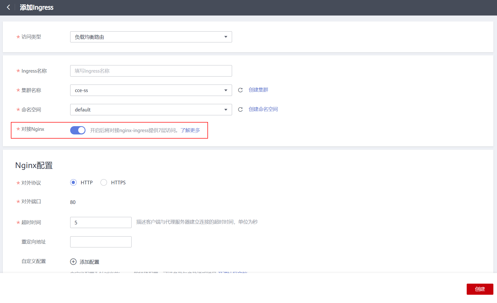

# 基本功能操作

## 前提条件

-   Ingress为后端工作负载提供网络访问，因此集群中需提前部署可用的工作负载。若您无可用工作负载，可参考[创建无状态负载\(Deployment\)](创建无状态负载(Deployment).md)、[创建有状态负载\(StatefulSet\)](创建有状态负载(StatefulSet).md)或[创建守护进程集\(DaemonSet\)](创建守护进程集(DaemonSet).md)部署示例nginx工作负载。
-   为上述工作负载配置Service，支持的Service类型如[表1](#table2470112719444)，可参考[集群内访问\(ClusterIP\)](集群内访问(ClusterIP).md)或[节点访问\(NodePort\)](节点访问(NodePort).md)配置示例Service。
-   若添加Nginx型Ingress，需在集群中安装nginx-ingress插件，具体操作可参考[安装插件](nginx-ingress.md#section3590245124519)。

**表 1**  支持Service类型

<table><thead align="left"><tr id="row947015271448"><th class="cellrowborder" valign="top" width="25%" id="mcps1.2.5.1.1">
Ingress类型

</th>
<th class="cellrowborder" valign="top" width="25%" id="mcps1.2.5.1.2">
访问类型

</th>
<th class="cellrowborder" valign="top" width="24.95%" id="mcps1.2.5.1.3">
集群内访问(ClusterIP)

</th>
<th class="cellrowborder" valign="top" width="25.05%" id="mcps1.2.5.1.4">
节点访问(NodePort)

</th>
</tr>
</thead>
<tbody><tr id="row3470182718442"><td class="cellrowborder" rowspan="2" valign="top" width="25%" headers="mcps1.2.5.1.1 ">
ELB型Ingress

</td>
<td class="cellrowborder" valign="top" width="25%" headers="mcps1.2.5.1.2 ">
负载均衡路由

</td>
<td class="cellrowborder" valign="top" width="24.95%" headers="mcps1.2.5.1.3 ">
不支持

</td>
<td class="cellrowborder" valign="top" width="25.05%" headers="mcps1.2.5.1.4 ">
支持

</td>
</tr>
<tr id="row1282441143612"><td class="cellrowborder" valign="top" headers="mcps1.2.5.1.1 ">
ENI负载均衡路由

</td>
<td class="cellrowborder" valign="top" headers="mcps1.2.5.1.2 ">
支持

</td>
<td class="cellrowborder" valign="top" headers="mcps1.2.5.1.3 ">
不支持

</td>
</tr>
<tr id="row12470142713442"><td class="cellrowborder" rowspan="2" valign="top" width="25%" headers="mcps1.2.5.1.1 ">
Nginx型Ingress

</td>
<td class="cellrowborder" valign="top" width="25%" headers="mcps1.2.5.1.2 ">
负载均衡路由

</td>
<td class="cellrowborder" valign="top" width="24.95%" headers="mcps1.2.5.1.3 ">
支持

</td>
<td class="cellrowborder" valign="top" width="25.05%" headers="mcps1.2.5.1.4 ">
支持

</td>
</tr>
<tr id="row191924423618"><td class="cellrowborder" valign="top" headers="mcps1.2.5.1.1 ">
ENI负载均衡路由

</td>
<td class="cellrowborder" valign="top" headers="mcps1.2.5.1.2 ">
支持

</td>
<td class="cellrowborder" valign="top" headers="mcps1.2.5.1.3 ">
不支持

</td>
</tr>
</tbody>
</table>

## 注意事项

-   在添加Ingress时自动创建的ELB实例建议不要被其他资源使用，否则会在删除时被占用，导致资源残留。
-   添加Ingress后请在CCE页面对所选ELB实例进行配置升级和维护，不可在ELB页面对配置进行更改，否则可能导致Ingress服务异常。
-   Ingress转发策略中注册的URL需与后端应用暴露的URL一致，否则将返回404错误。

## 添加ELB型Ingress

本节以nginx作为工作负载并添加ELB型Ingress为例进行说明。

1.  单击CCE左侧导航栏的“资源管理 \>  网络管理”，进入“Ingress页签”选择对应的集群和命名空间。
2.  单击“添加Ingress”，进入配置页面，如下图所示。

    **图 1**  Ingress配置页面  
    

    根据需求设置Ingress参数，关键参数信息如下：

    -   **访问类型**：根据实际选择负载均衡路由或ENI负载均衡路由。
        -   负载均衡路由：使用弹性负载均衡器访问服务。仅支持将请求转发到节点访问 \( NodePort \) 类型的Service。
        -   ENI负载均衡路由：使用弹性负载均衡器直通容器。仅支持将请求转发到集群内访问 \( ClusterIP \) 类型的Service，且Service的关联工作负载已绑定弹性网卡（即容器对接ENI）。

    -   **Ingress名称：**自定义Ingress名称，例如ingress-demo。
    -   **集群名称：**选择需要添加Ingress的集群。
    -   **命名空间：**选择需要添加Ingress的命名空间。
    -   **负载均衡配置：**Ingress使用弹性负载均衡服务（ELB）的负载均衡器提供七层网络访问。

        > **须知：** 
        >-   自动创建的ELB实例尽可能不要被其他Ingress或者Service使用，否则可能导致资源残留。
        >-   集群版本为1.17及以上时支持独享型负载均衡。
        >-   使用ENI负载均衡路由时仅支持独享型负载均衡。

        负载均衡：负载均衡实例需与当前集群处于相同VPC且为相同公网或私网类型。

        -   共享型：用户共享集群资源，集群支持超大性能。
        -   独享型：用户独享资源，高性能保障。并且拥有如下额外配置：
            -   可用区：独享型负载均衡支持同时部署在多个可用区，多活模式且互为备份，可提供更高的可靠性。
            -   实例规格：实例规格决定了负载均衡可创建的监听器类型，可按需选择规格类型和大小。
            -   慢启动：流量会根据时间戳线性导入后端，不会出现流量风暴，导致部分请求得不到响应。

        请根据业务需求选择“公网“或“私网“，默认为“公网”。

        -   公网：支持自动创建和使用已有负载均衡实例两种方式。如需手动创建负载均衡实例，请单击“创建负载均衡”，完成后单击刷新按钮。
            -   企业项目：对接ELB的企业项目，可以选择直接创建在具体的ELB企业项目下。
            -   更改配置：选择“公网 \> 自动创建“时，单击规格配置下的“更改配置”，可修改待创建的负载均衡实例的名称、规格、计费模式和带宽。

        -   私网：支持自动创建和使用已有负载均衡实例两种方式。
            -   企业项目：对接ELB的企业项目，可以选择直接创建在具体的ELB企业项目下。

    -   **监听器配置：**Ingress为负载均衡器配置监听器，监听器对负载均衡器上的请求进行监听，并分发流量。配置完成后ELB实例侧将会创建对应的监听器，名称默认为k8s\_<协议类型\>\_<端口号\>，例如“k8s\_HTTP\_80”。
        -   对外协议：支持HTTP和HTTPS。
        -   对外端口：开放在负载均衡服务地址的端口，可任意指定。
        -   服务器证书：负载均衡器创建HTTPS协议监听时需要绑定证书，以支持HTTPS数据传输加密认证。创建密钥证书的方法请参见[创建密钥](创建密钥.md)。

            > **说明：** 
            >同一个ELB实例的同一个端口配置HTTPS时，一个监听器只支持配置一个密钥证书。若使用两个不同的密钥证书将两个Ingress添加到同一个ELB下的同一个监听器，ELB侧实际只生效最初的证书。

        -   开启SNI：单击后开启SNI功能。SNI（Server Name Indication）是TLS的扩展协议，在该协议下允许同一个IP地址和端口号下对外提供多个基于TLS的访问域名，且不同的域名可以使用不同的安全证书。开启SNI后，允许客户端在发起TLS握手请求时就提交请求的域名信息。负载均衡收到TLS请求后，会根据请求的域名去查找证书：若找到域名对应的证书，则返回该证书认证鉴权；否则，返回缺省证书（服务器证书）认证鉴权。

            > **说明：** 
            >-   当选择HTTPS协议时，才支持配置“开启SNI”选项。
            >-   该功能仅支持1.15.11及以上版本的集群。
            >-   用于SNI的证书需要指定域名，每个证书只能指定一个域名。支持泛域名证书。

        -   安全策略：安全策略包含HTTPS可选的TLS协议版本和配套的加密算法套件。

            关于安全策略的详细说明，请参见[安全策略](https://support.huaweicloud.com/usermanual-elb/elb_ug_jt_0022.html)。

            > **说明：** 
            >-   选择HTTPS协议时，才支持配置“安全策略”选项。
            >-   该功能仅支持1.17.9及以上版本的集群。

    -   **转发策略配置：**请求的访问地址与转发规则匹配时（转发规则由域名、URL组成，例如：10.117.117.117:80/helloworld），此请求将被转发到对应的目标Service处理。单击“添加转发策略“按钮可添加多条转发策略。
        -   域名：实际访问的域名地址。请确保所填写的域名已注册并备案，在Ingress创建完成后，将域名与自动创建的负载均衡实例的IP（即Ingress访问地址的IP部分）绑定。一旦配置了域名规则，则必须使用域名访问。
        -   URL匹配规则：
            -   前缀匹配：例如映射URL为/healthz，只要符合此前缀的URL均可访问。例如/healthz/v1，/healthz/v2。
            -   精确匹配：表示精准匹配，只有完全匹配上才能生效。例如映射URL为/healthz，则必须为此URL才能访问。
            -   正则匹配：可设定映射URL规范，例如规范为**/\[A-Za-z0-9\_.-\]+/test**。只要符合此规则的URL均可访问，例如/abcA9/test，/v1-Ab/test。正则匹配规则支持POSIX与Perl两种标准。

        -   URL：需要注册的访问路径，例如：/healthz。
        -   目标Service：请选择已有Service或新建Service。页面列表中的查询结果已自动过滤不符合要求的Service。
        -   Service访问端口：可选择目标Service的访问端口。
        -   服务负载均衡配置：该配置是基于服务的配置，若有多条路由使用当前服务，这些路由将使用相同的服务负载均衡配置。
            -   分配策略类型：可选择加权轮询算法、加权最少连接或源IP算法。各分配策略具体说明请参考[负载均衡\(LoadBalancer\)](负载均衡(LoadBalancer).md)。
            -   会话保持：默认不启用。启用后需选择会话保持类型，设置会话保持时间。

                负载均衡器cookie：负载均衡器会根据客户端第一个请求生成一个cookie，后续所有包含这个cookie值的请求都会由同一个后端服务器处理。

                应用程序cookie：该选项依赖于后端应用。后端应用生成一个cookie值，后续所有包含这个cookie值的请求都会由同一个后端服务器处理。共享型负载均衡支持该会话保持类型。

            -   健康检查：默认不启用。请根据界面提示进行配置，更多参数说明请参见[配置健康检查](https://support.huaweicloud.com/usermanual-elb/zh-cn_topic_0162227063.html)。

        -   操作：可单击“删除“按钮删除该配置。

3.  配置完成后，单击“创建“。创建完成后，在Ingress列表可查看到已添加的Ingress。

    在ELB控制台中可查看通过CCE自动创建的ELB，名称默认为cce-lb-ingress.UID。单击ELB名称进入详情页，在“监听器”页签下即可查看Ingress对应的路由设置，包括URL、监听器端口以及对应的后端服务器组端口。

    > **须知：** 
    >Ingress创建后请在CCE页面对所选ELB实例进行配置升级和维护，不要在ELB控制台中对ELB实例进行维护，否则可能导致Ingress服务异常。

    **图 2**  ELB路由设置  
    

4.  访问工作负载（例如名称为defaultbackend）的“/healthz”接口。
    1.  获取defaultbackend“/healthz”接口的访问地址，访问地址由负载均衡实例IP、对外端口、映射URL组成，例如：10.\*\*.\*\*.\*\*:80/healthz。

        **图 3**  获取访问地址  
        

    2.  在浏览器中输入“/healthz”接口的访问地址，如：http://10.\*\*.\*\*.\*\*:80/healthz，即可成功访问工作负载，如[图4](#fig17115192714367)。

        **图 4**  访问defaultbackend“/healthz”接口  
        

## 添加Nginx型Ingress

本节以nginx作为工作负载并添加Nginx型Ingress为例进行说明。

> **须知：** 
>-   创建Nginx型Ingress前，集群必须已安装nginx-ingress插件，具体操作可参考[安装插件](nginx-ingress.md#section3590245124519)。
>-   **请勿在ELB服务页面修改ELB实例的任何配置，否则将导致服务异常。**如果您已经误操作，请卸载Nginx Ingress插件后重装。
>-   负载均衡实例需与当前集群处于相同VPC 且为相同公网或私网类型。
>-   负载均衡实例需要拥有至少两个监听器配额，且端口80和443没有被监听器占用。

1.  单击CCE左侧导航栏的“资源管理 \>  网络管理”，进入“Ingress页签”选择对应的集群和命名空间。
2.  单击“添加Ingress”，进入配置页面，如下图所示。

    **图 5**  Ingress配置页面  
    

    根据需求设置Ingress参数，关键参数信息如下：

    -   **访问类型**：使用弹性负载均衡器访问服务。
    -   **Ingress名称：**自定义Ingress名称，例如nginx-ingress-demo。
    -   **集群名称：**选择需要添加Ingress的集群。
    -   **命名空间：**选择需要添加Ingress的命名空间。
    -   **对接Nginx：**集群中已安装[nginx-ingress](nginx-ingress.md)插件后显示此选项，未安装nginx-ingress模板时本选项不显示。

        单击开启后将对接nginx-ingress提供7层访问，可配置如下参数：

        **表 2**  Nginx配置参数

        
        <table><thead align="left"><tr id="row1152018212415"><th class="cellrowborder" valign="top" width="23.400000000000002%" id="mcps1.2.3.1.1">
参数

        </th>
        <th class="cellrowborder" valign="top" width="76.6%" id="mcps1.2.3.1.2">
参数说明

        </th>
        </tr>
        </thead>
        <tbody><tr id="row10520162117415"><td class="cellrowborder" valign="top" width="23.400000000000002%" headers="mcps1.2.3.1.1 ">
对外协议

        </td>
        <td class="cellrowborder" valign="top" width="76.6%" headers="mcps1.2.3.1.2 ">
支持“HTTP”和“HTTPS”两种协议。

        </td>
        </tr>
        <tr id="row252018211444"><td class="cellrowborder" valign="top" width="23.400000000000002%" headers="mcps1.2.3.1.1 ">
对外端口

        </td>
        <td class="cellrowborder" valign="top" width="76.6%" headers="mcps1.2.3.1.2 ">
安装nginx-ingress插件时预留的监听端口，HTTP为80，HTTPS为443。

        </td>
        </tr>
        <tr id="row1978191961413"><td class="cellrowborder" valign="top" width="23.400000000000002%" headers="mcps1.2.3.1.1 ">
服务器证书

        </td>
        <td class="cellrowborder" valign="top" width="76.6%" headers="mcps1.2.3.1.2 ">
创建HTTPS协议监听时需要绑定IngressTLS类型的密钥证书，以支持HTTPS数据传输加密认证，创建密钥的方法请参见<a href="创建密钥.md">创建密钥</a>。

        </td>
        </tr>
        <tr id="row1952062114419"><td class="cellrowborder" valign="top" width="23.400000000000002%" headers="mcps1.2.3.1.1 ">
超时时间

        </td>
        <td class="cellrowborder" valign="top" width="76.6%" headers="mcps1.2.3.1.2 ">
描述客户端与代理服务器建立连接的超时时间。

        </td>
        </tr>
        <tr id="row165215211243"><td class="cellrowborder" valign="top" width="23.400000000000002%" headers="mcps1.2.3.1.1 ">
重定向地址

        </td>
        <td class="cellrowborder" valign="top" width="76.6%" headers="mcps1.2.3.1.2 ">
将所有的内容重定向到指定地址，例如输入"https://www.example.com/"。

        </td>
        </tr>
        <tr id="row65212212410"><td class="cellrowborder" valign="top" width="23.400000000000002%" headers="mcps1.2.3.1.1 ">
自定义配置

        </td>
        <td class="cellrowborder" valign="top" width="76.6%" headers="mcps1.2.3.1.2 ">
以“key: value”形式设置，可填参数与参数说明可通过<a href="https://kubernetes.github.io/ingress-nginx/user-guide/nginx-configuration/annotations/" target="_blank" rel="noopener noreferrer">Annotations</a>查询。

        </td>
        </tr>
        </tbody>
        </table>

    -   **转发策略配置：**请求的访问地址与转发规则匹配时（转发规则由域名、URL组成），此请求将被转发到对应的目标Service处理。单击“添加转发策略“按钮可添加多条转发策略。
        -   域名：实际访问的域名地址。请确保所填写的域名已注册并备案，在Ingress创建完成后，将域名与自动创建的负载均衡实例的IP（即Ingress访问地址的IP部分）绑定。一旦配置了域名规则，则必须使用域名访问。
        -   URL匹配规则：
            -   前缀匹配：例如映射URL为/healthz，只要符合此前缀的URL均可访问。例如/healthz/v1，/healthz/v2。
            -   精确匹配：表示精准匹配，只有完全匹配上才能生效。例如映射URL为/healthz，则必须为此URL才能访问。
            -   正则匹配：可设定映射URL规范，例如规范为**/\[A-Za-z0-9\_.-\]+/test**。只要符合此规则的URL均可访问，例如/abcA9/test，/v1-Ab/test。正则匹配规则支持POSIX与Perl两种标准。

        -   URL：需要注册的访问路径，例如：/healthz。
        -   目标Service：请选择已有Service或新建Service。页面列表中的查询结果已自动过滤不符合要求的Service。
        -   Service访问端口：可选择目标Service的访问端口。
        -   操作：可单击“删除“按钮删除该配置。

3.  配置完成后，单击“创建“。

    创建完成后，在Ingress列表可查看到已添加的Ingress。

## 更新Ingress

您可以在添加完Ingress后，更新此Ingress的端口、域名和路由配置。操作如下：

> **说明：** 
>在CCE控制台中更新Ingress时，负载均衡配置中可更改ELB实例的分配策略类型、会话保持、健康检查等内容，请勿在ELB服务修改相关信息。

1.  登录CCE控制台，在左侧导航栏中选择“资源管理 \> 网络管理”。在**Ingress**页签下，选择对应的集群和命名空间，单击待更新Ingress后方的“更新”。
2.  在“更新Ingress“页面，更新所需参数。

    参数选项与创建时一致。

3.  单击“提交”。工作负载已更新Ingress。

## 相关操作

由于社区Ingress结构体中没有property属性，用户使用client-go调用创建ingress的api接口时，创建的Ingress中没有property属性。为了与社区的client-go兼容，CCE提供了相关解决方案，具体请参见[Ingress中的property字段如何实现与社区client-go兼容？](https://support.huaweicloud.com/cce_faq/cce_faq_00234.html)。

