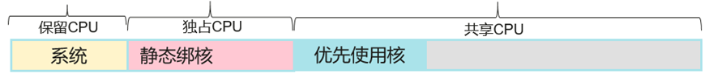

# 增强型CPU绑核管理策略<a name="cce_10_0552"></a>

在Kubernetes默认提供的[CPU管理策略](https://kubernetes.io/zh-cn/docs/tasks/administer-cluster/cpu-management-policies/)中有none和static两种：

-   none： 默认策略，表示现有的调度行为。
-   static：绑核策略，允许为节点上具有某些资源特征的 Pod（Guaranteed pod）赋予增强的 CPU 亲和性和独占性。

增强型CPU绑核管理策略（enhanced-static），是在兼容static  CPU管理策略的基础上，新增一种符合某些资源特征的Burstable Pod（CPU的request和limit值都是正整数）优先使用某些CPU的能力，以减少应用在多个CPU间频繁切换带来的影响。能够使用优先使用CPU的Burstable Pod举例如下：

```
...
spec:
  containers:
  - name: nginx
    image: nginx
    resources:
      limits:
        memory: "300Mi"
        cpu: "2"
      requests:
        memory: "200Mi"
        cpu: "1"
```

该特性是基于Huawei Cloud EulerOS 2.0内核中优化了CPU调度能力实现的。在Pod容器优先使用的CPU利用率超过85%时，会自动分配到其他利用率较低的CPU上，进而保障了应用的响应能力。



> **说明：** 
>-   开启增强型绑核特性时，应用性能比不绑核强，但弱于静态绑核。
>-   应用分配的优先使用的CPU并不会被独占，仍处于共享的CPU池中。因此在该Pod处于业务波谷时，节点上其他Pod可使用该部分CPU资源。

## 约束与限制<a name="section3877163611611"></a>

使用该特性，需同时满足以下条件：

-   集群版本为v1.23及以上。
-   节点操作系统为Huawei Cloud EulerOS 2.0。
-   节点容器引擎为Docker。

## 操作步骤<a name="section135842493165"></a>

1.  登录CCE控制台。
2.  单击集群名称进入集群，在左侧选择“节点管理“，在右侧选择“节点池“页签。
3.  单击节点池名称后的“更多 \> 配置管理“。所选节点池的节点操作系统需为Huawei Cloud EulerOS 2.0。
4.  在侧边栏滑出的“配置管理“窗口中，修改kubelet组件的cpu-manager-policy参数值，选择"enhanced-staic"。
5.  单击“确定“，完成配置操作。

## 验证<a name="section1879811281710"></a>

以8U32G节点为例，并提前在集群中部署一个CPU request为1，limit为2的工作负载。

1.  登录到节点池中的一个节点，查看/var/lib/kubelet/cpu\_manager\_state输出内容。

    ```
    cat /var/lib/kubelet/cpu_manager_state
    ```

    回显如下：

    ```
     {"policyName":"enhanced-static","defaultCpuSet":"0,2-7","entries":{"6739f6f2-ebe5-48ae-945a-986d5d8919b9":{"container-1":"0-7,10001"}},"checksum":1638128523}
    ```

    -   policyName字段值为enhanced-static代表策略设置成功。
    -   优先使用CPU号将10000作为基数，本例中10001即代表容器使用的亲和CPU号为1，0-7代表该Pod中容器可以使用的CPU集合。

2.  查看容器的cpuset.preferred\_cpus的cgroup设置，输出内容即为优先使用的CPU号。

    ```
    cat /sys/fs/cgroup/cpuset/kubepods/burstable/pod{pod uid}/{coredns容器id}/cpuset.preferred_cpus
    ```

    -   _\{pod uid\}_为Pod UID，可通过以下命令获取：

        ```
        kubectl get po {pod name} -n {namespace} -ojsonpath='{.metadata.uid}{"\n"}'
        ```

        命令中的_\{pod name\}_和_\{namespace\}_是Pod名称及其所在的命名空间。

    -   _\{coredns容器id\}_需要是完整的容器ID，可通过以下命令获取：

        ```
        docker ps --no-trunc | grep {pod name} | grep -v cce-pause | awk '{print $1}'
        ```

    完整示例如下：

    ```
    cat /sys/fs/cgroup/cpuset/kubepods/burstable/pod6739f6f2-ebe5-48ae-945a-986d5d8919b9/5ba5603434b95fd22d36fba6a5f1c44eba83c18c2e1de9b52ac9b52e93547a13/cpuset.preferred_cpus
    ```

    回显如下，表示优先使用1号CPU。

    ```
    1
    ```


