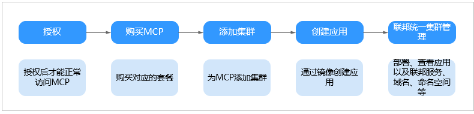
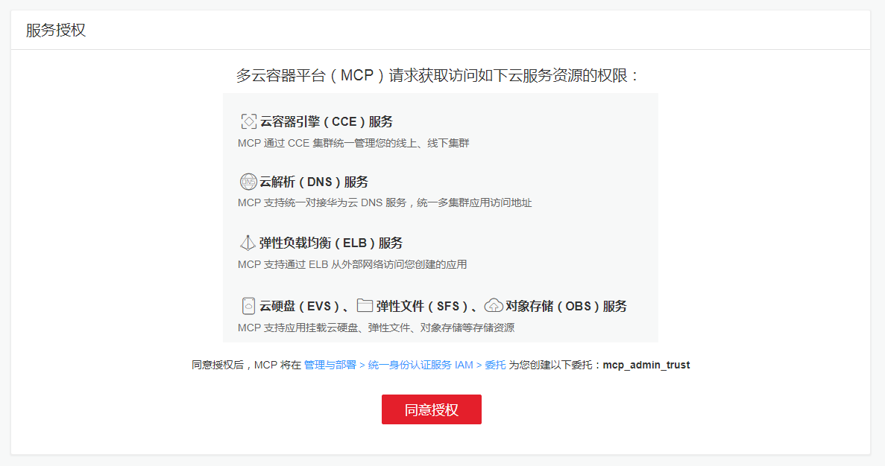

# 多云容器平台

多云容器平台（Multi-Cloud Container Platform，MCP）是基于多年容器云领域实践经验和社区先进的集群联邦技术（[Karmada](https://support.huaweicloud.com/productdesc-mcp/mcp_productdesc_0001.html#mcp_productdesc_0001__section3343055161913)），提供的容器多云和混合云的解决方案，为您提供跨云的多集群统一管理、应用在多集群的统一部署和流量分发，为您彻底解决多云灾备问题的同时，还可以在业务流量分担、业务与数据分离、开发与生产分离、计算与业务分离等多种场景下发挥价值。

## 使用限制

MCP必须使用帐号操作，不支持使用IAM用户（子帐号）操作。

## 使用流程

使用MCP前建议简单了解MCP使用流程如[图1](#fig121122372511)，点此前往[MCP控制台](https://console.huaweicloud.com/mcp)立即体验。

**图 1**  MCP使用流程  

1.  **给MCP授权。**

    在您开通MCP服务时，需要为其授权。当您进入MCP首页，如果之前没有给MCP授权，则会看到如下提示。请单击“同意授权”进行授权。

    **图 2**  服务授权界面  
    

2.  **根据功能说明，购买对应的MCP。**
    -   [购买MCP](https://support.huaweicloud.com/usermanual-mcp/mcp_01_0004.html)

3.  **为MCP添加集群。**
    -   [添加CCE集群到MCP](https://support.huaweicloud.com/usermanual-mcp/mcp_01_0006.html)
    -   [添加其他公有云集群到MCP](https://support.huaweicloud.com/usermanual-mcp/mcp_01_0007.html)
    -   [添加自建Kubernetes集群到MCP](https://support.huaweicloud.com/usermanual-mcp/mcp_01_0008.html)

4.  **创建应用**

    您可以使用华为云容器镜像服务（SWR）中的镜像、开源镜像中心或第三方镜像来创建应用。

5.  **可以部署应用，添加联邦服务、联邦存储声明和联邦命名空间等。**

